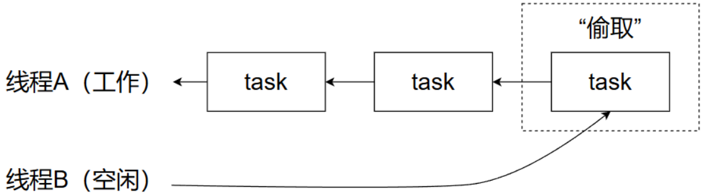

> [!NOTE]
> 本篇笔记基于《Java并发编程实战》第4章 - 基础构建模块

# 1. 同步容器类

同步容器类包括`Vector`和`Hashtable`，二者早在JDK1.0中就已经出现。这些类都是线程安全的，它们通过对每个公有方法进行同步，使得每次只有一个线程能够访问容器状态（串行化）。下面给出表格对其简单说明：

|     特性     |             **Vector**              |         **Hashtable**          |
| :----------: | :---------------------------------: | :----------------------------: |
| **数据结构** |              动态数组               |             哈希表             |
| **线程安全** |     是，所有方法均 synchronized     |  是，所有方法均 synchronized   |
| **数据类型** |            存储单个对象             |           存储键值对           |
| **允许空值** |         可以存储 null 元素          |      不允许键或值为 null       |
| **替代方案** | `ArrayList`，`CopyOnWriteArrayList` | `HashMap`，`ConcurrentHashMap` |

由于其同步机制的粒度较大，在现代开发中已逐渐被替代，在此处仅作为引子来介绍容器在迭代过程中可能存在的并发问题。观察下面这个例子，假如在迭代的过程中，有其他的线程删除了`vector`中的元素，那么就会抛出`IndexOutOfBoundsException`异常。为了防止出现这种情况，我们可以将整个迭代过程进行加锁，但是这又会导致其他的线程在其迭代过程中完全无法访问它，降低了并发性。

```java
for (int i = 0; i < vector.size(); i++) {
    dosomething(vector.get(i));
}
```

如果我们使用Java 5.0引入的for-each循环语法，使用`Iterator`进行迭代，在面对同样的问题时，这种”现代“的方法同样会抛出异常`ConcurrentModificationException`进行提示，还是需要在容器的迭代过程中使其持有锁才能有效确保线程安全。

> [!WARNING]
>
> 在实际情况中，迭代器很可能会隐藏起来而导致问题。例如容器的`toString`方法，它就会迭代容器，并在每个元素上调用`toString`

当容器规模过大时，对整个迭代过程加锁所带来的开销是巨大的，因此可以选择克隆容器，并在副本上完成迭代操作。要注意的是在克隆的过程中仍然需要加锁，并且这种方式的优劣取决多种因素，需结合实际考虑。

# 2. 并发容器

由于同步容器将所有对容器状态的访问都串行化，在多线程环境中性能严重降低，因此Java提供了多种并行容器来改善同步容器的性能。以下表格给出了对于部分并发容器的简要介绍：

| **容器类**                  | **接口** | **特性**                                                     | **适用场景**                                                 |
| --------------------------- | -------- | ------------------------------------------------------------ | ------------------------------------------------------------ |
| **`ConcurrentHashMap`**     | `Map`    | 采用分段锁（Segment）机制，多个线程可以并发地读取和写入不同的分段。支持高并发，写入性能优于 `Hashtable`。 | 高并发的键值对存储，适用于需要并发读取和写入的大型数据结构。 |
| **`CopyOnWriteArrayList`**  | `List`   | 采用写时复制（Copy on Write）机制，每次修改时会复制整个数组，适用于读多写少的场景。 | 读多写少的场景，如事件监听器、缓存列表。                     |
| **`ConcurrentLinkedQueue`** | `Queue`  | 非阻塞队列，基于 CAS 操作实现高并发性能，适用于无锁的并发访问。 | 高并发的无阻塞队列，用于事件处理、消息传递等。               |
| **`BlockingQueue`**         | `Queue`  | 阻塞队列，支持线程安全的入队和出队操作。常用于生产者-消费者模型。 | 需要线程间同步和阻塞操作的场景，如任务调度、消息传递。       |
| **`ConcurrentLinkedDeque`** | `Deque`  | 非阻塞双端队列，支持线程安全的从两端操作，适用于高效的双端队列操作。 | 双端队列操作、任务队列、事件队列等。                         |
| **`SynchronousQueue`**      | `Queue`  | 每个插入操作都必须等待一个对应的移除操作，适用于需要线程间同步的场景。 | 线程间同步和信号传递的场景，如生产者-消费者模型中的特定要求。 |


## 2.1 ConcurrentHashMap

传统的线程安全哈希表（如 `Hashtable`）通常使用一个全局锁来保证线程安全，这意味着在任何时候只能有一个线程对集合进行操作。这种做法会导致性能瓶颈，尤其在高并发场景下，线程会因为竞争同一个锁而被频繁阻塞。`ConcurrentHashMap` 为了解决这个问题，采用了**分段锁机制** ，使得每个线程可以并发地访问不同的“段”，从而减少了锁的竞争，提高了并发性能。

> [!TIP]
>
> 从Java8开始，`ConcurrentHashMap`不再使用分段锁，而是采取更细粒度的锁和CAS操作来减少锁的粒度

尽管其在提高并发性上做出了很多的改进，但是相应的，对于那些需要全局计算的方法，它就只能返回一个估计值而非精确值。从下面的源码中可以看到，对于`size`方法统计容器的大小，其并没有进行加锁，这就会不可避免的导致并发问题。但是考虑到在实际使用中更加注重于对`get`、`put`和`remove`等操作的性能，这种权衡是能够接受的。

```java
// ConcurrentHashMap部分源码
final long sumCount() {
    CounterCell[] cs = counterCells;
    long sum = baseCount;
    if (cs != null) {
        for (CounterCell c : cs)
            if (c != null)
                sum += c.value;
    }
    return sum;
}

public int size() {
    long n = sumCount();
    return ((n < 0L) ? 0 :
            (n > (long)Integer.MAX_VALUE) ? Integer.MAX_VALUE :
            (int)n);
}
```

## 2.2 CopyOnWriteArrayList

`CopyOnWriteArrayList` 使用了“写时复制”（Copy-On-Write）策略来确保在并发环境下操作的线程安全性。与传统的 `ArrayList` 不同，`CopyOnWriteArrayList` 通过在修改时复制底层数组，确保了读操作的高效性和线程安全，但代价是写操作相对较重。

在下面给出的源码中可以看到，对于新增元素，其会先复制再修改。

```java
// CopyOnWriteArrayList的部分源码
public boolean add(E e) {
    synchronized (lock) {
        Object[] es = getArray();
        int len = es.length;
        es = Arrays.copyOf(es, len + 1);
        es[len] = e;
        setArray(es);
        return true;
    }
}
```


## 2.3 BlockingQueue

**生产者-消费者模式** 是一种常见的并发设计模式，主要用于解决多个线程之间协作的问题，尤其是在生产和消费任务时的协调。该模式通过使用缓冲区（如队列）来存放生产者生成的数据，并由消费者线程从缓冲区中取出数据进行处理。生产者和消费者之间通常是通过共享资源（如队列）进行数据交换的。


`BlockingQueue` 是 Java 并发包中的一个接口，它定义了一些用于实现线程安全的队列操作的方法，特别适用于生产者-消费者模式。`BlockingQueue` 提供了能够在队列为空时阻塞消费者线程，或者在队列满时阻塞生产者线程的功能，从而实现了线程间的安全交换数据。除了阻塞操作外，`BlockingQueue` 还提供了一些非阻塞操作，例如 `offer` 和 `poll`，这些方法会在队列不可用时直接返回，而不会让线程进入阻塞状态。

`SynchronousQueue` 是一个特殊的 `BlockingQueue`，它没有容量。每个 `put` 操作必须等待一个对应的 `take` 操作才能完成，反之亦然。这种方式虽然看起来有些奇怪，但是其很好的降低了将数据从生产者移动到消费者的延迟。并且由于其没有存储功能，因此会使`put`和`take`一直阻塞。因此只有在有足够多的消费者，并且总有一个消费者准备好获取交付的数据时，才适合使用`SynchronousQueue`。


## 2.4 BlockingDeque

**工作密取** 是一种并发编程中的调度策略，常用于多核处理器上的任务调度。在这种策略下，每个线程（通常称为工作者线程）都有一个本地队列用于存储待执行的任务。当一个线程完成了自己的任务并且其队列为空时，它会从其他线程的队列中“偷取”任务来执行。通过这种方式，可以最大化 CPU 核心的使用效率，提高多线程的执行效率。



`BlockingDeque` 扩展了 `Deque` 接口，结合了阻塞队列的特性。与普通的 `Deque` 不同，`BlockingDeque` 支持阻塞操作，这意味着在某些条件下，插入和移除操作会导致当前线程被阻塞，直到可以继续执行。`BlockingDeque` 允许在队列两端（头部和尾部）进行阻塞插入和移除操作，使得它非常适合用于实现工作密取。


# 3. 阻塞方法与中断方法

**阻塞方法** 是指当线程执行某些操作时，如果操作无法立刻完成，线程将进入“阻塞”状态，直到满足某些条件才会继续执行。这些方法通常出现在队列操作、输入输出操作、网络通信等场景。

**中断方法** 是用于控制线程的执行，使其能够在适当的时机停止。线程中断主要依赖于 `Thread.interrupt()` 方法。通过中断，可以通知一个线程停止其当前操作或提前退出。但需要注意的是，一个线程并不能强制其他线程停止正在执行的操作，只能等待它们在合适的时间停止。

**解决方法：** 当代码中抛出`InterruptedException` 异常之后，我们有两种基本选择

- **传递异常：** 当发现异常之后，直接避开而将其传给调用者
- **恢复中断：** 当不能抛出异常时，可以选择捕获该异常并调用该线程的`interrupt` 方法使其保持中断状态


# 4. 同步工具类

所有的同步工具类都包含一些特定的结构化属性：它们封装了一些状态，这些状态将决定执行同步工具类的线程是继续执行还是等待，此外还提供了一些方法对状态进行操作，以及另一些方法高效的等待同步工具类进入预期状态。例如阻塞队列就能够通过阻塞的方式协调生产者与消费者之间的控制流。

## 4.1 闭锁

闭锁是一种同步工具类，可以延迟线程的进度直到其达到终止状态。闭锁的作用可以理解为是一扇门，在终止状态到来前，门是关闭的，所有线程都被禁止通过。而当到达终止状态时，所有的线程都被运行通过，并且门不会再关闭。通过这种机制，可以确保某些活动在达到一定条件后才能继续执行。

在Java中，`CountDownLatch`就是一种灵活的闭锁实现。其通过一个计数器来实现同步，计数器的初始值由构造函数设置。每调用一次 `countDown()`，计数器减一。当计数器为零时，所有等待线程通过。下面是一个利用`CountDownLatch`实现统计任务开始到所有任务结束所需的时间的例子，其中`startGate`用于控制所有线程同时开始执行任务，`endGate`用于等待所有线程完成任务。

```java
public class TestHarness {
    public long timeTasks(int nThreads, final Runnable task) throws InterruptedException {
        final CountDownLatch startGate = new CountDownLatch(1);
        final CountDownLatch endGate = new CountDownLatch(nThreads);

        for (int i = 0; i < nThreads; i++) {
            Thread t = new Thread() {
                public void run() {
                    try {
                        startGate.await();
                        try {
                            task.run();
                        } finally {
                            endGate.countDown();
                        }
                    } catch (InterruptedException ignored) {
                    }
                }
            };
            t.start();
        }

        long start = System.nanoTime();
        startGate.countDown();
        endGate.await();
        long end = System.nanoTime();
        return end - start;
    }
}
```

`FutureTask` 也可以用做闭锁，其结合了 `Runnable` 和 `Future` 的功能，并且支持异步操作，可以用于执行耗时任务并异步获取结果。并且，其还提供了任务的取消功能，并且在多个线程间共享任务执行结果。下面这个例子就说明了如何使用`FutureTask`来提前加载稍后需要的数据：

```java
public class Preloader {
    private final FutureTask<ProductInfo> future = new FutureTask<>(() -> loadProductInfo());
    private final Thread thread = new Thread(future);

    public void start() {
        thread.start();
    }

    public ProductInfo get() throws InterruptedException {
        try {
            return future.get();
        } catch (ExecutionException e) {
            Throwable cause = e.getCause();
            if (cause instanceof DataLoadException) {
                throw (DataLoadException) cause;
            } else {
                throw launderThrowable(cause);
            }
        }
    }
}
```

## 4.2 信号量

计数信号量用来控制同时访问某个特定资源的操作数量，或者同时执行某个指定操作的数量。Java中的`Semaphore`通过维护一个计数器，表示可用的资源数量，线程需要获取许可才能访问资源，访问完成后释放许可。

**常用方法** ：

- `acquire()`：获取一个许可，若无可用许可则阻塞
- `release()`：释放一个许可

下面给出一个例子，借助`Semaphore`来给容器的大小设置边界：

```java
public class BoundHashSet<T> {
    private final Set<T> set;
    private final Semaphore sem;

    public BoundHashSet(int bound) {
        this.set = Collections.synchronizedSet(new HashSet<>());
        this.sem = new Semaphore(bound);
    }

    public boolean add(T o) throws InterruptedException {
        sem.acquire();
        boolean wasAdded = false;
        try {
            wasAdded = set.add(o);
            return wasAdded;
        } finally {
            if (!wasAdded) {
                sem.release();
            }
        }
    }

    public boolean remove(Object o) {
        boolean wasRemoved = set.remove(o);
        if (wasRemoved) {
            sem.release();
        }
        return wasRemoved;
    }
}
```

## 4.3 栅栏

