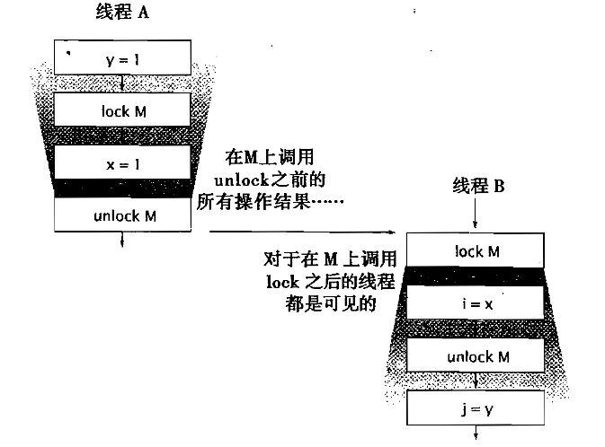

---

title: Java并发编程-对象的共享
published: 2024-10-23
description: 《Java并发编程实战》第3章 - 对象的共享学习笔记
image: ./assets/cover.jpg
tags: [Java, 并发编程, 内存模型]
category: 学习笔记
draft: false
---

> [!NOTE]
> 本篇笔记基于《Java并发编程实战》第3章 - 对象的共享

# 1. 可见性

**可见性** 是并发编程中的一个重要概念，指的是当一个线程修改了共享变量的值后，其他线程是否能够立即看到该修改。

### 可见性问题的根本原因

在多线程环境下，**每个线程通常都有自己的工作内存（缓存）**，而共享变量存储在主内存中。当一个线程对共享变量进行读写时：

1. 线程从主内存中读取变量的值到自己的工作内存中（通常存储在 CPU 缓存或寄存器中）
2. 线程在自己的工作内存中对变量进行修改
3. 线程把修改后的值写回主内存

由于线程之间的缓存是相互独立的，一个线程对变量的修改可能**不会立即刷新到主内存**，而其他线程可能会一直读取到旧的值。这种现象被称为**可见性问题**。

在下面这个例子中，程序可能会持续循环下去，因为读线程可能永远看不到`ready`的值。也有可能程序会输出0，因为读线程可能只看到了写入`ready`的值，而没有看到写入`number`的值，这种现象被称为**重排序** 。

>  [!TIP]
>
> **重排序** 是指在程序执行过程中，编译器和处理器为了优化性能，改变指令的执行顺序的行为

```java
private static boolean ready;
private static int number;
private static class ReaderThread extends Thread{
    public void run(){
        while(!ready){
            Thread.yield();
        }
        System.out.println(number);
    }
}
public static void main(String[] args){
    new ReaderThread().start();
    number = 42;
    ready = true;
}
```


## 1.1 加锁与可见性

为了解决上面这种数据失效的问题，我们可以采用加锁的方式来保障不同线程之间的数据可见性。通过这种同步机制，可以保证线程B在执行由锁保护的同步代码块时，可以看到线程A在之前一个同步代码块中的所有操作结果。



> [!NOTE]
>
> 加锁的含义不仅仅局限于互斥行为，还包括内存可见性。为了确保所有的线程都能够看到共享变量的最新值，所有执行读操作或是写操作的线程都必须在一个锁上同步


## 1.2 Volatile变量

Java中提供了一种稍弱的同步机制，即`volatile` 变量，用来保证**可见性**和**有序性**，但它并不能保证操作的**原子性**。volatile修饰的变量具有以下两个关键特性：

#### 1. **可见性**

当一个线程修改了volatile变量的值，新的值会立即被刷新到主内存中，而其他线程可以立刻看到这个修改后的值

- **普通变量**：线程可能会缓存变量值到工作内存中，其他线程读取的值可能是旧值
- **volatile变量**：线程每次读取时都会从主内存中获取最新值，修改时也会立即写回主内存

#### 2. **禁止指令重排序**

volatile通过内存屏障（Memory Barrier）机制，防止编译器和 CPU 对该变量的操作进行重排序，从而保证操作的有序性。


### **Volatile 的使用场景**

#### 1. **标志位**

使用volatile变量作为标志位，在多个线程之间传递状态信号。

```java
class VolatileFlagExample {
    private static volatile boolean flag = false;

    public static void main(String[] args) throws InterruptedException {
        Thread t1 = new Thread(() -> {
            while (!flag) {
                // 等待 flag 被设置为 true
            }
            System.out.println("Flag is true, exiting loop.");
        });

        t1.start();

        Thread.sleep(1000); // 模拟一些延迟
        flag = true;        // 修改 flag 的值，t1 线程会立即感知
        System.out.println("Flag set to true.");
    }
}
```

**输出**：

```vbnet
Flag set to true.
Flag is true, exiting loop.
```

#### 2. **双重检查锁实现单例模式**

volatile可以防止指令重排序，保证单例模式的线程安全性。

```java
java复制代码class Singleton {
    private static volatile Singleton instance;

    private Singleton() {}

    public static Singleton getInstance() {
        if (instance == null) { // 第一次检查
            synchronized (Singleton.class) {
                if (instance == null) { // 第二次检查
                    instance = new Singleton();
                }
            }
        }
        return instance;
    }
}
```

**为什么需要volatile**：

- `instance = new Singleton();`可能被编译器重排序为以下伪代码：
  1. 分配内存
  2. 将引用赋值给 `instance`
  3. 初始化对象
- 如果没有 volatile，其他线程可能会看到未完全初始化的 `instance`，导致问题

#### 3. **状态变量**

在某些场景下，用于维护一个简单的状态，例如开关控制、计数等


### **Volatile 无法解决的场景**

volatile 只能保证可见性和有序性，不能保证原子性。例如：

```java
java复制代码class VolatileCounter {
    private static volatile int count = 0;

    public static void main(String[] args) throws InterruptedException {
        Thread t1 = new Thread(() -> {
            for (int i = 0; i < 1000; i++) {
                count++; // 不是原子操作
            }
        });

        Thread t2 = new Thread(() -> {
            for (int i = 0; i < 1000; i++) {
                count++; // 不是原子操作
            }
        });

        t1.start();
        t2.start();

        t1.join();
        t2.join();

        System.out.println("Final count: " + count); // 可能小于 2000
    }
}
```

**问题**：

- `count++`实际上是三个操作：
  1. 读取 `count` 的值
  2. 将值加 1
  3. 将结果写回 `count`
- 多线程环境下，可能会出现两个线程同时读取同一个值，导致写回时覆盖，最终结果错误


### **适合使用 Volatile 的场景**

1. 变量由单个线程写入、多个线程读取
2. 变量的更新不依赖当前值（例如标志位切换）
3. 复合操作（如 `i++`、累加等）需要使用其他同步机制（如 `synchronized` 或 `Atomic`）


# 2. 发布与逸出

**发布(Publish):** 指的是一个对象被某个线程安全地共享，使得其他线程能够看到它的状态和行为。

**逸出(Escape):** 是指一个对象在尚未准备完全（或不安全）时，被发布到其他线程，导致其他线程可能访问到未初始化或错误的状态。


在下面这个例子中，就存在着逸出问题。在 `new ThisEscape(source)` 构造 `ThisEscape` 对象时，`this` 引用通过匿名内部类被传递给了 `source.registerListener`。此时，`ThisEscape` 的对象可能尚未完成初始化（包括其字段和状态），但其他线程可能已经通过 `EventSource` 访问到了这个对象。由于`this`在构造过程中逸出，这种对象就被认为是**不正确构造** 。

```java
private class ThisEscape{
    public ThisEscape(EventSource source){
        source.registerListener(new EventListener(){
            public void onEvent(Event e){
                doSomething(e);
            }
        });
    }
}
```


### 安全的对象构造过程

#### 1. **避免在构造方法中注册监听器**

将注册逻辑从构造方法中分离，确保对象完全构造后再注册监听器。

```java
private class ThisEscape {
    public ThisEscape(EventSource source) {
        // 构造方法中不注册监听器
    }

    public void initialize(EventSource source) {
        source.registerListener(new EventListener() {
            public void onEvent(Event e) {
                doSomething(e);
            }
        });
    }
}
```

**使用**：

```java
ThisEscape instance = new ThisEscape(source);
instance.initialize(source); // 确保对象完全构造后再注册
```

#### 2. **使用工厂方法**

通过工厂方法控制对象的创建过程，确保在对象完全初始化后再注册监听器。

```java
private class ThisEscape {
    private ThisEscape() {}

    public static ThisEscape newInstance(EventSource source) {
        ThisEscape instance = new ThisEscape();
        source.registerListener(instance.new SafeEventListener());
        return instance;
    }

    private class SafeEventListener implements EventListener {
        public void onEvent(Event e) {
            doSomething(e);
        }
    }
}
```

#### 3. **使用外部辅助类**

将监听器的逻辑封装到另一个类中，避免 `this` 的直接逸出。

```java
private class SafeEscape {
    private final Helper helper;

    public SafeEscape(EventSource source) {
        helper = new Helper();
        source.registerListener(helper);
    }

    private class Helper implements EventListener {
        public void onEvent(Event e) {
            doSomething(e);
        }
    }
}
```


# 3. 线程封闭

**线程封闭**是一种线程安全的实现策略，指的是将数据限制在某个线程内部访问，从而避免多线程环境下的竞争条件。这种方法依赖于线程的独占性，不需要额外的同步机制来保证线程安全。

### **1. Ad-hoc线程封闭**

通过程序的逻辑约定来保证数据不会逃逸到其他线程，完全依赖于开发者的正确性。

- **示例**：

  ```java
  public class AdHocExample {
      public void someMethod() {
          int localVariable = 42; // 局部变量，仅当前线程可见
          // 该变量不会被其他线程访问
          System.out.println(localVariable);
      }
  }
  ```

- **特点**：

  - 局部变量是线程封闭的天然方式
  - 由于其脆弱性，在程序的开发过程中应该尽量避免使用

### **2. 栈封闭**

局部变量存储在线程的栈帧中，具有天然的线程封闭特性。只要局部变量没有被外部线程引用，就不会引发线程安全问题。并且由于Java的语言特性，任何方法都无法获得对基本数据类型的引用，因此可以确保基本类型的局部变量始终被封闭在线程内。

- **示例**：

  ```java
  public void process() {
      int result = 0; // 局部变量，仅当前线程可访问
      for (int i = 0; i < 10; i++) {
          result += i; // 完全线程安全
      }
      System.out.println("Result: " + result);
  }
  ```

- **特点**：

  - 局部变量生命周期受线程栈管理，其他线程无法访问
  - 局部变量封闭是一种非常高效的线程安全策略


### **3. ThreadLocal**类

`ThreadLocal` 是 Java 提供的一种实现线程封闭的工具，允许每个线程保存一份独立的数据副本。

#### **ThreadLocal 工作原理**

- 每个线程都有一个独立的 `ThreadLocalMap`，`ThreadLocal` 的值存储在当前线程的 `ThreadLocalMap` 中。
- 不同线程访问同一个 `ThreadLocal` 对象时，实际访问的是各自的独立副本。

#### **示例**：

```java
public class ThreadLocalExample {
    private static ThreadLocal<Integer> threadLocalValue = ThreadLocal.withInitial(() -> 0);

    public static void main(String[] args) {
        Thread t1 = new Thread(() -> {
            threadLocalValue.set(42);
            System.out.println("Thread 1 value: " + threadLocalValue.get());
        });

        Thread t2 = new Thread(() -> {
            threadLocalValue.set(84);
            System.out.println("Thread 2 value: " + threadLocalValue.get());
        });

        t1.start();
        t2.start();
    }
}
```

**输出**：

```
Thread 1 value: 42
Thread 2 value: 84
```

**特点：**

- 每个线程拥有自己的独立副本，互不干扰。
- 特别适合在线程间共享不可变配置或线程私有的状态（如数据库连接、用户会话等）。


# 4. 不变性

**不可变对象（Immutable Object）** 是指其状态在创建后不能被修改的对象，其一定是线程安全的。

当满足以下条件时，对象才是不可变的：

- 对象创建后其状态就不能修改
- 对象的所有域都是`final`类型
- 对象是正确创建的（在对象的创建期间，`this`没有逸出）

在不可变对象的内部仍然可以使用可变对象来对状态进行管理，以下面这段代码为例，尽管`Set`对象仍然是可变的，但是从设计中可以看出，在完成了`Set`对象的构造之后就无法再对其进行修改，满足刚才提到的三点要求。

```java
public final class ThreeStooges {
    private final Set<String> stooges = new HashSet<>();
    
    public ThreeStooges(){
        stooges.add("Moe");
        stooges.add("Larry");
        stooges.add("Curly");
    }
    
    public boolean isStooge(String name){
        return stooges.contains(name);
    }
}
```

> [!TIP]
>
> 除非需要更高的可见性，否则所有的域都声明为私有域；除非需要某个域是可变的，否则应该将其声明为final域；这些都是良好的编程习惯。

---

### 示例：使用Volatile类型发布不可变对象

```java
class OneValueCache {
    private final BigInteger lastNumber;
    private final BigInteger[] lastFactors;

    public OneValueCache(BigInteger i, BigInteger[] factors) {
        lastNumber = i;
        lastFactors = Arrays.copyOf(factors, factors.length);
    }

    public BigInteger[] getFactors(BigInteger i) {
        if (lastNumber == null || !lastNumber.equals(i)) {
            return null;
        } else {
            return Arrays.copyOf(lastFactors, lastFactors.length);
        }
    }
}

public class VolatileCachedFactorizer {
    private volatile OneValueCache cache = new OneValueCache(null, null);

    public void service(BigInteger i) {
        BigInteger[] factors = cache.getFactors(i);
        if (factors == null) {
            factors = factor(i);
            cache = new OneValueCache(i, factors);
        }
    }
}
```

在 `OneValueCache` 类中，所有字段都被声明为 `final`，并且在构造时通过 `Arrays.copyOf` 深拷贝数组，确保数据不可变。`VolatileCachedFactorizer` 类的核心是一条 `volatile` 声明的 `cache` 字段，这确保了任何线程对 `cache` 字段的更新能被其他线程立即可见。这样，`cache` 始终保持线程间的内存一致性。当一个线程更新了缓存时，其他线程读取时一定能看到最新的值。在 `service` 方法中，当缓存未命中时，通过重新计算因数并更新缓存的方式实现懒加载。因为 `OneValueCache` 是不可变的，更新缓存是通过替换整个对象完成的，这种操作是线程安全的，不存在部分更新的问题。结合 `volatile` 的内存可见性，所有线程都能安全地共享最新的缓存数据。


# 5. 安全发布

任何线程都可以在不需要额外同步的情况下安全的访问不可变对象；而要安全发布可变对象，则必须使用同步。

一个正确构造的对象可以通过以下方式来安全的发布：

- 在静态初始化函数中初始化一个对象引用
- 将对象的引用保存到`volatile`类型的域或者`AtomicReference`对象中
- 将对象的引用保存到某个正确构造对象的`final`类型域中
- 将对象的引用保存到一个由锁保护的域中

---

对象的发布需求取决于它的可变性:

- 不可变对象可以通过任意机制来发布
- 事实不可变对象必须通过安全方式来发布
- 可变对象必须通过安全方式来发布，并且必须是线程安全的或是由某个锁保护起来

---

在并发程序中使用和共享对象时，可以使用一些实用的策略：

- **线程封闭：** 线程封闭的对象只能由一个线程拥有，对象被封闭在该线程中，并且只能由这个线程修改
- **只读共享：** 在没有额外同步的情况下，共享的只读对象可以由多个线程访问，但任何线程都不能修改它。共享的只读对象包括不可变对象和实时不可变对象
- **线程安全共享：** 线程安全的对象在内部实现同步，因此多个线程可以通过对象的公有接口访问而不需要额外的同步
- **保护对象：** 被保护的对象只能通过持有特定的锁来访问。保护对象包括封装在其他线程安全对象中的对象，以及已发布的并且由某个特定锁保护的对象
