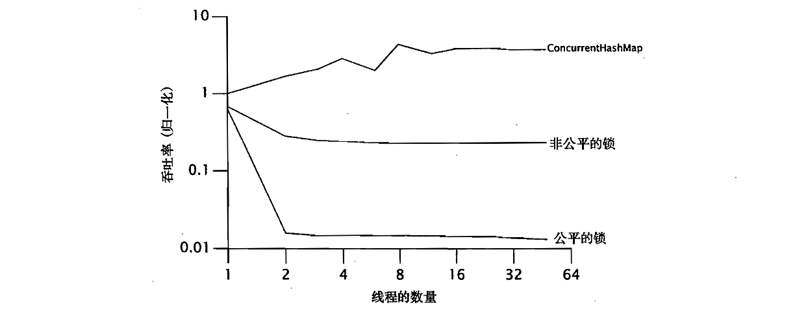

> [!NOTE]
> 本篇笔记基于《Java并发编程实战》第13章 - 显式锁

# 1. Lock与ReentrantLock

`ReentrantLock`实现了`Lock`接口，并提供了与`Synchronized`相同的互斥性和内存可见性。此外，与`Synchronized`一样，`ReentrantLock`还提供了可重入的加锁语义。

下面这段代码给出了`Lock`接口的标准使用形式，必须在`finally`块中释放锁。否则，如果在被保护的代码中抛出了异常，那么这个锁将永远无法释放。

```java
Lock lock = new ReentrantLock();
...
lock.lock();
try {
    // 更新对象状态
    // 捕获异常，在必要时恢复不变性
} finally {
    lock.unlock();
}
```


## 1.1 轮询锁与定时锁

可定时与可轮询的锁获取模式是由`tryLock`方法实现的，与无条件的锁获取模式相比，它具有更完善的错误恢复机制。在内置锁中，避免死锁的唯一方法就是在构建时避免出现不一样的锁顺序。可定时与可轮询的锁则提供了另一种选择，避免死锁的发生。

下面这段代码就演示了如何使用轮询锁来解决[第十章](https://mj3622.github.io/posts/学习笔记/java并发编程/避免活跃性危险/#12-动态的锁顺序死锁)中提到的动态顺序死锁问题。使用`trylock`来获取两个锁，如果不能同时获得，那么就回退并重新尝试。在休眠时间中包括固定部分和随机部分，从而降低发生活锁的可能性。如果在指定时间内不能获得所有需要的锁，那么`transferMoney`将返回一个失败状态，从而使该操作平缓地失败。

```java
public boolean transferMoney(Account fromAccount, 
                             Account toAccount, 
                             DollarAmount amount, 
                             long timeout, 
                             TimeUnit unit) 
    throws InsufficientFundsException, InterruptedException {
    long fixedDelay = getFixedDelayComponentNanos(timeout, unit);
    long randMod = getRandomDelayModulusNanos(timeout, unit);
    long stopTime = System.nanoTime() + unit.toNanos(timeout);
    while (true) {
        if (fromAccount.lock.tryLock()) {
            try {
                if (toAccount.lock.tryLock()) {
                    try {
                        if (fromAccount.getBalance().compareTo(amount) < 0) {
                            throw new InsufficientFundsException();
                        } else {
                            fromAccount.debit(amount);
                            toAccount.credit(amount);
                            return true;
                        }
                    } finally {
                        toAccount.lock.unlock();
                    }
                }
            } finally {
                fromAccount.lock.unlock();
            }
        }
        if (System.nanoTime() < stopTime) {
            return false;
        }
        NANOSECONDS.sleep(fixedDelay + ThreadLocalRandom.current().nextLong(randMod));
    }
}
```


而定时锁则是允许线程在尝试一段指定的时间内获取锁。如果超过了指定时间仍然无法获取锁，则线程会放弃尝试，并执行其他操作。通过这种方式，就可以保护对资源的访问不会被一直阻塞。

下面这段代码中就介绍了如何使用定时锁：

```java
public boolean trySendOnSharedLine(String message, long timeout, TimeUnit unit) throws InterruptedException {
    long nanosToLock = unit.toNanos(timeout) - estimatedNanosToSend(message);
    if (!lock.tryLock(nanosToLock, TimeUnit.NANOSECONDS)) {
        return false;
    }
    try {
        return sendOnSharedLine(message);
    } finally {
        lock.unlock();
    }
}
```


## 1.2 可中断的锁获取操作

可中断的锁获取操作指的是线程尝试获取锁时，可以响应外部的中断信号，从而停止等待锁的动作。与传统的阻塞锁（如 `synchronized` 或 `Lock.lock()`）不同，可中断的锁获取操作允许程序在一些特殊情况下（如线程需要中止或超时）中断当前线程的锁等待，避免因锁竞争而导致的无限阻塞。Java 中，`Lock` 接口提供了可中断锁获取操作的支持，主要通过 `lockInterruptibly()` 方法实现。

```java
public boolean sendOnSharedLine(String message) throws InterruptedException {
    lock.lockInterruptibly();
    try {
        return cancellableSendOnSharedLine(message);
    } finally {
        lock.unlock();
    }
}
```


# 2. 公平性

`ReentrantLock` 提供了两种锁的公平性选择：公平锁和非公平锁。

**公平锁：**

- 公平锁通过一个等待队列来保证锁的获取是公平的，按照线程请求锁的顺序来分配锁。
- 实现机制是先到先得（FIFO），即线程按照进入队列的顺序获取锁。
- 当一个线程释放锁时，锁会优先分配给等待时间最长的线程。

**非公平锁：**

- 非公平锁允许线程抢占锁，即线程可以在某些情况下不按照请求顺序直接获取锁。
- 只有当锁被某个线程持有时，新发出请求的线程才会被放入队列中。
- 默认情况下，`ReentrantLock` 是非公平锁。



从上面这张图中我们可以看出，公平锁的性能相较于非公平锁低了两个数量级，出现这种情况可能是由于以下原因：

1. **队列管理开销：** 公平锁通过维护FIFO队列保证线程按顺序获取锁，这增加了锁申请时的检查和入队、出队操作的复杂性。
2. **线程上下文切换频繁：** 公平锁优先唤醒等待时间最长的线程，而不是让当前线程尝试获取锁，可能导致更多线程切换，增加系统开销。
3. **CPU缓存局部性降低：** 唤醒的线程可能不是当前活跃线程，需要重新加载缓存数据，而非公平锁更倾向于利用当前线程，缓存命中率更高。
4. **锁竞争时间增加：** 公平锁可能让已准备好的线程等待排队，延长了锁的获取时间。

因此非必要的话，不要为公平性付出代价。


# 3. 读-写锁

读写锁是用来提高多线程环境下读写操作性能的一种锁机制。它允许多个线程同时读取共享资源，但在写线程进行写操作时，会阻止其他线程进行读或写操作。读写锁分为读锁和写锁：

- 读锁（共享锁）：

  - 允许多个读线程同时获取，前提是没有写线程持有写锁。

  - 在读线程持有读锁时，写线程会被阻塞。

- 写锁（独占锁）：

  - 只有一个线程可以持有写锁。

  - 当写锁被一个线程持有时，其他线程的读锁和写锁请求都会被阻塞。

在java中，`ReentrantReadWriteLock` 是 `ReadWriteLock` 的标准实现，支持以下功能：

1. **可重入性：**
   - 读锁和写锁都支持可重入性，意味着持有锁的线程可以再次获取相同的锁。
2. **锁降级：**
   - 允许线程持有写锁时获取读锁（降级）。
   - 但是，持有读锁的线程不能升级到写锁。
3. **公平锁和非公平锁：**
   - 默认是非公平锁，锁的获取顺序不一定与线程请求顺序一致。
   - 可以通过构造函数指定为公平锁，按照线程请求顺序来获取锁。
4. **支持条件变量：**
   - 通过 `ReentrantReadWriteLock` 的 `writeLock().newCondition()` 方法可以创建条件变量，仅支持写锁。