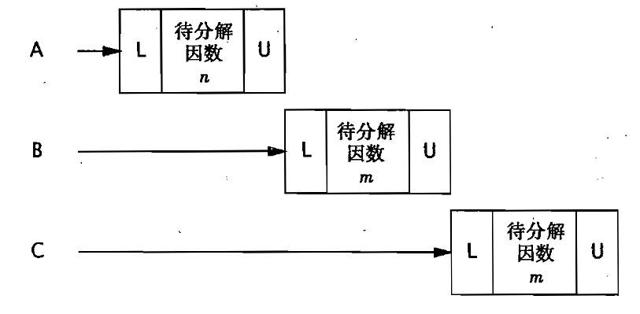

> [!NOTE]
> 本篇笔记基于《Java并发编程实战》第2章 - 线程安全性
# 1. 线程安全性
当多个线程访问某个类时，不管运行环境采用何种调度方式或者这些线程将交替执行，并且在主调代码中不需要任何额外的同步或协同，这个类都能表现出正确的行为，那么这个类就是线程安全的。

在对线程安全性的定义中，最核心的内容就是正确性，其含义是某个类的行为与其规范完全一致，即所见即所知。因此，我们可以给出对于**安全性的定义：当多个线程访问某个类时，这个类始终能表现出正确的行为。**


为了更好的进行说明，下面给出一个简单的Servlet的例子，它会接收一个数并进行因数分解，这样一个Servlet就是无状态的。当多个线程访问它时，线程之间并不会互相影响，因为两个线程之间并没有共享状态。

```java
@ThreadSafe
public class StatelessFactorizer implements Servlet {
    public void service(ServletRequest req, ServletResponse resp) {
        BigInteger i = extractFromRequest(req);
        BigInteger[] factors = factor(i);
        encodeIntoResponse(resp, factors);
    }
}
```

:::tip[无状态对象]
既不包含任何域，也不包含任何对其他类中域的引用，因此一定是线程安全的
:::


# 2. 原子性
当我们在无状态对象中增加一个状态后，会发生什么现象？

我们继续沿用上述的例子，但是加入一个新的计数器`count`，当Servlet每接收到一次请求时，就会进行一次计数。`++count`这个操作看上去只有一步，但实际上它是非原子的，因为它是一个“读取—修改—写入”的系列操作。这就使得这个Servlet变为**非线程安全**的了，因为当存在多个线程同时请求时，会出现同时读取和修改的情况，这就导致了count的值出现错误。

```java
@NotThreadSafe
public class UnsafeCountingFactorizer implements Servlet {
    private long count = 0;

    public long getCount() { return count; }

    public void service(ServletRequest req, ServletResponse resp) {
        BigInteger i = extractFromRequest(req);
        BigInteger[] factors = factor(i);
        ++count;
        encodeIntoResponse(resp, factors);
    }
}
```


在并发编程中，我们称这种情况为**竞态条件（Race Condition）**，即由于不恰当的执行顺序而出现结果不正确的情况。最常见的竞态条件就是“先检查后执行（Check-Then-Act）”操作，即通过一个可能失效的观测结果来决定下一步的动作。

使用“先检查后执行”操作的一种常见情况就是延迟初始化。延迟初始化的目的是将对象的初始化操作推迟到实际使用时才进行，同时要确保只初始化一次。下面这个例子中就包含了一个这样的一个竞态条件：当线程A和线程B同时执行`getInstance()`时，由于不可预测的时许和线程的调度方式等多种因素，就可能导致两个线程都判断`instance`为`null`，因此返回两个不同的结果。

```java
@NotThreadSafe
public class LazyInitRace {
    private ExpensiveObject instance = null;

    public ExpensiveObject getInstance() {
        if (instance == null) {
            instance = new ExpensiveObject();
        }
        return instance;
    }
}
```

因此，为了避免竞态条件问题，我们需要让这些操作以原子方式执行。也就是在某个线程修改变量时，通过某种方式防止其他线程使用这个变量，从而确保线程安全。

> [!NOTE]
>
> 假定有两个操作A和B，如果从执行A的线程来看，当另一个线程执行B时，要么将B全部执行完，要么完全不执行B，那么A和B对彼此来说就是原子的

于是我们回到之前给出涉及到计数器的例子，我们可以使用`AtomicLong`来代替`long`类型的计数器，借助原子变量类来确保所有操作都是原子的。这样虽然我们在无状态的类中添加了一个状态，但是该状态完全由线程安全的对象来管理，那么这个类任然是线程安全的。

```java
@ThreadSafe
public class UnsafeCountingFactorizer implements Servlet {
    private final AtomicLong count = new AtomicLong(0);

    public long getCount() { return count.get(); }

    public void service(ServletRequest req, ServletResponse resp) {
        BigInteger i = extractFromRequest(req);
        BigInteger[] factors = factor(i);
        count.incrementAndGet();
        encodeIntoResponse(resp, factors);
    }
}
```

> [!TIP]
>
> 关于原子变量将在15章进一步介绍


# 3. 加锁机制

还是回到之前提到的因数分解Servlet的例子，假设我们想提高其性能，将其最近计算的结果缓存起来，这样收到连续相同的请求时，就可以直接使用上一次的计算结果。在上文中我们使用了`AtomicLong`以线程安全的方式管理计数器的状态，这此处我们能否仿照这种思想进行缓存管理呢？

```java
@NotThreadSafe
public class UnsafeCachingFactorizer implements Servlet {
    private final AtomicReference<BigInteger> lastNumber
        = new AtomicReference<BigInteger>();
    private final AtomicReference<BigInteger[]> lastFactors
        = new AtomicReference<BigInteger[]>();

    public void service(ServletRequest req, ServletResponse resp) {
        BigInteger i = extractFromRequest(req);
        if (i.equals(lastNumber.get()))
            encodeIntoResponse(resp, lastFactors.get());
        else {
            BigInteger[] factors = factor(i);
            lastNumber.set(i);
            lastFactors.set(factors);
            encodeIntoResponse(resp, factors);
        }
    }
}
```

可惜的的时，这种方法并不正确，尽管这些原子引用本身是线程安全的，但是我们无法保障在修改`lastNumber`和`lastFactors`的操作之间，其他线程不会获取或修改它们的值，这样就导致不变性条件被破坏了。

> [!WARNING]
>
> 要保证一致性状态，就需要在单个原子操作中更新所有相关的状态变量


在Java中提供了一种内置的锁机制来支持原子性：同步代码块（Synchronized Block），如下所示。每个Java对象都可以用作一个实现同步的锁，这些锁被称为内置锁（Intrinsic Lock）或监视锁（Monitor Lock）。线程会在进入同步代码块之前自动获得锁，并且在退出代码块时自动释放锁。并且Java的内置锁相当于一种互斥体（或互斥锁），这意味着最多只有一个线程能持有这个锁。

```java
synchronized (lock){
	// 访问或修改由锁保护的共享状态
}
```


因此，我们可以用这种同步机制（`synchronized` 关键字）来解决上述提到的缓存问题，但是这种解决方法的并发性十分糟糕，因为客户端无法同时使用该服务，因此我们将在后文中给出更优的解决方案。

```java
@ThreadSafe
public class SynchronizedFactorizer implements Servlet {
    private final AtomicReference<BigInteger> lastNumber
        = new AtomicReference<BigInteger>();
    private final AtomicReference<BigInteger[]> lastFactors
        = new AtomicReference<BigInteger[]>();

    public synchronized void service(ServletRequest req, ServletResponse resp) {
        BigInteger i = extractFromRequest(req);
        if (i.equals(lastNumber.get()))
            encodeIntoResponse(resp, lastFactors.get());
        else {
            BigInteger[] factors = factor(i);
            lastNumber.set(i);
            lastFactors.set(factors);
            encodeIntoResponse(resp, factors);
        }
    }
}
```


当某个线程请求一个由其他线程持有的锁时，发出请求的线程就会阻塞。然而，由于内置锁是可重入的，因此如果某个线程试图获得一个已由它自己持有的锁，那么这个请求就会成功。**重入** 意味着获取锁的操作的粒度是“线程”，而不是“调用”。

重入的一种实现方法是，为每个锁关联一个获取计数值和一个所有者线程。当计数值为0时，这个锁就被认为是没有被任何线程持有。当线程请求一个未被持有的锁时，JVM将记下锁的持有者，并且将获取计数值置为1。如果同一个线程再次获取这个锁，计数值将递增，而当线程退出同步代码块时，计数器会相应地递减。当计数值为0时，这个锁将被释放。


# 4. 活跃性与性能

在`SynchronizedFactorizer`中，我们采用了对整个service方法进行同步，这种简单且粗颗粒度的方法能够很好的保证线程安全，但是会带来极大的性能浪费。并且，由于service是一个`Synchronized`方法，同时只能有一个客户端进行请求，这不仅违背了Servlet设计的初衷，同时也导致了CPU资源闲置而产生浪费。

当多个请求同时到达时，可以参考如下图所示的流程，每个请求都需要排队依次等待处理，像这样的Web应用程序我们称为 **不良并发（Poor Currency）** 应用程序。



为了解决这种情况，我们需要缩小同步代码块的范围，这样就能在保证线程安全的前提下，同时确保拥有良好的性能，修改后的代码如下所示。首先，我们将整个service方法的同步拆分成了两个较小的代码块，一个代码块只需保护返回缓存结果，另一个代码块只需要保护缓存的更新。同时，我们在这份修改后的代码中还引入了计数器，可以注意到在这里并未使用`AtomicLong`这是因为我们已经通过同步代码块来构造原子操作，而使用两种不同的同步机制不仅会带来混乱，并且也没有任何性能或安全性的提升，因此不再使用原子变量。

```java
@ThreadSafe
public class CachedFactorizer implements Servlet {
    @GuardedBy("this") private BigInteger lastNumber;
    @GuardedBy("this") private BigInteger[] lastFactors;
    @GuardedBy("this") private long hits;
    @GuardedBy("this") private long cacheHits;

    public synchronized long getHits() { return hits; }

    public synchronized double getCacheHitRatio() {
        return (double) cacheHits / (double) hits;
    }

    public void service(ServletRequest req, ServletResponse resp) {
        BigInteger i = extractFromRequest(req);
        BigInteger[] factors = null;
        synchronized (this) {
            ++hits;
            if (i.equals(lastNumber)) {
                ++cacheHits;
                factors = lastFactors.clone();
            }
        }
        if (factors == null) {
            factors = factor(i);
            synchronized (this) {
                lastNumber = i;
                lastFactors = factors.clone();
            }
        }
        encodeIntoResponse(resp, factors);
    }
}
```

> [!TIP]
>
> 当执行时间较长的计算或者可能无法快速完成的操作时（例如IO操作），一定不要持有锁
