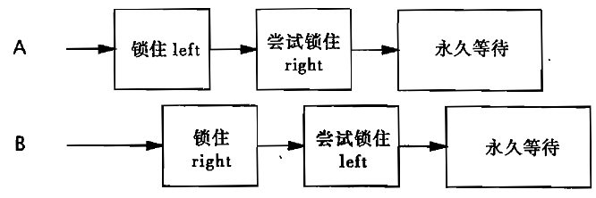

> [!NOTE]
> 本篇笔记基于《Java并发编程实战》第10章 - 避免活跃性危险

# 1. 死锁

死锁（Deadlock）是指在计算机系统中，多个进程或线程由于相互竞争资源而造成的一种相互等待的状态。如果没有外部干预，这些进程或线程将永远无法继续执行。简单来说，死锁是资源争用导致的“僵局”，进程之间互相等待对方释放资源，结果谁也无法继续。例如，在线程A持有锁L并想获得锁M的同时，线程B持有锁M并想获得锁L，那么这两个线程将永远地等待下去，这就是最简单的死锁，也被称为“抱死”。


## 1.1 锁顺序死锁

例如，在下面这段代码中，`LeftRightDeadlock`就存在死锁风险。

```java
public class LeftRightDeadlock {
    private final Object left = new Object();
    private final Object right = new Object();

    public void leftRight() {
        synchronized (left) {
            synchronized (right) {
                System.out.println("Left-Right");
            }
        }
    }

    public void rightLeft() {
        synchronized (right) {
            synchronized (left) {
                System.out.println("Right-Left");
            }
        }
    }
}
```

由于`leftRight`和`rightLeft`两个方法分别获得left锁和right锁，当有两个线程交错执行这两个方法时，流程如下图所示，就会发生死锁。



在`LeftRightDeadlock`中发生死锁的原因是：两个线程试图以不同的顺序来获得相同的锁。如果按照相同的顺序来请求锁，那么就不会出现循环的加锁依赖性，因此也不会产生死锁。


## 1.2 动态的锁顺序死锁

有时候，并不能清楚地知道是否在锁顺序上有足够的控制权来避免死锁的发生。例如在下面这段代码中，当两个账户互相转账时，就可能按照不同的顺序来获取锁，从而发生死锁的情况。

```java
public void transferMoney(Account fromAccount, Account toAccount, int amount) {
    synchronized (fromAccount) {
        synchronized (toAccount) {
            if (fromAccount.getBalance() >= amount) {
                fromAccount.debit(amount);
                toAccount.credit(amount);
            }
        }
    }
}
```

由于我们无法保障参数传入的顺序，因此，我们必须定义锁的顺序，以解决死锁的问题。在制定锁的顺序时，可以采用`System.identityHashCode()`方法，该方法将返回由`Object.hashCode()`返回的值。同时考虑到，在极少数的情况下，二者可能存在相同的哈希值，此时就可以引入“加时赛”锁，从而保证每次只有一个线程以未知的顺序获得这个锁。因此，我们可以对上述代码做出改进，如下所示：

```java
private static final Object tieLock = new Object();
public void transferMoney(final Account fromAcct, final Account toAcct, final DollarAmount amount) throws InsufficientFundsException {
    int fromHash = System.identityHashCode(fromAcct);
    int toHash = System.identityHashCode(toAcct);
    if (fromHash < toHash) {
        synchronized (fromAcct) {
            synchronized (toAcct) {
                new Helper().transfer();
            }
        }
    } else if (fromHash > toHash) {
        synchronized (toAcct) {
            synchronized (fromAcct) {
                new Helper().transfer();
            }
        }
    } else {
        synchronized (tieLock) {
            synchronized (fromAcct) {
                synchronized (toAcct) {
                    new Helper().transfer();
                }
            }
        }
    }
}
```

> [!TIP]
>
> 如果在对象中唯一的，不可变的且具备可比性的键值，那么可以直接使用键值对对象进行排序，而无需引入“加时赛”锁


## 1.3 在协作对象之间发生死锁

某些获取多个锁的操作并不像上述的代码那么明显，这多个锁也并不一定要在同一个方法中被获取。考虑到下面这段代码中互相协作的两个类，`Taxi`代表一个出租车对象，而`Dispatcher`代表一个出租车车队，在调度系统中会用到这两个它们。

尽管在代码中，并没有任何一个地方显式地获取两个锁，但`setLocation`和`getImage`等方法的调用者都会获得两个锁。如果一个线程在收到GPS接收器的更新事件时调用`setLocation`，那么它将首先更新出租车的位置，然后判断它是否到达了目的地。如果已经到达，它会通知`Dispatcher`：它需要一个新的目的地。因为 `setLocation`和 `notifyAvailable` 都是同步方法，因此调用 `setLocation`的线程将首先获取`Taxi`的锁，然后获取 `Dispatcher`的锁。同样，调用 `getImage`的线程将首先获取`Dispatcher` 锁，然后再获取每一个`Taxi`的锁（每次获取一个）。这与`LeftRightDeadlock` 中的情况相同，两个线程按照不同的顺序来获取两个锁，因此就可能产生死锁。

```java
class Taxi {
    private Point location, destination;
    private final Dispatcher dispatcher;

    public Taxi(Dispatcher dispatcher) {
        this.dispatcher = dispatcher;
    }

    public synchronized Point getLocation() {
        return location;
    }

    public synchronized void setLocation(Point location) {
        this.location = location;
        if (location.equals(destination)) {
            dispatcher.notifyAvailable(this);
        }
    }
}
class Dispatcher {
    private final Set<Taxi> taxis;
    private final Set<Taxi> availableTaxis;

    public Dispatcher() {
        taxis = new HashSet<>();
        availableTaxis = new HashSet<>();
    }

    public synchronized void notifyAvailable(Taxi taxi) {
        availableTaxis.add(taxi);
    }

    public Image getImage() {
        Image image = new Image();
        for (Taxi t : taxis) {
            image.drawMarker(t.getLocation());
        }
        return image;
    }
}
```


## 1.4 开放调用

如果在调用某个方法时不需要持有锁，那么这种调用被称为开放调用。依赖于开放调用的类通常能表现出更好的行为，并且也更容易编写。于是我们可将将上述出租车调度的例子修改为使用开放调用，从而消除死锁的风险。这就需要使同步代码块仅保护那些涉及共享状态的操作，而不是整个方法。

```java
class Taxi{
    private Point location,destination;
    private final Dispatcher dispatcher;
    public Taxi(Dispatcher dispatcher){
        this.dispatcher = dispatcher;
    }
    public synchronized Point getLocation(){
        return location;
    }
    public void setLocation(Point location){
        boolean reachedDestination;
        synchronized (this){
            this.location = location;
            reachedDestination = location.equals(destination);
        }
        if(reachedDestination){
            dispatcher.notifyAvailable(this);
        }
    }
}
class Dispatcher{
    private final HashSet<Taxi> taxis;
    private final HashSet<Taxi> availableTaxis;
    public Dispatcher(){
        taxis = new HashSet<>();
        availableTaxis = new HashSet<>();
    }
    public synchronized void notifyAvailable(Taxi taxi){
        availableTaxis.add(taxi);
    }
    public Image getImage(){
        HashSet<Taxi> copy;
        synchronized (this){
            copy = new HashSet<>(taxis);
        }
        Image image = new Image();
        for(Taxi t:copy){
            image.drawMarker(t.getLocation());
        }
        return image;
    }
}
```


# 2. 死锁的避免与诊断

## 2.1 支持定时的锁

`Lock` 接口提供了一种比传统的 `synchronized` 更加灵活的同步机制。`Lock` 接口中的定时锁功能允许线程尝试获取锁，但在指定时间内如果无法获取，则会放弃尝试。这种功能特别适合那些需要避免长时间等待死锁的场景。

```java
boolean tryLock(long time, TimeUnit unit) throws InterruptedException;
```

**定时锁功能的特点**

1. **避免死锁：** 通过限制锁等待时间，可以防止线程无限期地等待，从而降低死锁的风险。
2. **可中断性：** 线程在等待时可以响应中断，适用于需要及时停止任务的场景。
3. **灵活性：** 开发者可以根据业务需求自定义等待时间，而不是被动地阻塞。


## 2.2 通过线程转储信息来分析

当 Java 程序发生死锁时，可以通过线程转储（Thread Dump）信息来分析和定位死锁问题。线程转储是 JVM 中线程的当前状态和堆栈信息的快照，包括线程的活动、锁的持有情况以及等待关系等。通过分析线程转储信息，可以识别死锁及其原因，通常包含以下信息：

- **线程名称与线程 ID：** 每个线程的名称、优先级、线程 ID 和状态（如 `RUNNABLE`、`BLOCKED`、`WAITING` 等）。
- **线程栈信息：** 每个线程的调用堆栈，显示线程当前执行的位置。
- **锁依赖关系：** 哪些线程持有锁，哪些线程正在等待锁。
- **死锁信息：** JVM 会自动检测死锁并在线程转储中标记出死锁线程及其锁的依赖关系。


# 3. 其他活跃性危险

## 3.1 饥饿

饥饿是指某些线程长时间得不到执行机会，尽管它们处于可运行状态。发生饥饿的原因通常是某些线程优先级较低，或者高优先级的线程总是占用资源。

**产生原因：**

- **线程优先级** ：高优先级线程不断占用资源，导致低优先级线程一直无法运行。
- **资源分配策略** ：某些线程得不到公平分配资源。例如，一个线程频繁抢占锁资源，其他线程则被饿死。
- **锁竞争 ** ：锁或同步机制的设计不公平，某些线程总是得不到锁。

> [!WARNING]
>
> 因此要避免使用线程优先级，在大多数并发应用程序中，都可以使用默认的线程优先级

**解决方法：**

- 使用公平锁（如 `ReentrantLock` 的公平模式）。
- 避免使用优先级机制控制线程运行。
- 使用更公平的资源分配算法。


## 3.2 活锁

活锁是指两个或多个线程因为彼此的动作而不断改变状态，却无法继续前进。与死锁不同，活锁中的线程并未被阻塞，但由于相互干扰，始终无法完成任务。

**产生原因：**

- **过于“谦让”** ：线程在尝试避免冲突时过于频繁地改变状态，导致无法推进。
- **资源竞争** ：多个线程在某种条件下反复尝试相同的操作，互相影响。


**解决方法：**

- 设置超时或最大重试次数。
- 引入随机延迟，避免线程同时改变状态。
- 设计合理的线程间交互机制，避免过度“谦让”。