# 1. 数据结构

## 1.1 动态字符串SDS

在 Redis 中，**SDS**（Simple Dynamic String）是 Redis 中使用的字符串表示方式。SDS 是一种动态数组（或者说是扩展数组）结构，用于高效地处理字符串数据。相比于传统的 C 字符串（以 `\0` 结尾的字符数组），SDS 提供了更多的功能和优化，尤其在 Redis 的高性能要求下，具有更好的表现。

### SDS 设计背景

Redis 中的字符串并不是简单的 C 字符串，而是使用 SDS 作为其底层数据结构。这个设计的主要目的是解决 C 字符串的效率瓶颈，比如：

- **动态增长的性能问题**：C 字符串在操作时需要频繁地分配和拷贝内存，性能差。
- **长度计算的问题**：C 字符串的长度需要通过遍历字符串来计算（即 O(n)），而 Redis 使用 SDS 可以通过存储字符串的长度来避免这种计算。

### SDS 结构

SDS 的数据结构通常包含以下几个部分：

1. **len**：当前字符串的长度（不包括结尾的 `\0`）。
2. **alloc**：当前分配的内存大小（包括结尾的 `\0`）。
3. **flags**：一个标志位， 表示SDS的类型，有8位，16位，32位和64位。
4. **data**：实际存储字符串数据的字符数组。

具体来说，SDS 的结构如下（以 C 语言伪代码表示）：

```c
struct sdshdr32 {
    uint32_t len;     		// 当前字符串的长度
    uint32_t alloc;   		// 已分配的内存空间
    unsigned char flags; 	// 表示SDS的类型
    char buf[];       		// 字符数组，存储实际的字符串内容
};
```

### SDS 优点

1. **O(1) 时间复杂度的字符串长度计算**：通过 `len` 字段，SDS 可以在常数时间内获得字符串的长度，而不需要遍历整个字符串。
2. **预分配和动态扩展**：SDS 在插入和修改字符串时，会根据需要动态扩展内存。扩展过程中，Redis 会先分配比实际需要的更多内存，以减少频繁的内存重新分配，提升性能。
3. **优化的内存使用**：通过 `alloc` 字段，Redis 可以有效管理内存。当需要扩展字符串时，Redis 会一次性分配更多内存，而不是频繁重新分配。这使得在字符串长度增长时，性能得到了显著提升。
4. **防止内存碎片**：通过合理的内存管理和扩展策略，SDS 避免了内存碎片问题，保证了内存的高效使用。
5. **支持二进制安全**：SDS 能够存储任意二进制数据，包括 NULL 字符（`'\0'`）。这意味着 SDS 可以用作 Redis 中的所有类型的字符串，不仅仅是文本数据。


## 1.2 IntSet

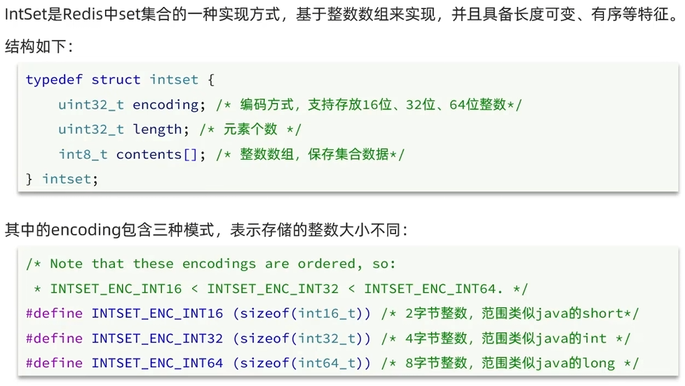

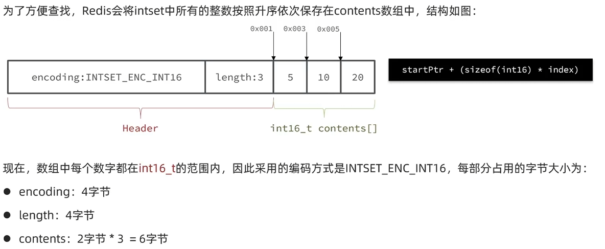

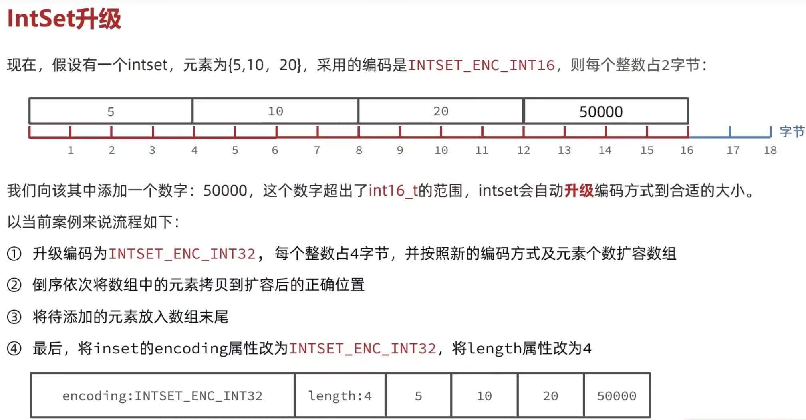

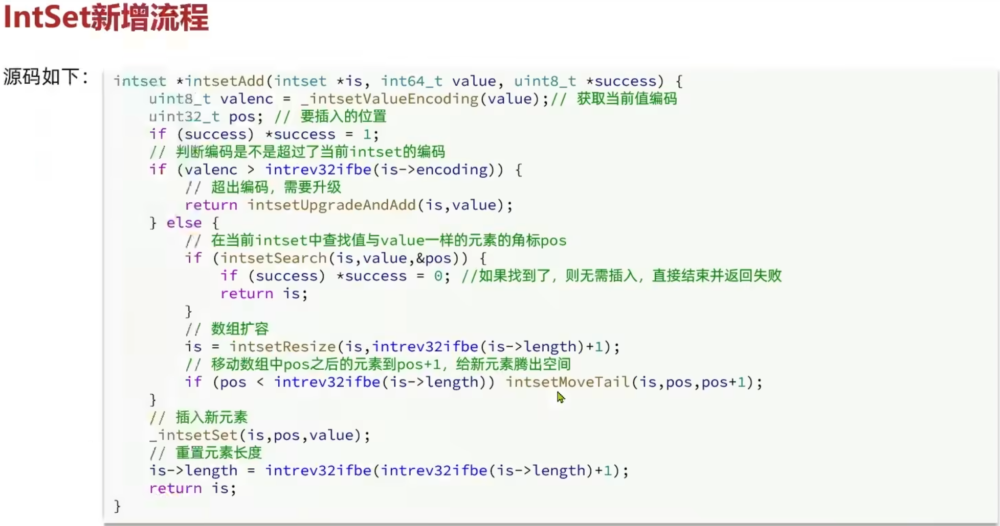


## 1.3 Dict

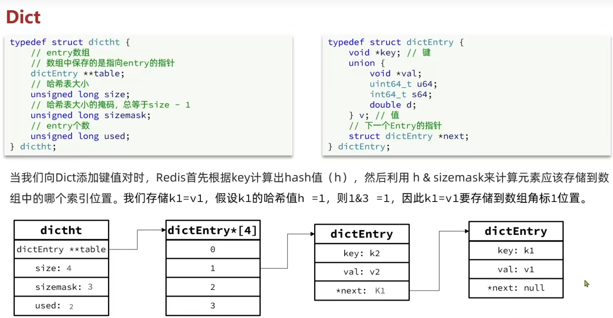

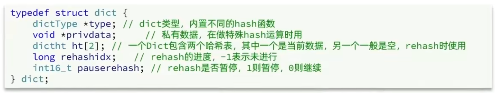

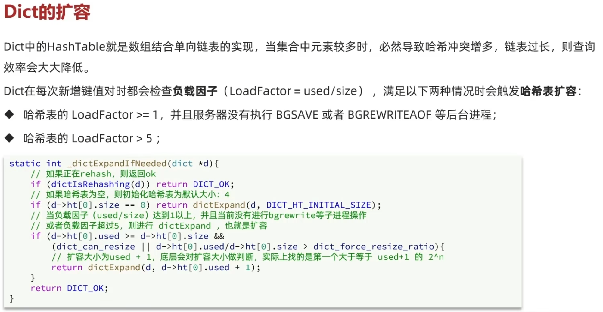

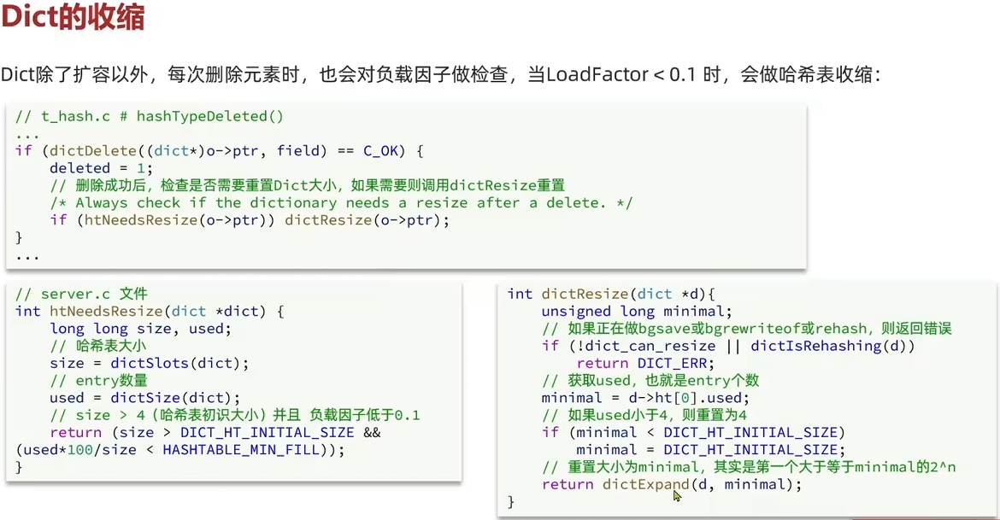

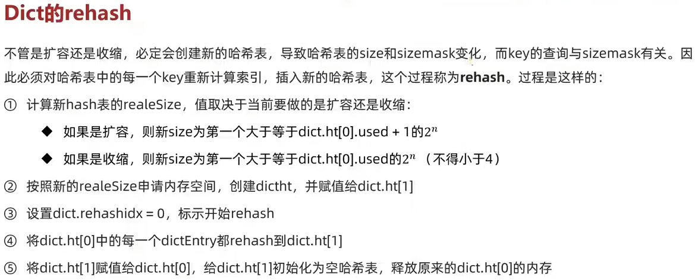

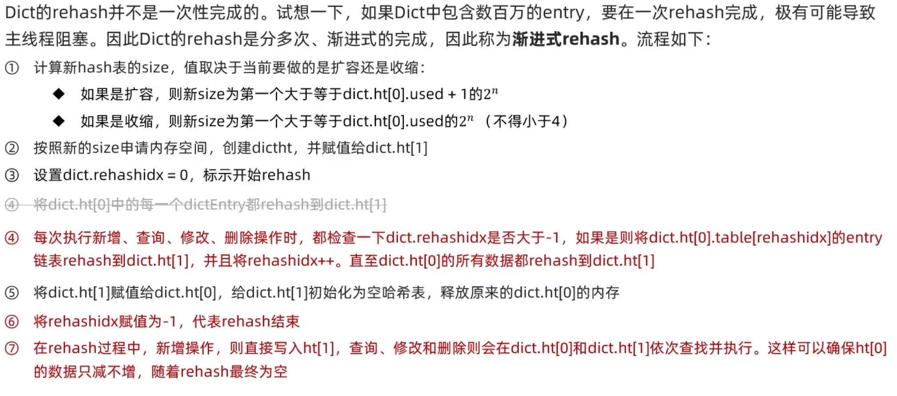

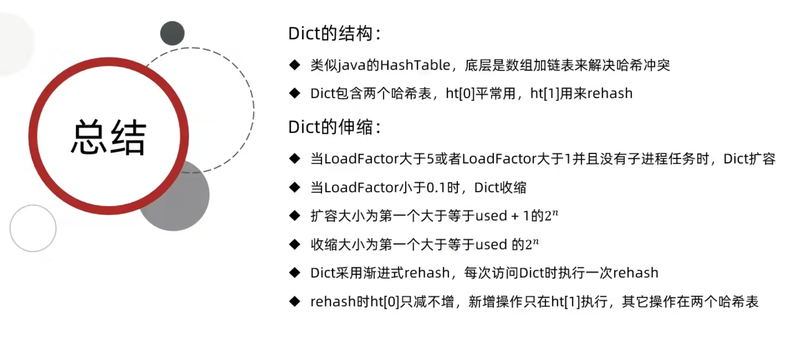


## 1.4 ZipList

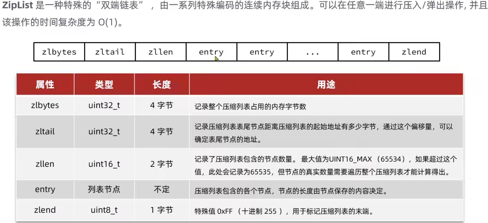

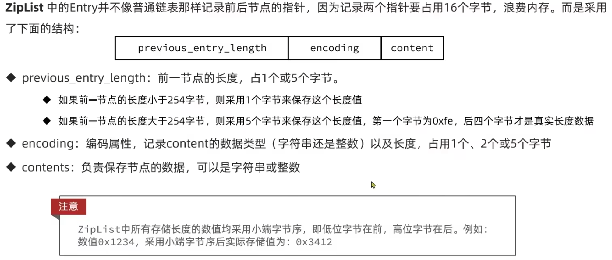

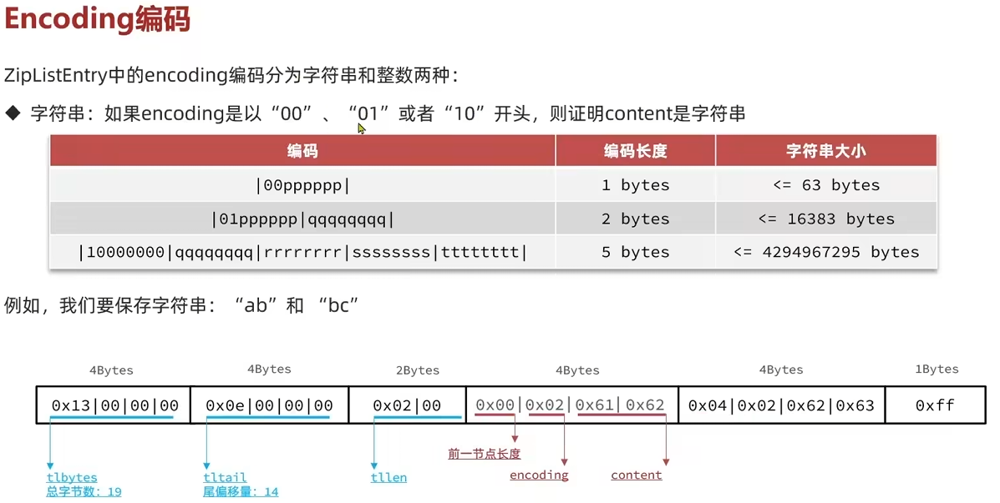

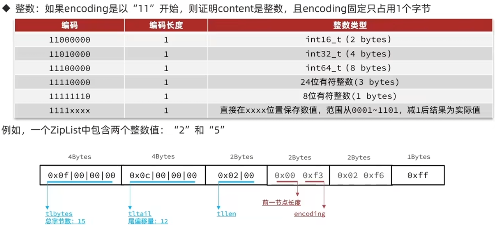

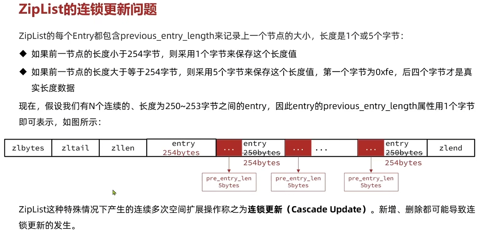


