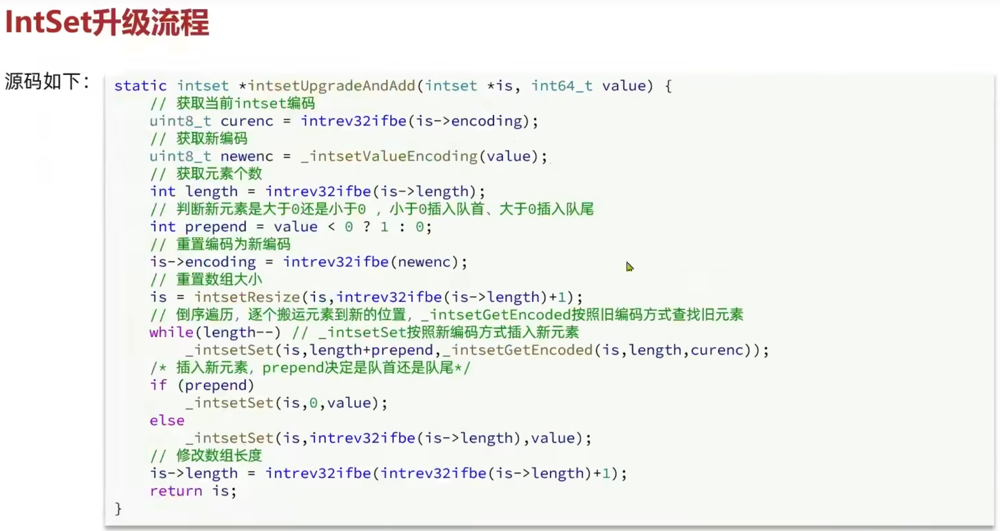
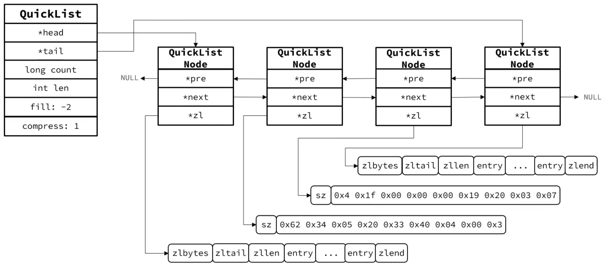
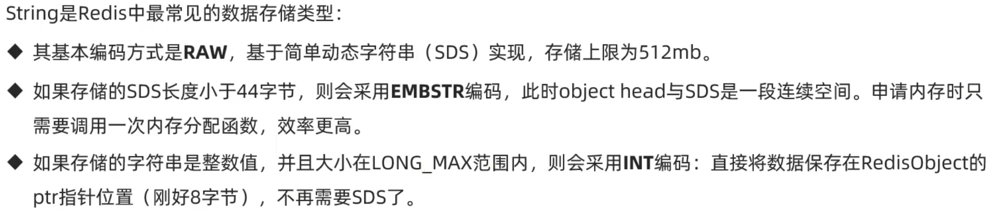

# 1. 数据结构

## 1.1 动态字符串SDS

在 Redis 中，**SDS**（Simple Dynamic String）是 Redis 中使用的字符串表示方式。SDS 是一种动态数组（或者说是扩展数组）结构，用于高效地处理字符串数据。相比于传统的 C 字符串（以 `\0` 结尾的字符数组），SDS 提供了更多的功能和优化，尤其在 Redis 的高性能要求下，具有更好的表现。

### SDS 设计背景

Redis 中的字符串并不是简单的 C 字符串，而是使用 SDS 作为其底层数据结构。这个设计的主要目的是解决 C 字符串的效率瓶颈，比如：

- **动态增长的性能问题**：C 字符串在操作时需要频繁地分配和拷贝内存，性能差。
- **长度计算的问题**：C 字符串的长度需要通过遍历字符串来计算（即 O(n)），而 Redis 使用 SDS 可以通过存储字符串的长度来避免这种计算。

### SDS 结构

SDS 的数据结构通常包含以下几个部分：

1. **len**：当前字符串的长度（不包括结尾的 `\0`）。
2. **alloc**：当前分配的内存大小（包括结尾的 `\0`）。
3. **flags**：一个标志位， 表示SDS的类型，有8位，16位，32位和64位。
4. **data**：实际存储字符串数据的字符数组。

具体来说，SDS 的结构如下（以 C 语言伪代码表示）：

```c
struct sdshdr32 {
    uint32_t len;     		// 当前字符串的长度
    uint32_t alloc;   		// 已分配的内存空间
    unsigned char flags; 	// 表示SDS的类型
    char buf[];       		// 字符数组，存储实际的字符串内容
};
```

### SDS 优点

1. **O(1) 时间复杂度的字符串长度计算**：通过 `len` 字段，SDS 可以在常数时间内获得字符串的长度，而不需要遍历整个字符串。
2. **预分配和动态扩展**：SDS 在插入和修改字符串时，会根据需要动态扩展内存。扩展过程中，Redis 会先分配比实际需要的更多内存，以减少频繁的内存重新分配，提升性能。
3. **优化的内存使用**：通过 `alloc` 字段，Redis 可以有效管理内存。当需要扩展字符串时，Redis 会一次性分配更多内存，而不是频繁重新分配。这使得在字符串长度增长时，性能得到了显著提升。
4. **防止内存碎片**：通过合理的内存管理和扩展策略，SDS 避免了内存碎片问题，保证了内存的高效使用。
5. **支持二进制安全**：SDS 能够存储任意二进制数据，包括 NULL 字符（`'\0'`）。这意味着 SDS 可以用作 Redis 中的所有类型的字符串，不仅仅是文本数据。


## 1.2 IntSet





## 1.3 Dict


## 1.4 ZipList


## 1.5 QuickList





## 1.6 SkipList


## 1.7 RedisObject


## 1.8 五种基本数据结构

### 1. String




### 2. List


### 3. Set


### 4. ZSet


### 5. Hash


# 2. Redis 网络模型

## 2.1 **阻塞I/O**

阻塞I/O是最简单和最常见的I/O模型。在这种模型下，进程在执行I/O操作时，会被挂起直到操作完成。具体来说，当进程发出I/O请求时，它会被阻塞，直到数据被读取或写入，或者I/O操作完成。

- **特点**：
  - 进程在等待I/O操作完成时不能做其他任何事情。
  - 系统会根据I/O的完成情况自动将进程从阻塞状态中唤醒。
  - 适用于I/O操作较少、对响应时间要求不高的场景。
- **应用场景**：常用于简单的文件操作、串行通信等。
- **流程**：
  1. 进程发起I/O请求。
  2. 进程被阻塞，等待I/O操作完成。
  3. I/O操作完成后，进程恢复执行。


## 2.2 **非阻塞I/O**

在非阻塞I/O模型下，进程在发出I/O请求时不会被阻塞。如果I/O操作无法立即完成，系统会立即返回一个错误码（如 `EAGAIN` 或 `EWOULDBLOCK`），进程可以继续执行其他任务，稍后再尝试进行I/O操作。

- **特点**：
  - 进程发出I/O请求后不会被阻塞。
  - 如果数据不可用，返回错误码，进程可以选择稍后再试。
  - 适用于需要同时处理多个I/O操作的情况，减少了进程等待的时间。
- **应用场景**：需要高并发、低延迟的网络编程，常用于多任务处理的服务器中。
- **流程**：
  1. 进程发起I/O请求。
  2. 如果I/O可以完成，则执行该操作，否则立即返回错误码。
  3. 进程继续执行其他任务，稍后重试I/O操作。


## 2.3 **I/O复用**

I/O复用是指一个进程可以同时处理多个I/O操作，而不需要阻塞在某个I/O操作上。通过使用I/O复用，进程可以同时监听多个I/O源的事件，并在某个事件就绪时进行处理。Linux提供了多种I/O复用机制，如 `select`、`poll` 和 `epoll`。

- **特点**：
  - 允许单个进程处理多个I/O操作，提高了系统的并发能力。
  - 进程在等待多个I/O事件时，不会阻塞，可以进行其他操作。
  - 适用于需要处理大量客户端连接的场景，如高并发的网络服务器。
- **应用场景**：网络服务器、事件驱动编程、大规模并发任务处理。
- **流程**：
  1. 进程通过 `select`、`poll` 或 `epoll` 等函数监听多个I/O事件。
  2. 当某个I/O操作准备好时，进程被通知并处理相应的操作。
  3. 如果没有准备好，进程可以继续执行其他任务。


### 1. **select**

`select` 是最早的 I/O 复用机制之一，它通过检查多个文件描述符的状态来判断是否可以进行读写操作。进程调用 `select` 时，它会提供一组文件描述符集合，`select` 会在这些文件描述符中检查哪些是可读、可写或者出现异常的。

#### 特点：

- **参数**：`select` 需要三个集合参数：`readfds`、`writefds` 和 `exceptfds`，分别表示监听可读、可写和异常的文件描述符。
- **阻塞**：`select` 在没有文件描述符准备好时会阻塞进程，直到其中一个或多个文件描述符就绪。
- **返回值**：返回准备就绪的文件描述符的数量。
- **限制**：`select` 的一个主要缺点是它有一个文件描述符数量的限制（通常为 1024）。如果需要监视的文件描述符超过这个限制，`select` 就无法处理。
- **效率**：当监视的文件描述符数量很大时，`select` 会遍历整个文件描述符集合，效率较低，尤其在高并发场景下表现不佳。


### 2. **poll**

`poll` 是 `select` 的增强版本，提供了更多的功能和灵活性，解决了 `select` 中的文件描述符数量限制问题。在 `poll` 中，文件描述符使用一个数组表示，并通过 `pollfd` 结构体来描述每个文件描述符的事件和状态。

#### 特点：

- **参数**：`poll` 接受一个 `pollfd` 结构体数组，每个 `pollfd` 结构体包括文件描述符、事件类型和返回的事件类型。
- **没有文件描述符数量限制**：`poll` 不像 `select` 那样限制最大文件描述符数量，文件描述符的数量仅受系统资源限制。
- **阻塞**：`poll` 也会阻塞，直到某个文件描述符就绪，或者超时发生。
- **效率**：`poll` 仍然需要扫描整个文件描述符数组，性能较低，尤其在文件描述符数目非常多时。


### 3. **epoll**

`epoll` 是 Linux 特有的 I/O 复用机制，专为高并发设计，解决了 `select` 和 `poll` 的性能瓶颈。与 `select` 和 `poll` 不同，`epoll` 在事件发生时进行通知，不需要每次都扫描整个文件描述符集合，这大大提高了性能。

#### 特点：

- **事件驱动**：`epoll` 是事件驱动的，内核会通知进程哪些文件描述符就绪，而不是轮询整个集合。这样，只有就绪的文件描述符才会被返回。
- **支持大规模文件描述符**：`epoll` 解决了 `select` 和 `poll` 的文件描述符数量限制问题，理论上能够支持更大的文件描述符集合。
- **工作模式**：`epoll`支持边缘触发（Edge Triggered，ET）和水平触发（Level Triggered，LT）两种模式。
  - **水平触发（LT）**：类似于 `select` 和 `poll`，只要文件描述符的状态满足条件，`epoll` 就会通知进程。
  - **边缘触发（ET）**：只在状态变化时通知一次，因此应用程序需要一次性读取所有数据，否则可能错过后续的事件。
- **效率高**：`epoll` 通过内核和用户空间的事件通知机制，大大减少了内核和用户空间之间的上下文切换，提高了效率。


## 2.4 **信号驱动I/O**

信号驱动I/O是指当I/O操作准备好时，内核通过向进程发送信号来通知进程。进程不需要主动查询I/O状态，而是通过捕获信号来响应I/O事件。这种模型通过信号机制来实现异步通知。

- **特点**：
  - 进程通过信号来响应I/O操作，而不需要轮询或阻塞。
  - 适合需要异步通知而又不希望占用过多资源的场景。
  - 使用起来较为复杂，主要需要处理信号和信号处理程序的设计。
- **应用场景**：一些高效的异步I/O操作，特别是在处理外部设备和硬件时。
- **流程**：
  1. 进程通过 `fcntl` 或 `sigaction` 等方式设置信号驱动模式。
  2. 内核通过信号通知进程I/O操作已准备好。
  3. 进程捕获信号后，执行相应的I/O操作。


## 2.5 **异步I/O**

异步I/O是一种高级的I/O模型，允许进程发起I/O请求后立即返回，而不需要等待I/O操作的完成。进程在I/O操作完成时会收到通知（通常通过回调函数或者信号机制）。这种模型支持非阻塞和不需要等待的I/O操作，适用于需要高效执行多个I/O操作的场景。

- **特点**：
  - 进程发起I/O请求后，不会阻塞，系统在操作完成时通过回调或信号通知进程。
  - 允许多个I/O操作并行执行，适用于高性能、高并发的场景。
  - 不同于I/O复用，异步I/O并不依赖于轮询。
- **应用场景**：高性能的网络服务器、大规模数据库操作、高并发的数据存取场景。
- **流程**：
  1. 进程发起异步I/O请求，立即返回。
  2. 系统在I/O操作完成后，通过回调或信号通知进程。
  3. 进程通过回调函数或信号处理结果。


## 2.6 Redis网络模型

**Redis到底是单线程还是多线程？**

- 如果仅仅聊Redis的核心业务部分（命令处理），答案是单线程
- 如果是聊整个Redis，那么答案就是多线程
- 在Redis版本迭代过程中，在两个重要的时间节点上引入了多线程的支持：
  - Redis v4.0：引入多线程异步处理一些耗时较长的任务，例如异步删除命令unlink
  - Redis v6.0：在核心网络模型中引I入多线程，进一步提高对于多核CPU的利用率


**什么Redis要选择单线程？**

- 抛开持久化不谈，Redis是纯内存操作，执行速度非常快，它的性能瓶颈是网络延迟而不是执行速度，因此多线程并不会带来巨大的性能提升。
- 多线程会导致过多的上下文切换，带来不必要的开销。
- 引入多线程会面临线程安全问题，必然要引入线程锁这样的安全手段，实现复杂度增高，而且性能也会大打折扣。


# 3. Redis 通信协议


# 4. Redis 内存回收

## 4.1 过期策略

Redis 支持设置键值对的过期时间，过期的键值对会自动被删除。过期策略主要用于管理那些有时间限制的数据，常用于缓存、会话等场景。

- **过期时间设置**：使用 `EXPIRE` 命令，或者在设置键值对时使用带过期时间的命令（如 `SETEX`）。
- **过期键的处理**：
  - 当键过期时，Redis 会将其从内存中删除，避免无用数据占用资源。
  - Redis 提供两种方式来处理过期键：
    1. **惰性删除**：只有在访问过期键时，Redis 才会删除它。这种方式会导致一些过期键占用内存，但对性能影响较小。
    2. **定期删除**：Redis 会周期性地检查一部分过期键，并将其删除。通常使用的是定时轮询，定期地检查过期键并清理它们。
       - SLOW模式执行频率默认为10，每次不超过25ms
       - FAST模式执行频率不固定，但两次间隔不低于2mS，每次耗时不超过1ms
- **过期键的默认行为**：
  - Redis 采用了惰性删除与定期删除相结合的策略，定期删除通过随机抽取一定数量的键来检查过期时间。
- **过期策略的配置**：
  - 可以通过 `config set` 命令来设置过期策略的配置参数，如 `hz`（过期键检测的频率）等。


## 4.2 淘汰策略

当 Redis 内存使用超过设定的最大内存限制时，它会使用淘汰策略来回收内存。淘汰策略决定了 Redis 在内存满时，如何处理不再使用的数据。

Redis 提供了多种淘汰策略，用户可以根据自己的需求选择合适的策略。

常见的淘汰策略有：

1. **noeviction（不淘汰）**：
   - 当内存不足时，Redis 将拒绝执行写操作（如 `SET` 命令）。这种策略保证了所有数据都被保留，但可能导致写操作失败。
2. **allkeys-lru（所有键使用 LRU 淘汰）**：
   - 当内存不足时，Redis 会通过最少使用的原则（LRU，Least Recently Used）删除最久未被访问的键。即使键设置了过期时间，Redis 仍然会根据最近使用情况来决定是否删除该键。
3. **volatile-lru（仅限有过期时间的键使用 LRU 淘汰）**：
   - 仅对设置了过期时间的键应用 LRU 淘汰策略。Redis 会删除最近最少访问的键，但只限于那些设置了过期时间的键。
4. **allkeys-random（随机淘汰）**：
   - 当内存不足时，Redis 会随机选择一些键进行删除，删除的键不论是否设置了过期时间。
5. **volatile-random（仅限有过期时间的键使用随机淘汰）**：
   - 只对设置了过期时间的键应用随机淘汰策略。Redis 会从这些键中随机选择一些进行删除。
6. **volatile-ttl（仅限有过期时间的键使用 TTL 淘汰）**：
   - 当内存不足时，Redis 会优先删除那些即将过期的键。TTL（Time To Live）较短的键会更容易被删除。


#### 配置淘汰策略

Redis 的淘汰策略可以通过 `maxmemory-policy` 参数进行配置。可以在 `redis.conf` 配置文件中设置，或者通过 `CONFIG SET` 命令进行动态修改。


