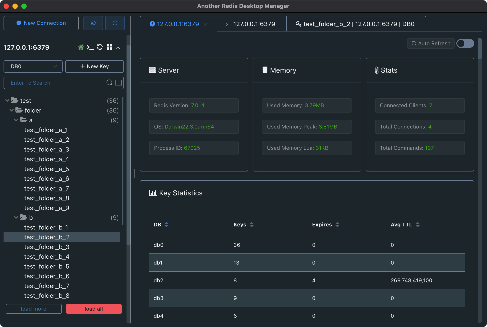
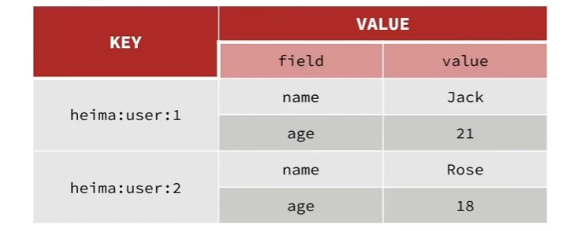

> [!NOTE]
>
> 本篇笔记基于[黑马程序员Redis教程](https://www.bilibili.com/video/BV1cr4y1671t) 基础篇内容

# 1. 认识Redis

Redis 是一种开源的高性能键值数据库，全称为 Remote Dictionary Server（远程字典服务器）。它通常用作缓存、消息队列、分布式锁等场景中的核心组件，同时也支持丰富的数据结构和多种高级特性。

**Redis特点：**

1. **内存存储：** Redis 将数据存储在内存中，读写速度极快，适合对性能要求较高的场景。
2. **丰富的数据结构：** Redis 提供了多种数据结构，满足不同的使用需求：
3. **持久化支持：**
   - **RDB (Redis Database)：** 定期生成快照保存到磁盘。
   - **AOF (Append Only File)：** 将每次写操作追加到日志中，提供更高的数据安全性。
4. **主从复制与高可用：** Redis 支持主从复制，可通过 Sentinel 或 Cluster 模式实现高可用和水平扩展。
5. **轻量级与高并发：** Redis 是单线程的，但由于采用了高效的 I/O 多路复用机制，性能非常优越。


## 1.1 安装Redis

### 1.1.1 常规安装

**Ubuntu：**

1. 更新系统软件包

   ```sh
   sudo apt update
   ```

2. 安装 Redis

   ```sh
   sudo apt install redis-server -y
   ```

3. 配置文件，默认位于`/etc/redis/redis.conf`（具体配置信息可参考后文docker安装部分）

4. 启动 Redis

   ```sh
   sudo systemctl start redis-server
   ```

5. 设置开机自启

   ```sh
   sudo systemctl enable redis-server
   ```

6. 验证 Redis 运行状态

   ```sh
   # 查看状态
   sudo systemctl status redis-server
   
   # 进入 Redis
   redis-cli
   
   # 尝试ping
   127.0.0.1:6379> ping
   PONG
   ```

**Centos：**

1. 更新系统软件包

   ```sh
   sudo yum update -y
   ```

2. 安装 Redis

   ```sh
   # 首先，安装 EPEL 仓库
   sudo yum install epel-release -y
   
   # 安装 Redis
   sudo yum install redis -y
   ```

3. 配置文件，默认位于`/etc/redis/redis.conf`（具体配置信息可参考后文docker安装部分）

4. 启动 Redis

   ```sh
   sudo systemctl start redis-server
   ```

5. 设置开机自启

   ```sh
   sudo systemctl enable redis-server
   ```

6. 验证 Redis 运行状态

   ```sh
   # 查看状态
   sudo systemctl status redis-server
   
   # 进入 Redis
   redis-cli
   
   # 尝试ping
   127.0.0.1:6379> ping
   PONG
   ```


### 1.1.2 Docker创建Redis容器

1. 拉取docker镜像

   ```sh
   docker pull redis
   ```

2. 在本地某个位置创建以下内容

   ```sh
   # 以/docker/redis为例
   mkdir -p /docker/redis
   mkdir -p /docker/redis/data
   touch /docker/redis/redis.conf
   ```

3. 编辑`redis.conf`配置文件

   ```sh
   # Redis配置文件
   
   # Redis默认不是以守护进程的方式运行，可以通过该配置项修改，使用yes启用守护进程
   daemonize no
   
   # 指定Redis监听端口，默认端口为6379
   port 6379
   
   # 绑定的主机地址，不要绑定容器的本地127.0.0.1地址，因为这样就无法在容器外部访问
   bind 0.0.0.0
   
   #需要密码则打开
   requirepass 123456
   
   # 持久化
   appendonly yes
   
   slave-read-only no
   ```

4. 启动容器

   ```sh
   docker run -d \
     --name redis \
     -p 6379:6379 \
     -v /docker/redis/redis.conf:/etc/redis/redis.conf \
     -v /docker/redis/data:/data \
     redis \
     redis-server /etc/redis/redis.conf
   ```

5. 进入 Redis 容器

   ```sh
   docker exec -it redis redis-cli
   ```

6. 若已配置密码，则需使用以下命令进行验证才能使用

   ```sh
   AUTH password
   ```


## 1.2 Redis客户端

### 1.2.1 命令行客户端

使用如下命令即可进入Redis命令行客户端

```sh
redis-cli -h 127.0.0.1 -p 6379 -a 123456
```

- `-h`：地址
- `-p`：端口
- -`a`：密码

或不输入密码，在进入客户端后用如下命令进行身份验证

```sh
AUTH [password]
```


### 1.2.2 图形化界面

可以使用这个开源图形化页面客户端

::github{repo="qishibo/AnotherRedisDesktopManager"}

效果图如下所示：




# 2. Redis命令

**Redis中的常见数据结构：**

| **数据类型**  | **示例**                  | **介绍**                                     |
| ------------- | ------------------------- | -------------------------------------------- |
| **String**    | `hello world`             | 存储简单的字符串，可以是文本或二进制数据     |
| **Hash**      | `{name: "Jack", age: 21}` | 存储键值对（类似于对象或字典）               |
| **List**      | `[A -> B -> C -> C]`      | 按顺序存储字符串元素，可以用作队列或栈       |
| **Set**       | `{A, B, C}`               | 存储无序的唯一字符串集合，支持集合运算       |
| **SortedSet** | `{A: 1, B: 2, C: 3}`      | 存储有序的字符串集合，每个元素关联一个分数   |
| **GEO**       | `{A: (120.3, 30.5)}`      | 用于存储地理位置信息并提供地理半径查询功能   |
| **BitMap**    | `0110110101110101011`     | 用于位存储和操作，适合状态记录或布尔值表示   |
| **HyperLog**  | `0110110101101101101`     | 用于估算基数（去重后的数据量），占用内存较小 |

> [!TIP]
>
> [Redis官方文档](https://redis.io/docs/latest/commands/)中包含对所有命令的详细介绍，在后续的内容中可以结合官方文档深入学习


## 2.1 Redis通用命令

### 1. `KEYS` 命令

**作用：** `KEYS` 命令用于查找与指定模式匹配的所有键。

**语法：**`KEYS pattern`

**参数说明：**

- `pattern`是匹配模式，可以包含通配符：
  - `*`：匹配任意多个字符。
  - `?`：匹配单个字符。
  - `[abc]`：匹配任意一个指定字符。

**示例：**

```cmd
SET key1 value1
SET key2 value2
SET hello value3
KEYS k*    # 返回 ["key1", "key2"]
KEYS h?llo # 返回 ["hello"]
```

**注意：**

- `KEYS` 命令扫描所有键，性能较差，不建议在生产环境中频繁使用。


### 2. `DEL` 命令

**作用：** `DEL` 命令用于删除一个或多个键。如果键不存在，则忽略。

**语法：** `DEL key [key ...]`

**示例：**

```cmd
SET key1 value1
SET key2 value2
DEL key1 key2   # 返回 2，表示删除了两个键
DEL key3        # 返回 0，表示 key3 不存在
```


### 3. `EXISTS` 命令

**作用：** `EXISTS` 用于检查一个或多个键是否存在。

**语法：**`EXISTS key [key ...]`

**返回值：**

- 如果提供一个键，则返回 1（存在）或 0（不存在）。
- 如果提供多个键，则返回存在的键数。

**示例：**

```cmd
SET key1 value1
EXISTS key1     # 返回 1
EXISTS key2     # 返回 0
EXISTS key1 key2 # 返回 1，表示 key1 存在
```


### 4. `EXPIRE` 命令

**作用：** `EXPIRE` 命令用于为键设置过期时间（以秒为单位）。当时间到了后，键会被自动删除。

**语法：**`EXPIRE key seconds`

**返回值：**

- 返回 1：设置成功。
- 返回 0：键不存在或无法设置过期时间（例如永久键）。

**示例：**

```cmd
SET key1 value1
EXPIRE key1 10  # 设置 key1 的过期时间为 10 秒
```

**相关命令：**

- `PEXPIRE key milliseconds`：设置以毫秒为单位的过期时间。


### 5. `TTL` 命令

**作用：** `TTL` 命令返回键的剩余生存时间（以秒为单位）。

**语法：**`TTL key`

**返回值：**

- 正整数：剩余的过期时间（秒）。
- -1：键存在，但没有设置过期时间。
- -2：键不存在。

**示例：**

```cmd
SET key1 value1
EXPIRE key1 10
TTL key1       # 返回 10（时间会随着查询减少）
TTL key2       # 返回 -2，表示 key2 不存在
```

**相关命令：**

- `PTTL key`：返回以毫秒为单位的剩余时间。


## 2.2 Key的层级结构

### 1. Key 的基本结构

- **数据类型**： Redis 的键是二进制安全的字符串。这意味着键可以包含任何字节，甚至是二进制数据。
- **长度限制**： 单个键的最大长度为 512 MB，但实践中通常不会使用如此长的键，因为长键会影响性能。
- **字符限制**： 键可以包含任何字符，包括空格、特殊字符等。


### 2. Key 的命名规则

Redis 对键的命名没有严格的规则，但为了方便管理和性能优化，通常遵循一些约定和最佳实践：

- **命名规范：**
  - 使用清晰、描述性的命名。
  - 避免使用过长的键。
  - 避免键的命名冲突。
- **分层命名（推荐）：**
  - 通常使用冒号 `:` 作为分隔符，形成分层结构。
  - 示例：`user:1001:profile`、`order:2024:details`。
  - 这种命名方式便于通过命令（如 `SCAN` 或 `KEYS`）按前缀过滤相关键。


### 3. Key 的最佳实践

1. **短而有意义的命名**：
   - 键名应该尽量短小，但足够有意义，避免浪费内存。
   - 示例：用 `user:1001` 代替冗长的 `application:user:id:1001`。
2. **避免通配符查询**：
   - 避免在生产环境中使用 `KEYS` 命令，因为它是 $O(N)$ 的操作，可能导致性能问题。
   - 推荐使用 `SCAN` 命令逐步遍历。
3. **统一命名规则**：
   - 采用固定的前缀和分隔符，以便于组织和查找。
   - 示例：`appname:module:identifier`。
4. **设置过期时间（TTL）**：
   - 对临时性数据设置过期时间，减少内存占用。
   - 示例：`SET key value EX 60` 设置 60 秒过期。
5. **避免大规模键值冲突**：
   - 避免使用通用名称，如 `key1`、`temp`。


### 4. Key 的使用场景

根据业务需求，键的命名可以体现其用途。例如：

- **用户信息**：`user:1001:info`，`user:1001:orders`
- **缓存数据**：`cache:product:1234`
- **会话信息**：`session:abc123`


### 5. Redis Key 的注意事项

1. 避免过多的唯一键：如果键太多且唯一性过强（如时间戳），会导致内存占用增加和管理复杂性提升。
2. 警惕键空间膨胀：避免生成大量无用键，例如动态生成的临时键。


## 2.3 String类型常见命令

`String` 是最基本的数据类型，用于存储简单的键值对（key-value）。它是 Redis 中最常用的数据类型，可以存储字符串、整数、浮点数等各种数据。

| **命令**      | **描述**                                                     | **语法**                       |
| ------------- | ------------------------------------------------------------ | ------------------------------ |
| `SET`         | 添加或者修改已经存在的一个 String 类型的键值对               | `SET key value`                |
| `GET`         | 根据 key 获取 String 类型的 value                            | `GET key`                      |
| `MSET`        | 批量添加多个 String 类型的键值对                             | `MSET key1 value1 key2 value2` |
| `MGET`        | 根据多个 key 获取多个 String 类型的 value                    | `MGET key1 key2`               |
| `INCR`        | 让一个整型的 key 自增 1                                      | `INCR key`                     |
| `INCRBY`      | 让一个整型的 key 自增并指定步长                              | `INCRBY key 2`                 |
| `INCRBYFLOAT` | 让一个浮点类型的数字自增并指定步长                           | `INCRBYFLOAT key 2.5`          |
| `SETNX`       | 添加一个 String 类型的键值对，前提是这个 key 不存在，否则不执行 | `SETNX key value`              |
| `SETEX`       | 添加一个 String 类型的键值对，并且指定有效期                 | `SETEX key 60 value`           |


## 2.4 Hash类型常见命令

`Hash` 是一种键值对集合，用于存储多个字段（field）及其对应的值（value）。


**Hash的结构示意图：**




**常用命令如下所示：**

| **命令**  | **描述**                                                     | **语法**                      |
| --------- | ------------------------------------------------------------ | ----------------------------- |
| `HSET`    | 添加或者修改 Hash 类型 key 的 field 的值                     | `HSET key field value`        |
| `HGET`    | 获取一个 Hash 类型 key 的 field 的值                         | `HGET key field`              |
| `HMSET`   | 批量添加多个 Hash 类型 key 的 field 的值                     | `HMSET key field1 value1 ...` |
| `HMGET`   | 批量获取多个 Hash 类型 key 的 field 的值                     | `HMGET key field1 field2 ...` |
| `HGETALL` | 获取一个 Hash 类型 key 中的所有 field 和 value               | `HGETALL key`                 |
| `HKEYS`   | 获取一个 Hash 类型 key 中的所有 field                        | `HKEYS key`                   |
| `HVALS`   | 获取一个 Hash 类型 key 中的所有 value                        | `HVALS key`                   |
| `HINCRBY` | 让一个 Hash 类型 key 的字段值自增并指定步长                  | `HINCRBY key field increment` |
| `HSETNX`  | 添加一个 Hash 类型 key 的 field 值，前提是这个 field 不存在，否则不执行 | `HSETNX key field value`      |


## 2.5 List类型常见命令

`List` 是一种有序的数据结构，类似于传统编程语言中的链表或数组。它由多个元素组成，支持元素的插入、删除、访问和查询操作。Redis 中的 `List` 是双向链表，因此它能够高效地在列表的两端进行操作。

| **命令** | **描述**                                                     | **语法**                          |
| -------- | ------------------------------------------------------------ | --------------------------------- |
| `LPUSH`  | 向列表左侧插入一个或多个元素                                 | `LPUSH key element [element ...]` |
| `LPOP`   | 移除并返回列表左侧的第一个元素，没有则返回 `nil`             | `LPOP key`                        |
| `RPUSH`  | 向列表右侧插入一个或多个元素                                 | `RPUSH key element [element ...]` |
| `RPOP`   | 移除并返回列表右侧的第一个元素                               | `RPOP key`                        |
| `LRANGE` | 返回一段角标范围内的所有元素                                 | `LRANGE key start end`            |
| `BLPOP`  | 与 `LPOP` 类似，但会在没有元素时等待指定时间，而不是直接返回 `nil` | `BLPOP key [key ...] timeout`     |
| `BRPOP`  | 与 `RPOP` 类似，但会在没有元素时等待指定时间，而不是直接返回 `nil` | `BRPOP key [key ...] timeout`     |


## 2.6 Set类型常见命令

`Set` 是一种无序的数据结构，它用于存储多个不重复的元素。`Set` 是一种集合类型，具有高效的插入、删除和查找操作，特别适用于那些不关心元素顺序、但需要保证唯一性的数据集合。

| **命令**    | **描述**                      | **语法**                       |
| ----------- | ----------------------------- | ------------------------------ |
| `SADD`      | 向 set 中添加一个或多个元素   | `SADD key member [member ...]` |
| `SREM`      | 移除 set 中的指定元素         | `SREM key member [member ...]` |
| `SCARD`     | 返回 set 中元素的个数         | `SCARD key`                    |
| `SISMEMBER` | 判断一个元素是否存在于 set 中 | `SISMEMBER key member`         |
| `SMEMBERS`  | 获取 set 中的所有元素         | `SMEMBERS key`                 |
| `SINTER`    | 求 key1 与 key2 的交集        | `SINTER key1 [key2 ...]`       |
| `SDIFF`     | 求 key1 与 key2 的差集        | `SDIFF key1 [key2 ...]`        |
| `SUNION`    | 求 key1 和 key2 的并集        | `SUNION key1 [key2 ...]`       |


## 2.7 ZSet（Sorted Set）类型常见命令

`Sorted Set`（有序集合）是一种非常强大的数据结构，结合了 `Set` 和 `List` 的特点。与普通的 `Set` 不同，`Sorted Set` 中的元素是有序的，每个元素除了一个值（`member`）外，还关联一个分数（`score`）。元素的排序是根据分数来进行的，分数可以是浮点数。

| **命令**        | **描述**                                                     | **语法**                                   |
| --------------- | ------------------------------------------------------------ | ------------------------------------------ |
| `ZADD`          | 添加一个或多个元素到 sorted set，如果已经存在则更新其 score 值 | `ZADD key score member [score member ...]` |
| `ZREM`          | 删除 sorted set 中的一个指定元素                             | `ZREM key member [member ...]`             |
| `ZSCORE`        | 获取 sorted set 中的指定元素的 score 值                      | `ZSCORE key member`                        |
| `ZRANK`         | 获取 sorted set 中的指定元素的排名                           | `ZRANK key member`                         |
| `ZCARD`         | 获取 sorted set 中的元素个数                                 | `ZCARD key`                                |
| `ZCOUNT`        | 统计 score 值在给定范围内的所有元素的个数                    | `ZCOUNT key min max`                       |
| `ZINCRBY`       | 让 sorted set 中的指定元素自增，步长为指定的 increment 值    | `ZINCRBY key increment member`             |
| `ZRANGE`        | 按照 score 排序后，获取指定排名范围内的元素                  | `ZRANGE key min max [WITHSCORES]`          |
| `ZRANGEBYSCORE` | 按照 score 排序后，获取指定 score 范围内的元素               | `ZRANGEBYSCORE key min max [WITHSCORES]`   |
| `ZDIFF`         | 求差集                                                       | `ZDIFF numkeys key [key ...]`              |
| `ZINTER`        | 求交集                                                       | `ZINTER numkeys key [key ...]`             |
| `ZUNION`        | 求并集                                                       | `ZUNION numkeys key [key ...]`             |


# 3. Redis的Java客户端

以下是一些常用的客户端总结：

| **客户端**            | **特点**                                     | **优点**                                   | **缺点**                                     | **适用场景**                      |
| --------------------- | -------------------------------------------- | ------------------------------------------ | -------------------------------------------- | --------------------------------- |
| **Jedis**             | 简单易用，支持 Redis 大部分功能，连接池      | 简单易用，适合大多数场景，支持常见数据类型 | 单线程，异步支持差，可能在高并发场景下性能差 | 小型应用，简单的 Redis 操作       |
| **Lettuce**           | 基于 Netty，支持异步、反应式编程，非阻塞 I/O | 高并发、高性能，支持异步和反应式编程       | API 较复杂，学习成本高                       | 高并发应用，需要异步操作的场景    |
| **Redisson**          | 提供分布式锁、分布式集合，支持同步/异步      | 提供高级功能，支持 Redis 集群、主从模式    | 学习成本高，复杂性较高                       | 分布式应用，需要高级 Redis 功能   |
| **Spring Data Redis** | 与 Spring 集成，提供 RedisTemplate           | 与 Spring Boot 无缝集成，简化 Redis 操作   | 适用于 Spring 环境，增加复杂度               | Spring/Spring Boot 应用，自动配置 |


## 3.1 Jedis

项目地址：
::github{repo="redis/jedis"}

### 使用方法：

1. 引入maven坐标

   ```xml
   <dependency>
       <groupId>redis.clients</groupId>
       <artifactId>jedis</artifactId>
       <version>5.2.0</version>
   </dependency>
   ```

2. 建立连接

   ```java
   Jedis jedis = new Jedis("localhost", 6379);
   jedis.auth("password");
   jedis.select(0);
   ```

3. 使用

   ```java
   jedis.set("name", "zhangsan");
   System.out.println(jedis.get("name"));
   ```

4. 释放资源

   ```java
   if (jedis != null) {
       jedis.close();
   }
   ```


### Jedis连接池

由于Jedis本身是线程不安全的，并且频繁的创建和销毁连接会有性能损耗，因此推荐使用Jedis连接池代替Jedis的直连方式。

以下是一个基于Jedis连接池的实践：

```java
public class JedisFactory {
    // 创建 JedisPool 实例
    private static JedisPool jedisPool;

    // 静态代码块初始化连接池
    static {
        // 配置连接池参数
        JedisPoolConfig poolConfig = new JedisPoolConfig();
        poolConfig.setMaxTotal(128);  // 最大连接数
        poolConfig.setMaxIdle(64);    // 最大空闲连接数
        poolConfig.setMinIdle(16);    // 最小空闲连接数
        poolConfig.setTestOnBorrow(true);  // 获取连接时进行有效性检查
        poolConfig.setTestOnReturn(true);  // 归还连接时进行有效性检查
        poolConfig.setMaxWaitMillis(3000);  // 最大等待时间，单位毫秒

        // 初始化 Jedis 连接池
        jedisPool = new JedisPool(config, "localhost", 6379, 1000, "password");
    }

    // 提供 Jedis 连接
    public static Jedis getJedis() {
        return jedisPool.getResource();
    }

    // 关闭连接池
    public static void closePool() {
        if (jedisPool != null) {
            jedisPool.close();
        }
    }
}
```


## 3.2 Spring Data Redis

