# 1. 分布式缓存

由于单点Redis中存在以下问题，因此在本节中，将一一介绍其对应的解决方法。


## 1.1 RDB（Redis DataBase）持久化

#### **概念**

- RDB 是 Redis 的一种快照（Snapshotting）持久化方式。
- 在特定的时间间隔，将 Redis 内存中的数据以二进制文件的形式保存到磁盘。
- 默认的 RDB 文件名为 `dump.rdb`。

#### **工作原理**

- Redis 会通过 `fork` 操作创建一个子进程。
- 子进程将当前内存数据写入到临时文件，写入完成后用该文件替换之前的 RDB 文件。

#### **触发方式**

1. **手动触发**：

   - 使用 `SAVE` 命令：阻塞式生成 RDB 文件。
   - 使用 `BGSAVE` 命令：非阻塞式生成 RDB 文件。

2. **自动触发**：

   - 根据 `save` 配置项，设置满足条件时自动触发（如写操作达到一定数量或时间间隔）。

     ```bash
     # redis.conf
     # save ""		 # 禁用 RDB 快照
     save 900 1       # 在 900 秒内（15 分钟）至少有 1 次写操作时触发 RDB 快照
     save 300 10      # 在 300 秒内（5 分钟）至少有 10 次写操作时触发 RDB 快照
     save 60 10000    # 在 60 秒内（1 分钟）至少有 10000 次写操作时触发 RDB 快照
     dbfilename dump.rdb  # RDB 文件的文件名
     dir /path/to/dir     # 保存 RDB 文件的路径
     stop-writes-on-bgsave-error yes  # RDB 生成错误时停止写操作
     ```

#### **优点**

- **磁盘占用小**：只保存某一时刻的完整数据快照。
- **恢复速度快**：加载 RDB 文件时速度较快。
- **性能较高**：持久化由子进程完成，主进程无需处理磁盘 I/O。

#### **缺点**

- **可能丢失数据**：如果 Redis 在快照之间宕机，会丢失最近一次快照之后的数据。
- **不适合频繁持久化**：快照操作较重，频繁执行可能影响性能。


## 1.2 AOF（Append Only File）持久化

#### **概念**

- AOF 是 Redis 的日志型持久化方式。
- 它会以日志形式记录每个写入操作，将其追加到一个文件中（默认文件名为 `appendonly.aof`）。

#### **工作原理**

- Redis 将每一个写操作（如 `SET`、`HSET`）以文本形式记录到 AOF 文件。
- 定期根据策略对 AOF 文件进行重写（压缩），以减小文件大小。

#### **触发方式**

配置项控制写入时机：

- `appendfsync always`：每次写操作都立即同步到磁盘，性能较差但最安全。
- `appendfsync everysec`（默认）：每秒同步一次，性能和数据安全性之间的平衡。
- `appendfsync no`：由操作系统决定何时写入，性能最高但最不安全。

```bash
# redis.conf
appendonly yes              # 开启 AOF 持久化（默认关闭）
appendfilename "appendonly.aof"  # AOF 文件名
appendfsync always          # 每次写操作后立即同步到磁盘（性能低，数据最安全）
appendfsync everysec        # 每秒同步一次（默认，性能与安全的平衡）
appendfsync no              # 操作系统决定何时同步（性能高，数据安全性低）
no-appendfsync-on-rewrite yes  # AOF 重写期间，不进行磁盘同步
auto-aof-rewrite-percentage 100  # AOF 文件大小是上次重写时的 100% 时触发重写
auto-aof-rewrite-min-size 64mb  # AOF 文件最小达到 64MB 时允许触发重写
```

#### **优点**

- **更高的数据安全性**：每次写操作都会记录，最多丢失最近 1 秒的数据（`everysec` 模式）。
- **可读性强**：AOF 文件是可读的文本文件，便于分析和修复数据。
- **灵活性高**：可以根据实际需要选择同步策略。

#### **缺点**

- **磁盘占用大**：AOF 文件比 RDB 文件大，特别是写操作频繁时。使用`BGREWRITEAOF`指令重写可以进行一定程度的优化。
- **恢复速度慢**：加载 AOF 文件需要重放所有日志，速度较慢。
- **性能影响**：频繁写入磁盘可能影响 Redis 性能。


## 1.3 Redis主从

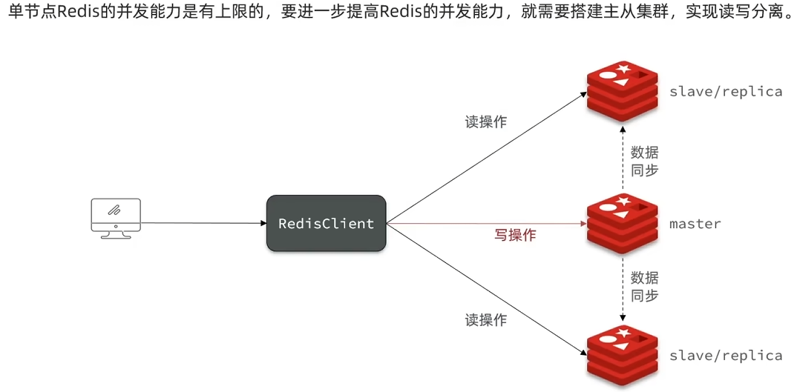

### 1. 搭建主从集群

接着尝试尝试写入数据看是否能进行数据同步：

```bash
# 从节点
127.0.0.1:7001> get k
(nil)

# 主节点
127.0.0.1:7000> set k 1
OK

# 从节点
127.0.0.1:7001> get k
"1"
```

**1.编写配置文件**

`redis-cluster/master/redis.conf`

```bash
# redis实例的声明 IP
replica-announce-ip 10.0.2.15

port 7000
bind 0.0.0.0
protected-mode no
appendonly yes
```


`redis-cluster/slave1/redis.conf`（其他从节点类似）

```bash
# slave1 - redis.conf
replica-announce-ip 10.0.2.15
replicaof 10.0.2.15 7000

port 7001
bind 0.0.0.0
protected-mode no
appendonly yes
```


**2.分别启动三个实例**

为了方便查看日志，我们打开3个ssh窗口，分别启动3个redis实例，启动命令：

```bash
# 第1个
redis-server master/redis.conf --daemonize yes
# 第2个
redis-server slave1/redis.conf --daemonize yes
# 第3个
redis-server slave2/redis.conf --daemonize yes
```

若要一键停止可以使用如下命令：

```bash
printf '%s\n' 7000 7001 7002 | xargs -I{} -t redis-cli -p {} shutdown
```


**3.验证可用性**

分别使用命令`redis-cli -p 7000 info replication`观察三个实例，可以发现构成为一主二从

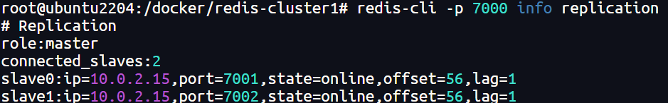

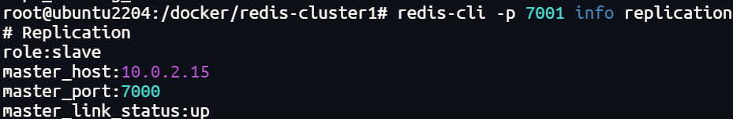

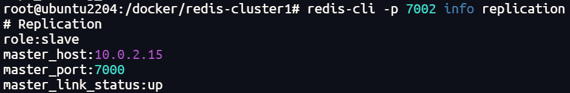

接着尝试写入数据，观察能否同步

```bash
# 从节点
127.0.0.1:7001> get k
(nil)

# 主节点
127.0.0.1:7000> set k 1
OK

# 从节点
127.0.0.1:7001> get k
"1"
```

### 2. 数据同步原理

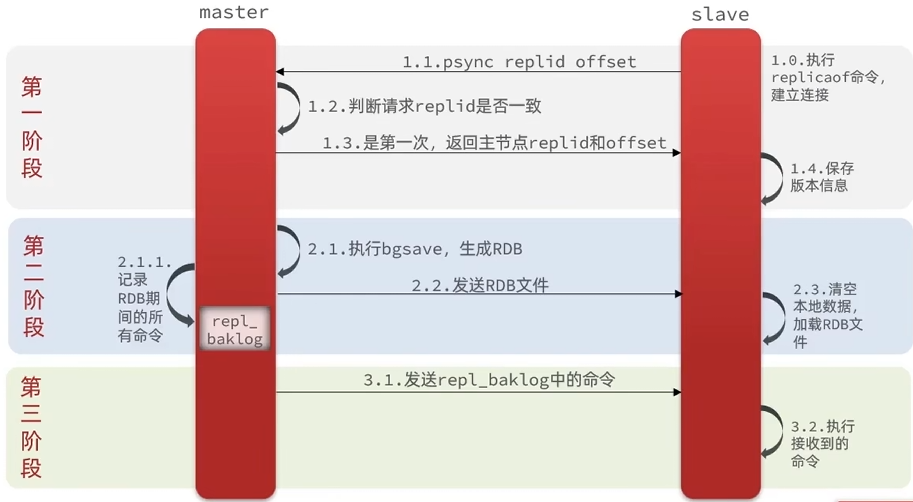

`replid` ：是一个唯一标识符，用于标识Redis实例的复制状态。每个Redis节点（无论是主节点还是从节点）都有一个唯一的 `replid`。

`offset` ：是一个数字，表示主节点复制积压缓冲区中的数据的偏移量。它标识了主节点写操作的顺序，用于确保主从同步中增量数据的正确传输。

#### **初始同步（全量同步）**

当从节点第一次连接到主节点时，会执行一次全量同步，步骤如下：

1. **从节点向主节点发送SYNC命令**：当从节点启动并连接到主节点时，会向主节点发送一个`SYNC`命令，表示准备进行数据同步。
2. **主节点开始创建RDB快照**：主节点会创建一个RDB（Redis数据备份）快照，这时主节点会暂停处理写请求并将内存中的数据写入到磁盘。
3. **从节点接收数据快照**：主节点生成RDB文件之后，将整个数据集（即RDB文件）发送给从节点。
4. **从节点加载RDB文件**：从节点接收到完整的RDB文件后，将文件加载到内存中，完成初步数据同步。


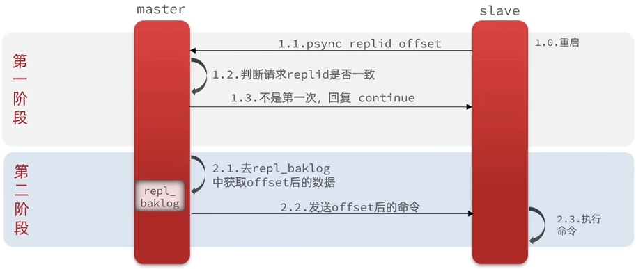

#### **增量同步（部分同步）**

在全量同步后，主节点和从节点会持续进行增量同步：

1. **主节点的写操作**：主节点在进行数据写操作时，会将这些操作记录到一个叫做`replication backlog`（复制积压缓冲区）的小缓冲区中。
2. **从节点的同步**：从节点会定期向主节点发送`PSYNC`命令，请求同步自上次同步以来的增量数据。
3. **主节点返回增量数据**：主节点会将自上次同步以来的所有写操作（包括`SET`、`DEL`等）发送给从节点，确保从节点数据的实时更新。

> [!NOTE]
>
> repl_baklog大小有上限，写满后会覆盖最早的数据。如果slave断开时间过久，导致尚未备份的数据被覆盖，则无法基于log做增量同步，只能再次全量同步。


#### 使用优化

- 在master中配置`repl-diskless-sync yes`启用无磁盘复制，避免全量同步时的磁盘lO。
- Redis单节点上的内存占用不要太大，减少RDB导致的过多磁盘IO。
- 适当提高repl_baklog的大小，发现slave岩机时尽快实现故障恢复，尽可能避免全量同步。
- 限制一个master上的slave节点数量，如果实在是太多slave，则可以采用主-从-从链式结构，减少master压力。


## 1.4 Redis哨兵

### 1. 基本介绍

Redis 哨兵（**Sentinel**）是一个用于 Redis 集群高可用性（High Availability, HA）管理的系统，它通过监控、通知和故障转移等机制，确保 Redis 服务在出现故障时能够自动恢复，保证系统的高可用性。


#### 哨兵的作用：

1. **监控**（Monitoring）

   - 哨兵会定期检查 Redis 实例的状态（包括主节点和从节点）。它通过发送`PING`命令来检查节点是否处于正常运行状态。如果发现某个 Redis 节点不可用（例如：由于网络问题或节点宕机），哨兵会将该节点标记为下线（fail）。

   - 哨兵可以监控多个 Redis 实例，包括主节点和从节点。

2. **自动故障转移**（Automatic Failover）
   - 当主节点发生故障（例如宕机或无法响应）时，Redis 哨兵会自动进行故障转移。
3. **通知**（Notification）
   - 当 Redis 节点出现问题（例如：故障、下线等），哨兵会通过配置的通知方式（如邮件、短信、HTTP 请求等）通知管理员。


#### 监控服务的原理

1. **定期发送`PING`命令**：哨兵通过每秒向被监控的 Redis 实例发送`PING`命令，检测节点是否存活。
2. **基于响应的超时判断**：如果被监控节点在指定时间内没有响应，哨兵会将其标记为疑似下线（`Subjectively Down`，简称`SDOWN`）。
3. **多哨兵协作验证**：如果标记主节点为`SDOWN`的哨兵数量达到`quorum`值，那么该节点会被标记为客观下线（`Objectively Down`，简称`ODOWN`）。
4. **故障检测与恢复**：当主节点被标记为`ODOWN`时，哨兵会启动故障转移流程。


#### 选举依据

一旦发现master故障，sentinel需要在salve中选择一个作为新的master，选择依据是这样的：

1. 首先会判断slave节点与master节点断开时间长短，如果超过指定值$（down-after-milliseconds*10）$则会排除该slave节点
2. 然后判断slave节点的`slave-priority`值，越小优先级越高，如果是0则永不参与选举
3. 如果`slave-prority`一样，则判断slave节点的`offset`值，越大说明数据越新，优先级越高
4. 最后是判断slave节点的运行id大小，越小优先级越高


#### 故障转移流程

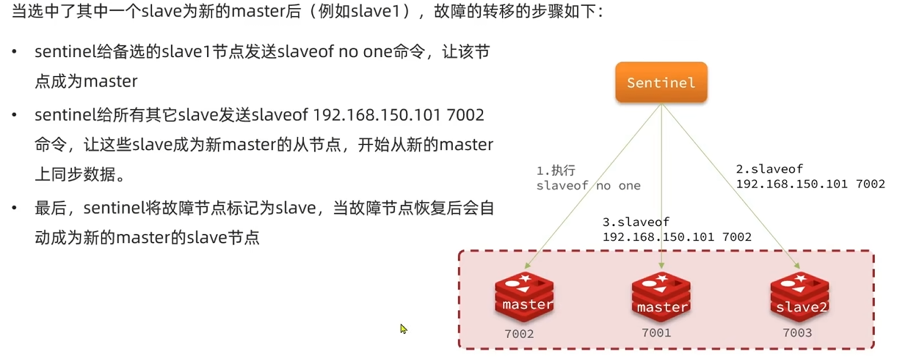


### 2. 搭建哨兵集群

**1.安装服务**

如果没有安装`redis-sentinel`，先运行下面的指令安装

```bash
sudo apt update
sudo apt install redis-sentinel -y
```


**2.编写配置**

为每个哨兵编写一份配置文件

```bash
port 26379
bind 0.0.0.0
sentinel monitor mymaster 10.0.2.15 6379 2
sentinel down-after-milliseconds mymaster 5000
sentinel failover-timeout mymaster 10000
sentinel parallel-syncs mymaster 1

# 多个主节点的配置（如果有的话）
# sentinel monitor mymaster2 10.0.2.15 6380 2
# sentinel down-after-milliseconds mymaster 5000
# sentinel failover-timeout mymaster 10000
# sentinel parallel-syncs mymaster 1
```

- `mymaster`：主节点的名称。
- `10.0.2.15 6379`：主节点的地址和端口。
- `2`：需要至少两个哨兵实例同意，才会进行故障转移。


**3.启动**

```bash
# 第1个
redis-sentinel s1/sentinel.conf
# 第2个
redis-sentinel s2/sentinel.conf
# 第3个
redis-sentinel s3/sentinel.conf
```


**4.测试**

手动关停7000端口主节点，若观察到主节点发生切换，即证明哨兵正常运行

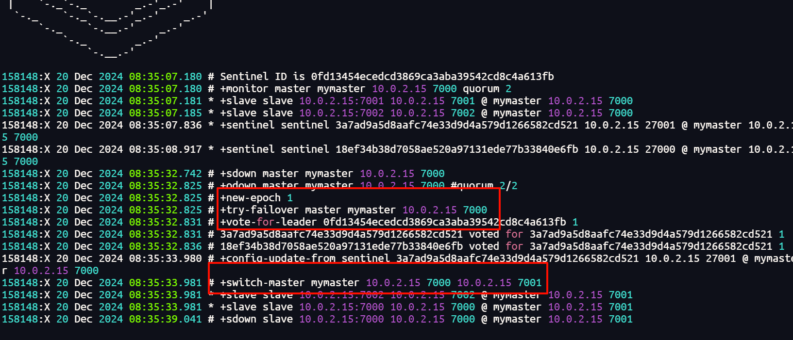


### 3. RedisTemplate连接哨兵

1. 引入redis依赖

   ```xml
   <dependency>
       <groupId>org.springframework.boot</groupId>
       <artifactId>spring-boot-starter-data-redis</artifactId>
   </dependency>
   ```

2. 再`application.yml`中配置相关信息

   ```yml
   spring:
     data:
       redis:
         sentinel:
           master: mymaster	# 之前配置的master名称
           nodes:	# sentinel节点
             - 192.168.64.10:27000
             - 192.168.64.10:27001
             - 192.168.64.10:27002
   ```

3. 配置主从读写分离

   ```java
   @Bean
   public LettuceClientConfigurationBuilderCustomizer lettuceClientConfigurationBuilderCustomizer() {
       return clientConfigurationBuilder -> clientConfigurationBuilder.readFrom(ReadFrom.REPLICA_PREFERRED);
   }
   ```

   - MASTER：从主节点读取
   - MASTER_PREFERRED：优先从master节点读取，master不可用才读取replica
   - REPLICA：从slave（replica）节点读取
   - REPLICA_PREFERRED：优先从slave（replica）节点读取，所有的slave都不可用才读取master


## 1.5 Redis分片集群

### 1. 基本介绍

Redis 分片集群（Redis Cluster Sharding）是一种通过将数据划分到多个 Redis 实例（节点）中来实现高可扩展性和高可用性的分布式架构。它通过对数据进行分片（Sharding）来减轻单个 Redis 实例的负担，提供横向扩展的能力


### 2. 搭建分片集群

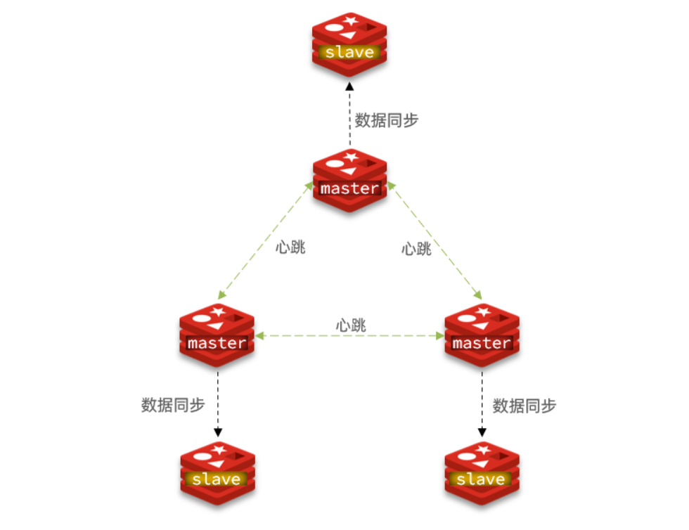

在本节中，将搭建一个最小的三主三从分片集群：

**1.创建配置文件**

创建目录

```sh
# 进入/tmp目录
cd /tmp

# 创建目录
mkdir 7001 7002 7003 8001 8002 8003
```


在/tmp下准备一个新的redis.conf文件，内容如下：

```ini
port 6379
# 开启集群功能
cluster-enabled yes
# 集群的配置文件名称，不需要我们创建，由redis自己维护
cluster-config-file /tmp/6379/nodes.conf
# 节点心跳失败的超时时间
cluster-node-timeout 5000
# 持久化文件存放目录
dir /tmp/6379
# 绑定地址
bind 0.0.0.0
# 让redis后台运行
daemonize yes
# 注册的实例ip（改成自己的）
replica-announce-ip 192.168.31.152
# 保护模式
protected-mode no
# 数据库数量
databases 1
# 日志
logfile /tmp/6379/run.log
```

将这个文件拷贝到每个目录下：

```sh
# 进入/tmp目录
cd /tmp
# 执行拷贝
echo 7001 7002 7003 8001 8002 8003 | xargs -t -n 1 cp redis.conf
```


修改每个目录下的redis.conf，将其中的6379修改为与所在目录一致：

```sh
# 进入/tmp目录
cd /tmp
# 修改配置文件
printf '%s\n' 7001 7002 7003 8001 8002 8003 | xargs -I{} -t sed -i 's/6379/{}/g' {}/redis.conf
```


**2.启动实例**

因为已经配置了后台启动模式，所以可以直接启动服务：

```sh
# 进入/tmp目录
cd /tmp
# 一键启动所有服务
printf '%s\n' 7001 7002 7003 8001 8002 8003 | xargs -I{} -t redis-server {}/redis.conf
```

通过ps查看状态：

```sh
ps -ef | grep redis
```

发现服务都已经正常启动：

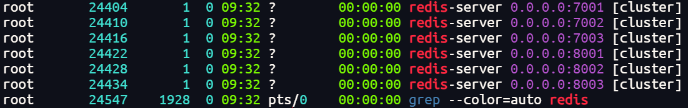

关闭指令：

```bash
printf '%s\n' 7001 7002 7003 8001 8002 8003 | xargs -I{} -t redis-cli -p {} shutdown
```


**3.启动集群**

Redis5.0以后集群管理以及集成到了redis-cli中，格式如下：

```sh
redis-cli --cluster create --cluster-replicas 1 192.168.31.152:7001 192.168.31.152:7002 192.168.31.152:7003 192.168.31.152:8001 192.168.31.152:8002 192.168.31.152:8003
```

命令说明：

- `redis-cli --cluster`或者`./redis-trib.rb`：代表集群操作命令
- `create`：代表是创建集群
- `--replicas 1`或者`--cluster-replicas 1` ：指定集群中每个master的副本个数为1，此时`节点总数 ÷ (replicas + 1)` 得到的就是master的数量。因此节点列表中的前n个就是master，其它节点都是slave节点，随机分配到不同master


### 3. 散列插槽

Redis 集群通过将所有数据划分为 16384 个散列插槽（编号从 0 到 16383），并将这些插槽分配给不同的节点，从而实现数据的分布式管理和存储。


**散列插槽的工作原理**

1. **哈希计算**
   Redis 使用 `CRC16` 算法计算键的哈希值，然后对 16384 取模，得到该键对应的散列插槽编号：
2. **插槽分配**
   Redis 集群中的每个主节点管理多个散列插槽。例如：
   - 节点 A 负责插槽范围 `0-5460`。
   - 节点 B 负责插槽范围 `5461-10922`。
   - 节点 C 负责插槽范围 `10923-16383`。
3. **键存储**
   每个键根据其散列插槽编号被存储到对应负责该插槽的节点上。


Redis 集群默认不支持跨多个插槽的操作（如 `MSET`、`MGET`）。为了解决这个问题，可以使用 **哈希标签（hash tag）** 将多个键映射到同一个插槽。例如：

- `key1` 和 `key2` 都包含 `{user}`，如 `user:{123}` 和 `user:{456}`。
- Redis 只会对 `{user}` 部分计算哈希值，从而将这两个键映射到同一个散列插槽。


### 4. 集群伸缩

Redis 集群的伸缩是指通过动态调整集群中的节点数量来适应业务需求的变化。Redis 集群支持 **水平扩展（Scale Out）** 和 **水平缩减（Scale In）**，即增加或移除节点以动态改变集群容量。


**扩容步骤**

1. **添加新节点**

   - 启动一个新的 Redis 实例，并配置为集群模式（`cluster-enabled yes`）。
   - 将新节点加入现有的 Redis 集群。

   ```bash
   redis-cli --cluster add-node <new-node-ip>:<port> <existing-node-ip>:<port>
   ```

2. **重新分配哈希槽**

   - 新节点加入后，Redis 集群会重新分配部分哈希槽给新节点。
   - 集群会将数据从原先负责这些哈希槽的节点迁移到新节点。

   ```bash
   redis-cli --cluster reshard <existing-node-ip>:<port>
   ```

3. **数据迁移**

   - 在迁移过程中，Redis 会将哈希槽及其对应的数据从旧节点复制到新节点。迁移是在线完成的，客户端对这一过程透明。

4. **验证集群状态**

   - 执行以下命令检查集群是否正常：

     ```bash
     redis-cli --cluster check <existing-node-ip>:<port>
     ```


**缩容步骤**

1. **选择要移除的节点**

   - 确定需要移除的节点，通常是负载较轻或冗余的节点。

2. **迁移哈希槽**

   - 将待移除节点负责的哈希槽迁移到其他节点。

   ```bash
   redis-cli --cluster reshard <existing-node-ip>:<port>
   ```

3. **移除节点**

   - 完成哈希槽迁移后，将节点从集群中移除。

   ```bash
   redis-cli --cluster del-node <existing-node-ip>:<port> <node-id>
   ```

4. **关闭节点**

   - 从集群中移除后，可以安全地关闭该节点。


### 5. 故障转移

**故障转移：**

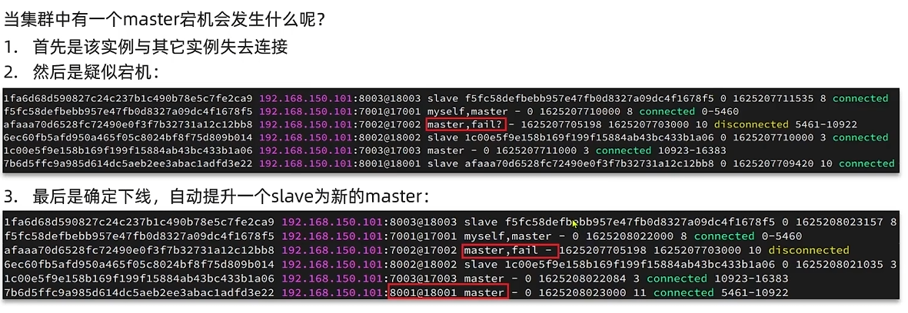


**数据迁移：**

可以利用`cluster failover`命令手动使集群中的某个master宕机，切换到执行该命令的slave节点，实现数据的无感迁移，其流程如下所示：

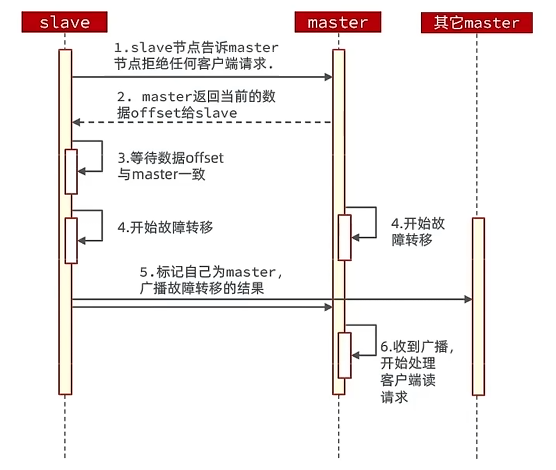

手动Failover支持以下几种模式：

- 缺省：默认的流程，如上图所示
- force：省略了对offset的一致性校验
- takeover：直接执行第5步，忽略数据一致性、忽略master状态和其它master的意见


### 6. RedisTemplate访问分片集群

基本与哨兵模式一致，只需要修改配置文件即可

1. 引入redis依赖

   ```xml
   <dependency>
       <groupId>org.springframework.boot</groupId>
       <artifactId>spring-boot-starter-data-redis</artifactId>
   </dependency>
   ```

2. 再`application.yml`中配置相关信息

   ```yml
   spring:
     data:
       redis:
         cluster:
         	nodes:	# 每一个节点的信息
         	  -  192.168.31.152:7001
         	  -  192.168.31.152:7002
         	  -  192.168.31.152:7003
         	  -  192.168.31.152:8001
         	  -  192.168.31.152:8002
         	  -  192.168.31.152:8003
   ```

3. 配置主从读写分离

   ```java
   @Bean
   public LettuceClientConfigurationBuilderCustomizer lettuceClientConfigurationBuilderCustomizer() {
       return clientConfigurationBuilder -> clientConfigurationBuilder.readFrom(ReadFrom.REPLICA_PREFERRED);
   }
   ```


# 2. 多级缓存

## 2.1 多级缓存介绍

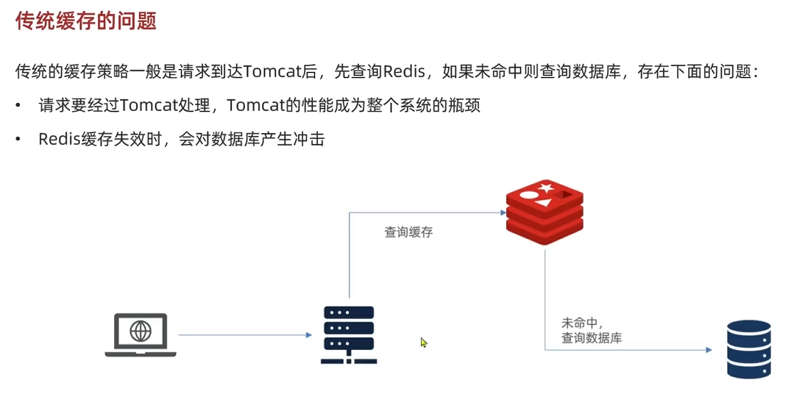

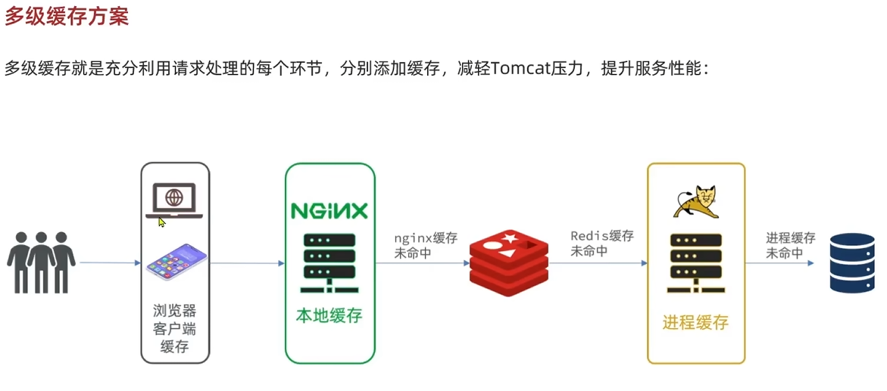

**多级缓存架构**

1. **一级缓存（本地缓存）：**
   - 使用 OpenResty 的 `lua_shared_dict` 实现的共享内存缓存，存储热点数据，访问速度极快。
   - 数据生命周期短，适合高频访问的临时数据。
2. **二级缓存（分布式缓存）：**
   - 使用 Redis 或其他分布式缓存，存储更大规模的数据。
   - 数据生命周期较长，适合全局共享的数据。
3. **持久化存储（数据库）：**
   - 缓存未命中时，最终从数据库中加载数据。


## 2.2 JVM进程缓存

缓存在日常开发中启动至关重要的作用，由于是存储在内存中，数据的读取速度是非常快的，能大量减少对数据库问，减少数据库的压力。我们把缓存分为两类：

- 分布式缓存，例如Redis：
  - 优点：存储容量更大、可靠性更好、可以在集群间共享
  - 缺点：访问缓存有网络开销
  - 场景：缓存数据量较大、可靠性要求较高、需要在集群间共享
- 进程本地缓存，例如HashMap、GuavaCache：
  - 优点：读取本地内存，没有网络开销，速度更快
  - 缺点：存储容量有限、可靠性较低、无法共享
  - 场景：性能要求较高，缓存数据量较小


::github{repo="ben-manes/caffeine"}

在Java中，我们可以使用caffeine来简单使用

使用方法：

1. 引入依赖

   ```xml
   <dependency>
       <groupId>com.github.ben-manes.caffeine</groupId>
       <artifactId>caffeine</artifactId>
       <version>3.1.8</version>
   </dependency>
   ```

2. 配置属性

   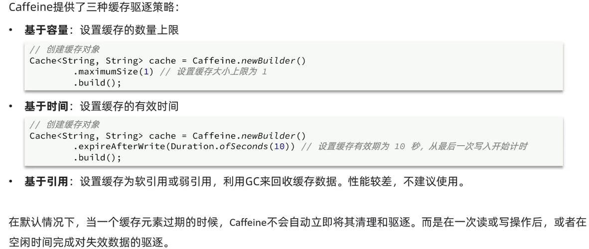

3. 使用

   ```java
   // 放入缓存
   cache.put("key1", "value1");
   
   // 读取缓存
   String value = cache.getIfPresent("key1");
   System.out.println("Cached Value: " + value);
   
   // 如果不存在，使用计算函数加载
   String computedValue = cache.get("key2", k -> "computedValue for " + k);
   System.out.println("Computed Value: " + computedValue);
   ```

   

## 2.3 OpenResty

::github{repo="openresty/openresty"}

OpenResty 是一个基于 Nginx 的高性能 Web 应用服务器，它集成了 Lua 脚本引擎和一系列的 Nginx 模块，能够以非阻塞的方式处理复杂的 Web 请求。


**主要功能**

1. **动态路由和请求处理**：通过 Lua 脚本实现动态路由和请求处理逻辑。
2. **API 网关**：可以用作高性能的 API 网关，支持负载均衡、限流、鉴权等功能。
3. **缓存**：支持本地共享内存缓存（`lua_shared_dict`）和分布式缓存（如 Redis 和 Memcached）。
4. **数据交互**：OpenResty 提供与数据库交互的支持，包括 MySQL、PostgreSQL、Redis 等。
5. **静态资源服务**：像 Nginx 一样，可以高效地提供静态资源服务。


> [!NOTE]
>
> 具体使用教程可参考官方文档：[OpenResty - Getting Started](https://openresty.org/cn/getting-started.html)


## 2.4 缓存同步策略

常见的缓存同步策略有以下几种：

- **设置有效期**：给缓存设置有效期，到期后自动删除。再次查询时更新
  - 优势：简单、方便
  - 缺点：时效性差，缓存过期之前可能不一致
  - 场景：更新频率较低，时效性要求低的业务
- **同步双写**：在修改数据库的同时，直接修改缓存
  - 优势：时效性强，缓存与数据库强一致
  - 缺点：有代码侵入，耦合度高
  - 场景：对一致性、时效性要求较高的缓存数据
- **异步通知**：修改数据库时发送事件通知，相关服务监听到通知后修改缓存数据
  - 优势：低耦合，可以同时通知多个缓存服务
  - 缺点：时效性一般，可能存在中间不一致状态
  - 场景：时效性要求一般，有多个服务需要同步


::github{repo="alibaba/canal"}

**canal [kə'næl]**，译意为水道/管道/沟渠，主要用途是基于 MySQL 数据库增量日志解析，提供增量数据订阅和消费。

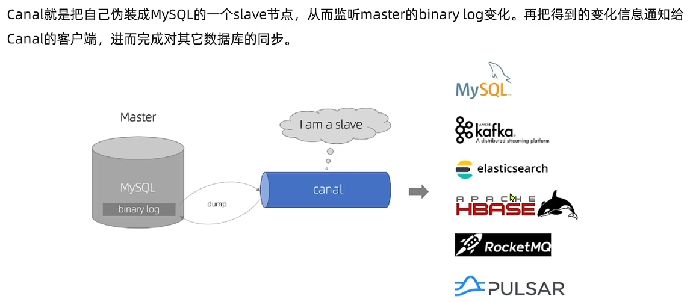

### **架构流程**

1. **数据库变更（DML 操作）**：应用程序执行 `INSERT`、`UPDATE` 或 `DELETE` 操作。
2. **Canal 监听 Binlog**：Canal 作为 MySQL 的伪从库，实时获取 Binlog 日志并解析出变更数据。
3. **数据推送**：Canal 解析变更数据后，推送到消息队列（如 Kafka、RabbitMQ）或直接推送到消费端。
4. **缓存同步**：消费端收到变更事件后，更新 Redis、本地缓存等多级缓存。


###使用方法

1. 开启MySQL主从：在MySQL的配置文件`my.cnf`中添加以下内容

   ```ini
   log-bin=/var/lib/mysql/mysql-bin
   binlog-do-db=mydb
   ```

   - `log-bin=/var/lib/mysql/mysql-bin`：设置binary log文件的存放地址和文件名，叫做mysql-bin
   - `binlog-do-db=mydb`：指定对哪个database记录binary log events，这里记录mydb这个库

2. 设置用户权限：添加一个仅用于数据同步的账户

   ```mysql
   create user canal@'%' IDENTIFIED by 'canal';
   GRANT SELECT, REPLICATION SLAVE, REPLICATION CLIENT,SUPER ON *.* TO 'canal'@'%' identified by 'canal';
   FLUSH PRIVILEGES;
   ```

3. 修改canal配置文件：修改`instance.properties`文件

   ```properties
   canal.instance.mysql.slaveId = 1234
   canal.instance.master.address = 127.0.0.1:3306
   canal.instance.dbUsername = canal
   canal.instance.dbPassword = canal
   canal.instance.filter.regex = mydb\\..*  # 监听指定数据库表
   canal.instance.tsdb.enable=true
   canal.instance.gtidon=false
   ```

4. 在Spring中配置：

   引入maven坐标

   ```xml
   <dependency>
       <groupId>top.javatool</groupId>
       <artifactId>canal-spring-boot-starter</artifactId>
       <version>1.2.1-RELEASE</version>
   </dependency>
   ```

   编写配置信息

   ```yaml
   canal:
     destination：mydb	#canal实例名称，要跟canal-server运行时设置的destination一致
     server:192.168.150.101:11111	# canal地址
   ```

5. 编写监听类，监听Canal消息：

   ```java
   @CanalTable("tb_item")
   @Componentpublic 
   class ItemHandler implements EntryHandler<Item>{
       
       @override
       public void insert(Item item）{
           //新增数据到redis
       }
                          
       @override
      	public void update(Item before,Item after）{
           //更新redis数据
           //更新本地缓存
       }
                          
      	@override
   	public void delete(Item item) {
           //删除redis数据
           //清理本地缓存
       }
   }
   ```

   
