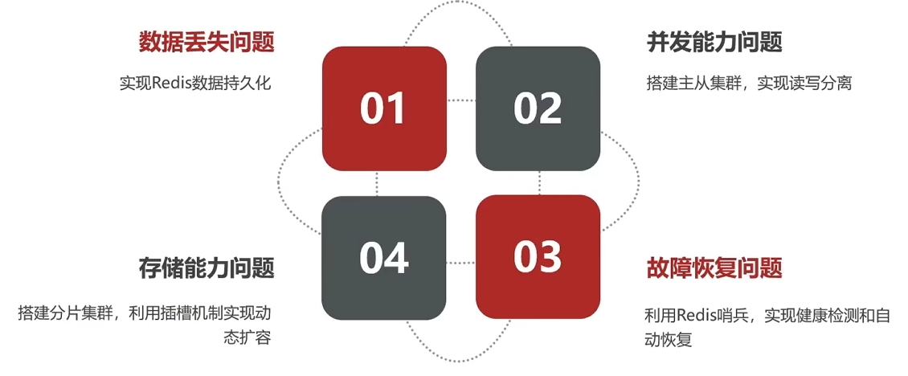

# 1. 分布式缓存

由于单点Redis中存在以下问题，因此我们需要需要



## 1.1 RDB（Redis DataBase）持久化

#### **概念**

- RDB 是 Redis 的一种快照（Snapshotting）持久化方式。
- 在特定的时间间隔，将 Redis 内存中的数据以二进制文件的形式保存到磁盘。
- 默认的 RDB 文件名为 `dump.rdb`。

#### **工作原理**

- Redis 会通过 `fork` 操作创建一个子进程。
- 子进程将当前内存数据写入到临时文件，写入完成后用该文件替换之前的 RDB 文件。

#### **触发方式**

1. **手动触发**：

   - 使用 `SAVE` 命令：阻塞式生成 RDB 文件。
   - 使用 `BGSAVE` 命令：非阻塞式生成 RDB 文件。

2. **自动触发**：

   - 根据 `save` 配置项，设置满足条件时自动触发（如写操作达到一定数量或时间间隔）。

     ```bash
     # redis.conf
     # save ""		 # 禁用 RDB 快照
     save 900 1       # 在 900 秒内（15 分钟）至少有 1 次写操作时触发 RDB 快照
     save 300 10      # 在 300 秒内（5 分钟）至少有 10 次写操作时触发 RDB 快照
     save 60 10000    # 在 60 秒内（1 分钟）至少有 10000 次写操作时触发 RDB 快照
     dbfilename dump.rdb  # RDB 文件的文件名
     dir /path/to/dir     # 保存 RDB 文件的路径
     stop-writes-on-bgsave-error yes  # RDB 生成错误时停止写操作
     ```

#### **优点**

- **磁盘占用小**：只保存某一时刻的完整数据快照。
- **恢复速度快**：加载 RDB 文件时速度较快。
- **性能较高**：持久化由子进程完成，主进程无需处理磁盘 I/O。

#### **缺点**

- **可能丢失数据**：如果 Redis 在快照之间宕机，会丢失最近一次快照之后的数据。
- **不适合频繁持久化**：快照操作较重，频繁执行可能影响性能。


## 1.2 AOF（Append Only File）持久化

#### **概念**

- AOF 是 Redis 的日志型持久化方式。
- 它会以日志形式记录每个写入操作，将其追加到一个文件中（默认文件名为 `appendonly.aof`）。

#### **工作原理**

- Redis 将每一个写操作（如 `SET`、`HSET`）以文本形式记录到 AOF 文件。
- 定期根据策略对 AOF 文件进行重写（压缩），以减小文件大小。

#### **触发方式**

配置项控制写入时机：

- `appendfsync always`：每次写操作都立即同步到磁盘，性能较差但最安全。
- `appendfsync everysec`（默认）：每秒同步一次，性能和数据安全性之间的平衡。
- `appendfsync no`：由操作系统决定何时写入，性能最高但最不安全。

```bash
# redis.conf
appendonly yes              # 开启 AOF 持久化（默认关闭）
appendfilename "appendonly.aof"  # AOF 文件名
appendfsync always          # 每次写操作后立即同步到磁盘（性能低，数据最安全）
appendfsync everysec        # 每秒同步一次（默认，性能与安全的平衡）
appendfsync no              # 操作系统决定何时同步（性能高，数据安全性低）
no-appendfsync-on-rewrite yes  # AOF 重写期间，不进行磁盘同步
auto-aof-rewrite-percentage 100  # AOF 文件大小是上次重写时的 100% 时触发重写
auto-aof-rewrite-min-size 64mb  # AOF 文件最小达到 64MB 时允许触发重写
```

#### **优点**

- **更高的数据安全性**：每次写操作都会记录，最多丢失最近 1 秒的数据（`everysec` 模式）。
- **可读性强**：AOF 文件是可读的文本文件，便于分析和修复数据。
- **灵活性高**：可以根据实际需要选择同步策略。

#### **缺点**

- **磁盘占用大**：AOF 文件比 RDB 文件大，特别是写操作频繁时。使用`BGREWRITEAOF`指令重写可以进行一定程度的优化。
- **恢复速度慢**：加载 AOF 文件需要重放所有日志，速度较慢。
- **性能影响**：频繁写入磁盘可能影响 Redis 性能。


## 1.3 Redis主从

