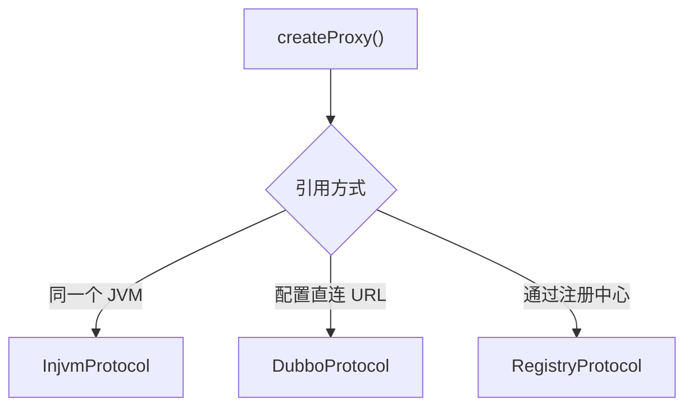

在 Consumer 中配置 `<dubbo:reference>` 或 `@Reference` 后，Spring 注入的不是 Provider 实例，而是一个本地接口代理。这个代理背后连着 `ClusterInvoker` 和 `RegistryDirectory`；Provider 地址发生变化时，Spring 中的业务 Bean 通常不需要重建。

本文以 Dubbo 2.6.12 为准，沿着源码把引用过程走一遍。新版 Dubbo 的包名和部分初始化流程已经调整，阅读其他版本时应以对应源码为准。

## 1. 一次服务引用经过哪些对象


前半段由 `ReferenceBean` 和 `ReferenceConfig` 接收、校验并整理配置，后半段由 `RegistryDirectory` 和 `ClusterInvoker` 组装代理背后的 `Invoker` 结构。`ProxyFactory` 最后根据 `ClusterInvoker` 创建接口代理，再交给 Spring。

## 2. Spring 如何处理引用配置

### 2.1 XML 配置

XML 引用通常写成：

```xml
<dubbo:reference
    id="userService"
    interface="com.example.UserService" />
```

Dubbo 的 Spring 命名空间处理器会把 `<dubbo:reference>` 解析成 `ReferenceBean`。它有两个身份：

```java
public class ReferenceBean<T> extends ReferenceConfig<T>
        implements FactoryBean, ApplicationContextAware,
                   InitializingBean, DisposableBean {
}
```

它继承 `ReferenceConfig`，可以发起 Dubbo 服务引用；同时实现 `FactoryBean`，由 `getObject()` 向 Spring 提供真正要注入的对象。

Spring 获取引用时调用的是：

```java
public Object getObject() throws Exception {
    return get();
}
```

`ReferenceBean` 因此既保存引用配置，也是创建入口，但它本身不是业务服务。Spring 最终拿到的是 `get()` 返回的代理。

### 2.2 `@Reference` 注解

使用注解时，入口换成 `ReferenceAnnotationBeanPostProcessor`。它扫描字段或方法，为注入点准备 `ReferenceBean`，再取得真实的 Dubbo 引用。

```java
@Reference
private UserService userService;
```

XML 和注解的入口不同。真正创建 Dubbo 引用时，两条路径都会回到 `ReferenceConfig.get()`；区别主要在 Spring 注入点外面是否还有一层代理，后文会单独说明。

### 2.3 `ReferenceBean` 暴露的对象

Spring 中需要区分两个对象：

```text
ReferenceBean             管理引用配置和生命周期
ReferenceBean.getObject() 返回可调用的 UserService 代理
```

业务代码注入 `UserService` 时拿到的是第二个对象。Provider 实现类以及 Provider 端的 Spring Bean 都不会进入 Consumer 进程。

## 3. `ReferenceConfig` 如何发起服务引用

### 3.1 get() 触发首次初始化

`ReferenceConfig.get()` 是引用流程的入口：

```java
public synchronized T get() {
    if (destroyed) {
        throw new IllegalStateException("Already destroyed!");
    }
    if (ref == null) {
        init();
    }
    return ref;
}
```

第一次调用时 `ref` 为空，代码进入 `init()`。代理创建完成后会保存在 `ref` 中，后续调用直接返回同一个对象。

### 3.2 init() 校验接口并合并参数

Dubbo 先加载接口类，检查方法配置：

```java
interfaceClass = Class.forName(interfaceName, true,
        Thread.currentThread().getContextClassLoader());

checkInterfaceAndMethods(interfaceClass, methods);
```

接下来，Dubbo 合并应用、模块、全局 Consumer、当前 Reference 和方法级配置，整理成一份扁平参数：

```text
side=consumer
interface=com.example.UserService
methods=findById,createUser
timeout=1000
retries=2
```

XML 属性、注解属性和全局默认值到这里已经变成 Dubbo 内部统一使用的 URL 参数。参数准备完成后，`init()` 执行：

```java
ref = createProxy(map);
```

`createProxy()` 这个名字有点超前：方法进入后并不会立刻生成 Java 代理，而是先构建代理背后的 `Invoker` 调用链。

### 3.3 createProxy() 选择引用路径

`createProxy()` 会根据配置选择引用路径：



同一 JVM 内的服务可以生成 `InjvmInvoker`；配置 `dubbo://host:port` 时会直连指定 Provider；常见的注册中心模式则先连接注册中心，再订阅 Provider 地址。下面只跟踪第三条路径，因为 `RegistryDirectory` 正是在这里创建的。

注册中心引用的入口是：

```java
List<URL> us = loadRegistries(false);

// 省略 registry URL 和 refer 参数的组装
invoker = refprotocol.refer(interfaceClass, urls.get(0));
```

`refprotocol` 不是写死的实现类，而是 Dubbo SPI 生成的自适应 `Protocol`。它根据 URL 的协议名把调用转给对应扩展：

```text
registry://...  → RegistryProtocol
dubbo://...     → DubboProtocol
injvm://...     → InjvmProtocol
```

## 4. `RegistryDirectory` 如何维护 Provider 目录

### 4.1 创建 RegistryDirectory 并订阅注册中心

`RegistryProtocol` 不直接保存 Provider 列表。它创建 `RegistryDirectory`，注入注册中心和自适应 `Protocol`，然后发起订阅：

```java
RegistryDirectory<T> directory = new RegistryDirectory<T>(type, url);
directory.setRegistry(registry);
directory.setProtocol(protocol);

registry.register(registeredConsumerUrl);
directory.subscribe(subscribeUrl.addParameter(
        Constants.CATEGORY_KEY,
        Constants.PROVIDERS_CATEGORY + ","
                + Constants.CONFIGURATORS_CATEGORY + ","
                + Constants.ROUTERS_CATEGORY));
```

订阅结果不只有 Provider 地址，还包括路由规则和动态配置。

### 4.2 从 refer 参数还原 Consumer 配置

`ReferenceConfig` 整理出的 Consumer 参数会编码进注册中心 URL 的 `refer` 参数。`RegistryDirectory` 构造时再把它们解码出来：

```java
this.queryMap = StringUtils.parseQueryString(
        url.getParameterAndDecoded(Constants.REFER_KEY));

this.overrideDirectoryUrl = this.directoryUrl = url
        .setPath(url.getServiceInterface())
        .clearParameters()
        .addParameters(queryMap)
        .removeParameter(Constants.MONITOR_KEY);
```

`queryMap` 保存 Consumer 参数，`directoryUrl` 是整理后的 Consumer 服务 URL。后续合并 Provider URL、应用覆盖配置以及激活路由和 Filter 时都会用到它们。

### 4.3 接收注册中心通知：动态更新的入口

注册中心首次返回地址列表，以及之后发生 Provider 上下线或规则变化时，都会调用 `RegistryDirectory.notify()`。

```java
public synchronized void notify(List<URL> urls) {
    // 将 URL 分成 Provider、Router、Configurator
    // 更新路由和动态配置
    refreshInvoker(invokerUrls);
}
```

`notify()` 把通知分成 Provider、Router 和 Configurator 三类，更新路由与动态配置后，再把 Provider 地址交给 `refreshInvoker()`。

### 4.4 把 Provider URL 转成 `Invoker`

分类完成后，Provider URL 会进入 `refreshInvoker(invokerUrls)`。注册中心返回 `empty://` 时，`RegistryDirectory` 会进入禁止调用状态并清理原有 `Invoker`。如果通知里只有路由或动态配置，`invokerUrls` 为空，`refreshInvoker()` 就用上一次缓存的 Provider URL 重新计算。

确定本次要处理的地址后，`refreshInvoker()` 调用 `toInvokers()`：

```java
Map<String, Invoker<T>> newUrlInvokerMap =
        toInvokers(invokerUrls);
```

`toInvokers()` 逐个处理 Provider URL。注册中心下发的只是 Provider 地址及其参数，还要经过 `mergeUrl(providerUrl)`，叠加 Consumer 配置和动态配置，才是当前引用实际使用的 URL。

合并后的完整 URL 同时也是 Invoker 的缓存键：

```java
URL url = mergeUrl(providerUrl);
String key = url.toFullString();
Invoker<T> invoker = localUrlInvokerMap == null
        ? null : localUrlInvokerMap.get(key);
```

缓存命中时，原来的 `Invoker` 可以直接放进新 Map。地址、版本或超时参数发生变化后，完整 URL 也会改变；缓存没有命中，`toInvokers()` 才重新创建 `Invoker`：

```java
invoker = new InvokerDelegate<T>(
        protocol.refer(serviceType, url), url, providerUrl);
```

`protocol.refer()` 创建面向该 Provider 的 `Invoker`。外层 `InvokerDelegate` 暴露合并后的 URL，同时保留注册中心下发的原始 `providerUrl`；调用和销毁仍交给内部 `Invoker`。被禁用、协议不受支持或重复的 Provider 不会进入新 Map。

处理完所有 Provider 后，`toInvokers()` 把 `newUrlInvokerMap` 返回给 `refreshInvoker()`。这份 Map 仍按 URL 组织，`RegistryDirectory` 还要调用 `toMethodInvokers()`，把 `Invoker` 按服务方法整理成 `methodInvokerMap`：

```java
Map<String, List<Invoker<T>>> newMethodInvokerMap =
        toMethodInvokers(newUrlInvokerMap);
```

两个 Map 都准备好后，`refreshInvoker()` 才替换 `RegistryDirectory` 当前保存的引用，并销毁新 Map 中已经不存在的旧 `Invoker`：

```java
this.methodInvokerMap = multiGroup
        ? toMergeMethodInvokerMap(newMethodInvokerMap)
        : newMethodInvokerMap;
this.urlInvokerMap = newUrlInvokerMap;
destroyUnusedInvokers(oldUrlInvokerMap, newUrlInvokerMap);
```

到这里，注册中心的地址变化已经转换成 `RegistryDirectory` 内部最新的 `Invoker` 目录。

### 4.5 Provider 变化时为什么不用重建业务代理

Provider 上线时，`RegistryDirectory` 创建新的 `Invoker` 并加入目录；Provider 下线时，它删除并销毁对应的 `Invoker`。收到 `empty://` 说明当前没有可用 Provider，Directory 会进入禁止调用状态并清理旧 `Invoker`。

业务代理和 `ClusterInvoker` 一直持有同一个 `RegistryDirectory`。服务发现只需要更新代理背后的 Provider 目录，不必替换 Spring 已经注入的业务 Bean。

## 5. `Cluster` 如何聚合 `Directory`

RegistryDirectory 完成订阅后，`RegistryProtocol` 执行：

```java
Invoker invoker = cluster.join(directory);
```

`Cluster` 扩展根据集群策略返回对应的 `ClusterInvoker`。默认 Failover 策略下，得到的是 `FailoverClusterInvoker`。它内部持有 `RegistryDirectory`，对上仍是一个普通的 `Invoker<UserService>`。

```text
FailoverClusterInvoker
└── RegistryDirectory
    ├── InvokerDelegate A
    ├── InvokerDelegate B
    └── InvokerDelegate C
```

这层聚合把 `Directory` 中的多个 `Invoker` 藏在统一接口后面。`ProxyFactory` 只会看到一个 `Invoker<UserService>`。引用完成后，`ClusterInvoker` 持有的是可动态更新的 `Directory`，并没有永久绑定某个 Provider。`cluster.join(directory)` 的作用，就是把这份动态目录包装成代理可以长期持有的统一 `Invoker`。

## 6. `ProxyFactory` 如何创建接口代理

### 6.1 自适应 ProxyFactory 选择具体实现

`Invoker` 调用链准备好后，`ReferenceConfig.createProxy()` 才真正开始创建 Java 代理：

```java
return (T) proxyFactory.getProxy(invoker);
```

`ProxyFactory` 是 SPI 接口，默认扩展名是 `javassist`，`getProxy()` 是自适应方法。自适应实现读取 URL 的 `proxy` 参数；没有显式配置时选择 Javassist。

```java
@SPI("javassist")
public interface ProxyFactory {
    @Adaptive({Constants.PROXY_KEY})
    <T> T getProxy(Invoker<T> invoker) throws RpcException;
}
```

没有配置 `proxy` 时，自适应 `ProxyFactory` 会选择默认的 `JavassistProxyFactory`。

如果配置了 `stub` 或 `local`，Dubbo 还可以在动态代理外再包一层 Consumer 自己编写的本地实现，用来处理参数校验、本地缓存或异常降级。

选定代理实现后，`AbstractProxyFactory` 会整理代理需要实现的接口。除了业务接口，它还会加入 `EchoService`：

```java
if (interfaces == null) {
    interfaces = new Class<?>[]{
            invoker.getInterface(), EchoService.class
    };
}
```

因此，`UserService` 代理通常也能转成 `EchoService`，通过 `$echo` 检查端到端连通性，业务接口本身不必声明 `$echo` 方法。

### 6.2 Javassist 生成接口代理类

`JavassistProxyFactory` 的入口只有几行：

```java
public <T> T getProxy(Invoker<T> invoker, Class<?>[] interfaces) {
    return (T) Proxy.getProxy(interfaces)
            .newInstance(new InvokerInvocationHandler(invoker));
}
```

`Proxy.getProxy()` 先按类加载器和接口集合查询缓存。没有命中时，它用 `ClassGenerator` 动态生成两个类：代理类负责实现业务接口，工厂类负责创建代理实例。

代理类为每个接口方法生成的逻辑，可以概括为：

```java
Object result = handler.invoke(this, methods[index], args);
return (ReturnType) result;
```

这里的 `handler` 是 `InvokerInvocationHandler`。Javassist 生成的类只负责把 Java 方法交给统一处理器，不会为每个业务方法重复实现 RPC 逻辑。生成结果会进入缓存，同一组接口不必反复生成字节码。

### 6.3 `@Reference` 为什么可能出现两层代理

XML 方式通过 `FactoryBean.getObject()` 直接暴露 Dubbo 代理。`@Reference` 还要处理 Spring 注入点，以及本地服务延迟初始化，因此会在外面创建一层 JDK 动态代理：

```text
注入到字段的 JDK 代理
└── ReferenceAnnotationBeanPostProcessor 的 InvocationHandler
    └── ReferenceBean.get() 返回的 Dubbo 代理
        └── InvokerInvocationHandler
```

远程引用会立即初始化内部的 Dubbo 代理。本地引用则可能等对应服务完成导出后再初始化，避免 Consumer 过早走远程路径。

XML 配置通常直接暴露 Dubbo 接口代理；`@Reference` 注入点拿到的是外层 JDK 代理，实际 Dubbo 代理保存在它的 `InvocationHandler` 中。

### 6.4 ReferenceBean 将代理交给 Spring

对于 XML 配置，代理写入 `ReferenceConfig.ref` 后，会沿原调用链返回：

```text
ProxyFactory.getProxy()
  → ReferenceConfig.createProxy()
  → ReferenceConfig.init()
  → ReferenceConfig.get()
  → ReferenceBean.getObject()
  → Spring
```

到这里，Spring 已经可以取得并注入 `UserService`。使用 `@Reference` 时，注解后处理器会在这个对象外再套一层用于注入的 JDK 代理。

## 7. 最终的对象关系

### 7.1 从 Spring Bean 向下看

不考虑 `@Reference` 外层代理时，最终对象关系可以写成：

```text
Spring 中的 UserService Bean
└── Dubbo 接口代理（同时实现 EchoService）
    └── InvokerInvocationHandler
        └── ClusterInvoker
            └── RegistryDirectory
                ├── InvokerDelegate A
                └── InvokerDelegate B
```

这张图按对象持有关系从上往下读，和创建顺序正好相反。创建时先有 `RegistryDirectory`，再由 `Cluster` 聚合成 `ClusterInvoker`，随后生成接口代理并交给 Spring。

### 7.2 创建顺序

```text
Consumer 配置
→ ReferenceBean 接收 Spring 配置
→ ReferenceConfig 校验接口并合并参数
→ RegistryProtocol 创建 RegistryDirectory
→ RegistryDirectory 订阅并维护 Provider Invoker
→ Cluster.join(directory) 创建 ClusterInvoker
→ ProxyFactory 根据 ClusterInvoker 生成接口代理
→ ReferenceBean 把代理提供给 Spring
```

这条链路只在 Consumer 进程内创建对象。注册中心提供的是 Provider 地址和配置，Provider 实现类不会进入 Consumer JVM。

XML 配置下，Spring 注入的通常是 Javassist 创建的 Dubbo 接口代理；使用 `@Reference` 时，注入点外还有一层 JDK 动态代理。真正的 Dubbo 引用保存在 `ReferenceConfig.ref` 中，由 `ReferenceBean` 创建并提供给上层。
