调用一个 Dubbo 接口时，业务代码只看到一个普通的 Java 方法，框架内部却要完成服务导出、地址注册、服务订阅、代理创建、网络通信和结果返回。

本文以 **Dubbo 2.6.12** 为准，从三条基础调用链出发，再继续跟踪运行期治理、故障恢复和停机过程：

1. Provider 如何把业务实现转换成 `Invoker`，启动协议端口并注册服务地址？
2. Consumer 如何订阅 Provider 地址，建立连接并生成远程代理对象？
3. 一次接口调用如何到达 Provider 的业务方法，执行完成后又如何返回 Consumer？
4. 地址、路由和配置变化后，下一次调用如何使用新的运行状态？
5. 网络、注册中心、线程池或业务执行发生异常时，Dubbo 如何处理和恢复？
6. 编解码、Filter、特殊调用模式与优雅停机怎样接入同一条 Invoker 主线？

## 1. 源码阅读准备

### 1. 最小调用模型

先用一个简单接口固定阅读主线：

```java
public interface GreetingService {
    String sayHello(String name);
}
```

Provider 提供实现：

```java
public class GreetingServiceImpl implements GreetingService {

    @Override
    public String sayHello(String name) {
        return "Hello, " + name;
    }
}
```

Consumer 发起调用：

```java
String result = greetingService.sayHello("Dubbo");
```

源码分析的目标，就是解释 `greetingService` 从哪里来，以及这一行代码背后发生了什么。

### 2. 重点模块

| 模块 | 主要职责 | 重点类 |
| --- | --- | --- |
| `dubbo-config` | 解析服务配置，组织服务暴露与引用 | `ServiceConfig`、`ReferenceConfig` |
| `dubbo-config-spring` | 接入 Spring 生命周期 | `ServiceBean`、`ReferenceBean` |
| `dubbo-registry` | 服务注册、订阅和地址通知 | `RegistryProtocol`、`RegistryDirectory` |
| `dubbo-cluster` | 目录、路由、负载均衡和容错 | `AbstractClusterInvoker`、`FailoverClusterInvoker` |
| `dubbo-rpc` | 代理、过滤器、协议和调用抽象 | `Invoker`、`ProtocolFilterWrapper`、`DubboProtocol`、`DubboInvoker` |
| `dubbo-remoting` | 请求响应模型和网络传输 | `ExchangeClient`、`HeaderExchangeHandler`、`DefaultFuture` |

### 3. 先认识几个核心对象

| 对象 | 作用 |
| --- | --- |
| `URL` | Dubbo 的配置载体，保存协议、地址、接口和参数 |
| `Invoker` | 可执行的调用对象，Provider 和 Consumer 两端都使用这一抽象 |
| `Exporter` | Provider 已暴露服务的持有对象，用于维护和取消暴露 |
| `Directory` | Consumer 本地的 Provider 动态目录 |
| `Invocation` | 一次调用的方法名、参数类型、参数值和附加信息 |
| `Result` | 调用结果或异常 |
| `DefaultFuture` | Consumer 等待请求响应的对象，通过请求 ID 匹配结果 |

## 2. 从函数调用链进入源码

本文不按模块逐个介绍，而是从入口函数一路跟到结果。前三条主线回答 Provider 如何启动、Consumer 如何得到代理，以及代理如何完成一次远程调用；后续流程则沿着这些对象继续观察状态刷新、治理、恢复和销毁。

函数名只是定位源码的坐标。阅读每一步时还要回答三个问题：这一步解决什么问题、它把系统状态从什么变成什么、下一层为什么需要它的输出。只有把函数调用和功能变化对应起来，调用链才不只是类名清单。

```text
Provider 暴露:
ServiceBean#export
  → ServiceConfig#doExportUrlsFor1Protocol
  → RegistryProtocol#export
  → DubboProtocol#export
  → Registry#register

Consumer 引用:
ReferenceBean#getObject
  → ReferenceConfig#createProxy
  → RegistryProtocol#refer
  → RegistryDirectory#subscribe
  → ProxyFactory#getProxy

远程调用:
InvokerInvocationHandler#invoke
  → MockClusterInvoker#invoke
  → ClusterInvoker#invoke
  → DubboInvoker#doInvoke
  → DubboProtocol.requestHandler#reply
  → AbstractProxyInvoker#invoke
  → Result#recreate
```

前两条属于启动阶段的控制链路。第三条是运行阶段的数据链路，正常的 RPC 请求由 Consumer 直接发送给 Provider，不经过注册中心。

后续章节仍遵循同一个阅读方法：先找触发入口，再跟踪函数如何改变 `URL`、`Invoker`、连接、Future 或线程状态，最后解释这种变化会怎样影响下一次调用。这样既能定位源码，也能理解每个机制解决的实际问题。

## 3. Provider 服务暴露与注册流程

这条流程的输入是 Spring 中的服务配置和业务实现，输出是一个正在监听端口、已经写入注册中心的 Provider。

### 1. 功能目标：让普通 Bean 成为远程服务

`GreetingServiceImpl` 最初只是 Spring 容器中的普通对象。它能被本地代码调用，但还不具备 RPC 服务需要的三种能力：

1. **可执行**：Dubbo 需要一个统一对象描述“如何执行这个接口”，这就是 Provider Invoker；
2. **可访问**：进程需要监听协议端口，并能把网络请求分发到对应 Invoker；
3. **可发现**：Provider 的接口和地址需要发布到注册中心，Consumer 才能找到它。

所以“服务暴露”不是简单调用一次 `register`，而是按 **生成 Invoker → 启动端口 → 注册地址** 的顺序建立这三种能力。先完成本地导出再注册也很重要，否则 Consumer 可能拿到一个尚未提供监听能力的地址。

### 2. 函数调用总览

```text
ServiceBean#afterPropertiesSet / onApplicationEvent
  → ServiceBean#export
  → ServiceConfig#export
  → ServiceConfig#doExport
  → ServiceConfig#doExportUrls
  → ServiceConfig#doExportUrlsFor1Protocol
  → ProxyFactory#getInvoker
  → RegistryProtocol#export
  → RegistryProtocol#doLocalExport
  → DubboProtocol#export
  → DubboProtocol#openServer
  → DubboProtocol#createServer
  → Exchangers#bind
  → Registry#register
```

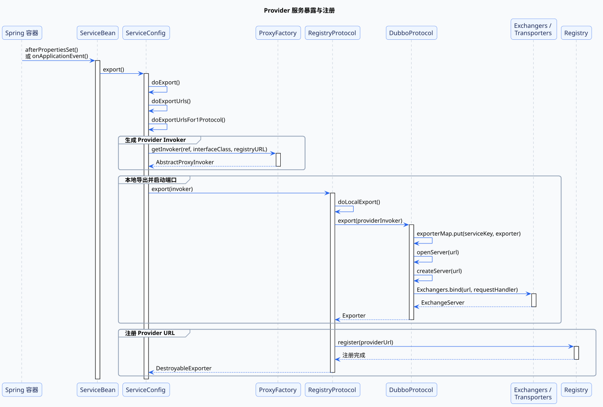

### 3. `ServiceBean#export`：让 RPC 生命周期跟随 Spring

在 Spring 环境中，`<dubbo:service>` 或旧版 `@Service` 最终对应 `ServiceBean`。根据延迟暴露配置，入口来自 Bean 初始化或容器刷新事件：

```text
ServiceBean#afterPropertiesSet
或 ServiceBean#onApplicationEvent
  → ServiceBean#export
  → ServiceConfig#export
```

`ServiceConfig#export` 处理延迟暴露，`doExport` 校验接口、实现对象和配置，随后进入 `doExportUrls`。如果配置了多个协议，`doExportUrlsFor1Protocol` 会针对每个协议分别构造 Provider URL。

这一步的功能作用不是执行网络操作，而是把 Spring 生命周期转换为 Dubbo 的服务生命周期。Web 容器启动时自动暴露服务，容器关闭时再统一销毁，业务代码不需要自己创建或阻塞独立的 Dubbo 容器。

这一层还负责把分散在 Application、Registry、Protocol 和 Service 中的配置合并成 URL。后面的扩展点只接收 URL，不需要感知配置最初来自 XML、注解还是属性文件。

### 4. `ProxyFactory#getInvoker`：统一业务方法的执行入口

`ServiceConfig#doExportUrlsFor1Protocol` 准备好 URL 后调用：

```java
Invoker<?> invoker = proxyFactory.getInvoker(
    ref,
    (Class) interfaceClass,
    registryURL.addParameterAndEncoded(
        Constants.EXPORT_KEY,
        url.toFullString()
    )
);
```

默认的函数调用继续进入：

```text
JavassistProxyFactory#getInvoker
  → Wrapper#getWrapper
  → new AbstractProxyInvoker
```

这里的 `ref` 是 `GreetingServiceImpl`，生成的 `AbstractProxyInvoker` 持有这个真实对象。它的 `doInvoke` 最终执行 `Wrapper#invokeMethod`，因此 Provider 收到远程请求后能够调用业务方法。

功能上，Invoker 把“调用某个 Java 对象的方法”抽象成 `invoke(Invocation)`。协议层只需要认识 Invoker，不需要知道实现类是普通 Bean、代理对象还是泛化服务。这样过滤器、协议和注册中心都可以围绕同一个调用抽象工作。

这一步完成的状态变化是：

```text
GreetingServiceImpl
  → 可接收 Invocation 并返回 Result 的 Provider Invoker
```

### 5. `RegistryProtocol#export`：分开注册协调与协议导出

存在注册中心时，外层 URL 的协议是 `registry`，自适应 `Protocol#export` 会选择 `RegistryProtocol`：

```text
RegistryProtocol#export
  → RegistryProtocol#doLocalExport
  → Protocol#export
  → DubboProtocol#export
```

`RegistryProtocol` 负责协调注册中心，`DubboProtocol` 才负责真正的 Dubbo 协议导出。`doLocalExport` 从注册 URL 的 `export` 参数中还原 Provider URL，再把 Provider Invoker 交给 `DubboProtocol#export`。

这里体现了两层不同职责：

- `RegistryProtocol` 处理“服务如何被发现”，属于注册和订阅的控制链路；
- `DubboProtocol` 处理“请求如何进入 Provider”，属于实际 RPC 数据链路。

如果把两者混在一起，就很容易误以为注册中心负责转发请求。实际上 `RegistryProtocol` 只协调导出顺序，业务流量仍由 `DubboProtocol` 监听的端口直接接收。

### 6. `DubboProtocol#export`：建立网络地址到业务执行器的映射

`DubboProtocol#export` 先创建 `DubboExporter`，再使用服务 key 写入 `exporterMap`：

```text
DubboProtocol#export
  → exporterMap.put(serviceKey, exporter)
  → openServer
  → createServer
  → Exchangers#bind
  → Transporters#bind
  → NettyTransporter#bind
  → new NettyServer
```

服务 key 由端口、接口、分组和版本等信息组成。请求到达 Provider 时，`DubboProtocol#getInvoker` 会用相同维度从 `exporterMap` 找回这里保存的 Invoker。

`createServer` 把 `DubboCodec` 和 `requestHandler` 放入 URL，然后调用 `Exchangers#bind`。调用继续经过 Transporter SPI，最终由 Netty 绑定协议端口。

这一层同时解决两个问题：

- NettyServer 让 Provider 具备接收网络请求的能力；
- `exporterMap` 让一个共享端口能够承载多个接口、分组和版本，并把每个请求准确分发到对应业务 Invoker。

因此“端口已经启动”和“服务已经导出”并不是同一件事。只有端口没有 `exporterMap` 中的服务映射，请求仍然找不到要执行的接口。

### 7. `Registry#register`：把可调用地址变成可发现地址

只有本地导出成功后，`RegistryProtocol#export` 才继续注册 Provider URL：

```text
RegistryProtocol#getRegistry
  → RegistryProtocol#getRegisteredProviderUrl
  → RegistryProtocol#register
  → RegistryFactory#getRegistry
  → Registry#register
```

Provider URL 中包含接口、主机、协议端口、`group`、`version`、方法列表和服务参数。注册完成后，Consumer 才能通过订阅获得这个地址。

注册中心保存的是服务描述和网络位置，而不是 `GreetingServiceImpl` 或 Provider Invoker。它解决的是“Consumer 去哪里调用”，不参与“业务方法怎样执行”。

这条函数调用链结束时，Provider 已经同时具备三个状态：

- `exporterMap` 中保存了业务 Invoker；
- NettyServer 正在监听 Dubbo 协议端口；
- 注册中心保存了 Provider URL。

## 4. Consumer 服务引用与代理创建流程

这条流程的输入是 `<dubbo:reference>` 等引用配置，输出是一个可以注入业务代码的 `GreetingService` 代理。

### 1. 功能目标：把接口声明变成可调用的远程代理

Consumer 不会从注册中心下载一个 `GreetingService` 对象。注册中心只能提供 Provider URL，Consumer 必须在本地完成四次转换：

```text
Provider URL
  → 每个地址对应的远程 Invoker
  → 能感知地址变化的 RegistryDirectory
  → 负责路由、负载均衡和容错的 ClusterInvoker
  → 面向业务接口的 GreetingService 代理
```

这几层分别隔离了地址变化、网络连接、集群治理和业务接口。业务代码只依赖最后的接口代理，Provider 扩容、下线或切换地址时，不需要重新生成业务对象。

### 2. 函数调用总览

```text
ReferenceBean#getObject
  → ReferenceConfig#get
  → ReferenceConfig#init
  → ReferenceConfig#createProxy
  → RegistryProtocol#refer
  → RegistryProtocol#doRefer
  → RegistryDirectory#subscribe
  → Registry#subscribe
  → RegistryDirectory#notify
  → RegistryDirectory#refreshInvoker
  → RegistryDirectory#toInvokers
  → DubboProtocol#refer
  → DubboProtocol#getClients
  → Cluster#join
  → ProxyFactory#getProxy
```

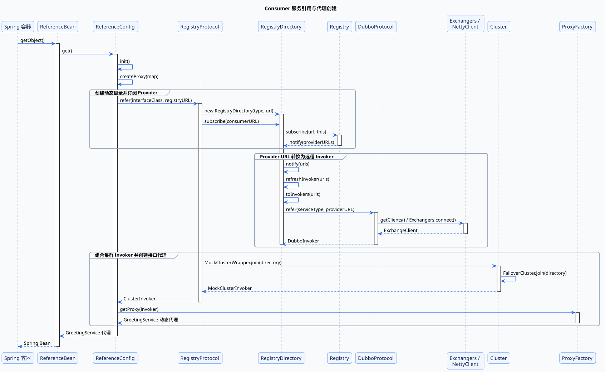

### 3. `ReferenceBean#getObject`：把远程引用接入 Spring Bean 模型

`ReferenceBean` 实现了 Spring `FactoryBean`。Spring 获取它生产的对象时调用：

```text
ReferenceBean#getObject
  → ReferenceConfig#get
  → ReferenceConfig#init
  → ReferenceConfig#createProxy
```

`init` 合并 Consumer、Application 和 Registry 等配置，并把接口、方法、超时等参数放入 Map。`createProxy` 判断本地引用、直连和注册中心引用，本节沿注册中心分支继续向下。

`ReferenceBean` 的作用是让远程服务看起来和普通 Spring Bean 一样。Controller 或业务 Service 只需要注入 `GreetingService`，不需要关心代理什么时候创建、连接何时建立，以及应用关闭时如何释放资源。

### 4. `RegistryProtocol#doRefer`：建立持续更新的服务目录

`ReferenceConfig#createProxy` 调用自适应 `Protocol#refer`。注册 URL 的协议是 `registry`，所以进入：

```text
RegistryProtocol#refer
  → RegistryProtocol#doRefer
  → new RegistryDirectory
  → RegistryDirectory#setRegistry
  → RegistryDirectory#setProtocol
  → RegistryDirectory#subscribe
  → Registry#subscribe
```

`RegistryDirectory` 实现了 `NotifyListener`。它既代表一个服务的动态目录，也负责接收注册中心推送的 Provider、Router 和 Configurator URL。

这里使用订阅而不是只查询一次，是因为 Provider 列表不是静态配置。Provider 上线、下线或治理规则变化后，注册中心可以继续通知同一个 Directory。对上层 ClusterInvoker 来说，Directory 始终代表“当前可以调用哪些 Provider”。

### 5. `RegistryDirectory#notify`：把注册信息变成可执行对象

收到 Provider URL 后，函数调用进入：

```text
RegistryDirectory#notify
  → RegistryDirectory#refreshInvoker
  → RegistryDirectory#toInvokers
  → Protocol#refer
  → DubboProtocol#refer
```

`toInvokers` 逐个处理 Provider URL。接口、协议和配置匹配后，每个地址都会通过 `Protocol#refer` 转换为一个 Consumer 侧 Invoker。

这里要区分两类 Invoker：

- `RegistryDirectory` 中的 `DubboInvoker` 对应一个具体 Provider 地址；
- `RegistryProtocol#doRefer` 返回的 ClusterInvoker 代表整个服务。

`notify` 的功能不是简单保存字符串地址，而是维护 URL 与 Invoker 的映射。新地址需要创建 Invoker，仍然存在的地址可以复用，已经删除的地址需要销毁。这样注册中心的地址变化才能真正影响下一次 RPC 调用。

### 6. `DubboProtocol#refer`：让一个 Provider 地址具备远程执行能力

针对单个 Provider URL，调用链继续向网络层推进：

```text
DubboProtocol#refer
  → DubboProtocol#getClients
  → getSharedClient / initClient
  → Exchangers#connect
  → Transporters#connect
  → NettyTransporter#connect
  → new NettyClient
  → new DubboInvoker
```

默认情况下，相同 Provider 地址的连接可以复用。`DubboInvoker` 持有 `ExchangeClient`，调用它就可以向对应 Provider 发送请求。

Provider 侧 Invoker 表示“执行本地业务对象”，Consumer 侧 DubboInvoker 表示“通过网络调用一个 Provider”。两者实现相同的 `Invoker` 接口，使集群层不需要区分调用最终发生在本地还是远程。

### 7. `Cluster#join`：把多个地址提升为一个服务

订阅完成后，`RegistryProtocol#doRefer` 执行：

```text
Cluster#join(directory)
  → MockClusterWrapper#join
  → FailoverCluster#join
  → new FailoverClusterInvoker(directory)
  → new MockClusterInvoker(directory, failoverInvoker)
```

默认的 `MockClusterWrapper` 会在 FailoverClusterInvoker 外再包装一层 MockClusterInvoker。它不固定保存某一个 Provider；每次正常调用仍由内部的 FailoverClusterInvoker 从 `RegistryDirectory` 取得可用 Invoker，再完成路由、负载均衡和容错。

Directory 解决“有哪些 Provider”，ClusterInvoker 解决“这一次应该调用哪一个、失败后怎么办”。它把一组会变化的远程 Invoker 提升成一个稳定的服务级 Invoker。

### 8. `ProxyFactory#getProxy`：把 Dubbo 调用模型还原为接口调用

`RegistryProtocol#refer` 把 ClusterInvoker 返回给 `ReferenceConfig#createProxy`，最后执行：

```text
ProxyFactory#getProxy
  → JavassistProxyFactory#getProxy
  → Proxy#getProxy
  → Proxy#newInstance
  → new InvokerInvocationHandler(invoker)
```

最终生成的对象实现了 `GreetingService` 接口，但不包含业务实现。它只持有 `InvokerInvocationHandler`，Handler 再持有 ClusterInvoker。

代理层的作用是屏蔽 Dubbo 内部的 `Invocation` 和 `Result`。业务代码继续使用 Java 接口、参数和异常，动态代理负责在 Java 方法语义与 Dubbo 调用模型之间转换。

```text
GreetingService 代理
  → InvokerInvocationHandler
  → ClusterInvoker
  → RegistryDirectory
  → Consumer Filter 链
  → DubboInvoker
  → ExchangeClient
```

## 5. Consumer 到 Provider 的完整远程调用流程

Provider 完成暴露、Consumer 完成引用后，业务代码才进入真正的远程调用链。

### 1. 功能目标：在跨进程环境中保持接口调用语义

远程调用的本质不是“把方法直接发到网络上”，而是把一次 Java 方法调用拆成多个阶段：

1. 动态代理把方法转换为与传输无关的 `RpcInvocation`；
2. 集群层从动态 Provider 列表中选择目标；
3. 协议层把 Invocation 转换为带请求 ID 的 Request；
4. Provider 把 Request 重新映射到本地业务 Invoker；
5. Response 通过请求 ID 唤醒 Consumer，最后还原为返回值或异常。

每层只处理一种变化：代理层处理调用形式，集群层处理地址和治理，协议层处理网络，Provider Invoker 处理业务执行。正是这种分层，让业务代码仍然可以写成普通接口调用。

### 2. 函数调用总览

```text
InvokerInvocationHandler#invoke
  → MockClusterInvoker#invoke
  → AbstractClusterInvoker#invoke
  → AbstractDirectory#list
  → RegistryDirectory#doList
  → FailoverClusterInvoker#doInvoke
  → LoadBalance#select
  → DubboInvoker#doInvoke
  → HeaderExchangeChannel#request
  → DefaultFuture#get
  → HeaderExchangeHandler#handleRequest
  → DubboProtocol.requestHandler#reply
  → DubboProtocol#getInvoker
  → AbstractProxyInvoker#invoke
  → Wrapper#invokeMethod
  → GreetingServiceImpl#sayHello
  → DefaultFuture#received
  → Result#recreate
```

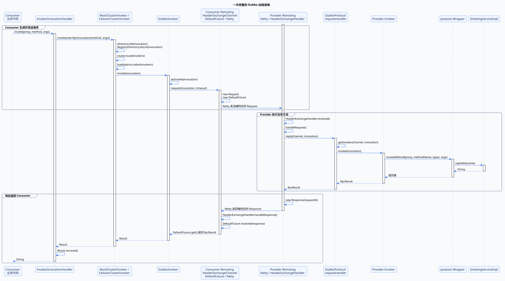

### 3. `InvokerInvocationHandler#invoke`：从 Java 语义进入 Dubbo 语义

业务代码调用：

```java
String result = greetingService.sayHello("Dubbo");
```

动态代理统一进入：

```text
InvokerInvocationHandler#invoke
  → new RpcInvocation(method, args)
  → MockClusterInvoker#invoke
  → AbstractClusterInvoker#invoke
```

`RpcInvocation` 保存方法名、参数类型、参数值和 attachments。Handler 持有的是引用阶段返回的 MockClusterInvoker，正常调用会继续交给内部的 FailoverClusterInvoker，而不是某个固定 Provider。

这一步把反射得到的 `Method` 和参数转换为统一消息，使后面的路由、过滤器和协议不再依赖某个具体接口。attachments 还可以继续携带超时、版本和调用上下文。

### 4. `AbstractClusterInvoker#invoke`：把服务调用落实到一个 Provider

默认 Failover 集群沿下面的函数调用寻找 Provider：

```text
AbstractClusterInvoker#invoke
  → AbstractClusterInvoker#list
  → AbstractDirectory#list
  → RegistryDirectory#doList
  → Router#route
  → FailoverClusterInvoker#doInvoke
  → AbstractClusterInvoker#select
  → LoadBalance#select
  → selectedInvoker#invoke
```

`RegistryDirectory#doList` 给出当前地址列表，Router 过滤候选 Invoker，LoadBalance 再选择本次调用的目标。`selectedInvoker` 的最内层是对应一个 Provider 地址的 `DubboInvoker`，外层还可能包含 `ProtocolFilterWrapper` 构造的 Consumer Filter 链。

这一层把“调用 GreetingService”转换成“调用当前某个具体地址”。重试也发生在这里：一次 Provider 调用失败后，FailoverClusterInvoker 可以重新取得地址列表并再次选择，而代理层和业务代码不需要参与。

### 5. `DubboInvoker#doInvoke`：把方法调用变成可关联的网络请求

选中 Provider 后进入网络发送流程：

```text
AbstractInvoker#invoke
  → DubboInvoker#doInvoke
  → ExchangeClient#request
  → HeaderExchangeChannel#request
  → new Request
  → new DefaultFuture
  → Channel#send
  → DubboCodec#encodeRequestData
  → NettyChannel#send
  → DefaultFuture#get
```

`HeaderExchangeChannel#request` 为请求分配 ID，并用相同 ID 创建 `DefaultFuture`。同步调用发送请求后停在 `DefaultFuture#get`，直到响应到达或等待超时。

请求 ID 解决了同一连接上多个并发调用的响应匹配问题。Consumer 不需要按照发送顺序等待结果，而是由 `DefaultFuture` 把任意时刻返回的 Response 交给正确的调用线程。

### 6. `HeaderExchangeHandler#handleRequest`：把网络请求重新定位到服务

Provider 的 Netty Channel 收到并解码 Request 后，调用链进入 Exchange 层：

```text
NettyHandler#messageReceived
  → ChannelHandler#received
  → HeaderExchangeHandler#received
  → HeaderExchangeHandler#handleRequest
  → DubboProtocol.requestHandler#reply
  → DubboProtocol#getInvoker
  → providerInvoker#invoke
```

`DubboProtocol#getInvoker` 根据请求中的接口、端口、`group` 和 `version` 生成服务 key，再从 `exporterMap` 找到暴露阶段保存的 Exporter 和 Provider Invoker。

Provider Invoker 外层同样可能存在 `ProtocolFilterWrapper` 创建的 Filter 链。Filter 执行完成后，调用才到达持有业务实现的 `AbstractProxyInvoker`。

这一层完成从网络身份到本地执行器的转换。接口相同但 `group` 或 `version` 不同的服务可以共享同一个端口，因为 `exporterMap` 会把请求定位到不同的 Provider Invoker。

### 7. `Wrapper#invokeMethod`：回到真实 Java 对象

Provider Invoker 的最内层调用是：

```text
AbstractProxyInvoker#invoke
  → AbstractProxyInvoker#doInvoke
  → Wrapper#invokeMethod
  → GreetingServiceImpl#sayHello
  → new RpcResult(returnValue)
```

Javassist 生成的 `Wrapper` 根据方法名和参数类型调用 `GreetingServiceImpl#sayHello`。正常返回值和业务异常都会被包装为 `RpcResult`，交回 Exchange 层。

这一步是调用链真正进入业务代码的位置。前面的代理、集群、协议和传输都只是在准备执行条件；只有 `Wrapper#invokeMethod` 会触发 Provider 实现产生业务结果或业务异常。

### 8. `DefaultFuture#received`：把异步到达的响应还原为同步结果

Provider 返回结果时执行：

```text
HeaderExchangeHandler#handleRequest
  → new Response(requestId)
  → Response#setResult
  → Channel#send
  → DubboCodec#encodeResponseData
  → Netty 返回响应
```

Consumer 收到响应后，根据 request ID 找到原来的 Future：

```text
HeaderExchangeHandler#handleResponse
  → DefaultFuture#received
  → DefaultFuture#doReceived
  → Condition#signal
  → DefaultFuture#get 返回 RpcResult
  → InvokerInvocationHandler#invoke
  → Result#recreate
```

`Result#recreate` 是调用链回到业务代码前的最后一步。调用成功时返回真实结果；`RpcResult` 中保存业务异常时，则在这里重新抛出。

网络响应本来是异步到达的，`DefaultFuture#get` 和 `received` 共同把它转换成业务代码看到的同步等待。`Result#recreate` 再把 Dubbo 的结果容器还原成 Java 返回值或异常，最终闭合接口调用语义。

到这里，一次调用完成了三次形态转换：

```text
Java 方法调用
  → RpcInvocation / Request / Response
  → Java 返回值或异常
```

## 6. Provider 地址通知与 Invoker 动态刷新流程

服务引用完成后，Consumer 代理不会固定绑定启动时的 Provider 列表。Provider 上线、下线或参数变化时，注册中心会再次触发 `RegistryDirectory#notify`，把新的地址快照转换为下一次调用使用的 Invoker 快照。

### 1. 功能目标：更新可执行目录，而不是重建业务代理

注册中心通知的是 URL，真正执行调用的是 Invoker。如果只更新地址字符串，已经创建的 ClusterInvoker 仍然无法调用新节点，也不会释放已下线节点的连接。

因此动态刷新要完成三件事：

1. 新地址创建 Invoker；
2. 未变化地址复用 Invoker，避免重复建连；
3. 下线地址销毁 Invoker，并让后续调用看不到它。

业务代理始终持有同一个 ClusterInvoker，ClusterInvoker 每次再从 RegistryDirectory 读取当前快照，所以地址变化不要求重新注入 `GreetingService`。

### 2. 函数调用总览

```text
ZookeeperRegistry.ChildListener#childChanged
  → ZookeeperRegistry#notify
  → RegistryDirectory#notify
  → RegistryDirectory#refreshInvoker
  → RegistryDirectory#toInvokers
  → Protocol#refer
  → RegistryDirectory#toMethodInvokers
  → 替换 methodInvokerMap / urlInvokerMap
  → RegistryDirectory#destroyUnusedInvokers
```

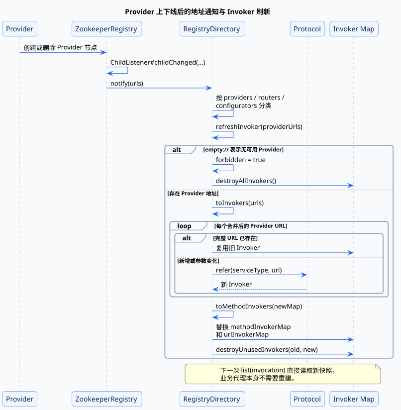

### 3. `RegistryDirectory#notify`：先区分变化类型

ZooKeeper 子节点变化后，`ZookeeperRegistry` 把当前子节点转换为 URL 列表，再调用 NotifyListener。RegistryDirectory 正是订阅时传入的 NotifyListener：

```text
RegistryDirectory#notify
  → providers URL
  → routers URL
  → configurators URL
```

Provider、路由和动态配置走不同的更新路径。Router URL 会变成 Router，Configurator URL 会变成 Configurator，只有 Provider URL 会进入 `refreshInvoker`。这样一次通知既能改变地址，也能改变“怎样选择地址”和“地址最终使用什么参数”。

### 4. `refreshInvoker`：先算新快照，再替换旧状态

普通地址刷新会先保留旧的 `urlInvokerMap`，再根据新 URL 计算两个新 Map：

```text
Provider URL 列表
  → toInvokers
  → Map<完整 URL, Invoker>
  → toMethodInvokers
  → Map<方法名, List<Invoker>>
```

`toInvokers` 用合并后的完整 URL 作为 key。key 未变化就复用旧 Invoker；新增地址或参数变化会再次执行 `protocol.refer`。参数变化也需要新 Invoker，因为超时、权重、序列化等运行行为都保存在 URL 中，不能只沿用旧对象。

新 Map 计算成功后，RegistryDirectory 才替换字段引用，最后由 `destroyUnusedInvokers` 关闭不再出现的 Invoker。这个“先构造、后切换、再清理”的顺序，避免调用线程看到只更新了一半的列表。

当注册中心发送唯一的 `empty://` URL 时，`refreshInvoker` 会把 `forbidden` 设为 `true`、清空方法目录并销毁全部 Invoker。后续 `doList` 会明确抛出“没有 Provider”，而不是继续使用已经下线的旧地址。

## 7. Provider 路由、节点选择与失败重试流程

RegistryDirectory 给出的是候选节点，真正发起请求前还要依次回答三个问题：哪些节点符合本次调用规则、从中选择哪一个、失败后是否换节点重试。

### 1. 功能目标：把动态地址集合变成一次确定的调用

三个机制处理的是不同维度：

- **Router** 做过滤，例如按条件、标签或 Mock 标记筛选候选节点；
- **LoadBalance** 在候选节点中选出一个具体 Invoker；
- **Cluster** 决定调用失败后的整体策略，默认 Failover 会重新选择并重试。

顺序不能颠倒。负载均衡只能在路由允许的节点中选择，而重试需要重新读取 Directory，才能利用刚刚更新的 Provider 快照。

### 2. 函数调用总览

```text
AbstractClusterInvoker#invoke
  → AbstractClusterInvoker#list
  → AbstractDirectory#list
  → RegistryDirectory#doList
  → Router#route
  → FailoverClusterInvoker#doInvoke
  → AbstractClusterInvoker#select
  → LoadBalance#select
  → selectedInvoker#invoke
```

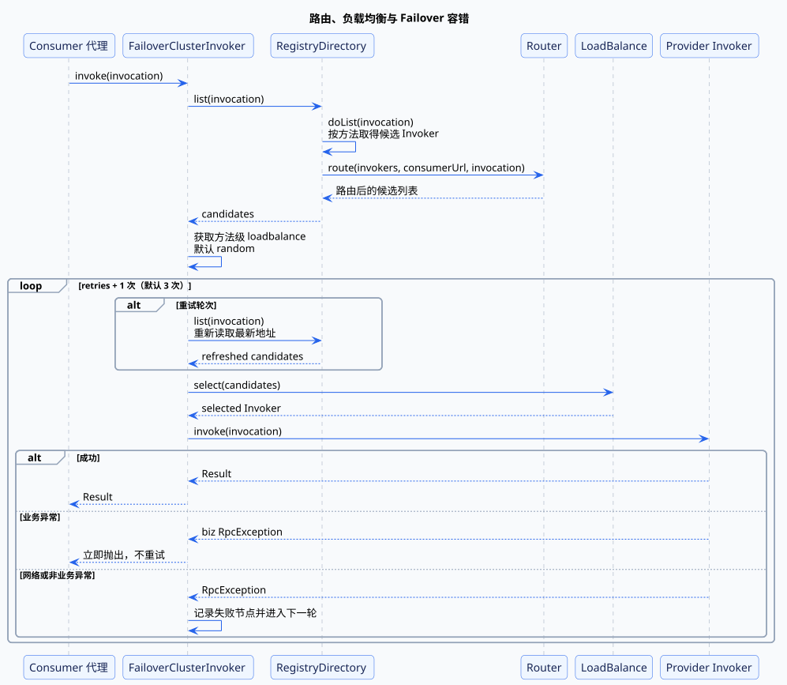

### 3. `Directory#list`：先按方法取目录，再应用路由

`RegistryDirectory#doList` 优先用方法名读取 `methodInvokerMap`，必要时还可以使用“方法名 + 第一个参数”匹配预先生成的列表。`AbstractDirectory#list` 随后执行运行时 Router：

```text
methodInvokerMap
  → 当前方法的 Invoker 列表
  → Router#route
  → 本次调用允许访问的列表
```

RegistryDirectory 在地址刷新时已经通过 `toMethodInvokers` 处理非运行时路由；标记 `runtime=true` 的 Router 则在每次调用时执行，因为它可能依赖 Invocation 的方法、参数或 attachments。

路由的功能是限定边界，而不是决定流量比例。它可以把十个节点过滤成三个，但最终选择哪个仍由 LoadBalance 完成。

### 4. `LoadBalance#select`：从候选节点中选择一个

`AbstractClusterInvoker#invoke` 从第一个候选 Invoker 的方法级 URL 参数读取 `loadbalance`，默认扩展是 `random`。`RandomLoadBalance#doSelect` 并不是简单的等概率随机：

- 权重不同时，在总权重区间中随机，权重越大被选中的概率越高；
- 权重相同或总权重为零时，在节点数量范围内等概率随机；
- `AbstractLoadBalance#getWeight` 还会对刚启动的 Provider 进行预热权重计算，避免新节点立刻承受满额流量。

这一层只做“选择”，不负责重试。LoadBalance 返回一个 Invoker 后，FailoverClusterInvoker 才真正执行它。

### 5. `FailoverClusterInvoker#doInvoke`：失败后重新取址并选择

默认重试次数 `retries=2`，源码计算为 `retries + 1`，所以最多尝试三次。第一次失败后，每轮都会重新调用 `list(invocation)`：

```text
第一次：list → select → invoke
第二次：重新 list → reselect → invoke
第三次：重新 list → reselect → invoke
```

重新 list 的作用是避免拿着过期地址盲目重试。Provider 可能已在第一次失败后被 RegistryDirectory 移除，新节点也可能刚刚加入。

Failover 只重试网络或非业务 RpcException。业务异常表示 Provider 已经正常执行方法，只是业务结果失败；再次调用既没有意义，还可能重复产生写操作。因此业务异常会直接返回到代理层，并最终由 `Result#recreate` 抛出。

## 8. Consumer 同步等待与调用超时处理流程

同步 RPC 看起来像当前线程一直等 Provider，实际是请求先异步发送，再由 DefaultFuture 使用请求 ID 和 Condition 把响应交回原调用线程。

### 1. 功能目标：给“等待响应”设置边界

超时约束的是 Consumer 等待结果的时间，不是远程业务方法的最大执行时间。Consumer 和 Provider 位于不同进程，Dubbo 2.6.12 超时路径不会向 Provider 发送取消请求，也不会中断 Provider 业务线程。

这意味着：

```text
Consumer 已经超时
≠ Provider 已停止执行
≠ 业务操作一定失败
```

对于写操作，超时后的重试尤其需要结合幂等设计，否则第一次调用可能稍后成功，第二次重试又执行一遍。

### 2. 函数调用总览

```text
DubboInvoker#doInvoke
  → HeaderExchangeChannel#request
  → new Request(requestId)
  → new DefaultFuture(channel, request, timeout)
  → FUTURES.put(requestId, future)
  → Channel#send
  → DefaultFuture#get
  → Condition#await

响应到达:
HeaderExchangeHandler#handleResponse
  → DefaultFuture#received
  → FUTURES.remove(requestId)
  → DefaultFuture#doReceived
  → Condition#signal
```

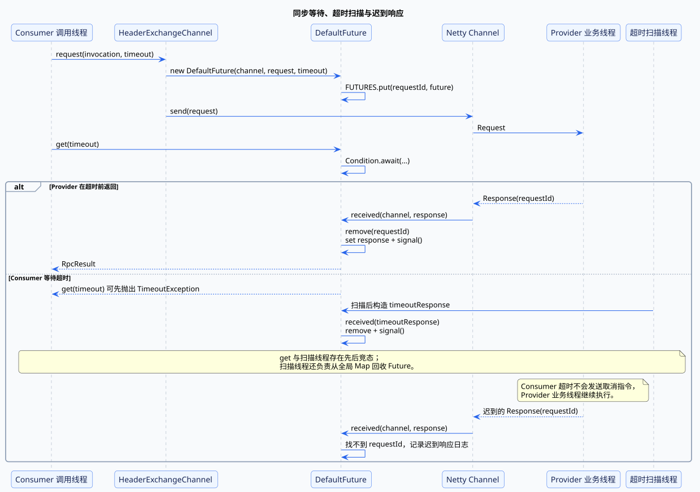

### 3. `DefaultFuture#get`：同步语义由本地等待实现

构造 DefaultFuture 时，请求 ID 会同时写入静态 `FUTURES` 和 `CHANNELS`。调用线程进入 `get(timeout)` 后，在锁保护下循环检查 `response` 并等待 Condition。

响应返回时，Netty 接收线程执行 `DefaultFuture#received`，使用 response ID 找到 Future，设置 response 并 `signal`。原调用线程被唤醒后执行 `returnFromResponse`，把正常结果、超时状态或 RemotingException 分别还原。

所以“同步调用”不是网络层采用同步 I/O，而是异步网络事件与本地 Future 配合出的同步接口。

### 4. `RemotingInvocationTimeoutScan`：回收超时 Future

DefaultFuture 的静态初始化会启动 `DubboResponseTimeoutScanTimer`，约每 30ms 扫描一次未完成 Future。超过 Future 自身 timeout 后，它构造一个 CLIENT_TIMEOUT 或 SERVER_TIMEOUT 的 Response，再复用 `DefaultFuture#received` 完成移除和通知。

`get(timeout)` 本身也可能先于扫描线程发现等待超时并抛出 `TimeoutException`；此时扫描线程会在随后负责从全局 Map 中移除该 Future。因此等待超时与资源回收可能由两个线程先后完成。

如果真实响应更晚才到达，`received` 已经找不到 request ID，只会记录“timeout response finally returned”日志。这个日志恰好证明 Provider 在 Consumer 超时后仍可能完成执行。

## 9. Provider 请求线程派发与业务执行流程

Provider 收到请求后不能直接在 Netty IO 线程中执行任意业务方法，否则一个慢接口就可能阻塞同一 EventLoop 上其他连接的读写。

### 1. 功能目标：分离网络读写与业务执行

默认 `all` Dispatcher 会把 `received`、`connected`、`disconnected` 和 `caught` 事件派发到 Dubbo 线程池。一次请求因此跨过两个线程域：

```text
Netty IO 线程：读取字节、协议解码、触发 received
Dubbo 业务线程：处理 Request、执行 Filter 和业务方法
```

IO 线程应快速完成接收与投递，业务耗时则被限制在线程池中。这既保护网络层，也提供线程数、队列和拒绝策略等容量控制点。

### 2. 函数调用总览

```text
NettyHandler#messageReceived
  → MultiMessageHandler#received
  → HeartbeatHandler#received
  → AllChannelHandler#received
  → ExecutorService#execute
  → ChannelEventRunnable#run
  → DecodeHandler#received
  → HeaderExchangeHandler#received
  → HeaderExchangeHandler#handleRequest
  → DubboProtocol.requestHandler#reply
  → providerInvoker#invoke
```

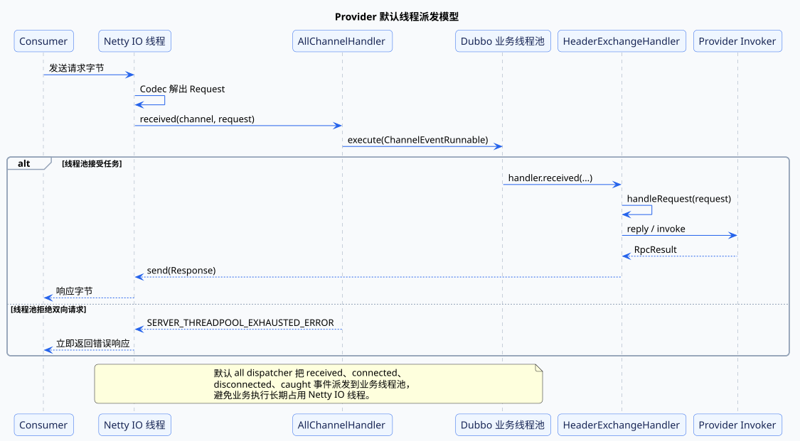

### 3. `ChannelHandlers#wrapInternal`：在建 Server 时装配派发链

`HeaderExchanger#bind` 把业务 ExchangeHandler 包装成 `DecodeHandler(new HeaderExchangeHandler(handler))`。Transporter 绑定 Server 时，`ChannelHandlers#wrapInternal` 再加上多消息、心跳和 Dispatcher：

```text
MultiMessageHandler
  → HeartbeatHandler
  → AllChannelHandler
  → DecodeHandler
  → HeaderExchangeHandler
  → Dubbo requestHandler
```

默认 Dispatcher SPI 是 `all`，`AllDispatcher#dispatch` 创建 AllChannelHandler。`WrappedChannelHandler` 再通过 ThreadPool SPI 创建 Provider Executor。2.6.12 的默认线程池扩展是 `limited`，默认线程数上限为 200。

这条包装链决定了代码在哪个线程执行：Netty 调用 AllChannelHandler 时仍在 IO 线程；提交的 ChannelEventRunnable 开始运行后，后面的 DecodeHandler、ExchangeHandler、Filter 和业务方法都处于 Dubbo 业务线程。

### 4. `AllChannelHandler#received`：拒绝时尽快给出明确结果

AllChannelHandler 把消息封装成 ChannelEventRunnable 并提交线程池。如果线程池拒绝一个双向 Request，它会直接构造 `SERVER_THREADPOOL_EXHAUSTED_ERROR` Response 返回 Consumer。

这个分支很重要：如果只丢弃任务，Consumer 只能等到超时，无法区分网络变慢和 Provider 线程池已满。明确错误能更快触发上层容错，也能让监控定位容量问题。

线程池只是隔离手段，不会让系统容量无限增长。业务长期阻塞时，任务仍会耗尽线程或队列，所以线程配置必须与接口耗时、下游依赖和可接受并发量一起评估。

## 10. Consumer 连接建立、复用与断线重连流程

每个 Consumer 侧 DubboInvoker 都需要 ExchangeClient，但“一个 Invoker 一个 TCP 连接”并不是默认行为。Dubbo 会按 Provider 地址共享连接，并在连接断开后由客户端定时检查和恢复。

### 1. 功能目标：控制连接成本，并让短暂断线可恢复

连接机制要同时解决三个问题：

- 首次引用时怎样建立到 Provider 的 Channel；
- 同一 JVM 中多个服务引用怎样避免重复连接；
- Channel 失效后怎样在不重建业务代理的情况下恢复。

连接和 Provider Invoker 的生命周期相关，但不是一一对应。共享连接外层使用引用计数，只有最后一个引用销毁时才真正关闭物理连接。

### 2. 函数调用总览

```text
DubboProtocol#refer
  → DubboProtocol#getClients
  → getSharedClient / initClient
  → Exchangers#connect
  → HeaderExchanger#connect
  → Transporters#connect
  → new NettyClient
  → AbstractClient#doOpen
  → AbstractClient#connect
  → NettyClient#doConnect
```

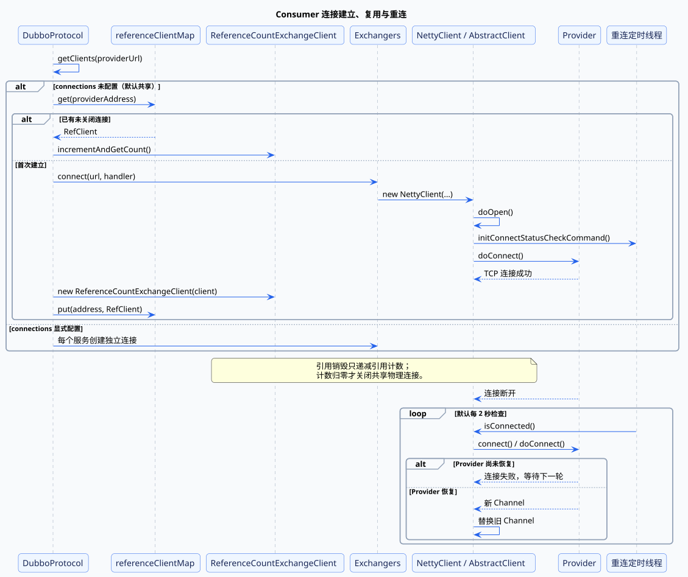

### 3. `getSharedClient`：按 Provider 地址复用物理连接

`getClients` 读取 `connections` 参数。未配置时值为 0，源码把它解释为“共享连接，并使用一个连接”；显式配置为正数时，才为该服务创建指定数量的独立连接。

共享分支以 `url.getAddress()` 为 key 查询 `referenceClientMap`：

```text
已有未关闭客户端
  → ReferenceCountExchangeClient#incrementAndGetCount
  → 直接复用

没有客户端
  → initClient
  → new ReferenceCountExchangeClient
  → 放入 referenceClientMap
```

ReferenceCountExchangeClient 的 `close` 先递减计数，归零后才关闭内部 ExchangeClient。这样 RegistryDirectory 因某个服务地址变化而销毁 Invoker 时，不会误关同地址上仍被其他服务使用的连接。

### 4. `AbstractClient#connect`：建立并替换 Channel

`initClient` 为 URL 设置 `DubboCodec` 和心跳参数，非懒连接模式继续调用 `Exchangers#connect`。NettyClient 构造时先 `doOpen` 初始化 Bootstrap，再由 `AbstractClient#connect` 调用 `NettyClient#doConnect`。

`doConnect` 等待连接结果。成功后用新 Channel 替换旧 Channel，并关闭旧对象；失败时，`check=true` 会让引用创建失败，`check=false` 则记录警告并保留客户端，等待之后重连。

### 5. `initConnectStatusCheckCommand`：断线后复用同一个客户端对象恢复

`connect` 会启动连接状态检查任务。默认 `reconnect` 周期为 2000ms，任务发现 `!isConnected()` 就再次调用 `connect`：

```text
定时检查
  → isConnected == false
  → connect
  → doConnect
  → 成功后替换 Channel
```

上层 DubboInvoker 始终持有同一个 ExchangeClient 包装对象，所以重连不要求重新创建接口代理。需要注意，重连只能恢复“地址仍然有效但连接断开”的情况；Provider 已从注册中心下线时，RegistryDirectory 会销毁对应 Invoker，而不是无限保留这个地址。

## 11. 注册中心操作失败与断线恢复流程

注册中心属于控制面。它暂时不可用时，已建立的 Consumer 到 Provider 连接仍可能继续承载请求，但新地址、下线和治理规则无法及时同步，因此注册与订阅操作需要独立的失败恢复机制。

### 1. 功能目标：把一次远程操作变成可持续重试的意图

FailbackRegistry 不只执行 `doRegister` 和 `doSubscribe`，还保存“本来应该成功、但当前失败”的操作。2.6.12 维护多组失败集合：

- `failedRegistered` / `failedUnregistered`；
- `failedSubscribed` / `failedUnsubscribed`；
- `failedNotified`。

保存失败意图后，定时任务可以继续重试，而应用不必重新启动。注册中心重连时，当前有效的注册和订阅也会重新加入恢复流程，用来重建 ZooKeeper 临时节点和监听器。

### 2. 函数调用总览

```text
FailbackRegistry#register / subscribe
  → ZookeeperRegistry#doRegister / doSubscribe
  → ZooKeeperClient#create / addChildListener
  → 失败操作写入 failed 集合

DubboRegistryFailedRetryTimer
  → FailbackRegistry#retry
  → doRegister / doSubscribe / listener.notify
  → 成功后移出 failed 集合

StateListener#stateChanged(RECONNECTED)
  → FailbackRegistry#recover
  → 当前 registered / subscribed 加入 failed 集合
  → retry
```

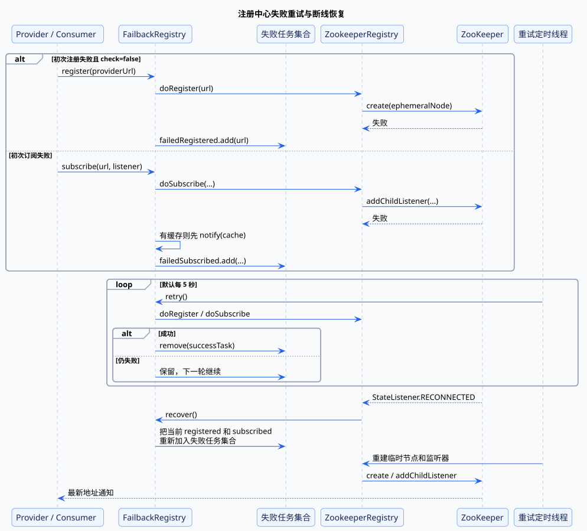

### 3. `register` 与 `subscribe`：启动检查和后台恢复是两种策略

注册失败时，如果 URL 与注册中心都要求 `check=true`，FailbackRegistry 会直接抛出异常，让应用启动失败；`check=false` 时则记录到 `failedRegistered`，交给后台重试。

订阅失败还多一层本地缓存兜底。`getCacheUrls` 有数据时会先通知 Listener 使用缓存地址，同时把订阅加入 `failedSubscribed`。这只能让 Consumer 暂时拥有一份旧地址快照，不能证明这些 Provider 当前仍然在线。

因此 `check=false` 的作用是允许应用在注册中心暂时不可用时启动，不是让服务调用自动成功。Provider、连接和缓存地址是否可用仍要由实际调用验证。

### 4. `retry`：默认每五秒重做失败操作

FailbackRegistry 构造时启动单线程定时任务，默认 `retry.period=5000ms`。每轮对失败集合做快照，然后调用底层 `doRegister`、`doSubscribe` 等方法；成功就移除，失败则保留到下一轮。

通知 Listener 自身失败也会进入 `failedNotified`。这说明恢复不仅覆盖“到注册中心的网络操作”，也覆盖“注册信息送到本地 Directory”这最后一步。

### 5. `recover`：重连后重建会话相关状态

ZooKeeper 客户端发出 `RECONNECTED` 状态时，ZookeeperRegistry 调用 `recover`。FailbackRegistry 不会假设旧临时节点和 Watcher 仍存在，而是把当前 `registered` 和 `subscribed` 全部加入失败任务集合，再由 retry 重新执行。

这一步恢复的是注册中心会话状态，不是 Dubbo 协议连接。Registry 恢复与 Provider TCP 重连属于两条独立链路：前者保证地址发现继续工作，后者保证某个已知地址的网络通道可用。

## 12. Consumer 与 Provider 的 Filter 责任链执行流程

上下文、监控、并发限制、轻量 Token 校验和异常规范化都不应写进业务实现，也不应让 DubboProtocol 为每种横切需求增加分支。Dubbo 使用 Filter 把这些职责包装在 Invoker 外层。

### 1. 功能目标：不改变核心 Invoker，也能插入调用前后逻辑

Filter 的统一形式是：

```text
filter.invoke(next, invocation)
```

调用 `next.invoke` 前可以读取上下文、校验或计数，返回后可以采集结果、转换异常，并在 `finally` 中清理线程状态；不调用 next 则可以直接拒绝或降级。

Provider 与 Consumer 使用不同的激活分组和配置 key，因此同一个扩展机制可以在两端构建不同责任链。

### 2. 函数调用总览

```text
ProtocolFilterWrapper#export / refer
  → ProtocolFilterWrapper#buildInvokerChain
  → ExtensionLoader#getActivateExtension
  → 按 @Activate、service.filter / reference.filter 取 Filter
  → 从后向前包装 Invoker

调用时:
outerFilter#invoke
  → nextFilter#invoke
  → ...
  → protocolInvoker / businessInvoker#invoke
  → 结果沿责任链反向返回
```

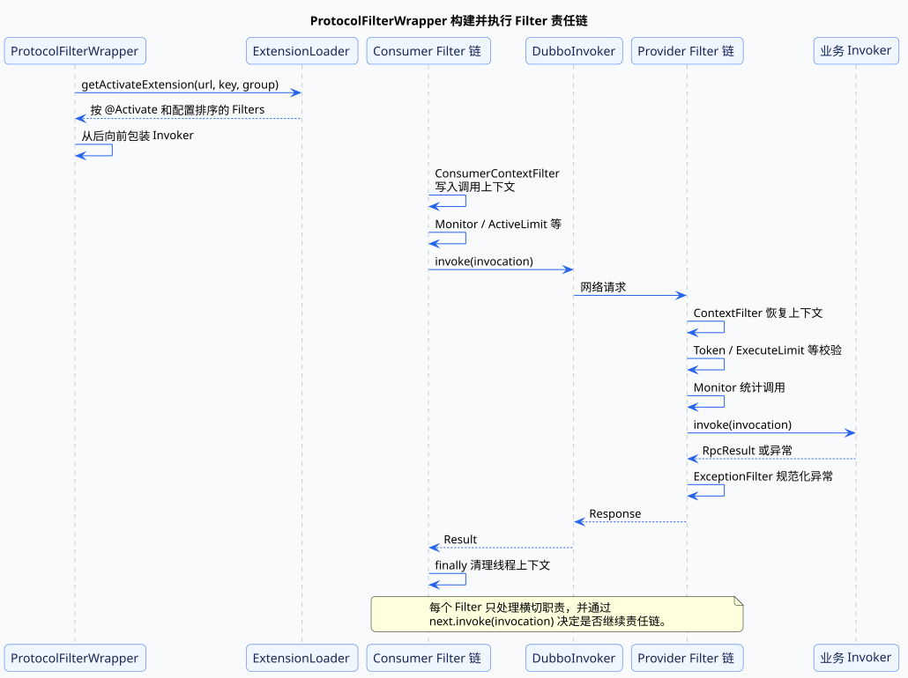

### 3. `buildInvokerChain`：倒序包装，正序执行

`buildInvokerChain` 先拿到已排序的 Filter 列表，再从末尾向前创建匿名 Invoker。每个包装对象的 `invoke` 只执行当前 Filter，并把上一次构造的 Invoker 作为 next：

```text
Filter A
  → Filter B
  → 原始 Invoker
  ← Filter B
  ← Filter A
```

倒序构造保证运行时按扩展排序结果正向进入。`@Activate` 的 group、value、before、after、order 与 URL 中显式 Filter 配置共同决定最终链条。

RegistryProtocol 自身不会构建业务 Filter 链；它继续调用具体协议的 export 或 refer 时，ProtocolFilterWrapper 才围绕 DubboProtocol 的 Invoker 构建 Provider 或 Consumer 链。

### 4. 常见 Filter 各自改变什么

| Filter | 位置与作用 | 对调用状态的影响 |
| --- | --- | --- |
| `ConsumerContextFilter` | Consumer | 写入本地/远程地址和 Invoker，返回后传递服务端 attachments 并清理上下文 |
| `ContextFilter` | Provider | 从 Invocation 恢复 RpcContext，调用结束后把 ServerContext attachments 放入 Result |
| `MonitorFilter` | 两端 | 统计耗时、并发、成功/失败和输入输出大小，不改变业务结果 |
| `ActiveLimitFilter` / `ExecuteLimitFilter` | Consumer / Provider | 限制方法级活跃调用数或 Provider 并发执行数 |
| `TokenFilter` | Provider | 比较 Provider URL 与 Invocation 中的 token，不匹配就终止责任链 |
| `ExceptionFilter` | Provider | 记录未声明异常，并处理 Consumer 可能缺少异常类的问题 |

`TokenFilter` 只是基于共享 token 的轻量校验，不能替代完整身份认证和授权。限流 Filter 也只控制所在 JVM 的调用，不等同于全局配额。

责任链最容易被忽略的问题是线程上下文泄漏。ContextFilter 使用 `finally` 清理 RpcContext，正是因为 Provider 业务线程会被线程池复用；不清理就可能让下一次请求读到上一次调用的 attachments。

## 13. Dubbo 配置解析、合并与动态覆盖流程

Dubbo 运行时几乎所有扩展点都从 URL 读取参数，但这些参数可能来自 XML、Consumer/Provider 默认项、引用或服务配置、方法配置、系统属性和注册中心动态规则。源码并不存在一条能概括所有情况的简单总排序，而是分“配置聚合”和“运行时合并”两个阶段。

### 1. 功能目标：把多来源配置收敛为一次调用可读取的 URL

理解优先级需要先区分三个概念：

1. XML 是配置输入方式，解析后变成 Config Bean，本身不是运行时的独立优先级；
2. `appendParameters` 决定 Application、Consumer、Reference、Method 等本地配置怎样写入参数 Map；
3. `RegistryDirectory#mergeUrl` 决定 Consumer 参数、Provider URL 和动态 Configurator 怎样合并。

最后，调用代码使用 `getMethodParameter(method, key)` 时，还会先查 `method.key` 再查全局 `key`。

### 2. 函数调用总览

```text
DubboNamespaceHandler
  → DubboBeanDefinitionParser#parse
  → ServiceBean / ReferenceBean / MethodConfig
  → AbstractConfig#appendProperties
  → -D 系统属性写回 Config Bean
  → ServiceConfig / ReferenceConfig#appendParameters
  → URL 参数 Map
  → RegistryDirectory#mergeUrl
  → ClusterUtils#mergeUrl
  → Configurator#configure
  → URL#getMethodParameter
```

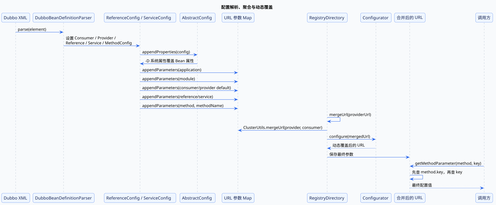

### 3. `DubboBeanDefinitionParser#parse`：XML 先变成对象关系

Spring 命名空间处理器为 `<dubbo:consumer>`、`<dubbo:provider>`、`<dubbo:service>`、`<dubbo:reference>` 等元素注册同一个通用解析器。解析器根据 Setter 把 XML 属性写入 BeanDefinition，并把 `<dubbo:method>` 转换成 MethodConfig 列表。

因此 XML 的作用是创建和关联 Config Bean。注解或 API 配置只要形成相同的 Config 对象，后面的 URL 聚合逻辑基本相同。

### 4. `appendProperties` 与 `appendParameters`：本地配置按写入顺序聚合

ReferenceConfig 的主要顺序是：

```text
Application
  → Module
  → Consumer(default 前缀)
  → ReferenceConfig
  → MethodConfig(methodName 前缀)
```

ServiceConfig 对应：

```text
Application
  → Module
  → Provider(default 前缀)
  → ProtocolConfig
  → ServiceConfig
  → MethodConfig(methodName 前缀)
```

后写入的同名参数覆盖前值，所以 Reference/Service 自身配置高于 Consumer/Provider 默认配置。MethodConfig 写成 `sayHello.timeout`，不是直接覆盖 `timeout`；真正调用 `URL#getMethodParameter("sayHello", "timeout")` 时，方法 key 会优先于全局 key。

在聚合前，`AbstractConfig#appendProperties` 会读取 `-Ddubbo...` 系统属性并调用 Setter，因此系统属性可以覆盖 XML 已写入的 Bean 属性。

### 5. `RegistryDirectory#mergeUrl`：动态规则在地址刷新时最终覆盖

Consumer 收到 Provider URL 后，`mergeUrl` 先调用 `ClusterUtils.mergeUrl(providerUrl, queryMap)`，多数 Consumer 参数会覆盖 Provider 参数；部分必须由 Provider 决定的参数会被保留。随后 Configurator 再执行 `configure`。

源码注释给出的这一阶段顺序是：

```text
动态 override > -D 系统属性 > Consumer > Provider
```

但方法级配置是另一条查找轴：合并后的 URL 同时存在 `timeout` 与 `sayHello.timeout` 时，`getMethodParameter` 总是先取方法 key。因此判断最终值时，应先看动态合并后 URL 中有哪些 key，再按“方法级 → 全局级”读取，而不是把所有来源硬塞进一条总优先级。

## 14. 请求响应编解码与序列化流程

RpcInvocation 仍然是 JVM 对象，无法直接在 TCP 上传输。DubboCodec 负责定义 RPC 消息体字段，ExchangeCodec 负责 16 字节协议头和请求/响应框架，Serialization SPI 负责把具体 Java 对象转换成字节。

### 1. 功能目标：同时保留传输边界和 Java 调用语义

编码需要保留两类信息：

- Exchange 层需要请求/响应标志、双向标志、序列化 ID、状态、request ID 和消息体长度；
- RPC 层需要接口路径、版本、方法名、参数类型、参数值、attachments，以及返回值或异常。

request ID 让响应可以关联 DefaultFuture，参数类型描述让 Provider 能恢复重载方法，序列化 ID 则允许双方选择匹配的 Serialization 扩展。

### 2. 函数调用总览

```text
NettyCodecAdapter.Encoder#encode
  → ExchangeCodec#encodeRequest
  → Serialization#serialize
  → DubboCodec#encodeRequestData
  → 写入 16 字节 Header 与 Body

Provider 解码:
DubboCodec#decodeBody
  → new DecodeableRpcInvocation
  → DecodeableRpcInvocation#decode
  → Serialization#deserialize
  → RpcInvocation

Consumer 解码:
DubboCodec#decodeBody
  → new DecodeableRpcResult
  → DecodeableRpcResult#decode
  → RpcResult
```

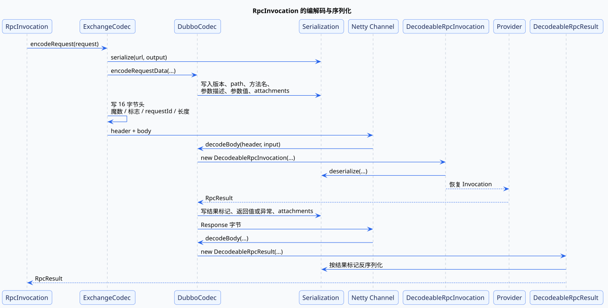

### 3. `ExchangeCodec#encodeRequest`：先留出 Header，再序列化 Body

ExchangeCodec 先在 ChannelBuffer 中预留 16 字节，然后让 Serialization 创建 ObjectOutput，并调用 DubboCodec 写请求数据。Body 完成后，它才能计算实际长度并回填 Header：

```text
魔数 2 字节
  + 请求/双向/事件标志与序列化 ID
  + 响应状态
  + request ID
  + body length
```

固定 Header 让接收方能校验魔数、判断是否收齐完整帧、限制 payload 大小，并在反序列化之前知道消息类型。

### 4. `DubboCodec#encodeRequestData`：写入恢复方法所需的信息

请求 Body 按顺序写入 Dubbo 协议版本、path、service version、方法名、参数类型描述、参数对象和 attachments。Provider 的 DecodeableRpcInvocation 使用相同顺序读回数据：

```text
方法名 + 参数描述
  → ReflectUtils#desc2classArray
  → 参数按目标类型反序列化
  → 恢复 RpcInvocation
```

path、group、version 等 attachments 会继续用于 `DubboProtocol#getInvoker` 定位 Exporter；普通业务 attachments 则供 Filter 和业务上下文使用。编解码不是只传参数值，它还传输了“这次调用应该交给谁执行”的路由身份。

### 5. `DecodeableRpcResult#decode`：结果标记区分值、空值与异常

Provider 返回时，DubboCodec 先写结果标记：

- 普通返回值；
- `null`；
- 异常；
- 上述三种带 attachments 的版本。

Consumer 根据标记选择反序列化返回类型或 Throwable，并构造 RpcResult。Exchange Response 的 status 可以是 `OK`，同时 RpcResult 内仍然保存业务异常；前者表示 RPC 响应成功到达，后者表示业务方法执行结果是异常，两者不能混为一谈。

Serialization 只负责对象与字节的具体转换，DubboCodec 决定字段语义，ExchangeCodec 决定帧格式。三层分开后，更换序列化实现不需要改变请求 ID、消息长度和 RPC 字段顺序。

## 15. Provider 异常传输与 Consumer 重新抛出流程

远程异常既要保持 Java 接口语义，又要面对 Consumer 可能没有 Provider 异常类、异常对象无法序列化，以及网络故障与业务失败需要不同容错策略的问题。

### 1. 功能目标：区分业务结果异常与 RPC 框架异常

调用链中主要有两类异常：

- 业务方法抛出的异常被保存到 RpcResult，代表 Provider 已经找到并执行了方法；
- 连接失败、超时、解码失败或线程池拒绝等 RpcException/RemotingException，代表 RPC 过程没有正常完成。

Failover 是否重试、Consumer 最终抛出什么，都依赖这个边界。把业务异常误判为网络失败，可能导致一次业务操作被重复执行。

### 2. 函数调用总览

```text
Wrapper#invokeMethod
  → 业务方法抛出异常
  → AbstractProxyInvoker#invoke
  → new RpcResult(targetException)
  → ExceptionFilter#invoke
  → DubboCodec#encodeResponseData
  → RESPONSE_WITH_EXCEPTION
  → DecodeableRpcResult#decode
  → RpcResult#setException
  → DefaultFuture#get
  → InvokerInvocationHandler#invoke
  → RpcResult#recreate
```

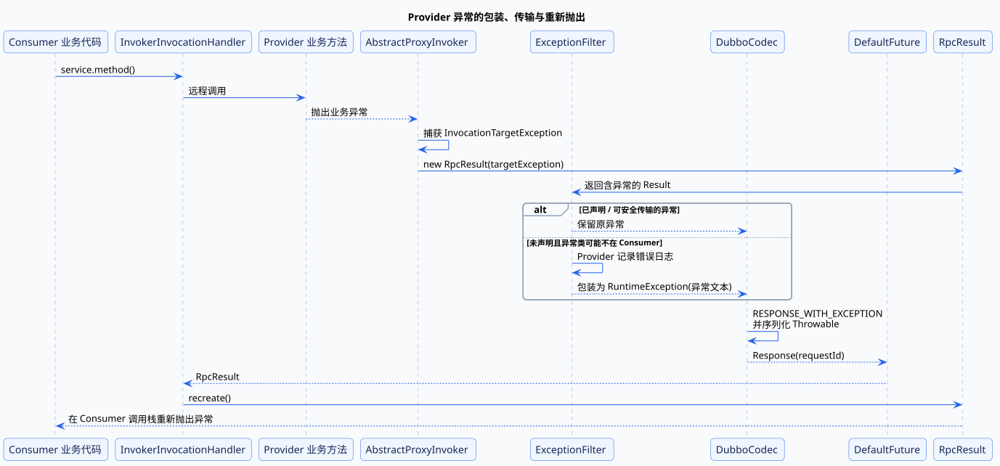

### 3. `AbstractProxyInvoker#invoke`：把反射异常还原为业务异常

Javassist Wrapper 调用业务对象时，目标方法异常会包在 `InvocationTargetException` 中。AbstractProxyInvoker 捕获它并取 `getTargetException()`，返回一个包含真实异常的 RpcResult。

这里没有直接把异常抛给 Exchange 层，是因为业务异常属于方法结果的一部分。Provider Filter、Codec 和 Consumer 代理仍然需要按正常响应链处理它。

### 4. `ExceptionFilter#invoke`：处理跨进程异常类兼容性

ExceptionFilter 会直接保留以下异常：

- checked exception；
- 接口方法签名明确声明的异常；
- 与接口位于同一代码来源的异常；
- JDK 异常或 RpcException。

对于未声明的 RuntimeException，如果异常类只存在于 Provider 实现包，Consumer 反序列化时可能找不到类。ExceptionFilter 会先在 Provider 记录错误，再把堆栈文本包装进通用 RuntimeException，降低响应因异常类缺失而无法反序列化的风险。

这是一种兼容性保护，也提醒接口设计应把需要跨进程识别的业务异常放进双方共享的 API 包。

### 5. `RpcResult#recreate`：在代理调用栈上重新抛出

DubboCodec 用 `RESPONSE_WITH_EXCEPTION` 标记序列化 Throwable。Consumer 的 DecodeableRpcResult 读回异常并设置到 RpcResult，DefaultFuture 只负责把这个 Result 交给调用线程。

最终 InvokerInvocationHandler 调用 `result.recreate()`：

```java
if (exception != null) {
    throw exception;
}
return result;
```

因此业务代码看到的异常出现在本地接口调用栈中，但根因来自远程 Provider。相比之下，Response status 非 `OK` 会先在 DefaultFuture 中变成 RemotingException，再由 DubboInvoker 包装成 RpcException；这类异常描述的是 RPC 框架失败。

## 16. Provider 服务下线与优雅停机流程

直接结束 Provider 进程会留下三个风险：注册中心暂时保留旧地址、Consumer 继续向旧连接发请求、正在执行的请求被强制中断。2.6.12 通过注销、只读事件和等待窗口尽量降低这些风险。

### 1. 功能目标：先停止引流，再释放执行资源

理想顺序是：

```text
从注册中心删除地址
  → Consumer 刷新目录，不再选择该节点
  → 已连接 Consumer 收到 readonly 事件
  → 留出时间完成已有调用
  → 关闭 Server、Channel、Invoker 和线程池
```

其中注册中心通知解决新调用的地址选择，只读事件解决尚未收到通知的已有连接，等待窗口则给在途调用留下完成机会。

### 2. 函数调用总览

```text
DubboShutdownHook#run
  → DubboShutdownHook#destroyAll
  → AbstractRegistryFactory#destroyAll
  → Registry#unregister / unsubscribe
  → 遍历已加载的 Protocol#destroy
      → DubboProtocol#destroy
          → HeaderExchangeServer#close(timeout)
          → startClose
          → sendChannelReadOnlyEvent
          → 等待窗口结束后 Server#close
      → RegistryProtocol#destroy
          → DestroyableExporter#unexport
          → unregister / unsubscribe
          → 异步等待后执行内部 exporter.unexport
```

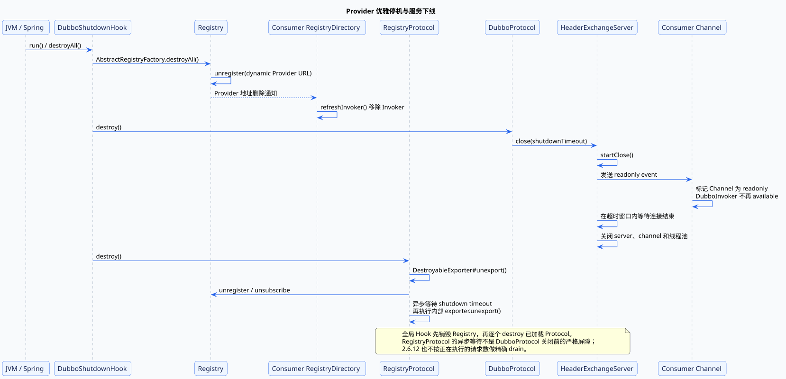

### 3. `DubboShutdownHook#destroyAll`：统一触发注册中心和协议销毁

ShutdownHook 使用 AtomicBoolean 保证销毁只执行一次。它先销毁 RegistryFactory 中的注册中心实例，再遍历已加载 Protocol 调用 `destroy`。

`AbstractRegistry#destroy` 会注销 `dynamic=true` 的 Provider URL 并取消订阅。Provider 节点删除后，Consumer 收到地址通知，RegistryDirectory 删除对应 Invoker，后续 Cluster 调用就不会再选择这个节点。

RegistryProtocol 的 DestroyableExporter 也会执行 unregister、unsubscribe，并在线程中等待 `dubbo.service.shutdown.wait` 指定的时间后再真正 unexport。默认服务停机等待时间为 10000ms。它是独立的异步取消暴露路径，不应理解为 DubboProtocol 关闭前一定会经过的同步屏障。

### 4. `HeaderExchangeServer#close`：只读事件先让连接退出选择

DubboProtocol 销毁 Server 时调用 `server.close(shutdownTimeout)`。HeaderExchangeServer 先 `startClose`，底层 AbstractServer 会拒绝停机过程中建立的新连接；随后向现有 Channel 发送单向 readonly event。

Consumer 的 HeaderExchangeHandler 收到事件后给 Channel 设置 `CHANNEL_ATTRIBUTE_READONLY_KEY`。`DubboInvoker#isAvailable` 检查到只读标记后返回 false，集群选择时便会避开该节点。

Server 在超时窗口内等待连接结束，再关闭心跳、底层 Server 和线程池。已进入业务线程的请求有机会在这个窗口内完成，但超时到达后资源仍会被关闭。

### 5. 2.6.12 的“优雅”是尽力而为，不是精确排空

`DubboShutdownHook` 先统一销毁 Registry，再遍历已加载的 Protocol；各协议的 `destroy` 是分别执行的。`HeaderExchangeServer#isRunning` 检查的是是否仍有连接，不是正在执行的请求计数；RegistryProtocol 的等待又是异步固定时间。因此 2.6.12 没有按每个 in-flight 请求做精确 drain。

优雅停机能显著减少新请求进入，却无法保证所有长任务一定完成。超过等待时间的调用仍可能失败，进程被 `kill -9` 时 ShutdownHook 也不会运行。重要写操作仍然需要幂等、重试边界和业务补偿。

## 17. injvm、Mock、异步与单向调用流程

injvm、Mock、异步和单向调用不是四套独立框架，而是在引用、集群或协议层改变同一条 Invoker 调用链的某个环节。

### 1. 功能目标：按场景跳过不需要的远程调用语义

| 模式 | 改变的位置 | 核心变化 |
| --- | --- | --- |
| injvm | 引用与协议选择 | 同 JVM 直接找本地 Exporter，不经过网络 |
| Mock | ClusterInvoker 外层 | 强制本地返回，或远程失败后执行本地降级 |
| 异步 | DubboInvoker 请求分支 | 发送双向请求但不阻塞当前业务线程 |
| 单向 | DubboInvoker 请求分支 | 只发送消息，不创建 Future，也不等待响应 |

这四种模式仍然使用 Invocation 和 Invoker，因此 Filter、URL 方法参数和代理入口可以继续复用。

### 2. 函数调用总览

```text
injvm:
ReferenceConfig#createProxy
  → InjvmProtocol#isInjvmRefer
  → InjvmProtocol#refer
  → InjvmInvoker#doInvoke
  → exporterMap.get
  → providerInvoker#invoke

Mock:
MockClusterInvoker#invoke
  → force: doMockInvoke
  → fail: clusterInvoker#invoke 失败后 doMockInvoke
  → MockInvoker#invoke

异步 / 单向:
DubboInvoker#doInvoke
  → RpcUtils#isAsync / isOneway
  → ExchangeClient#request / send
```

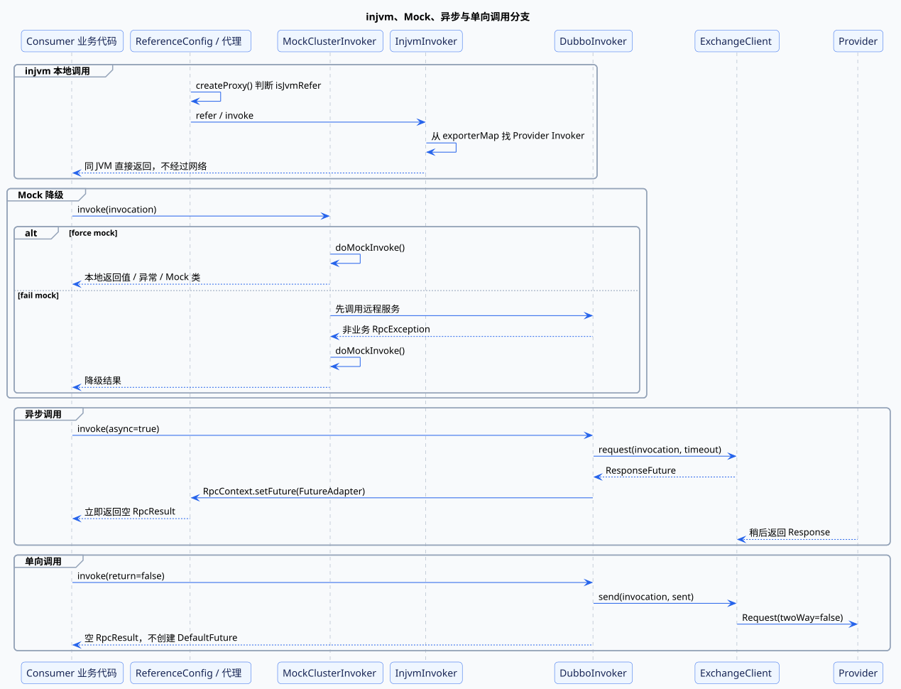

### 3. `InjvmInvoker#doInvoke`：同 JVM 复用 Provider Invoker

Provider 导出远程服务时，ServiceConfig 默认也会执行 `exportLocal`，把本地协议改成 `injvm` 并写入 InjvmProtocol 的 exporterMap。Consumer 创建代理时，如果没有显式直连 URL、没有强制 remote、不是泛化调用，并且本地存在匹配 Exporter，`isInjvmRefer` 默认选择本地引用。

调用时 InjvmInvoker 直接从 exporterMap 找到 Provider Invoker：

```text
接口代理
  → InjvmInvoker
  → 本地 Provider Filter 链
  → 业务实现
```

它不建立 TCP 连接，也不做网络编解码，但仍经过 Invoker 抽象。`scope=remote` 可以强制走远程，`scope=local` 或 `injvm=true` 可以强制本地。

### 4. `MockClusterInvoker#invoke`：强制降级与失败降级

MockClusterInvoker 位于正常 ClusterInvoker 外层，读取方法级 `mock` 参数：

- `force:` 不调用远程服务，直接进入 `doMockInvoke`；
- `fail:` 先执行正常集群调用，只在捕获非业务 RpcException 后降级；
- `return ...` 返回配置值，`throw ...` 构造异常，也可以实例化接口对应的 Mock 实现类。

业务异常不会触发 fail mock，因为 Provider 已经正常响应，降级不应掩盖明确的业务失败。Mock 的职责是提供可预期的本地替代结果，不是把所有异常都吞掉。

### 5. `DubboInvoker#doInvoke`：同步、异步和单向共用发送入口

异步调用仍执行 `currentClient.request`，因此会创建 Request、DefaultFuture 并期待 Provider Response；区别是 DubboInvoker 把 `FutureAdapter` 放入 `RpcContext` 后立刻返回空 RpcResult。业务代码通过 `RpcContext.getContext().getFuture()` 取得稍后完成的结果。

单向调用在 `return=false` 时执行 `currentClient.send`，Request 的 `twoWay=false`，不创建 DefaultFuture。`sent=true` 最多表示等待消息成功写出客户端 Channel，不表示 Provider 已经接收，更不表示业务方法执行成功。

所以四种模式省略的能力各不相同：injvm 省略网络，Mock 可能省略真实 Provider，异步省略当前线程等待，单向则连响应确认都省略。选择前必须先确认业务是否需要远端执行结果和失败语义。

## 18. 学习总结

### 1. 概要

Dubbo 用 `Invoker` 统一 Provider 本地执行、Consumer 远程调用、集群治理和 Filter 扩展，再用 URL 传递配置，用 Directory 保存动态地址，用 ExchangeClient 与 DefaultFuture 衔接异步网络事件。围绕这些稳定抽象，地址、连接、路由和配置都可以变化，而业务接口代理不需要跟着重建。

完整生命周期可以概括为：

```text
配置解析
  → 服务暴露与引用
  → 地址和连接动态维护
  → 路由、负载均衡与容错
  → Filter、线程派发和业务执行
  → 编解码、响应或异常返回
  → 故障恢复与优雅销毁
```

### 2. 学习内容

- Provider 暴露的功能变化是“业务 Bean → Provider Invoker → 协议服务 → 可发现地址”；
- Consumer 引用的功能变化是“Provider URL → 远程 Invoker → 动态目录 → 集群 Invoker → 接口代理”；
- `RegistryProtocol` 负责地址发现的控制链路，`DubboProtocol` 负责承载请求的数据链路；
- `RegistryDirectory` 把地址通知转换为可执行 Invoker 快照，ClusterInvoker 再完成路由、负载均衡和容错；
- 连接、注册中心和业务调用有各自独立的恢复链路，不能用一个“重试”概括；
- `DefaultFuture` 的超时只结束 Consumer 等待，不会取消已经开始的 Provider 业务执行；
- Provider 默认把请求从 Netty IO 线程派发到 Dubbo 业务线程池，线程池拒绝时会返回明确错误；
- Filter 通过 Invoker 包装插入上下文、监控、限制、校验与异常处理；
- 配置优先级要分本地聚合、Consumer/Provider 合并、动态覆盖和方法级查找四个步骤判断；
- ExchangeCodec、DubboCodec 与 Serialization 分别负责消息帧、RPC 字段和对象字节转换；
- Provider 业务异常通过 RpcResult 传输，最终由 Consumer 的 `Result#recreate` 重新抛出；
- injvm、Mock、异步和单向调用只是在统一 Invoker 链的不同位置选择分支；
- 2.6.12 的优雅停机依赖地址注销、只读事件与等待窗口，属于尽力而为的资源排空。

### 3. 遇到的问题

- Provider Invoker 和 Consumer Invoker 名称相同，但职责不同；
- `RegistryProtocol` 负责注册中心协调，真正打开端口的是 `DubboProtocol`；
- 业务异常可以位于 status 为 `OK` 的 Response 内，而网络和框架异常通常通过非 OK status 或 RpcException 表达；
- `retries=2` 表示额外重试两次，总尝试次数是三次；
- Consumer 超时、TCP 重连和注册中心恢复发生在不同对象中，触发条件和结果不能混淆；
- XML、方法配置和动态规则并不是简单线性覆盖，最终值还取决于参数 key 是否带方法名前缀；
- 2.6.12 的停机等待检查连接而不是精确统计在途请求，不能把它理解为强保证。

### 4. 思考与解答

#### 问题一：如果要实现真正的远程取消，需要改造哪些环节？

Dubbo 2.6.12 的 `DefaultFuture#cancel` 只修改 Consumer 本地 Future，并不会通知 Provider。真正的远程取消至少需要增加一条以 request ID 为关联键的控制链路：

```text
Consumer 取消 Future
  → 发送 CancelRequest(requestId)
  → Provider 查找 requestId 对应的执行任务
  → 标记取消并尝试 interrupt
  → 返回取消确认
  → Consumer 处理响应与取消之间的竞态
```

Provider 还需要维护 `requestId → Future/业务线程` 的映射，并在任务开始、完成和取消后及时清理。仅调用 `Thread#interrupt` 仍不能保证业务立即停止：业务代码、数据库驱动和下游调用都必须响应中断。对于已经产生外部副作用的操作，取消也无法自动回滚，因此接口仍需要幂等键、事务边界或补偿机制。

#### 问题二：怎样按正在执行的请求数实现更准确的优雅停机？

可以在 Provider 调用链外增加“准入开关 + in-flight 计数器”：

```text
开始停机
  → 关闭新请求准入
  → 注销注册中心地址并发送 readonly 事件
  → 等待 in-flight 计数归零
  → 到达上限后强制结束等待
  → 关闭 Server、连接和线程池
```

请求通过准入检查后先递增计数，在 `finally` 中递减并唤醒停机线程。关闭准入和递增计数必须放在同一个同步边界内，否则请求可能在停机检查到零之后进入。等待仍然要设置最大时长，避免永久阻塞在无法结束的业务调用上。相比 2.6.12 只检查连接是否存在，这种方式更接近真正的请求排空。

#### 问题三：动态配置变化时，哪些状态可以原地更新？

应根据配置由哪一层读取来判断：

- `timeout`、`retries`、`loadbalance`、`weight` 和路由规则主要在每次调用或目录选择时读取，更新 URL 或 Router 快照即可影响后续调用；
- Provider 已存在 Server 会经过 `DubboProtocol#openServer → server.reset(url)`，`AbstractServer#reset` 可以调整 `accepts`、`idle.timeout` 和线程数，HeaderExchangeServer 还能重启心跳定时器；
- Provider URL 完整字符串变化时，RegistryDirectory 会创建新 Invoker 并销毁旧 Invoker；
- Consumer 共享连接以 Provider 地址为 key。即使生成了新 DubboInvoker，同地址的 ExchangeClient 仍可能被复用，所以客户端类型、连接数、传输层和部分连接参数不能只依赖 URL 刷新来保证完全重建；
- 地址、协议或必须在 Channel 初始化阶段确定的配置发生变化时，应销毁旧 Invoker/连接后重新 `refer`，无法确认 reset 支持范围时则需要重启实例。

因此“收到动态配置”不等于所有运行对象都已原地更新，需要继续跟踪参数最终由 Invoker、Server 还是已建立的 Channel 读取。

#### 问题四：怎样观察 Filter、Router 和 LoadBalance 的最终执行顺序？

2.6.12 没有一条默认日志能够完整展示整条治理链，可以从三个装配点分别观察：

1. 在 `ProtocolFilterWrapper#buildInvokerChain` 记录 `getActivateExtension` 返回的 Filter 类名，确认 Consumer 和 Provider 两端的最终 Filter 顺序；
2. 在 `AbstractDirectory#list` 或具体 Router 前后记录 Invoker 地址集合，确认每条路由规则过滤了哪些节点；
3. 在 `AbstractClusterInvoker#select` 后记录 LoadBalance 名称和最终选中的 Invoker，区分“被路由排除”和“未被负载均衡选中”。

排查时还可以在 `ExtensionLoader#getActivateExtension`、`AbstractDirectory#list`、`FailoverClusterInvoker#doInvoke` 设置断点。日志应携带同一个调用 ID，但避免输出完整参数和敏感 attachments。这样才能把“Filter 做调用拦截、Router 做候选过滤、LoadBalance 做单节点选择”三种作用分开观察。
