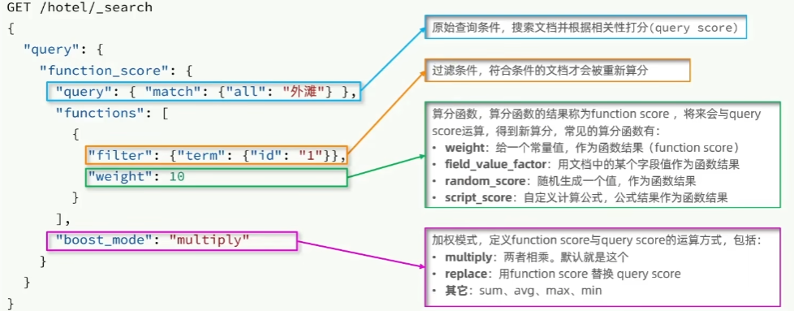

## 1 初步认知

Elasticsearch是一个开源的分布式搜索和分析引擎，用于存储、搜索和分析大规模数据。它是基于Apache Lucene库构建的，提供了高效的全文搜索、结构化搜索、分布式搜索和数据分析能力。


ES是通过使用**倒排索引**，先对文档内容分词，对词条创建索引，并记录词条所在文档的信息。查询时先根据词条查询到文档id，而后获取到文档

- 文档：每一条数据就是一个文档
- 词条：对文档中的内容分词，得到的词语就是词条


**利用docker部署es：**

1. 由于我们和kibana容器互联，因此需要先创建一个网络

   ```shell
   docker network create es-net
   ```

2. 运行如下命令部署单点es，其中`ES_JAVA_OPTS`为配置堆内存大小，默认为1G，可自行调整

   ```shell
   docker run -d \
   --name es \
   -p 9200:9200 \
   -p 9300:9300 \
   -e "discovery.type=single-node" \
   -e "ES_JAVA_OPTS=-Xms512m -Xmx512m" \
   -v es-data:/usr/share/elasticsearch/data \
   -v es-plugins:/usr/share/elasticsearch/plugins \
   --privileged \
   --network es-net \
   elasticsearch:7.12.1
   ```

3. 接着可以通过浏览器访问9200端口，如果查询到内容，则证明部署成功

4. 运行如下命令，部署kibana（图形化辅助工具），注意版本保持一致

   ```shell
   docker run -d \
   --name kibana \
   -e ELASTICSEARCH_HOSTS=http://es:9200 \
   --network=es-net \
   -p 5601:5601  \
   kibana:7.12.1
   ```

5. 接着可以通过浏览器访问5601端口，如果查询到内容，则证明部署成功

6. 由于es对中文的分词效果较差，因此我们还需要安装**IK分词器**来解决这个问题

   ```shell
   #在线安装（不推荐）
   # 1.进入容器内部
   docker exec -it es /bin/bash
   
   # 2在线下载并安装
   ./bin/elasticsearch-plugin  install https://github.com/medcl/elasticsearch-analysis-ik/releases/download/v7.12.1/elasticsearch-analysis-ik-7.12.1.zip
   
   # 3.退出
   exit
   # 4.重启容器
   docker restart es
   ```

   ```shell
   #离线安装（推荐）
   # 1.前往官方仓库下载并解压
   https://github.com/medcl/elasticsearch-analysis-ik
   
   # 2.在/var/lib/docker/volumes/es-plugins/_data中创建ik目录，并将解压结果上传至该目录
   
   # 3.重启容器
   docker restart es
   ```

   

7. 接着我们可以在5601端口中的DEV Tool中运行如下DSL语句，验证是否配置成功

   IK分词器包含两种模式：

   * `ik_smart`：最少切分

   * `ik_max_word`：最细切分

   ```json
   GET /_analyze
   {
     "analyzer": "ik_smart",
     "text": "我现在开始学Java"
   }
   
   // 结果
   {
     "tokens" : [
       {
         "token" : "我",
         "start_offset" : 0,
         "end_offset" : 1,
         "type" : "CN_CHAR",
         "position" : 0
       },
       {
         "token" : "现在",
         "start_offset" : 1,
         "end_offset" : 3,
         "type" : "CN_WORD",
         "position" : 1
       },
       {
         "token" : "开始",
         "start_offset" : 3,
         "end_offset" : 5,
         "type" : "CN_WORD",
         "position" : 2
       },
       {
         "token" : "学",
         "start_offset" : 5,
         "end_offset" : 6,
         "type" : "CN_CHAR",
         "position" : 3
       },
       {
         "token" : "java",
         "start_offset" : 6,
         "end_offset" : 10,
         "type" : "ENGLISH",
         "position" : 4
       }
     ]
   }
   
   ```

   

**IK分词器的拓展：**

在实际使用的过程中，我们可能需要对字典做出一定的修改，比如增加或删除某些词语的分词

1. 首先找到`var/lib/docker/volumes/es-plugins/_data/ik/config/IKAnalyzer.cfg.xml`文件并打开

2. 在文件中添加如下内容

   ```xml
   <?xml version="1.0" encoding="UTF-8"?>
   <!DOCTYPE properties SYSTEM "http://java.sun.com/dtd/properties.dtd">
   <properties>
           <comment>IK Analyzer 扩展配置</comment>
           <!--用户可以在这里配置自己的扩展字典 *** 添加扩展词典-->
           <entry key="ext_dict">ext.dic</entry>
   </properties>
   ```

3. 接着在同目录下创建`ext.dic`文件，并且在其中配置字典

   ```
   腾讯
   字节跳动
   ```

4. 对于停止词字典同理


**mapping映射属性：**

- type：字段数据类型，常见的简单类型有：
  - 字符串：text（可分词的文本）、keyword（精确值，例如：品牌、国家、ip地址）
  - 数值：long、integer、short、byte、double、float、
  - 布尔：boolean
  - 日期：date
  - 对象：object
- index：是否创建索引，默认为true
- analyzer：使用哪种分词器
- properties：该字段的子字段

例如下面的json文档：

```json
{
    "age": 21,
    "weight": 52.1,
    "isMarried": false,
    "info": "我是一个路人甲",
    "email": "123@qq.com",
    "score": [99.1, 99.5, 98.9],
    "name": {
        "firstName": "云",
        "lastName": "赵"
    }
}
```

对应的每个字段映射（mapping）：

- age：类型为 integer；参与搜索，因此需要index为true；无需分词器
- weight：类型为float；参与搜索，因此需要index为true；无需分词器
- isMarried：类型为boolean；参与搜索，因此需要index为true；无需分词器
- info：类型为字符串，需要分词，因此是text；参与搜索，因此需要index为true；分词器可以用ik_smart
- email：类型为字符串，但是不需要分词，因此是keyword；不参与搜索，因此需要index为false；无需分词器
- score：虽然是数组，但是我们只看元素的类型，类型为float；参与搜索，因此需要index为true；无需分词器
- name：类型为object，需要定义多个子属性
  - name.firstName；类型为字符串，但是不需要分词，因此是keyword；参与搜索，因此需要index为true；无需分词器
  - name.lastName；类型为字符串，但是不需要分词，因此是keyword；参与搜索，因此需要index为true；无需分词器


## 2 索引库操作

**创建索引：**

下面是一个实例，创建一个名为`namelist`的索引，并且定义了对应的映射

```sh
PUT /namelist
{
  "mappings": {
    "properties": {
      "info": {
        "type": "text",
        "analyzer": "ik_smart"
      },
      "email": {
        "type": "keyword",
        "index": "false"
      },
      "name": {
        "properties": {
          "firstName": {
            "type": "keyword"
          },
          "lastName": {
            "type": "keyword"
          }
        }
      }
    }
  }
}
```

但是在我们进行查询时，很可能会同时查询多个字段，此时为了节约性能，我们可以创建一个虚拟的字段，它并不实际存在，只是已有字段的组合，如下所示：

```js
PUT /namelist/_mapping
{
  "properties": {
    "name": {
      "type": "text"
    },
    "info": {
      "type": "text"
    },
,
    "all": {
      "type": "text",
      "copy_to": ["name_info"]
    }
  }
}
```

**查询索引：**

```sh
GET /namelist
```

**修改索引，添加新字段：**

```sh
PUT /namelist/_mapping
{
  "properties":{
    "age":{
      "type": "integer"
    }
  }
}
```

**删除索引：**

```sh
DELETE /namelist
```


## 3 文档操作

**新增文档：**

```sh
#最后一个参数为id，若不指定则会自动生成
POST /namelist/_doc/1
{
  "info": "夏莱支教的sensei",
  "age": 18,
  "email": "mika@schale.com",
  "name": {
    "firstName": "sei",
    "lastName": "sen"
  }
}
```

**查询文档：**

```
GET /namelist/_doc/1
```

**修改文档：**

```sh
# 方式一：全量修改，会删除旧文档，生成新文档
PUT /namelist/_doc/1
{
  "info": "夏莱支教的sensei",
  "age": 20,
  "email": "mikasuki@schale.com",
  "name": {
    "firstName": "sei",
    "lastName": "sen"
  }
}

# 方式二：增量修改，只修改指定字段
POST /namelist/_update/1
{
  "doc":{
    "email": "Trinity@schale.com"
  }
}
```

**删除文档：**

```sh
DELETE /namelist/_doc/1
```


## 4 RestClient操作

**使用步骤：**

1. 引入es的客户端依赖，注意保持版本一致

   ```xml
           <dependency>
               <groupId>org.elasticsearch.client</groupId>
               <artifactId>elasticsearch-rest-high-level-client</artifactId>
               <version>7.12.1</version>
           </dependency>
   ```

2. 确定es版本保持同步

   ```xml
       <properties>
           <java.version>1.8</java.version>
           <elastic.version>7.12.1</elastic.version>
       </properties>
   ```

3. 初始化RestHighLevelClient

   ```Java
   RestHighLevelClient client = new RestHighLevelClient(RestClient.builder(
                   HttpHost.create("http://123.123.123.123:9200")
           ));
   ```

### 4.1 操作索引

**创建索引：**

`MAPPING_TEMPLATE`为`String`类型的DSL语句

```Java
        // 1. 创建索引请求
        CreateIndexRequest request = new CreateIndexRequest("hotel");
        // 2. 设置索引参数
        request.source(MAPPING_TEMPLATE, XContentType.JSON);
        // 3. 客户端发送请求，获取响应
        client.indices().create(request, RequestOptions.DEFAULT);
```

**删除索引：**

```Java
        client.indices().delete(new DeleteIndexRequest("hotel"), RequestOptions.DEFAULT);
```

**查询索引：**

```Java
		client.indices().get(new GetIndexRequest("hotel"), RequestOptions.DEFAULT)
```

### 4.2 操作文档

**添加文档：**

```Java
        // 获取酒店数据
        HotelDoc hotelDoc = new HotelDoc(hotelService.getById(36934L));

        // 准备Request对象
        IndexRequest request = new IndexRequest("hotel").id(hotelDoc.getId().toString());
        request.source(JSON.toJSONString(hotelDoc), XContentType.JSON);

        // 发送请求
        client.index(request, RequestOptions.DEFAULT);
```

**查询文档：**

```Java
        GetRequest request = new GetRequest("hotel", "36934");
        GetResponse response = client.get(request, RequestOptions.DEFAULT);
        if (response.isExists()) {
            System.out.println(response.getSourceAsString());
        }else {
            System.out.println("数据不存在");
        }
```

**删除文档：**

```Java
        DeleteRequest request = new DeleteRequest("hotel", "36934");
        client.delete(request, RequestOptions.DEFAULT);
```

**更新文档：**

```Java
        // 准备Request对象
        UpdateRequest request = new UpdateRequest("hotel", "36934");
        // 设置更新数据(局部更新)
        request.doc(
                "price", 1000,
                "city", "北京"
        );
        // 发送请求
        client.update(request, RequestOptions.DEFAULT);
```

**批量操作：**

当我们数据量较大时，可利用bulk实现数据的批量操作

```Java
		List<Hotel> list = hotelService.list();
		// 生成BulkRequest，用于后续接收请求
        BulkRequest request = new BulkRequest();
        for (Hotel hotel : list) {
            HotelDoc hotelDoc = new HotelDoc(hotel);
            // 添加请求而不提交
            request.add(new IndexRequest("hotel")
                    .id(hotelDoc.getId().toString())
                    .source(JSON.toJSONString(hotelDoc), XContentType.JSON));
        }
		// 一次性提交所有请求
        client.bulk(request, RequestOptions.DEFAULT);
```


## 5 DSL语法

**DSL Query基本语法：**

```js
GET /indexName/_search
{
	"query":{
		"查询类型":{
			"查询条件": "条件值"
		}
	}
}

// 查询所有
GET /hotel/_search
{
  "query": {
    "match_all": {}
  }
}
```

**全文检索：**

```js
// 检索（部分）含有对应字段的内容
GET /hotel/_search
{
  "query": {
    "match": {
      "name": "外滩"
      "FIELD": "TEXT"
    }
  }
}

// 在多个字段中查询匹配的项
GET /hotel/_search
{
  "query": {
    "multi_match": {
      "query": "外滩如家",
      "fields": ["brand","name","business"]
    }
  }
}
```


**精确查询：**

精确查询一般是查找keyword、数值、日期、boolean等类型字段。所以**不会对搜索条件分词**。

常见的查询有：

- term：根据词条精确值查询
- range：根据值的范围查询

```js
// term查询
GET /hotel/_search
{
  "query": {
    "term": {
      "city.keyword": {
        "value": "上海"
      }
    }
  }
}

// range查询
GET /hotel/_search
{
  "query": {
    "range": {
      "price": {
        "gte": 200,
        "lte": 300
      }
    }
  }
}
```


**地理查询：**

以某个坐标为中心，查询距离该坐标一定范围内的所有坐标

```js
GET /hotel/_search
{
  "query": {
    "geo_distance": {
        "distance": "5km",
        "location": "31.21, 121.5"
    }
  }
}
```


**复合查询：**

复合查询即为将其他简单查询组合起来，实现更复杂的搜索逻辑

例如：

- **Function Score Query：**算分函数查询，可以控制文档的相关性算分，控制文档的顺序排名。在ES5.1开始，采用BM25算法

  

- **Boolean Query：**布尔查询是一个或多个查询子句的组合，组合方式有以下几种

  - must：必须匹配每个子查询，类似“与”
  - should：选择性匹配子查询，类似“或”
  - must_not：必须不匹配，不参与算分，类似“非”
  - filter：必须匹配，不参与算分

  ```js
  GET /hotel/_search
  {
    "query": {
      "bool": {
        "must": [
          {
            "match": {
              "city": "上海"
            }
          }
        ],
        "should": [
          {
            "match": {
              "brand": "如家"
            }
          },
          {
            "match": {
              "brand": "7天酒店"
            }
          }
        ],
        "must_not": [
          {
            "range": {
              "price": {
                "gte": 1000
              }
            }
          }
        ],
        "filter": [
          {
            "range": {
              "score": {
                "gte": 36
              }
            }
          }
        ]
      }
    }
  }
  ```


## 6 搜索结果处理

**排序：**

对搜索结果进行排序，默认是按照相关度算分`(_score)`来排序。

可参与排序的字段有：

- keyword类型
- 数值类型
- 地理坐标类型
- 日期类型
- ...

```js
# 按score进行降序查询，按price进行升序查询
GET /hotel/_search
{
  "query": {
    "match_all": {}
  },
  "sort": [
    {
      "score": "desc"
    },
    {
      "price": "asc"
    }
  ]
}
```


**分页：**

es默认情况下只返回top10的数据，如果要查询更多则需要修改分页参数

```js
GET /hotel/_search
{
  "query": {
     "match_all": {}
  },
  "from": 10, // 分页开始的位置
  "size": 20, // 期望获取的文档数量
  "sort": [
    {
      "price": "desc"
    }
  ]
}
```

由于es中的分页查询实质上是查询出`from+size`条数据，再将`[from,from+size]`的数据切割返回，因此存在深度分页的问题，默认的查询上限`from+size=10000`


**高亮：**

在搜索结果中把搜索关键字突出显示

```js
GET /hotel/_search
{
  "query": {
    "match": {
      "brand": "如家"
    }
  },
  "highlight": {
    "fields": {
      "name": {
        "require_field_match": "false" // 如果高亮和查询的字段不一致，则需要设为false
      }
    }
  }
}
```


## 7 RestClient查询

**查询所有：**

```Java
        // 1. 创建查询请求
        SearchRequest request = new SearchRequest("hotel");
        // 2. 设置查询条件
        request.source().query(QueryBuilders.matchAllQuery());
        // 3. 发送请求
        SearchResponse response = client.search(request, RequestOptions.DEFAULT);
        // 4. 解析结果
        for (SearchHit hit : response.getHits().getHits()) {
            System.out.println(hit.getSourceAsString());
        }
```


对于其余的查询，我们只需要修改request部分即可，其余部分大体上是一致的

**全文检索：**

```Java
//单字段查询
request.source().query(QueryBuilders.matchQuery("city", "北京"));


//多字段查询
request.source().query(QueryBuilders.multiMatchQuery("外滩","business","name"));
```

**布尔查询、term查询、range查询：**

```Java
// boolean查询
BoolQueryBuilder boolQueryBuilder = QueryBuilders.boolQuery();
// term查询
boolQueryBuilder.must(QueryBuilders.termQuery("city.keyword", "北京"));
// range查询     
boolQueryBuilder.filter(QueryBuilders.rangeQuery("price").gte(100).lte(300));
request.source().query(boolQueryBuilder);
```

**排序和分页：**

```Java
// 分页
request.source().from(0).size(5);
//排序        
request.source().sort("price", SortOrder.DESC);
```

**高亮：**

```Java
// 设置高亮字段        
request.source().highlighter(new HighlightBuilder().field("name").requireFieldMatch(false));

// 处理高亮字段
for (SearchHit hit : response.getHits().getHits()) {
    // 获取高亮字段并进行替换
    String source = hit.getSourceAsString();
    String name = hit.getHighlightFields().get("name").getFragments()[0].string();
    source = source.replace(hit.getSourceAsMap().get("name").toString(), name);
    System.out.println(source);
}
```


## 8 数据聚合

聚合可以实现对文档数据的统计、分析、运算。聚合常见的有三类：

- 桶（Bucket）聚合：用来对文档做分组
  - TermAggregation：按照文档的字段分组
  - Date Aggregation：按照日期分组
- 度量（Metric）聚合：用于计算一些值，例如最大值、最小值和平均值等
- 管道（pipeline）聚合：将其他聚合的结果为基础做聚合


**DSL桶聚合语法：**

```js
GET /hotel/_search
{
  "query": {	// 对参与聚合的数据进行限制
    "range": {
      "price": {
        "gte": 100,
        "lte": 200
      }
    }
  }, 
  "size": 0,	// 展示文档的数量
   "aggs": {	// 定义聚合
    "brandAgg": {	// 聚合的名字
      "terms": {	// 聚合的类型
        "field": "brand.keyword",	// 参与聚合的字段
        "size": 10,	// 聚合结果的数量
        "order": {
          "_count": "asc"	// 可修改排序顺序，默认是降序排列
        }
      }
    }
  }
}
```

**DSL度量聚合语法：**

```js
GET /hotel/_search
{
  "size": 0,
   "aggs": {
    "brandAgg": {
      "terms": {
        "field": "brand.keyword",
        "size": 10,
        "order": {
          "ScoreAgg.avg": "desc"	// 按照再次聚合的结果进行排序
        }
      },
      "aggs": {	// 对桶中的结果再进行一次聚合
        "ScoreAgg": {	// 取名
          "stats": {	// 此处包含平均值、最大值、最小值和求和
            "field": "score"	// 再次聚合的字段
          }
        }
      }
    }
  }
}
```

**RestClient中实现：**

**桶聚合**

```Java
        // 1. 创建查询请求
        SearchRequest request = new SearchRequest("hotel");
        // 2. 设置查询条件
        request.source().size(0);
        request.source().aggregation(AggregationBuilders
                .terms("brandAgg")
                .field("brand.keyword")
                .size(10));
        // 3. 发送请求
        SearchResponse response = client.search(request, RequestOptions.DEFAULT);
        // 4. 解析结果
        Terms terms = response.getAggregations().get("brandAgg");
        List<? extends Terms.Bucket> buckets = terms.getBuckets();
        for (Terms.Bucket bucket : buckets) {
            System.out.println(bucket.getKeyAsString() + " : " + bucket.getDocCount());
        }
```


## 9 自动补全

**安装拼音分词器：**

在进行自动补全的学习之前，我们需要先安装[拼音分词器](https://github.com/infinilabs/analysis-pinyin)，安装方法和之前的ik分词器相同，可参考安装

安装之后可通过如下DSL语句进行验证，若结果为拼音，则证明安装成功

```js
POST /_analyze
{
  "text": ["北大路可怜是我脑婆"],
  "analyzer": "pinyin"
}
```

为了更好的使用拼音分词器，我们可以在创建索引的时候进行一些配置

```js
PUT /test
{
  "settings": {
    "analysis": {
      "analyzer": { 
        "my_analyzer": { 
          "tokenizer": "ik_max_word",
          "filter": "py"
        }
      },
      "filter": {
        "py": { 
          "type": "pinyin",
          "keep_full_pinyin": false,
          "keep_joined_full_pinyin": true,
          "keep_original": true,
          "limit_first_letter_length": 16,
          "remove_duplicated_term": true,
          "none_chinese_pinyin_tokenize": false
        }
      }
    }
  }
}
```

**completion suggester查询**

es提供了completion suggester查询来实现自动补全功能，但是为了提高补全的效率，对于文档中的字段有一定的要求：

- 参与补全查询的字段必须去completion类型
- 字段的内容一般是用来补全多个字条的数组

```js
// 以下是一个示例：
// 自动补全的索引库
PUT test
{
  "mappings": {
    "properties": {
      "title":{
        "type": "completion"
      }
    }
  }
}

// 示例数据
POST test/_doc
{
  "title": ["Sony", "WH-1000XM3"]
}
POST test/_doc
{
  "title": ["SK-II", "PITERA"]
}
POST test/_doc
{
  "title": ["Nintendo", "switch"]
}
```

查询的语法如下所示：

```js
POST /test/_search
{
  "suggest": {
    "title_suggest": {
      "text": "s", // 关键字
      "completion": {
        "field": "title", // 补全字段
        "skip_duplicates": true, // 跳过重复的
        "size": 10 // 获取前10条结果
      }
    }
  }
}
```

**RestClient实现：**

```Java
        // 1. 创建查询请求
        SearchRequest request = new SearchRequest("hotel");
        // 2. 设置查询条件
        request.source().suggest(
                new SuggestBuilder().addSuggestion(
                        "mySuggest",
                        SuggestBuilders
                                .completionSuggestion("suggestion")
                                .prefix("sh")
                                .skipDuplicates(true)
                                .size(10)
                )
        );
        // 3. 发送请求
        SearchResponse response = client.search(request, RequestOptions.DEFAULT);
        // 4. 解析结果
        CompletionSuggestion suggest = response.getSuggest().getSuggestion("mySuggest");
        for (CompletionSuggestion.Entry.Option option : suggest.getOptions()) {
            System.out.println(option.getText().string());
        }
```

## 10 数据同步

es中的数据是来自于mysql，因此当mysql中的数据发生变化，es中的数据也必须跟着变化

**利用MQ实现：**

通过MQ，当我们对数据库中的数据进行操作时，利用MQ向es的服务发送异步消息，使得数据能够同步


