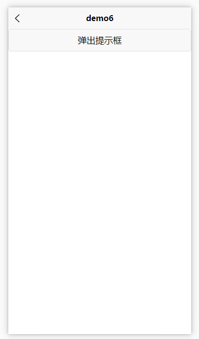
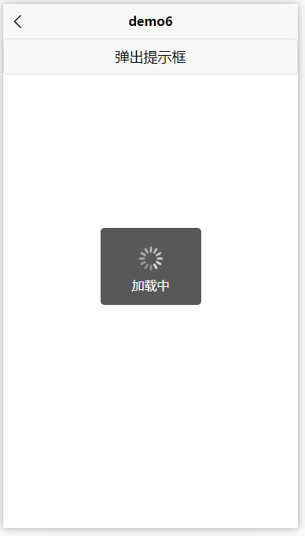
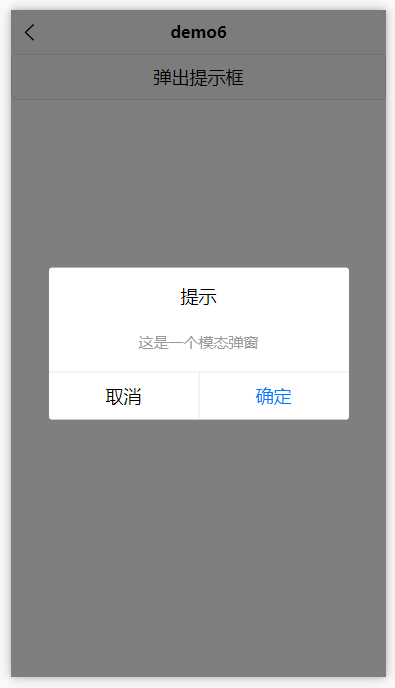
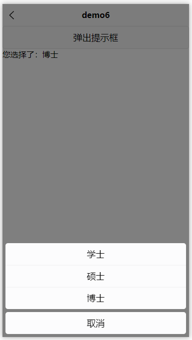

> [!NOTE]
>
> 本文的大部分内容源于[uni-app官方教程](https://uniapp.dcloud.net.cn/tutorial/)和[Vue官方教程](https://cn.vuejs.org/guide/introduction.html)的二次整合

# 0. uni-app

`uni-app` 是一个使用 [Vue.js](https://vuejs.org/) 开发所有前端应用的框架，开发者编写一套代码，可发布到iOS、Android、Web（响应式）、以及各种小程序（微信/支付宝/百度/头条/飞书/QQ/快手/钉钉/淘宝）、快应用等多个平台。（摘自[uni-app官网](https://uniapp.dcloud.net.cn/)的介绍）


在上手uni-app之前，推荐下载官方提供的[HBuilderX](https://www.dcloud.io/hbuilderx.html)以便后续开发，具体的教程可以参考[uni-app 快速上手](https://uniapp.dcloud.net.cn/quickstart-hx.html)。


一个uni-app工程，默认包含如下目录及文件（源自[工程简介 | uni-app官网](https://uniapp.dcloud.net.cn/tutorial/project.html)）：

```
┌─uniCloud              云空间目录，支付宝小程序云为uniCloud-alipay，阿里云为uniCloud-aliyun，腾讯云为uniCloud-tcb
│─components            符合vue组件规范的uni-app组件目录
│  └─comp-a.vue         可复用的a组件
├─utssdk                存放uts文件（已废弃）
├─pages                 业务页面文件存放的目录
│  ├─index
│  │  └─index.vue       index页面
│  └─list
│     └─list.vue        list页面
├─static                存放应用引用的本地静态资源（如图片、视频等）的目录，注意：静态资源都应存放于此目录
├─uni_modules           存放uni_module 
├─platforms             存放各平台专用页面的目录
├─nativeplugins         App原生语言插件 
├─nativeResources       App端原生资源目录
│  ├─android            Android原生资源目录 
|  └─ios                iOS原生资源目录 
├─hybrid                App端存放本地html文件的目录
├─wxcomponents          存放微信小程序、QQ小程序组件的目录
├─mycomponents          存放支付宝小程序组件的目录
├─swancomponents        存放百度小程序组件的目录
├─ttcomponents          存放抖音小程序、飞书小程序组件的目录
├─kscomponents          存放快手小程序组件的目录
├─jdcomponents          存放京东小程序组件的目录
├─unpackage             非工程代码，一般存放运行或发行的编译结果
├─main.js               Vue初始化入口文件
├─App.vue               应用配置，用来配置App全局样式以及监听 应用生命周期
├─pages.json            配置页面路由、导航条、选项卡等页面类信息
├─manifest.json         配置应用名称、appid、logo、版本等打包信息
├─AndroidManifest.xml   Android原生应用清单文件 
├─Info.plist            iOS原生应用配置文件 
└─uni.scss              内置的常用样式变量
```


`.vue`文件的结构

```vue
<!-- 负责定义组件的 HTML 结构 和 UI 模板 -->
<template>

</template>

<!-- 定义组件的 逻辑和数据 -->
<script setup>

</script>

<!-- 定义组件的 样式 -->
<style lang="scss">
	
</style>
```


在对`uni-app`有了基本的了解之后，将开始上手学习如何编写一个`uni-app`程序


# 1. 基本组件

## 1.1 视图容器

### 1. view

`view`是最基本的视图容器，可以用于包裹各种元素内容。


**常用属性：**

| 属性名           | 类型   | 默认值 | 说明                                                         |
| :--------------- | :----- | :----- | :----------------------------------------------------------- |
| hover-class      | String | none   | 指定按下去的样式类。当 hover-class="none" 时，没有点击态效果 |
| hover-start-time | Number | 50     | 按住后多久出现点击态，单位毫秒                               |
| hover-stay-time  | Number | 400    | 手指松开后点击态保留时间，单位毫秒                           |


### 2. scroll-view

`scroll-view`为可滚动视图区域，用于区域滚动。


**常用属性：**

| 属性名         | 类型    | 默认值 | 说明               |
| :------------- | :------ | :----- | :----------------- |
| scroll-x       | Boolean | false  | 允许横向滚动       |
| scroll-y       | Boolean | false  | 允许纵向滚动       |
| show-scrollbar | Boolean | false  | 控制是否出现滚动条 |


**横向滚动：**

当我们希望做出横向滚动的效果时，如果只配置`scroll-x`会发现并不能正常生效。此时，我们还需要使用css进行额外配置，如下所示：

```vue
<template>
	<view>
		<scroll-view scroll-x>
			<view class="box" style=" background-color: #f00;">1</view>
			<view class="box" style=" background-color: #0f0;">2</view>
			<view class="box" style=" background-color: #00f;">3</view>
			<view class="box" style=" background-color: #f0f;">4</view>
			<view class="box" style=" background-color: #ff0;">5</view>
			<view class="box" style=" background-color: #f00;">6</view>
			<view class="box" style=" background-color: #0f0;">7</view>
			<view class="box" style=" background-color: #00f;">8</view>
			<view class="box" style=" background-color: #f0f;">9</view>
			<view class="box" style=" background-color: #ff0;">10</view>
		</scroll-view>
	</view>
</template>

<style>
	scroll-view {
		width: 300px;
		height: 50px;
        /* 确保内容不换行 */
		white-space: nowrap;

		.box {
            /* 使得这些元素以行内块的形式显示 */
			display: inline-block;
		}
	}
</style>
```


### 3. swiper

`swiper`是滑块视图容器，一般用于左右滑动或上下滑动，比如banner轮播图。


**常用属性：**

| 属性名                 | 类型    | 默认值            | 说明                                                  |
| :--------------------- | :------ | :---------------- | :---------------------------------------------------- |
| indicator-dots         | Boolean | false             | 是否显示面板指示点                                    |
| indicator-color        | Color   | rgba(0, 0, 0, .3) | 指示点颜色                                            |
| indicator-active-color | Color   | #000000           | 当前选中的指示点颜色                                  |
| autoplay               | Boolean | false             | 是否自动切换                                          |
| interval               | Number  | 5000              | 自动切换时间间隔                                      |
| duration               | Number  | 500               | 滑动动画时长                                          |
| circular               | Boolean | false             | 是否采用衔接滑动，即播放到末尾后重新回到开头          |
| vertical               | Boolean | false             | 滑动方向是否为纵向                                    |
| previous-margin        | String  | 0px               | 前边距，可用于露出前一项的一小部分，接受 px 和 rpx 值 |
| next-margin            | String  | 0px               | 后边距，可用于露出后一项的一小部分，接受 px 和 rpx 值 |


当在`swiper`中显示内容时，可以使用`swiper-item`来进行显示，其宽高会自动设置为100%（相对于父组件）。

```vue
<template>
	<view>
		<swiper indicator-dots="" autoplay="" interval="3000">
			<swiper-item>
				<image src="../../../static/p1.jpg" mode="aspectFit"></image>
			</swiper-item>
			<swiper-item>
				<image src="../../../static/p2.jpg" mode="aspectFit"></image>
			</swiper-item>
			<swiper-item>
				<image src="../../../static/p3.jpg" mode="aspectFit"></image>
			</swiper-item>
			<swiper-item>
				<image src="../../../static/p4.jpg" mode="aspectFit"></image>
			</swiper-item>
		</swiper>
	</view>
</template>
```


## 1.2 基础内容

### 1. text

`text`是文本组件，用于包裹文本内容。


**常用属性：**

| 属性名      | 类型    | 默认值 | 说明         | 平台差异说明           |
| :---------- | :------ | :----- | :----------- | :--------------------- |
| selectable  | Boolean | false  | 文本是否可选 |                        |
| user-select | Boolean | false  | 文本是否可选 | 微信小程序             |
| space       | String  |        | 显示连续空格 | 钉钉小程序不支持       |
| decode      | Boolean | false  | 是否解码     | 百度、钉钉小程序不支持 |

**space 值说明**

| 值   | 说明                   |
| :--- | :--------------------- |
| ensp | 中文字符空格一半大小   |
| emsp | 中文字符空格大小       |
| nbsp | 根据字体设置的空格大小 |


## 1.3 表单组件

### 1. button

`button`为按钮组件。


**常用属性：**

| 属性名           | 类型    | 默认值       | 说明                                                         |
| :--------------- | :------ | :----------- | :----------------------------------------------------------- |
| size             | String  | default      | 按钮的大小（default：默认大小；mini：小尺寸）                |
| type             | String  | default      | 按钮的样式类型                                               |
| plain            | Boolean | false        | 按钮是否镂空，背景色透明                                     |
| disabled         | Boolean | false        | 是否禁用                                                     |
| loading          | Boolean | false        | 名称前是否带 loading 图标                                    |
| hover-class      | String  | button-hover | 指定按钮按下去的样式类。当 hover-class="none" 时，没有点击态效果 |
| hover-start-time | Number  | 20           | 按住后多久出现点击态，单位毫秒                               |
| hover-stay-time  | Number  | 70           | 手指松开后点击态保留时间，单位毫秒                           |


### 2. input

`input`是单行输入框。


**常用属性：**

| 属性名      | 类型        | 默认值 | 说明                                                         |
| :---------- | :---------- | :----- | :----------------------------------------------------------- |
| value       | String      |        | 输入框的初始内容                                             |
| type        | String      | text   | input 的类型 [有效值](https://uniapp.dcloud.net.cn/component/input.html#type) |
| password    | Boolean     | false  | 是否是密码类型                                               |
| placeholder | String      |        | 输入框为空时占位符                                           |
| disabled    | Boolean     | false  | 是否禁用                                                     |
| maxlength   | Number      | 140    | 最大输入长度，设置为 -1 的时候不限制最大长度                 |
| @focus      | EventHandle |        | 输入框聚焦时触发，event.detail = { value, height }，height 为键盘高度 |
| @blur       | EventHandle |        | 输入框失去焦点时触发，event.detail = {value: value}          |
| @confirm    | EventHandle |        | 点击完成按钮时触发（电脑端敲回车），event.detail = {value: value} |


**type 有效值**

| 值            | 说明               | 平台差异说明                                                 |
| :------------ | :----------------- | :----------------------------------------------------------- |
| text          | 文本输入键盘       |                                                              |
| number        | 数字输入键盘       | 均支持，App平台、H5平台 3.1.22 以下版本 vue 页面在 iOS 平台显示的键盘包含负数和小数。 |
| idcard        | 身份证输入键盘     | 微信、支付宝、百度、QQ小程序、快手小程序、京东小程序         |
| digit         | 带小数点的数字键盘 | 均支持，App平台、H5平台 vue 页面在 iOS 平台显示的键盘包含负数（原生键盘不支持负号）。 |
| tel           | 电话输入键盘       |                                                              |
| safe-password | 密码安全输入键盘   | 微信小程序                                                   |
| nickname      | 昵称输入键盘       | 微信小程序                                                   |


### 3. switch

`switch`是开关选择器。


**常用属性：**

| 属性名   | 类型        | 默认值 | 说明                                                         |
| :------- | :---------- | :----- | :----------------------------------------------------------- |
| checked  | Boolean     | false  | 是否选中                                                     |
| disabled | Boolean     | false  | 是否禁用                                                     |
| type     | String      | switch | 样式，有效值：switch, checkbox                               |
| color    | Color       |        | switch 的颜色，同 css 的 color                               |
| @change  | EventHandle |        | checked 改变时触发 change 事件，event.detail={ value:checked} |


### 4. checkbox

`checkbox-group`为多选框组，用于包裹一组`checkbox`


**常用属性：**

| 属性名  | 类型        | 说明                                                         |
| :------ | :---------- | :----------------------------------------------------------- |
| @change | EventHandle | `<checkbox-group>`中选中项发生改变是触发 change 事件，detail = {value:[选中的checkbox的value的数组]} |


`checkbox`为多选项。在1组check-group中可选择多个


**常用属性：**

| 属性名   | 类型    | 默认值 | 说明                                                         |
| :------- | :------ | :----- | :----------------------------------------------------------- |
| value    | String  |        | `<checkbox>` 标识，选中时触发 `<checkbox-group>` 的 change 事件，并携带 `<checkbox>` 的 value。 |
| disabled | Boolean | false  | 是否禁用                                                     |
| checked  | Boolean | false  | 当前是否选中，可用来设置默认选中                             |


**使用案例：**

```vue
<template>
	<view>
		<div>Checked names: {{ checkedNames }}</div>

		<checkbox-group @change="onChange">
			<checkbox value="Jack" /><text> Jack </text>
			<checkbox value="Mike" /><text> Mike </text>
			<checkbox value="John" /><text> John </text>
		</checkbox-group>
	</view>
</template>

<script setup>
	import {ref} from "vue"
    
	const checkedNames = ref([])

	const onChange = (e) => {
		checkedNames.value = e.detail.value;
	}
</script>
```


## 1.4 路由与页面跳转

### 1. navigator

`navigator`用于页面跳转，该组件类似HTML中的`<a>`组件，但只能跳转本地页面。目标页面必须在`pages.json`中注册。

**属性说明**

| 属性名      | 类型   | 默认值          | 说明                                                         |
| :---------- | :----- | :-------------- | :----------------------------------------------------------- |
| url         | String |                 | 应用内的跳转链接，值为相对路径或绝对路径，如："../first/first"，"/pages/first/first"，注意不能加 `.vue` 后缀 |
| open-type   | String | navigate        | 跳转方式                                                     |
| delta       | Number |                 | 当 open-type 为 'navigateBack' 时有效，表示回退的层数        |
| hover-class | String | navigator-hover | 指定点击时的样式类，当hover-class="none"时，没有点击态效果   |

**open-type 有效值**

| 值           | 说明                                   | 平台差异说明                     |
| :----------- | :------------------------------------- | :------------------------------- |
| navigate     | 对应 uni.navigateTo 的功能             |                                  |
| redirect     | 对应 uni.redirectTo 的功能             |                                  |
| switchTab    | 对应 uni.switchTab 的功能              |                                  |
| reLaunch     | 对应 uni.reLaunch 的功能               | 抖音小程序与飞书小程序不支持     |
| navigateBack | 对应 uni.navigateBack 的功能           |                                  |
| exit         | 退出小程序，target="miniProgram"时生效 | 微信2.1.0+、百度2.5.2+、QQ1.4.7+ |


## 1.5 媒体组件

### 1. image

`imgae`为图片组件，用于显示图片。


**常用属性：**

| 属性名    | 类型    | 默认值        | 说明                                                         | 平台差异说明                                   |
| :-------- | :------ | :------------ | :----------------------------------------------------------- | :--------------------------------------------- |
| src       | String  |               | 图片资源地址                                                 |                                                |
| mode      | String  | 'scaleToFill' | 图片裁剪、缩放的模式                                         |                                                |
| lazy-load | Boolean | false         | 图片懒加载。只针对page与scroll-view下的image有效             | 微信小程序、百度小程序、抖音小程序、飞书小程序 |
| webp      | boolean | false         | 在系统不支持webp的情况下是否单独启用webp。默认false，只支持网络资源。webp支持详见下面说明 | 微信小程序2.9.0                                |


**mode 有效值**

mode 有 14 种模式，其中 5 种是缩放模式，9 种是裁剪模式。

| 模式 | 值           | 说明                                                         |
| :--- | :----------- | :----------------------------------------------------------- |
| 缩放 | scaleToFill  | 不保持纵横比缩放图片，使图片的宽高完全拉伸至填满 image 元素  |
| 缩放 | aspectFit    | 保持纵横比缩放图片，使图片的长边能完全显示出来。也就是说，可以完整地将图片显示出来。 |
| 缩放 | aspectFill   | 保持纵横比缩放图片，只保证图片的短边能完全显示出来。也就是说，图片通常只在水平或垂直方向是完整的，另一个方向将会发生截取。 |
| 缩放 | widthFix     | 宽度不变，高度自动变化，保持原图宽高比不变                   |
| 缩放 | heightFix    | 高度不变，宽度自动变化，保持原图宽高比不变                   |
| 裁剪 | top          | 不缩放图片，只显示图片的顶部区域                             |
| 裁剪 | bottom       | 不缩放图片，只显示图片的底部区域                             |
| 裁剪 | center       | 不缩放图片，只显示图片的中间区域                             |
| 裁剪 | left         | 不缩放图片，只显示图片的左边区域                             |
| 裁剪 | right        | 不缩放图片，只显示图片的右边区域                             |
| 裁剪 | top left     | 不缩放图片，只显示图片的左上边区域                           |
| 裁剪 | top right    | 不缩放图片，只显示图片的右上边区域                           |
| 裁剪 | bottom left  | 不缩放图片，只显示图片的左下边区域                           |
| 裁剪 | bottom right | 不缩放图片，只显示图片的右下边区域                           |


# 2. vue3 语法

此部分内容基于[Vue 官方文档整合](https://cn.vuejs.org/guide/quick-start.html)

## 2.1 模板语法

### 1. 插值表达式

最基本的数据绑定形式是插值表达式，用于在视图中动态地显示变量、表达式或计算结果。插值表达式通过双大括号 `{{}}` 的形式嵌入在模板中。

```vue
<template>
	<view>
		{{name}}
	</view>
</template>

<script setup>
const name = "张三"
</script>

<style>

</style>
```


插值表达式支持以下内容：

1. 简单变量

   ```html
   <p>{{ message }}</p>
   ```

2. 复杂表达式

   ```html
   <p>{{ number1 + number2 }}</p>
   ```

3. 三元运算符

   ```html
   <p>{{ condition ? '是' : '否' }}</p>
   ```

4. 方法调用

   ```html
   <p>{{ greet('小明') }}</p>
   ```


### 2. Attribute 绑定

双大括号不能在 HTML attributes 中使用。想要响应式地绑定一个 attribute，应该使用`v-bind` 指令。

```vue
<div v-bind:id="dynamicId"></div>
```

因为 `v-bind` 非常常用，因此官方提供了特定的简写语法：

```vue
<div :id="dynamicId"></div>
```


使用举例：

```vue
<template>
	<view>
		<image :src = "url"></image>
	</view>
</template>
<script setup>
	let url = "https://img.yzcdn.cn/vant/cat.jpeg"
</script>
```


## 2.2 响应式基础

### 1. ref

在组合式 API 中，推荐使用`ref()`函数来声明响应式状态。值通过 `.value` 访问或修改。在模板中使用时会自动拆箱，不需要使用`.value`。

示例：

```vue
<template>
	<view>
		<text>{{name}}今年 {{age}} 岁了</text>
		<text>\n{{user.name}}今年 {{user.age}} 岁了</text>
	</view>
</template>

<script setup>
	import {
		ref
	} from "vue"

	const name = "张三"
	const age = ref(18)

	let user = ref({
		name: "李四",
		age: 20
	})

	setInterval(() => {
		age.value++
		user.value.age += 10
	}, 1000)
</script>

<style>

</style>
```


## 2.3 class与style绑定

### 1. 绑定HTML class

通过绑定绑定HTML class，我们可以实现动态渲染。并且，`:class` 指令也可以和一般的 `class` attribute 共存。举例来说，下面这样的状态：

```javascript
const isActive = ref(true)
const hasError = ref(false)
```

配合以下模板：

```html
<div
  class="static"
  :class="{ active: isActive, 'text-danger': hasError }"
></div>
```

渲染的结果会是：

```html
<div class="static active"></div>
```

当 `isActive` 或者 `hasError` 改变时，class 列表会随之更新。举例来说，如果 `hasError` 变为 `true`，class 列表也会变成 `"static active text-danger"`。


### 2. 绑定内联样式

`:style` 支持绑定 JavaScript 对象值，对应的是HTML元素的 `style` 属性:

```vue
<script>
    const activeColor = ref('red')
    const fontSize = ref(30)
</script>

<div :style="{ color: activeColor, fontSize: fontSize + 'px' }"></div>
```


尽管推荐使用 camelCase，但 `:style` 也支持 kebab-cased 形式的 CSS 属性 key (对应其 CSS 中的实际名称)，例如：

```html
<div :style="{ 'font-size': fontSize + 'px' }"></div>
```


为了使代码更加简洁，可可以直接绑定一个样式对象

```vue
<script>
    const styleObject = reactive({
      color: 'red',
      fontSize: '30px'
    })
</script>

<div :style="styleObject"></div>
```


## 2.4 事件处理

我们可以使用 `v-on` 指令 (简写为 `@`) 来监听 DOM 事件，并在事件触发时执行对应的 JavaScript。用法：`v-on:click="handler"` 或 `@click="handler"`。


下面给出一个结合多个组件的事件处理案例：

```vue
<template>
	<view>
		<switch @change="isChange"/>
		<button type=" primary" :loading="isLoading" :disabled="isLoading"> 按钮 </button>
	</view>
</template>

<script setup>
	import {
		ref
	} from "vue"

	const isLoading = ref(false)

	function isChange(e) {
		isLoading.value = e.detail.value
	}
</script>
```


## 2.5 条件渲染

`v-if` 指令用于条件性地渲染一块内容。这块内容只会在指令的表达式返回真值时才被渲染。`v-else-if` 提供的是相应于 `v-if` 的`else if`区块。`v-else`则是对应的`else`区块。


使用案例：

```vue
<div v-if="type === 'A'">
  A
</div>
<div v-else-if="type === 'B'">
  B
</div>
<div v-else-if="type === 'C'">
  C
</div>
<div v-else>
  Not A/B/C
</div>
```


因为 `v-if` 是一个指令，他必须依附于某个元素。但如果我们想要切换不止一个元素呢？在这种情况下我们可以在一个 `<template>` 元素上使用 `v-if`，这只是一个不可见的包装器元素，最后渲染的结果并不会包含这个 `<template>` 元素。

```vue
<template v-if="ok">
  <h1>Title</h1>
  <p>Paragraph 1</p>
  <p>Paragraph 2</p>
</template>
```


另一个可以用来按条件显示一个元素的指令是 `v-show`。其用法基本一样：

```vue
<h1 v-show="ok">Hello!</h1>
```

不同之处在于 `v-show` 会在 DOM 渲染中保留该元素；`v-show` 仅切换了该元素上名为 `display` 的 CSS 属性。并且`v-show` 不支持在 `<template>` 元素上使用，也不能和 `v-else` 搭配使用。

​	

## 2.6 列表渲染

我们可以使用 `v-for` 指令基于一个数组来渲染一个列表。`v-for` 指令的值需要使用 `item in items` 形式的特殊语法，其中 `items` 是源数据的数组，而 `item` 是迭代项的别名， `index`是对应元素的下标：

```vue
<template>
	<view class="">
		<text v-for="(item, index) in peoples" :key="item.id">
			{{ item.id }}: {{ item.name }} 今年 {{ item.age }} \n
		</text>
	</view>
</template>

<script setup>
	import {
		ref
	} from "vue";

	const peoples = ref([{
			id: 1,
			name: "张三",
			age: 18
		},
		{
			id: 2,
			name: "李四",
			age: 20
		},
		{
			id: 3,
			name: "王五",
			age: 22
		}
	])
</script>

<style lang="scss" scoped>

</style>
```

> [!NOTE]
>
> key最好使用数组中元素的唯一值而不要直接使用index索引，以免出现问题


## 2.7 表单输入绑定

在前端处理表单时，我们常常需要将表单输入框的内容同步给 JavaScript 中相应的变量。

```vue
<input
  :value="text"
  @input="event => text = event.target.value">
```

`v-model` 指令提供了一种简化的绑定方式：

```vue
<input v-model="text">
```


我们也可以将多个复选框绑定到同一个数组或集合：

```vue
<template>
    <div>Checked names: {{ checkedNames }}</div>

    <input type="checkbox" id="jack" value="Jack" v-model="checkedNames" />
    <label for="jack">Jack</label>

    <input type="checkbox" id="john" value="John" v-model="checkedNames" />
    <label for="john">John</label>

    <input type="checkbox" id="mike" value="Mike" v-model="checkedNames" />
    <label for="mike">Mike</label>
</template>

<script>
    const checkedNames = ref([])
</script>
```


## 2.8 计算属性

如果在模板中写太多逻辑，会让模板变得臃肿，难以维护。例如下面这个例子：

```vue
<template>
    <p>Has published books:</p>
    <span>{{ author.books.length > 0 ? 'Yes' : 'No' }}</span>
</template>

<script>
    const author = reactive({
      name: 'John Doe',
      books: [
        'Vue 2 - Advanced Guide',
        'Vue 3 - Basic Guide',
        'Vue 4 - The Mystery'
      ]
    })
</script>
```


因此官方推荐使用计算属性来描述依赖响应式状态的复杂逻辑。这是重构后的示例：

```vue
<script setup>
import { reactive, computed } from 'vue'

const author = reactive({
  name: 'John Doe',
  books: [
    'Vue 2 - Advanced Guide',
    'Vue 3 - Basic Guide',
    'Vue 4 - The Mystery'
  ]
})

// 一个计算属性 ref
const publishedBooksMessage = computed(() => {
  return author.books.length > 0 ? 'Yes' : 'No'
})
</script>

<template>
  <p>Has published books:</p>
  <span>{{ publishedBooksMessage }}</span>
</template>
```


并且由于计算属性值会基于其响应式依赖被缓存，一个计算属性仅会在其响应式依赖更新时才重新计算。这意味着只要 `author.books` 不改变，无论多少次访问 `publishedBooksMessage` 都会立即返回先前的计算结果，而不用重复执行 getter 函数。


## 2.9 监听器

在组合式 API 中，我们可以使用`watch`函数在每次响应式状态发生变化时触发回调函数。`watch` 的第一个参数可以是不同形式的“数据源”：它可以是一个 `ref` (包括计算属性)、一个响应式对象、一个 getter 函数、或多个数据源组成的数组。

```javascript
const x = ref(0)
const y = ref(0)

// 单个 ref
watch(x, (newX) => {
  console.log(`x is ${newX}`)
})

// getter 函数
watch(
  () => x.value + y.value,
  (sum) => {
    console.log(`sum of x + y is: ${sum}`)
  }
)

// 多个来源组成的数组
watch([x, () => y.value], ([newX, newY]) => {
  console.log(`x is ${newX} and y is ${newY}`)
})
```


**深层监听器**

直接给 `watch()` 传入一个响应式对象，会隐式地创建一个深层侦听器——该回调函数在所有嵌套的变更时都会被触发：

```javascript
const obj = reactive({ count: 0 })

watch(obj, (newValue, oldValue) => {
  // 在嵌套的属性变更时触发
  // 注意：`newValue` 此处和 `oldValue` 是相等的
  // 因为它们是同一个对象！
})

obj.count++
```


或者通过显式指定的方式，将其强制转成深层侦听器：

```javascript
watch(
  () => state.someObject,
  (newValue, oldValue) => {
    // 注意：`newValue` 此处和 `oldValue` 是相等的
    // *除非* state.someObject 被整个替换了
  },
  { deep: true }
)
```


# 3. 组件

组件是 Vue（或其他现代框架）中的核心概念之一，表示一个独立、可复用的 UI 单元。它可以包含 HTML 模板、JavaScript 逻辑 和 CSS 样式，用于构建页面的功能模块。在开发中，我们通常将页面拆分为多个组件，每个组件负责独立的功能或展示特定的内容，比如按钮、表单、导航栏等。


## 3.1 注册组件

在uni-app工程根目录下的 `components` 目录，创建并存放自定义组件：

```
	│─components            	符合vue组件规范的uni-app组件目录
	│  └─componentA         	符合‘components/组件名称/组件名称.vue’目录结构，easycom方式可直接使用组件
	│  		└─componentA.vue    可复用的componentA组件
	│  └─component-a.vue      可复用的component-a组件
```

在注册一个组件的时候，我们始终需要给它一个名字。 定义组件名的方式有两种：

- **使用 kebab-case**：当使用 `kebab-case` (短横线分隔命名) 定义一个组件时，你也必须在引用这个自定义元素时使用 `kebab-case`，例如 `<my-component-name>`。

- **使用 PascalCase**：当使用 `PascalCase` (首字母大写命名) 定义一个组件时，你在引用这个自定义元素时两种命名法都可以使用。 也就是说 `<my-component-name>` 和 `<MyComponentName>` 都是可接受的。


**全局注册：**

`uni-app` 支持配置全局组件，需在 `main.js` 里进行全局注册，注册后就可在所有页面里使用该组件。

1. `main.js` 里进行全局导入和注册

```js
	import App from './App'
	import {createSSRApp} from 'vue'
	//引入组件
	import myComponent from './components/my-component/my-component.vue'
	export function createApp() {
		const app = createSSRApp(App)
		//调用app.component方法全局注册组件
		app.component('my-component', myComponent)
		return {
			app
		}
	}
```

2. `index.vue` 里可直接使用组件

```html
	<template>
		<view>
			<my-component></my-component>
		</view>
	</template>
```


**局部注册：**

1. **传统vue规范：** 在 index.vue 页面中，通过 `import` 方式引入组件 ，在 `components` 选项中定义你想要使用的组件。

   对于 `components` 对象中的每个 `property` 来说，其 `property` 名就是自定义元素的名字，其 `property` 值就是这个组件的选项对象。

   在对象中放一个类似 `uniBadge` 的变量名其实是 `uniBadge : uniBadge` 的缩写，即这个变量名同时是：

   - 用在模板中的自定义元素的名称
   - 包含了这个组件选项的变量名(仅支持驼峰法命名)

```html
	<!-- 在index.vue引入 uni-badge 组件-->
	<template>
		<view>
			<uni-badge text="1"></uni-badge><!-- 3.使用组件 -->
		</view>
	</template>
	<script>
		import uniBadge from '@/components/uni-badge/uni-badge.vue';//1.导入组件（这步属于传统vue规范，但在uni-app的easycom下可以省略这步）
		export default {
			components:{uniBadge }//2.注册组件（这步属于传统vue规范，但在uni-app的easycom下可以省略这步）
		}
	</script>
```

2. **通过uni-app的easycom：** 将组件引入精简为一步。只要组件安装在项目的 `components` 目录下，并符合 `components/组件名称/组件名称.vue` 目录结构。就可以不用引用、注册，直接在页面中使用。

```html
	<!-- 在index.vue引入 uni-badge 组件-->
	<template>
		<view>
			<uni-badge text="1"></uni-badge><!-- 3.使用组件 -->
		</view>
	</template>
	<script>
		// 这里不用import引入，也不需要在components内注册uni-badge组件。template里就可以直接用
		export default {
			data() {
				return {
				}
			}
		}
	</script>
```


## 3.2 props传值

`props` 可以是数组或对象，用于接收来自父组件的数据。`props` 可以是简单的数组，或者使用对象作为替代，对象允许配置高级选项，如类型检测、自定义验证和设置默认值。

| 选项      | 类型                                                         | 说明                                                         |
| --------- | ------------------------------------------------------------ | ------------------------------------------------------------ |
| type      | `String` 、 `Number` 、 `Boolean` 、 `Array` 、 `Object` 、 `Date` 、 `Function` 、 `Symbol` ，任何自定义构造函数、或上述内容组成的数组 | 会检查一个 `prop` 是否是给定的类型，否则抛出警告，复杂数据类型需要通过 `PropType` 标记类型。 |
| default   | any                                                          | 为该 `prop` 指定一个默认值。如果该 `prop` 没有被传入，则换做用这个值。对象或数组的默认值必须从一个工厂函数返回。 |
| required  | Boolean                                                      | 定义该 `prop` 是否是必填项。                                 |
| validator | Function                                                     | 自定义验证函数会将该 `prop` 的值作为唯一的参数代入。在非生产环境下，如果该函数返回一个 `false` 的值 (也就是验证失败)，一个控制台警告将会被抛出。 |

**使用示例：**

```vue
<template>
	<view class="user-info">
		<image :src="user.avatar" mode="aspectFill"></image>
		<text> 用户名：{{user.name}} </text>
	</view>
</template>

<script setup>
	defineProps({
		user: {
			type: Object,
			default () {
				return {
					name: "游客",
					avatar: "../../../static/avatar.jpg"
				}
			}
		}

	});
</script>

<style lang="scss" scoped>
	.user-info {
		display: flex;
		align-items: center;
		flex-direction: column;
		padding: 10px;
		background-color: #eee;
		border-bottom: 1px solid #f0f0f0;
		margin: 10px;
	}

	.user-info image {
		width: 100px;
		height: 100px;
		margin: 10px 0;

		border-radius: 50%;
	}

	.user-info text {
		font-size: 16px;
	}
</style>
```


## 3.3 插槽

**插槽内容**

插槽（Slot） 是 Vue 提供的一种机制，允许父组件向子组件传递自定义内容，并在子组件的特定位置进行渲染。插槽的主要用途是让子组件更加灵活和通用，适用于需要动态内容的场景。

它允许你像这样合成组件：

```html
	<todo-button>
		Add todo
	</todo-button>
```

然后在 `todo-button` 的模板中，你可能有：

```html
	<!-- todo-button 组件模板 -->
	<button class="btn-primary">
		<slot></slot>
	</button>
```

当组件渲染的时候，将会被替换为`“Add Todo”`。

```html
	<!-- 渲染 HTML -->
	<button class="btn-primary">
		Add todo
	</button>
```


**后备内容**

有时为一个插槽设置具体的后备 (也就是默认的) 内容是很有用的，它只会在没有提供内容的时候被渲染。例如在一个 `submit-button` 组件中，我们可能希望这个 `button` 内绝大多数情况下都渲染文本`“Submit”`。为了将`“Submit”`作为后备内容，我们可以将它放在 `slot` 标签内：

```html
	<button type="submit">
		<slot>Submit</slot>
	</button>
```

现在当我在一个父级组件中使用 `submit-button` 并且不提供任何插槽内容时，后备内容“Submit”将会被渲染：

```html
    <button type="submit">
        Submit
    </button>
```

但是如果我们提供内容：

```html
	<submit-button>
		Save
	</submit-button>
```

则这个提供的内容将会被渲染从而取代后备内容：

```html
	<button type="submit">
		Save
	</button>
```


**具名插槽**

有时我们需要多个插槽，对于这样的情况，`slot` 元素有一个特殊的 `attribute：name`。这个 `attribute` 可以用来定义额外的插槽：

```html
<view class="container">
	<header>
		<slot name="header"></slot>
	</header>
	<main>
		<slot></slot>
	</main>
	<footer>
		<slot name="footer"></slot>
	</footer>
</view>
```

一个不带 `name` 的 `slot` 出口会带有隐含的名字`default`。在向具名插槽提供内容的时候，我们可以在一个 `template` 元素上使用 `v-slot` 指令，并以 `v-slot` 的参数的形式提供其名称：

```html
<template>
	<view>
	<!-- 父组件使用子组件`<base-layout>`，节点上使用v-slot特性： -->
		<base-layout>
			<template v-slot:header>
				<view>Here might be a page title</view>
			</template>
			<template v-slot:default>
				<view>A paragraph for the main content.</view>
				<view>And another one.</view>
			</template>
			<template v-slot:footer>
				<view>Here's some contact info</view>
			</template>
		</base-layout>
	</view>
</template>
```

跟 `v-on` 和 `v-bind` 一样，`v-slot` 也有缩写，即把参数之前的所有内容 (v-slot:) 替换为字符 **#**。例如 `v-slot:header` 可以被重写为 `#header`：

```html
<base-layout>
	<template #header>
		<view>Here might be a page title</view>
	</template>

	<template #default>
		<view>A paragraph for the main content.</view>
		<view>And another one.</view>
	</template>

	<template #footer>
		<view>Here's some contact info</view>
	</template>
</base-layout>
```


## 3.4 emit

`emit` 是一种用于实现父子组件通信的机制。通过 `emit`，子组件可以向父组件发送事件，父组件可以监听这些事件并作出响应。


**示例：**

子组件代码

```vue
<template>
  <button @click="handleClick">点击我</button>
</template>

<script setup>
const emit = defineEmits(['customEvent']); // 定义事件

const handleClick = () => {
  emit('customEvent', 'Hello from child!'); // 触发事件，并传递数据
};
</script>
```


父组件代码

```vue
<template>
  <ChildComponent @customEvent="handleEvent" />
</template>

<script setup>
import ChildComponent from './ChildComponent.vue';

const handleEvent = (message) => {
  console.log('父组件接收到消息:', message);
};
</script>
```


## 3.5 expose

在 Vue 3 的 `<script setup>` 语法中，`defineExpose` 用于显式地向父组件暴露子组件的属性或方法。这让父组件可以通过 `ref` 访问子组件中的指定内容。


**使用示例：**

子组件

```vue
<template>
  <button @click="increment">点击增加</button>
</template>

<script setup>
import { ref } from 'vue';

const count = ref(0);

const increment = () => {
  count.value++;
};

// 显式暴露 count 和 increment 给父组件
defineExpose({
  count,
  increment,
});
</script>
```

父组件

```vue
<template>
  <ChildComponent ref="childRef" />
  <button @click="logCount">获取子组件计数</button>
</template>

<script setup>
import { ref } from 'vue';
import ChildComponent from './ChildComponent.vue';

const childRef = ref(null);

const logCount = () => {
  console.log('子组件计数值:', childRef.value.count); // 访问子组件的 count
  childRef.value.increment(); // 调用子组件的方法
};
</script>
```


## 3.6 组件生命周期

Vue 3 中的生命周期指组件从创建到销毁的完整过程，包括初始化、渲染、更新、销毁等阶段。Vue 提供了一系列生命周期钩子函数，让开发者可以在特定的时刻执行逻辑。


### 生命周期阶段

1. **创建阶段**
   组件实例初始化，各种属性如 `props`、`data` 等被设置。
2. **挂载阶段**
   模板编译为虚拟 DOM 并插入真实 DOM。
3. **更新阶段**
   当响应式数据发生变化时，组件会重新渲染并更新 DOM。
4. **销毁阶段**
   组件实例被销毁，清理资源。


### 生命周期钩子函数

**创建阶段**

| 钩子函数        | 说明                                                         |
| --------------- | ------------------------------------------------------------ |
| `setup()`       | 组件初始化时调用。组合式 API 的入口点，定义响应式数据、方法等。 |
| `onBeforeMount` | 在组件挂载到 DOM 之前调用。适合执行初始化逻辑，但此时无 DOM 结构。 |
| `onMounted`     | 组件挂载完成后调用。此时 DOM 可用，常用于操作 DOM 或发送请求。 |

**更新阶段**

| 钩子函数         | 说明                                          |
| ---------------- | --------------------------------------------- |
| `onBeforeUpdate` | 组件更新前调用，数据已变化，但 DOM 尚未更新。 |
| `onUpdated`      | 组件更新完成后调用，此时 DOM 已更新。         |

**销毁阶段**

| 钩子函数          | 说明                                           |
| ----------------- | ---------------------------------------------- |
| `onBeforeUnmount` | 组件销毁前调用，适合清理资源。                 |
| `onUnmounted`     | 组件销毁后调用，所有数据和事件监听器已被移除。 |


以下是一个组件示例，展示了常用的生命周期钩子函数：

```vue
<template>
  <div>
    <p>计数：{{ count }}</p>
    <button @click="increment">增加</button>
  </div>
</template>

<script setup>
import { ref, onMounted, onUpdated, onUnmounted } from 'vue';

const count = ref(0);

const increment = () => {
  count.value++;
};

// 在组件挂载时执行
onMounted(() => {
  console.log('组件已挂载');
});

// 在组件更新时执行
onUpdated(() => {
  console.log('组件已更新，当前计数：', count.value);
});

// 在组件销毁时执行
onUnmounted(() => {
  console.log('组件已销毁');
});
</script>
```


# 4. 页面相关

## 4.1 css语法

### 1. rpx

`rpx` 是 **uni-app** 中用于页面布局的一种响应式单位，全称为 “responsive pixel”，即“响应式像素”。它通过动态计算屏幕宽度，自动适配不同设备，特别适用于多屏适配需求的场景。

`rpx` 会根据设备屏幕宽度的不同而自动调整实际的像素值。例如：

- 在屏幕宽度为 750px 的设备上，1rpx 等于 1px。
- 在屏幕宽度为 375px 的设备上，1rpx 等于 0.5px。


### 2. 样式导入

我们可以将样式等文件单独抽离出来成一个文件，当需要使用的时候再进行导入。可以在根目录下创建一个`common`文件夹，用于存储这些文件，这样只有在使用到的时候这些文件才会被打包进去，从而节省空间。

```
─common              
  └─css		存储css文件
  └─scss		存储scss文件
  └─js			存储js文件
```


**样式引入：**

```css
<style lang="scss">
@import  "@/common/css/my.css";
</style>
```


**scss:**

在根目录中的`uni.scss`文件中，定义了一系列的常用样式变量。同样的，我们可以在里面导入我们自定义的变量来使用

```scss
@import "@/common/scss/my.scss";
```


## 4.2 pages.json 页面路由

### 1. globalStyle

用于设置应用的状态栏、导航条、标题、窗口背景色等。

**常用属性：**

| 属性                         | 类型     | 默认值  | 描述                                                         |
| :--------------------------- | :------- | :------ | :----------------------------------------------------------- |
| navigationBarBackgroundColor | HexColor | #F8F8F8 | 导航栏背景颜色（同状态栏背景色）                             |
| navigationBarTextStyle       | String   | black   | 导航栏标题颜色及状态栏前景颜色，仅支持 black/white           |
| navigationBarTitleText       | String   |         | 导航栏标题文字内容                                           |
| navigationStyle              | String   | default | 导航栏样式，仅支持 default/custom。custom即取消默认的原生导航栏 |
| enablePullDownRefresh        | Boolean  | false   | 是否开启下拉刷新，详见[页面生命周期](https://uniapp.dcloud.net.cn/tutorial/page.html#lifecycle)。 |
| onReachBottomDistance        | Number   | 50      | 页面上拉触底事件触发时距页面底部距离，单位只支持px，详见[页面生命周期](https://uniapp.dcloud.net.cn/tutorial/page.html#lifecycle) |


### 2. tabBar

如果应用是一个多 tab 应用，可以通过 tabBar 配置项指定一级导航栏，以及 tab 切换时显示的对应页。

**常用属性：**

| 属性            | 类型     | 必填 | 默认值 | 描述                                                 |
| :-------------- | :------- | :--- | :----- | :--------------------------------------------------- |
| color           | HexColor | 是   |        | tab 上的文字默认颜色                                 |
| selectedColor   | HexColor | 是   |        | tab 上的文字选中时的颜色                             |
| backgroundColor | HexColor | 是   |        | tab 的背景色                                         |
| list            | Array    | 是   |        | tab 的列表，详见 list 属性说明，最少2个、最多5个 tab |
| fontSize        | String   | 否   | 10px   | 文字默认大小                                         |


其中 list 接收一个数组，数组中的每个项都是一个对象，其属性值如下：

| 属性             | 类型   | 必填 | 说明                                                         |
| :--------------- | :----- | :--- | :----------------------------------------------------------- |
| pagePath         | String | 是   | 页面路径，必须在 pages 中先定义                              |
| text             | String | 是   | tab 上按钮文字，在 App 和 H5 平台为非必填。例如中间可放一个没有文字的+号图标 |
| iconPath         | String | 否   | 图片路径，icon 大小限制为40kb，建议尺寸为 81px * 81px，当 position 为 top 时，此参数无效，不支持网络图片，不支持字体图标 |
| selectedIconPath | String | 否   | 选中时的图片路径，icon 大小限制为40kb，建议尺寸为 81px * 81px ，当 position 为 top 时，此参数无效 |


## 4.3 交互反馈

### 1. showToast

`uni.showToast(OBJECT)`用于显示消息提示框。

| 参数     | 类型    | 必填 | 说明                                        |
| :------- | :------ | :--- | :------------------------------------------ |
| title    | String  | 是   | 提示的内容，长度与 icon 取值有关。          |
| icon     | String  | 否   | 图标，有效值详见下方说明，默认：success。   |
| image    | String  | 否   | 自定义图标的本地路径（app端暂不支持gif）    |
| mask     | Boolean | 否   | 是否显示透明蒙层，防止触摸穿透，默认：false |
| duration | Number  | 否   | 提示的延迟时间，单位毫秒，默认：1500        |


**使用示例：**

```vue
<template>
    <view class="">
		<button @click="onClick()">弹出提示框</button>
    </view>
</template>

<script setup>
	function onClick() {
		uni.showToast({
			title: 'Hello World',
			icon: 'success'
		})
	}
</script>
```




### 2. showLoading

`uni.showLoading(OBJECT)`用于显示 loading 提示框, 需主动调用 `uni.hideLoading` 才能关闭提示框。

| 参数     | 类型     | 必填 | 说明                                             |
| :------- | :------- | :--- | :----------------------------------------------- |
| title    | String   | 是   | 提示的文字内容，显示在loading的下方              |
| mask     | Boolean  | 否   | 是否显示透明蒙层，防止触摸穿透，默认：false      |
| success  | Function | 否   | 接口调用成功的回调函数                           |
| fail     | Function | 否   | 接口调用失败的回调函数                           |
| complete | Function | 否   | 接口调用结束的回调函数（调用成功、失败都会执行） |

**使用示例：**

```vue
<template>
	<view class="">
		<button @click="onClick()">弹出提示框</button>
	</view>
</template>

<script setup>
	function onClick() {
		uni.showLoading({
			title: '加载中'
		})
	}
</script>
```




### 3. showModal

`uni.showModal(OBJECT)`显示模态弹窗，可以只有一个确定按钮，也可以同时有确定和取消按钮。

| 参数            | 类型     | 必填 | 说明                                                         |
| :-------------- | :------- | :--- | :----------------------------------------------------------- |
| title           | String   | 否   | 提示的标题                                                   |
| content         | String   | 否   | 提示的内容                                                   |
| showCancel      | Boolean  | 否   | 是否显示取消按钮，默认为 true                                |
| cancelText      | String   | 否   | 取消按钮的文字，默认为"取消"                                 |
| cancelColor     | HexColor | 否   | 取消按钮的文字颜色，默认为"#000000"                          |
| confirmText     | String   | 否   | 确定按钮的文字，默认为"确定"                                 |
| confirmColor    | HexColor | 否   | 确定按钮的文字颜色，H5平台默认为"#007aff"，微信小程序平台默认为"#576B95"，百度小程序平台默认为"#3c76ff" |
| editable        | Boolean  | 否   | 是否显示输入框                                               |
| placeholderText | String   | 否   | 显示输入框时的提示文本                                       |
| success         | Function | 否   | 接口调用成功的回调函数                                       |
| fail            | Function | 否   | 接口调用失败的回调函数                                       |
| complete        | Function | 否   | 接口调用结束的回调函数（调用成功、失败都会执行）             |


**使用示例：**

```vue
<template>
	<view class="">
		<button @click="onClick()">弹出提示框</button>
	</view>
</template>

<script setup>
	function onClick() {
		uni.showModal({
			title: '提示',
			content: '这是一个模态弹窗',
			showCancel: true,
			cancelText: '取消',
			confirmText: '确定',
			success: function(res) {
				if (res.confirm) {
					console.log('用户点击确定');
				} else if (res.cancel) {
					console.log('用户点击取消');
				}
			}
		})
	}
</script>
```




### 4. showActionSheet

`uni.showActionSheet(OBJECT)`用于生成从底部向上弹出操作菜单。


**OBJECT参数说明**

| 参数     | 类型            | 必填 | 说明                                             |
| :------- | :-------------- | :--- | :----------------------------------------------- |
| title    | String          | 否   | 菜单标题                                         |
| itemList | `Array<String>` | 是   | 按钮的文字数组                                   |
| success  | Function        | 否   | 接口调用成功的回调函数，详见返回参数说明         |
| fail     | Function        | 否   | 接口调用失败的回调函数                           |
| complete | Function        | 否   | 接口调用结束的回调函数（调用成功、失败都会执行） |


**使用示例：**

```vue
<template>
	<view class="">
		<button @click="onClick()">弹出提示框</button>
		<text>您选择了：{{selected}}</text>
	</view>
</template>

<script setup>
	let list = ["学士", "硕士", "博士"]
	let selected = ref("")
	function onClick() {
		uni.showActionSheet({
			itemList: list,
			success: function(res) {
				console.log('选中了第' + (res.tapIndex + 1) + '个按钮');
				console.log(list[res.tapIndex]);
				selected.value = list[res.tapIndex]
			}
		});
	}
</script>
```




## 4.4 设置导航条

`uni.setNavigationBarTitle(OBJECT)`动态设置当前页面的标题。

| 参数     | 类型     | 必填 | 说明                                             |
| :------- | :------- | :--- | :----------------------------------------------- |
| title    | String   | 是   | 页面标题                                         |
| success  | Function | 否   | 接口调用成功的回调函数                           |
| fail     | Function | 否   | 接口调用失败的回调函数                           |
| complete | Function | 否   | 接口调用结束的回调函数（调用成功、失败都会执行） |


**使用示例：**

```javascript
uni.setNavigationBarTitle({
	title: '新的标题'
});
```


## 4.5 设置TabBar

### 1. tabBar文本

`uni.setTabBarBadge(OBJECT)`为 tabBar 某一项的右上角添加文本。

| 参数     | 类型     | 必填 | 说明                                             |
| :------- | :------- | :--- | :----------------------------------------------- |
| index    | Number   | 是   | tabBar的哪一项，从左边算起                       |
| text     | String   | 是   | 显示的文本，不超过 3 个半角字符                  |
| success  | Function | 否   | 接口调用成功的回调函数                           |
| fail     | Function | 否   | 接口调用失败的回调函数                           |
| complete | Function | 否   | 接口调用结束的回调函数（调用成功、失败都会执行） |

**使用示例：**

```vue
uni.setTabBarBadge({
  index: 0,
  text: '1'
})
```


`uni.removeTabBarBadge(OBJECT)`移除 tabBar 某一项右上角的文本。

| 参数     | 类型     | 必填 | 说明                                             |
| :------- | :------- | :--- | :----------------------------------------------- |
| index    | Number   | 是   | tabBar的哪一项，从左边算起                       |
| success  | Function | 否   | 接口调用成功的回调函数                           |
| fail     | Function | 否   | 接口调用失败的回调函数                           |
| complete | Function | 否   | 接口调用结束的回调函数（调用成功、失败都会执行） |


### 2. tabBar红点

`uni.showTabBarRedDot(OBJECT)`显示 tabBar 某一项的右上角的红点。

| 参数     | 类型     | 必填 | 说明                                             |
| :------- | :------- | :--- | :----------------------------------------------- |
| index    | Number   | 是   | tabBar的哪一项，从左边算起                       |
| success  | Function | 否   | 接口调用成功的回调函数                           |
| fail     | Function | 否   | 接口调用失败的回调函数                           |
| complete | Function | 否   | 接口调用结束的回调函数（调用成功、失败都会执行） |


`uni.hideTabBarRedDot(OBJECT)`隐藏 tabBar 某一项的右上角的红点。

| 参数     | 类型     | 必填 | 说明                                             |
| :------- | :------- | :--- | :----------------------------------------------- |
| index    | Number   | 是   | tabBar的哪一项，从左边算起                       |
| success  | Function | 否   | 接口调用成功的回调函数                           |
| fail     | Function | 否   | 接口调用失败的回调函数                           |
| complete | Function | 否   | 接口调用结束的回调函数（调用成功、失败都会执行） |


## 4.6 下拉刷新

在 js 中定义 `onPullDownRefresh` 处理函数（和`onLoad`等生命周期函数同级），监听该页面用户下拉刷新事件。

- 需要在 pages.json 里，找到的当前页面的pages节点，并在 style 选项中开启 enablePullDownRefresh。
- 当处理完数据刷新后，`uni.stopPullDownRefresh` 可以停止当前页面的下拉刷新。


`uni.startPullDownRefresh(OBJECT)`：开始下拉刷新，调用后触发下拉刷新动画，效果与用户手动下拉刷新一致。

| 参数名   | 类型     | 必填 | 说明                                             |
| :------- | :------- | :--- | :----------------------------------------------- |
| success  | Function | 否   | 接口调用成功的回调                               |
| fail     | Function | 否   | 接口调用失败的回调函数                           |
| complete | Function | 否   | 接口调用结束的回调函数（调用成功、失败都会执行） |


## 4.7 跳转和路由

- `uni.navigateTo(OBJECT)`：保留当前页面，跳转到应用内的某个页面，使用uni.navigateBack可以返回到原页面。
- `uni.redirectTo(OBJECT)`：关闭当前页面，跳转到应用内的某个页面。
- `uni.reLaunch(OBJECT)`：关闭所有页面，打开到应用内的某个页面。
- `uni.switchTab(OBJECT)`：跳转到 tabBar 页面，并关闭其他所有非 tabBar 页面。


## 4.8 数据缓存

### 1. **`uni.setStorage` 和 `uni.getStorage`**

- **`uni.setStorage`**: 用于将数据存储到本地缓存中。
- **`uni.getStorage`**: 用于从本地缓存中获取数据。

```
// 存储数据
uni.setStorage({
    key: 'key_name',
    data: 'value',
    success: function () {
        console.log('存储成功');
    }
});

// 获取数据
uni.getStorage({
    key: 'key_name',
    success: function (res) {
        console.log('获取到的数据:', res.data);
    }
});
```


### 2. **`uni.setStorageSync` 和 `uni.getStorageSync`**

- **`uni.setStorageSync`**: 同步方式将数据存储到本地缓存中。
- **`uni.getStorageSync`**: 同步方式从本地缓存中获取数据。


**注意事项：**

- 存储的数据可以是任意类型，但最终会以字符串形式存储。
- 存储的数据大小有限制，通常为 10MB 左右，具体限制因平台而异。
- 存储的数据在应用卸载后会被清除。
- 存储的数据是明文存储的，因此不建议存储敏感信息（如密码、token 等）。

```javascript
// 存储数据
try {
    uni.setStorageSync('key_name', 'value');
    console.log('存储成功');
} catch (e) {
    console.error('存储失败:', e);
}

// 获取数据
try {
    const value = uni.getStorageSync('key_name');
    console.log('获取到的数据:', value);
} catch (e) {
    console.error('获取失败:', e);
}
```


### 3. **`uni.removeStorage` 和 `uni.removeStorageSync`**

- **`uni.removeStorage`**: 异步方式从本地缓存中移除指定 key 的数据。
- **`uni.removeStorageSync`**: 同步方式从本地缓存中移除指定 key 的数据。

```javascript
// 异步移除数据
uni.removeStorage({
    key: 'key_name',
    success: function () {
        console.log('移除成功');
    }
});

// 同步移除数据
try {
    uni.removeStorageSync('key_name');
    console.log('移除成功');
} catch (e) {
    console.error('移除失败:', e);
}
```


### 4. **`uni.clearStorage` 和 `uni.clearStorageSync`**

- **`uni.clearStorage`**: 异步方式清除本地缓存中的所有数据。
- **`uni.clearStorageSync`**: 同步方式清除本地缓存中的所有数据。

```javascript
// 异步清除所有缓存
uni.clearStorage({
    success: function () {
        console.log('清除成功');
    }
});

// 同步清除所有缓存
try {
    uni.clearStorageSync();
    console.log('清除成功');
} catch (e) {
    console.error('清除失败:', e);
}
```


### 5. **`uni.getStorageInfo` 和 `uni.getStorageInfoSync`**

- **`uni.getStorageInfo`**: 异步方式获取当前缓存的相关信息。
- **`uni.getStorageInfoSync`**: 同步方式获取当前缓存的相关信息。

```javascript
// 异步获取缓存信息
uni.getStorageInfo({
    success: function (res) {
        console.log('缓存信息:', res);
    }
});

// 同步获取缓存信息
try {
    const info = uni.getStorageInfoSync();
    console.log('缓存信息:', info);
} catch (e) {
    console.error('获取缓存信息失败:', e);
}
```


## 4.9 网络请求

### 1. request

`uni.request` 是 UniApp 中用于发起网络请求的 API

**参数说明**

| 参数名         | 类型       | 必填 | 说明                                                         |
| :------------- | :--------- | :--- | :----------------------------------------------------------- |
| `url`          | `string`   | 是   | 请求地址，必须是完整的 HTTP/HTTPS 地址。                     |
| `method`       | `string`   | 否   | 请求方法，默认为 `GET`，支持 `GET`、`POST`、`PUT`、`DELETE` 等。 |
| `data`         | `object`   | 否   | 请求参数，可以是对象或字符串。                               |
| `header`       | `object`   | 否   | 请求头，可以设置 `Content-Type`、`Authorization` 等。        |
| `timeout`      | `number`   | 否   | 超时时间，单位为毫秒，默认为 60000（60 秒）。                |
| `dataType`     | `string`   | 否   | 返回数据的格式，默认为 `json`，支持 `json`、`text` 等。      |
| `responseType` | `string`   | 否   | 响应数据类型，默认为 `text`，支持 `text`、`arraybuffer` 等。 |
| `success`      | `function` | 否   | 请求成功的回调函数，参数为响应结果。                         |
| `fail`         | `function` | 否   | 请求失败的回调函数，参数为错误信息。                         |
| `complete`     | `function` | 否   | 请求完成的回调函数（无论成功或失败都会执行）。               |


**返回值**

`uni.request` 的 `success` 回调函数会返回一个响应对象，包含以下字段：

| 字段名       | 类型     | 说明                                                 |
| :----------- | :------- | :--------------------------------------------------- |
| `data`       | `any`    | 响应数据，类型由 `dataType` 和 `responseType` 决定。 |
| `statusCode` | `number` | HTTP 状态码，如 200、404 等。                        |
| `header`     | `object` | 响应头。                                             |
| `cookies`    | `array`  | 响应中的 cookies（仅 H5 平台支持）。                 |

**使用示例**

```javascript
uni.request({
    url: 'https://example.com/api/data', // 请求地址
    method: 'GET', // 请求方法，默认为 GET
    data: { // 请求参数
        key1: 'value1',
        key2: 'value2'
    },
    header: { // 请求头
        'Content-Type': 'application/json'
    },
    success: (res) => { // 请求成功回调
        console.log('请求成功:', res.data);
    },
    fail: (err) => { // 请求失败回调
        console.error('请求失败:', err);
    },
    complete: () => { // 请求完成回调（无论成功或失败）
        console.log('请求完成');
    }
});
```


### 2. Promise 

Promise 是 JavaScript 中用于处理异步操作的对象，它可以将异步操作转换为链式调用，避免回调地狱（Callback Hell），使代码更易读和维护。

**三种状态**:

- **Pending**: 初始状态，表示异步操作尚未完成。
- **Fulfilled**: 操作成功完成。
- **Rejected**: 操作失败。


在uniapp中使用 Promise 发送网络请求：

```javascript
function request(url, method = 'GET', data = {}) {
    return new Promise((resolve, reject) => {
        uni.request({
            url,
            method,
            data,
            success: (res) => resolve(res.data),
            fail: (err) => reject(err)
        });
    });
}

// 使用
request('https://example.com/api/data')
    .then(data => console.log('请求成功:', data))
    .catch(err => console.error('请求失败:', err));
```

###  

**使用 `async/await` 简化 Promise**

`async/await` 是 Promise 的语法糖，可以让异步代码看起来像同步代码，更易读和维护。

使用示例：

```javascript
async function get() {
    try {
        const res = await uni.request({
            url: "https://jsonplaceholder.typicode.com/posts"
        });
        console.log(res);
    } catch (e) {
        console.log(e)
    }
}

get()
```


# 5. 媒体API

## 5.1 图片

### 1. 选择图片

`uni.chooseImage(OBJECT)`：从本地相册选择图片或使用相机拍照。

**OBJECT 参数说明**

| 参数名     | 类型            | 必填 | 说明                                                         | 平台差异说明                              |
| :--------- | :-------------- | :--- | :----------------------------------------------------------- | :---------------------------------------- |
| count      | Number          | 否   | 最多可以选择的图片张数，默认9                                | 见下方说明                                |
| sizeType   | `Array<String>` | 否   | original 原图，compressed 压缩图，默认二者都有               | App、微信小程序、支付宝小程序、百度小程序 |
| extension  | `Array<String>` | 否   | 根据文件拓展名过滤，每一项都不能是空字符串。默认不过滤。     | H5(HBuilder X2.9.9+)                      |
| sourceType | `Array<String>` | 否   | album 从相册选图，camera 使用相机，默认二者都有。如需直接开相机或直接选相册，请只使用一个选项 |                                           |
| crop       | Object          | 否   | 图像裁剪参数，设置后 sizeType 失效                           | App 3.1.19+                               |
| success    | Function        | 是   | 成功则返回图片的本地文件路径列表 tempFilePaths               |                                           |
| fail       | Function        | 否   | 接口调用失败的回调函数                                       | 小程序、App                               |
| complete   | Function        | 否   | 接口调用结束的回调函数（调用成功、失败都会执行）             |                                           |

**crop 参数说明**

| 参数名  | 类型    | 必填 | 说明                                                         |
| :------ | :------ | :--- | :----------------------------------------------------------- |
| quality | Number  | 否   | 取值范围为1-100，数值越小，质量越低（仅对jpg格式有效）。默认值为80。 |
| width   | Number  | 是   | 裁剪的宽度，单位为px，用于计算裁剪宽高比。                   |
| height  | Number  | 是   | 裁剪的高度，单位为px，用于计算裁剪宽高比。                   |
| resize  | Boolean | 否   | 是否将width和height作为裁剪保存图片真实的像素值。默认值为true。注：设置为false时在裁剪编辑界面显示图片的像素值，设置为true时不显示 |

**success 返回参数说明**

注：文件的临时路径，在应用本次启动期间可以正常使用，如需持久保存，需在主动调用 uni.saveFile，在应用下次启动时才能访问得到。

| 参数          | 类型                         | 说明                                       |
| :------------ | :--------------------------- | :----------------------------------------- |
| tempFilePaths | `Array<String>`              | 图片的本地文件路径列表                     |
| tempFiles     | `Array<Object>、Array<File>` | 图片的本地文件列表，每一项是一个 File 对象 |

**File 对象结构如下**

| 参数 | 类型   | 说明                           |
| :--- | :----- | :----------------------------- |
| path | String | 本地文件路径                   |
| size | Number | 本地文件大小，单位：B          |
| name | String | 包含扩展名的文件名称，仅H5支持 |
| type | String | 文件类型，仅H5支持             |


### 2. 预览图片

`uni.previewImage(OBJECT)`：预览图片。

**OBJECT 参数说明**

| 参数名           | 类型            | 必填 | 说明                                                         | 平台差异说明     |
| :--------------- | :-------------- | :--- | :----------------------------------------------------------- | :--------------- |
| current          | String/Number   | 是   | 详见下方说明                                                 |                  |
| showmenu         | Boolean         | 否   | 是否显示长按菜单，默认值为 true                              | 微信小程序2.13.0 |
| urls             | `Array<String>` | 是   | 需要预览的图片链接列表                                       |                  |
| indicator        | String          | 否   | 图片指示器样式，可取值："default" - 底部圆点指示器； "number" - 顶部数字指示器； "none" - 不显示指示器。 | App              |
| loop             | Boolean         | 否   | 是否可循环预览，默认值为 false                               | App              |
| longPressActions | Object          | 否   | 长按图片显示操作菜单，如不填默认为**保存相册**               | App 1.9.5+       |
| success          | Function        | 否   | 接口调用成功的回调函数                                       |                  |
| fail             | Function        | 否   | 接口调用失败的回调函数                                       |                  |
| complete         | Function        | 否   | 接口调用结束的回调函数（调用成功、失败都会执行）             |                  |

**longPressActions 参数说明**

| 参数      | 类型            | 必填 | 说明                                             |
| :-------- | :-------------- | :--- | :----------------------------------------------- |
| itemList  | `Array<String>` | 是   | 按钮的文字数组                                   |
| itemColor | String          | 否   | 按钮的文字颜色，字符串格式，默认为"#000000"      |
| success   | Function        | 否   | 接口调用成功的回调函数，详见返回参数说明         |
| fail      | Function        | 否   | 接口调用失败的回调函数                           |
| complete  | Function        | 否   | 接口调用结束的回调函数（调用成功、失败都会执行） |

**success 返回参数说明**

| 参数     | 类型   | 说明                     |
| :------- | :----- | :----------------------- |
| index    | Number | 用户长按图片的索引值     |
| tapIndex | Number | 用户点击按钮列表的索引值 |


### 3. 保存图片

