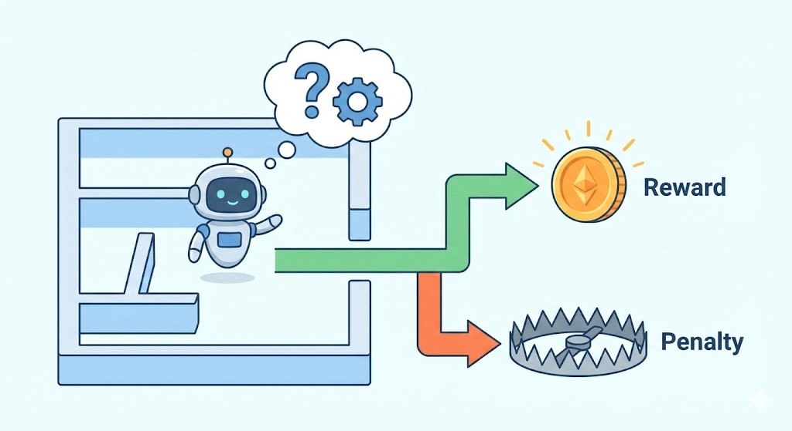
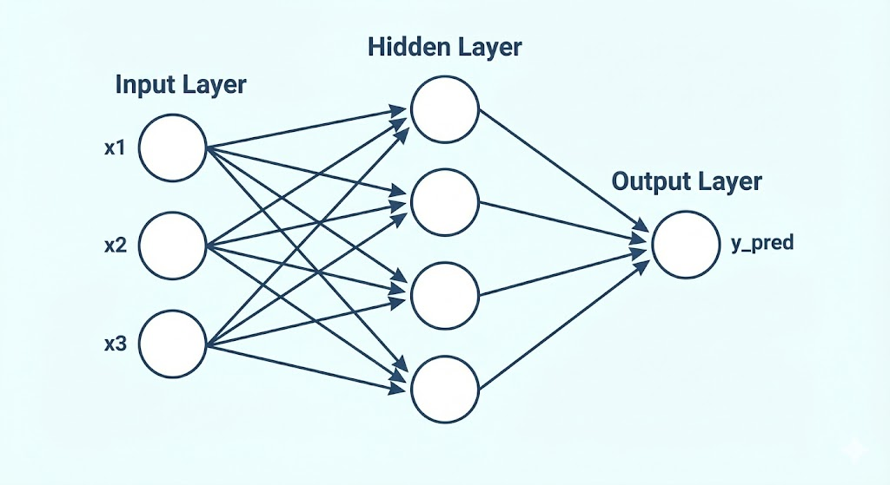
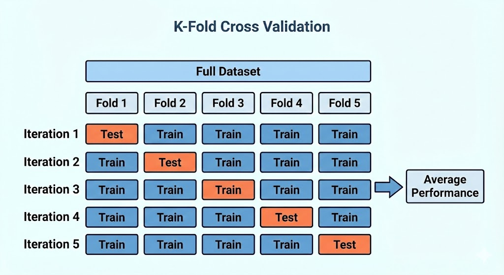
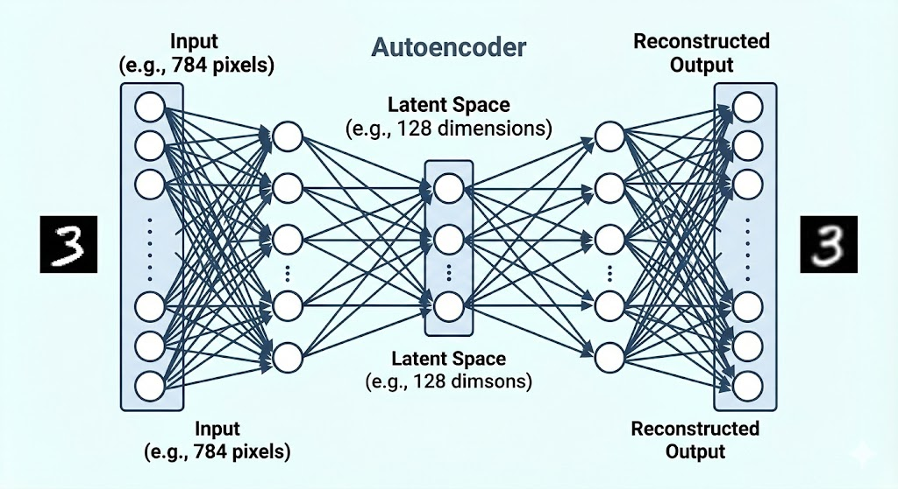

本文将带你深入浅出地了解人工智能领域的几大核心技术板块：从赋予 AI 决策能力的强化学习（Reinforcement Learning），到经典的神经网络（Neural Networks）与模型评估方法，再到处理图像数据的自编码器（Autoencoders）与聚类算法。无论你是初学者还是想巩固基础的开发者，这份大纲都能为你提供清晰的学习路径和代码实践指南。

# 强化学习（RL）入门：AI 如何学会在游戏中获胜

## 1. 核心概念解析

**什么是强化学习？**

强化学习是一种通过与环境交互并不断“试错”（Trial and Error）来最大化累积奖励的机器学习方法。 与需要喂给标准答案的监督学习不同，强化学习中的智能体（Agent）更像是一个独自在迷宫中摸索的探险者：做出正确的决策会获得奖励，做出错误的决策则会面临惩罚或零收益。最终目的是让 AI 自动摸索出一套能拿到最多分数的策略。

要理解这个过程，需要先明确两个基础概念：

- **状态（State）：** 环境在特定时刻的“全景快照”。以棋类游戏为例，状态就是此刻棋盘上所有棋子的具体位置分布，以及当前轮到哪一方下棋。它为 AI 提供了决策所需的全部已知信息。
- **动作（Action）：** 智能体为了改变当前状态而执行的合法指令。比如在当前局势下，将“马”按照规则移动到特定的坐标，这就是一个具体的动作。

## 2. 为什么游戏偏爱强化学习？

近年来，从围棋到复杂的电子竞技，AI 之所以能在游戏领域大放异彩，是因为游戏天然契合强化学习的两个核心特性：

- **延迟奖励（Delayed Rewards）：** 在游戏中，你当下的某一次精妙操作，往往很难立刻判定是否能奠定胜局，真正的输赢往往在游戏最后时刻才揭晓。强化学习极其擅长处理这种长期的“序列决策”问题，它能评估当前动作对未来最终胜利的潜在价值。
- **自我博弈（Self-play）：** 传统的机器学习高度依赖人类预先标注的数据，这使得 AI 的上限往往被人类自身的水平所限制。而强化学习允许 AI 摆脱这种束缚。只要设定好环境和规则，AI 就可以通过成千上万次的左右互搏与自我探索，发掘出连人类专家都意想不到的绝妙策略。

## 3. 两大流派：价值 vs 策略

在训练 AI 走向胜利的过程中，主要衍生出了两大经典流派：

- **基于价值（Value-based）：** 这种思路侧重于给具体的游戏盘面或动作“明码标价”。例如，吃掉对方的核心棋子得 9 分，损失己方棋子扣 4 分。AI 会学习并评估每个状态的价值，在每次行动时，始终致力于选择那个能通向总得分最高状态的路径。
- **基于策略（Policy-based）：** 这种思路不再纠结于给中间的单个状态算分，而是直接评估一整套动作习惯的好坏。它通常只在整局游戏结束时给出一次最终奖励（例如赢了 +1 分，输了 -1 分）。胜局中使用的所有动作策略会被“肯定”从而增加概率，败局中的动作概率则被降低。它直接优化的是 AI 获胜的高级直觉。

## 4. 现实局限性

尽管强化学习在理论上非常强大，但在实际应用中也面临着诸多现实局限：

首先，训练中的 AI 并不总是呈现稳步变强的趋势。在探索新招式时，它可能会经历表现的断崖式下跌，甚至陷入“局部最优”的死胡同。在自我博弈中，它也可能对某个特定对手的风格产生严重过拟合，导致在面对其他未见过的策略时变得极其脆弱。

其次，在商业游戏开发中，我们的目标通常并不是训练一个“无敌”的 AI。一个完美无缺的对手只会给玩家带来纯粹的挫败感。真正的商业应用目标是最大化玩家的乐趣，这就需要训练出能够模拟真实人类竞技行为、会犯合理的错误，并能动态适应玩家当前技能水平的有趣对手。

# 构建你的第一个神经网络：回归预测实战



## 1. 原理讲解：前馈神经网络（Feed-Forward NN）究竟是怎么工作的？

对于完全没有基础的初学者来说，“神经网络”这个词听起来像是极其高深的大脑仿生学。但别被它吓倒，在代码世界里，你可以把它想象成一家**分工极其明确的“房价评估公司”**。

在这家公司里，没有复杂的机械齿轮，只有三个核心部门：

- **输入层（前台数据收集员）：** 负责在一线接收最原始的死数据。比如要预测一套房子的价格，前台会把“房间数量”、“建造年份”、“距离地铁站的步数”等具体数字逐一登记下来。
- **隐藏层（后台数据分析师）：** 这是这家公司真正的“核心大脑”。数据从前台送达后，会交由这里成百上千个“虚拟分析师”（也就是所谓的**神经元节点**）进行深度挖掘。每个分析师的性格和看重的东西都不一样：有的分析师是个“地段控”，只盯着距离地铁站的数据看；有的则是“空间控”，拼命放大房间数量的重要性。他们会根据自己的经验，给这些数据打上不同的“权重分数”（也就是判断哪个指标更重要）。
  最厉害的是，这些分析师不只有一排，而是可以有很多排（层）。第一排的初级分析师只看基础数字，第二排的高级分析师则会拿第一排算出的初步结果进行“头脑风暴”，得出更高级的结论（比如把“房间多”和“年份老”结合起来，脑补出这是一个“老破大”）。
- **输出层（最终决策老板）：** 老板不需要看原始数据，他只负责汇总所有高级分析师的综合汇报，然后拍板给出一个最终的预测结果（例如：这套房子的预测价格是 500 万）。

**为什么名字里要带“前馈（Feed-Forward）”两个字？**
因为在这家公司里，有着极其严格的上下级汇报制度：数据就像流水线上的包裹，只能**单向、一直往前走**。前台把数据传给初级分析师，初级传给高级，高级传给老板。中间绝对不能越级，不能回头重新算，也不能在某一个部门里来回死循环。这种干净利落的单向传递，就是“前馈”的真正含义。

**没有它就不行的核心魔法：非线性激活函数（比如 ReLU）**
想象一下，如果所有的后台分析师都只会做最简单的乘法和加法算术题，那么无论你雇佣多少个分析师、盖多高的大楼，公司最终算出来的房价走势永远只是一条死板的直线。但现实世界的房价规律是起伏不定的曲线，一条直线是永远无法精准预测现实的。

为了让这家公司拥有画出“复杂曲线”的能力，我们必须在每个分析师的办公桌上放一个神奇的过滤网——也就是“激活函数”。目前深度学习界最火的过滤网叫做 **ReLU**。

这个 ReLU 过滤网的工作方式极其简单粗暴，就像一个铁面无私的质检员：

- 如果分析师算出来的综合得分是个**负数**，过滤网就会“咔嚓”一刀，直接把结果变成 0。（这就相当于告诉下一级：这个特征对预测房价毫无用处，可以直接无视）。
- 如果分析师算出来的得分是个**正数**，过滤网就亮绿灯，原封不动地把分数传递给下一个人。

千万别小看这个简单的“负数一律清零”操作。正是有了这种“区别对待”，神经网络才打破了只能画直线的死板限制，拥有了拟合出现实世界中任何复杂规律、看透各种隐秘联系的终极力量。

## 2. 核心预处理：防止数据泄露（Data Leakage）

在把数据真正丢给前台接待员之前，给数据“梳妆打扮”是决定预测准不准的关键。

面对现实数据时，各个数字的体量差异可能是极其悬殊的（比如“房间数”通常是 2 间或 3 间，而“房屋总价”动辄就是几百万）。如果直接把这些原始数字塞给分析师，那些天生自带巨大数值的指标，就会像一个嗓门极大的推销员，瞬间盖过其他小数值指标的声音，导致整个评估公司陷入彻底的混乱甚至崩溃。

为了让所有人公平交流，我们需要使用 Python 中的 `sklearn.preprocessing.StandardScaler` 工具来对数据进行**标准化**。它的作用就像是给所有数据穿上统一大小的制服：把所有特征的平均水平强行拉平到 0 附近。这样一来，所有的特征就都站在了同一条起跑线上，没有人能靠着嗓门大（数值大）来作弊。

**⚠️ 绝对不能踩的雷区：**
在这个环节，初学者最容易犯一个极其致命的错误——数据泄露。你必须牢记以下铁律：

- 模型在训练时，只能用**训练集**来摸索规律。所以，这个统一制服的尺寸（均值和缩放比例），必须**仅仅针对训练集**来测量和剪裁（代码中叫做 `fit_transform`）。
- 等到模型要去预测**测试集**（代表未来的、从未见过的新房子）时，严禁重新给测试集量尺寸！你必须强行把刚刚在训练集上做好的制服，直接套在测试集身上（代码中只能用 `transform`）。如果在这个时候重新量尺寸（fit），就相当于模型在考试前偷偷看了一眼全班同学的试卷分布，这种作弊得来的高分，在真实世界的应用中会瞬间露馅。

## 3. PyTorch 实战与相关包介绍

搞懂了公司的运作机制和数据规矩，我们就可以用 PyTorch（目前全球最受欢迎的 AI 搭建工具）来真正建立这家公司了。

搭建过程中，你会用到两个最核心的工具箱：

- **`torch.nn`（建筑材料库）：** 这里面装满了搭建公司的预制板。比如你需要招募一排分析师，就可以直接调用里面的全连接层（`nn.Linear`）；你需要评估公司最终猜的房价离真实房价差了多少，就可以调用里面的均方误差计算器（`nn.MSELoss`）。
- **`torch.optim`（公司管理层）：** 这里面装的是各种优化策略，最出名的一个叫 Adam。它的职责就像是公司的奖惩主管，负责在每次预测结束后，根据误差大小，去微调每一个分析师心里的那杆秤（权重参数），让他们下一次猜得更准。

在实际敲代码时，无论你的公司有多么庞大，PyTorch 的训练日常永远雷打不动地重复着以下**五步工作法**：

1. **`optimizer.zero_grad()`（清空记忆）：** 每天早上开工第一件事，主管会把所有人昨天本子上的检讨书全部擦干净，保证今天的工作不受昨天旧账的干扰。
2. **`predictions = model(X)`（正向预测）：** 前台把今天的房源数据分发下去，流水线轰鸣运转，老板最终拍板给出一个预测价格。
3. **`loss = criterion(...)`（计算误差）：** 翻开真实的市场成交价，和老板给的预测价做对比，算出一个具体的“打脸指数”（误差值）。这个指数越小，说明公司越靠谱。
4. **`loss.backward()`（反向追责）：** 这是公司里最核心的问责环节。系统会顺着流水线一路往回查，精准算出到底是因为哪个分析师的判断失误，导致了最终的误差。每个人都会领到一张写着自己责任大小的“追责单”（计算梯度）。
5. **`optimizer.step()`（自我修正）：** 主管出马，根据每个人手里的追责单，挨个调整分析师的评判标准。犯错多的多调一点，犯错少的少调一点，整个公司就这样完成了一次从错误中成长的进化。

```python
import torch
import torch.nn as nn
import torch.optim as optim
from sklearn.preprocessing import StandardScaler
import numpy as np

# 1. 定义前馈神经网络架构
class FeedForwardNN(nn.Module):
    def __init__(self, input_size):
        super().__init__()
        self.fc1 = nn.Linear(input_size, 64)
        self.fc2 = nn.Linear(64, 32)
        self.fc3 = nn.Linear(32, 1) # 回归任务，最后输出 1 个数值

    def forward(self, x):
        x = torch.relu(self.fc1(x))
        x = torch.relu(self.fc2(x))
        x = self.fc3(x) # 输出层不加激活函数
        return x

# 2. 模拟数据与标准化预处理 (严格防止数据泄露)
X_train, X_test = np.random.rand(100, 8), np.random.rand(20, 8)
y_train = np.random.rand(100, 1)

scaler = StandardScaler()
X_train_scaled = scaler.fit_transform(X_train) # 训练集：量体裁衣
X_test_scaled = scaler.transform(X_test)       # 测试集：直接穿衣

# 3. 准备模型与优化器
model = FeedForwardNN(input_size=8)
criterion = nn.MSELoss() # 均方误差损失函数
optimizer = optim.Adam(model.parameters(), lr=0.01)

# 4. 执行标准的 PyTorch 训练循环
for epoch in range(100):
    model.train()

    optimizer.zero_grad()                                  # 1. 清空上一步的残余梯度
    predictions = model(torch.FloatTensor(X_train_scaled)) # 2. 正向传播，获取预测值
    loss = criterion(predictions, torch.FloatTensor(y_train)) # 3. 计算预测值与真实值的误差
    loss.backward()                                        # 4. 反向传播，计算梯度
    optimizer.step()                                       # 5. 更新参数，完成自我修正
```

# 模型评估的艺术：K 折交叉验证


在机器学习的世界里，训练出一个模型只是第一步，如何“客观地评价”这个模型到底聪明不聪明，往往是一门更深的学问。

## 1. 原理讲解：为什么我们需要 K 折（K-Fold）？

想象一下，你在评估一个准备考大学的高中生。如果你只给他做一套模拟卷（这就像是最简单的“把数据切成一份训练集和一份测试集”），结果他刚好昨天复习了卷子上的题，考了满分。这能代表他实力天下第一吗？显然不能，这可能只是“运气好”。反过来，如果卷子全是他没看过的盲区，他考了零分，也不代表他一无是处。

简单粗暴的“一次性切分数据”极其容易受到运气因素的干扰。

为了彻底挤掉运气的水分，数据科学家们发明了**K 折交叉验证（K-Fold Cross Validation）**。它的核心思想是“轮流坐庄，全员考试”：

- 假设我们把 K 设置为 5。我们就像切蛋糕一样，把所有的数据均匀地切成 5 份。
- **第一轮**：我们把第 1 份数据藏起来作为“期末考卷（测试集）”，让模型去学习剩下的 4 份“复习资料（训练集）”。学完后，拿考卷测出一个成绩。
- **第二轮**：我们把第 2 份数据作为期末考卷，让模型重新归零，去学习第 1、3、4、5 份数据，再测出一个成绩。
- **以此类推**：我们重复这个过程 5 次，确保每一份数据都当过一次“考卷”。
- 最后，我们把这 5 次的成绩加起来算个平均分。这个平均分，就是模型最真实、最稳健的实力体现。它确保了数据集里的每一条数据，既被用来复习过，也被用来考查过。

## 2. Python 包与方法介绍

在 Python 的机器学习神器 `scikit-learn`（简称 sklearn）中，实现这套评估机制非常简单，我们主要会用到两个关键工具：

- **`sklearn.model_selection.KFold`：切蛋糕的顶级大厨**
  它的唯一工作，就是绝对公平地帮你把数据分成 K 份。在调用它时，有两个极具智慧的参数设定：
- **`shuffle=True`**：意思是“洗牌”。在切数据之前，先把数据像洗扑克牌一样彻底打乱。这样可以防止具有相同特征的数据扎堆出现，确保每一折（份）数据都具有代表性，评估结果更客观。
- **`random_state=固定数字`**：洗牌虽然是随机的，但科学实验讲究“可复现”。设定了这个随机种子（例如 5731）后，无论你今天运行还是明年运行，它“随机洗牌”的最终顺序都是一模一样的，方便对比不同的模型。
- **`sklearn.naive_bayes.GaussianNB`：高效的概率预测专家（朴素贝叶斯分类器）**
  在验证数据切分方法时，我们需要一个基础模型来跑分，朴素贝叶斯是一个极佳的选择。它不搞复杂的网络，而是单纯依靠“概率论”来做决定。就像是一个经验丰富的侦探，如果它发现历史上带有“免费”和“中奖”字眼的文件 90% 都是垃圾邮件，那它下次看到这两个词就会直接给出大概率是垃圾邮件的推断。它计算开销极小、训练速度极快，特别适合用来跑这种需要反复训练多次的交叉验证流程。

## 3. 代码示例：让理论落地

下面这段代码展示了如何将 KFold 与朴素贝叶斯模型结合，对数据集进行一场公平的“5 折大考”：

```python
import numpy as np
from sklearn.datasets import load_wine
from sklearn.naive_bayes import GaussianNB
from sklearn.model_selection import KFold

# 加载红酒分类数据集（特征数据 X，分类标签 y）
data = load_wine()
X = data.data
y = data.target

# 1. 准备好我们的“考生”：朴素贝叶斯分类器
model = GaussianNB()

# 2. 准备好我们的“发卷老师”：5折交叉验证拆分器
# 开启洗牌模式，并设定固定种子保证每次洗牌结果一致
kf = KFold(n_splits=5, shuffle=True, random_state=5731)

total_correct = 0      # 准备一个小本本，记录5次考试里总共答对了几题
total_samples = len(y) # 数据集里的总题数

# 3. 开始 5 轮循环考试
# kf.split(X) 会轮流产出每一轮“复习资料”和“考卷”在数据中的具体位置编号（索引）
for train_index, test_index in kf.split(X):

    # 根据编号，把这一轮的数据真正划分出来
    X_train, X_test = X[train_index], X[test_index]
    y_train, y_test = y[train_index], y[test_index]

    # 模型开始闭关学习复习资料 (fit)
    model.fit(X_train, y_train)

    # 学习完毕，立刻用这一轮的考卷进行测试 (predict)
    y_pred = model.predict(X_test)

    # 批改考卷：对比模型的答案和标准答案，把答对的题数记录在小本本上
    correct_count = (y_pred == y_test).sum()
    total_correct += correct_count

# 4. 计算最终的真实实力（平均准确率）
final_accuracy = total_correct / total_samples
print(f"经过 5 折交叉验证，该模型的真实准确率为: {final_accuracy * 100:.2f}%")

```

通过这种方式，不管数据集里面藏着什么“偏题怪题”，都会在轮流考试中被公平地测试到，我们对模型性能的评估也就彻底告别了运气成分。

# 图像压缩魔法：自编码器（Autoencoder）与特征提取

在掌握了通过预测数值来评估结果的前馈神经网络之后，我们迎来了深度学习中极其迷人的一个分支：无监督学习。在这个领域中，**自编码器（Autoencoder）**是最经典的图像压缩与特征提取工具。

## 1. 原理讲解：给高维数据“瘦身”

试想一下，如果你要把一张高清风景照通过极其狭窄的电报网发送给远方的朋友，并且要求对方能画出原图，你会怎么做？你不可能逐个像素发送，而是会提炼出最关键的特征（比如：“左边是一座雪山，右边是一条河流”），对方接收到这几个关键信息后，再依靠经验把风景“脑补”还原出来。

自编码器的工作原理与此完全一致。它是一种目标为“让输出尽可能等于输入”的特殊神经网络，主要由三个核心部分组成：

- **编码器（Encoder）：** 它的形状像一个不断收缩的漏斗。假设我们输入的是一张 28x28 像素的灰度图片，把它展平后就是 784 个数字（高维特征）。编码器的任务就是通过几层神经网络，把这 784 个数字强行压缩成更少的数字（比如 512，再到 256，最后到 128）。
- **潜在空间（Latent Space）：** 压缩到极致后的这 128 个数字构成的低维向量，就是潜在空间。这也是我们真正想要提取的“图像精华”。在被无情压缩的过程中，模型被迫抛弃了那些无用的冗余信息（比如背景里的噪点），只保留了能代表这张图片最本质的核心特征（如衣服的形状、轮廓、纹理等）。
- **解码器（Decoder）：** 它的形状与编码器正好相反，像一个不断放大的喇叭。它的任务是接收潜在空间传来的 128 个特征数字，尝试将其重新放大并还原成 784 个像素点。如果最终还原出的图片与原始图片极其相似，就说明中间那 128 个数字已经完美抓住了原图的灵魂。



## 2. PyTorch 实现细节

在 PyTorch 中搭建自编码器，就像是拼接两段对称的流水线。

- **使用 `nn.Sequential` 打包流水线：** 在构建极其多层的网络时，如果每一层都单独写出来会显得代码极其臃肿。`nn.Sequential` 就像是一个打包箱，你可以按照执行顺序，把线性层（`nn.Linear`）和激活函数按顺序扔进去。数据一旦进入这个箱子，就会自动按顺序依次穿过所有的层，这让代码变得异常整洁。
- **巧妙搭配激活函数（ReLU 与 Sigmoid）：**
- 在编码器和解码器的**隐藏层**中，我们通常使用 **ReLU** 激活函数。它能帮助模型学习复杂的非线性特征，同时避免计算过程中的梯度消失问题。
- 但是，在解码器的**最后一层（输出层）**，我们必须换成 **Sigmoid** 激活函数。为什么？因为图像的像素值在预处理时通常会被归一化到 0 到 1 之间（0 代表纯黑，1 代表纯白）。Sigmoid 函数的数学特性刚好可以将任何实数强制映射到 0 到 1 的区间内。这相当于给解码器的输出加了一把安全锁，确保它还原出来的结果完全符合像素的取值规则，而不会出现离谱的负数或超过 1 的异常值。

## 3. 特征提取实战

当我们历经千辛万苦训练好了一个自编码器后，真正的戏肉才刚刚开始。在实际的业务场景（如图像检索）中，我们往往会**直接扔掉解码器**，只保留编码器，用它来把海量的图片转化成轻量级的 128 维特征向量。

但在处理成千上万张图片时，有两个工程上的实战技巧必须掌握：

- **`torch.utils.data.DataLoader`：防止内存撑爆的传送带**
  面对几万甚至几十万张高清图像，如果试图一次性把它们全塞进内存里，计算机的内存和显存会瞬间崩溃。`DataLoader` 就是深度学习中的传送带，你可以设置一个 `batch_size`（比如 64），它就会将海量数据切分成一小块一小块，每次只运送 64 张图片进入模型进行特征提取。处理完一批再运下一批，从而实现细水长流、稳定运行。
- **`model.eval()` & `torch.no_grad()`：省流提速的终极开关**
  由于我们现在只是想用训练好的模型来“提取特征”，而不是要继续“训练”它，因此必须关闭学习机制：
- **`model.eval()`**：告诉模型“现在是考试时间，不是学习时间”。这会让网络中一些在训练和测试阶段表现不同的层（如 Dropout 或 BatchNorm）切换到静止的评估模式。
- **`torch.no_grad()`**：这是一个极其强大的上下文管理器。它会直接切断 PyTorch 的“反向传播梯度追踪”引擎。因为不更新权重，也就不需要记录那些极其消耗显存的计算图。加上这行代码，特征提取的内存占用会骤降，计算速度会大幅提升。
  让计算机读懂图像：K-Means 与视觉词袋模型

1. 降维后的新挑战
   拿到成千上万张图片的“潜在空间特征”（128 维数组）后，我们需要一种方法将它们归类并赋予语义。
2. 原理与工具：K-Means 聚类

sklearn.cluster.KMeans：经典的无监督学习算法。它自动在 128 维空间中寻找 K 个“重心”（Centres）。

原理现象解释：不同操作系统的底层数学库差异，会导致 K-Means 初始化时的微小偏差被放大，从而得出数值不同但维度和逻辑完全正确的聚类中心矩阵。

3. 进阶应用：视觉词袋模型（Visual Bag of Words）

K-Means 算出的 10 个中心点，就是 10 个“视觉单词”（如：鞋类特征、T 恤特征）。

对于任何一张新图像，只需计算它的特征与这 10 个单词的距离比例，就能将其转化成一个极度精简的“10 维直方图（Histogram）”。这让极其复杂的图像检索与比对变得轻而易举。

## 4. 代码示例：让理论落地

```python
import torch
import torch.nn as nn
from torch.utils.data import DataLoader, TensorDataset
import numpy as np

# 1. 定义自编码器架构
class Autoencoder(nn.Module):
    def __init__(self, input_size=784, hidden_size=128):
        super().__init__()
        # 编码器：压缩至 128 维潜在空间
        self.encoder = nn.Sequential(
            nn.Linear(input_size, 512), nn.ReLU(),
            nn.Linear(512, 256), nn.ReLU(),
            nn.Linear(256, hidden_size)
        )
        # 解码器：从 128 维还原至 784 维
        self.decoder = nn.Sequential(
            nn.Linear(hidden_size, 256), nn.ReLU(),
            nn.Linear(256, 512), nn.ReLU(),
            nn.Linear(512, input_size),
            nn.Sigmoid() # 保证输出的像素值处于 0 到 1 的合理区间
        )

    def forward(self, x):
        encoded = self.encoder(x)
        decoded = self.decoder(encoded)
        return decoded, encoded

# 2. 特征提取实战函数
def extract_latent_features(model, dataloader):
    model.eval() # 切换至评估模式
    latent_space_list = []
    
    with torch.no_grad(): # 切断梯度计算，极大节省系统资源
        for images, _ in dataloader:
            # 仅截取自编码器的第二个返回值（即 encoded 潜在特征）
            _, encoded = model(images)
            latent_space_list.append(encoded.cpu().numpy())
            
    # 将分批次提取的数据拼接成完整的二维矩阵
    return np.concatenate(latent_space_list, axis=0)

# 模拟 DataLoader 使用
dummy_data = torch.rand(1000, 784)
dummy_loader = DataLoader(TensorDataset(dummy_data, torch.zeros(1000)), batch_size=64)
model = Autoencoder()
features = extract_latent_features(model, dummy_loader)
print("提取出的潜在特征维度:", features.shape) # 输出: (1000, 128)
```