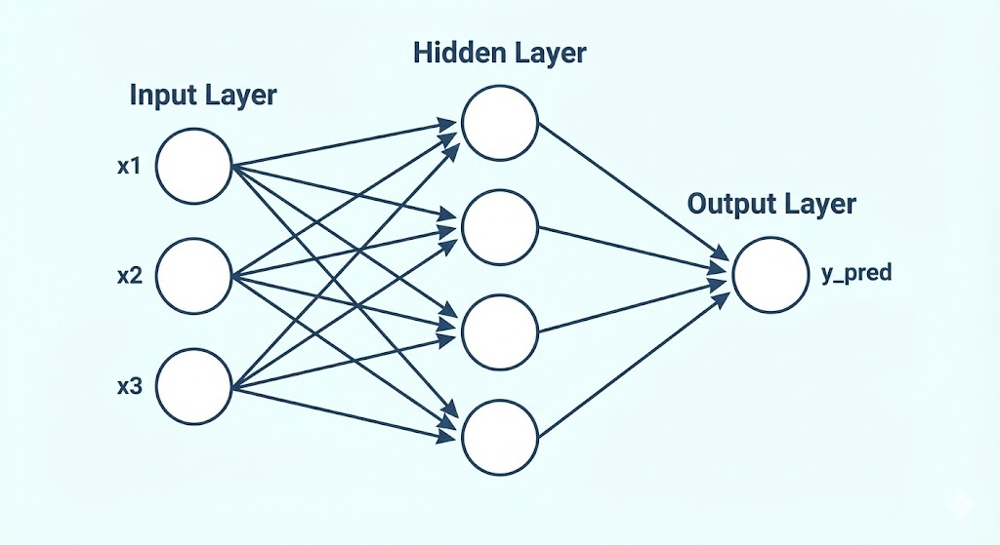
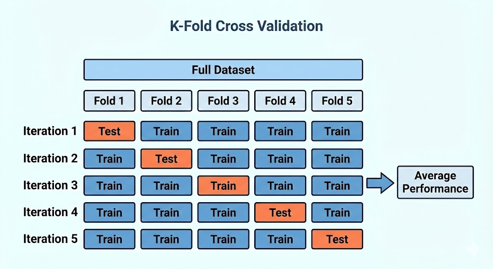
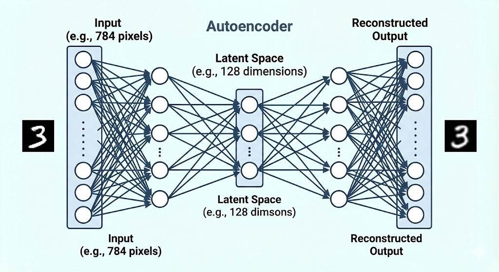

这份笔记整理强化学习、前馈神经网络、K 折交叉验证、自编码器和聚类算法，并用小型代码示例串联基本概念。

# 强化学习（RL）入门：AI 如何学会在游戏中获胜

## 1. 核心概念解析

**什么是强化学习？**

强化学习是一种让智能体（Agent）与环境交互，并通过奖励信号学习策略的机器学习方法。与依赖标注答案的监督学习不同，它关注一连串动作带来的累积回报。

要理解这个过程，需要先明确两个基础概念：

- **状态（State）：** 环境在某一时刻提供给智能体的信息。棋类游戏中，棋盘布局和当前行动方都属于状态。
- **动作（Action）：** 智能体在当前状态下可以执行的操作，例如把棋子移动到某个合法位置。

## 2. 为什么游戏偏爱强化学习？

游戏规则明确、反馈可计算，很适合用来训练和评估强化学习算法，主要有两个原因：

- **延迟奖励（Delayed Rewards）：** 单步操作的好坏通常要到若干回合后才能判断，适合研究长期序列决策。
- **自我博弈（Self-play）：** 规则和环境确定后，智能体可以反复与自身或不同版本的策略对局，不必为每一步准备人工标签。

## 3. 两大流派：价值 vs 策略

在训练 AI 走向胜利的过程中，主要衍生出了两大经典流派：

- **基于价值（Value-based）：** 这种思路侧重于给具体的游戏盘面或动作“明码标价”。例如，吃掉对方的核心棋子得 9 分，损失己方棋子扣 4 分。AI 会学习并评估每个状态的价值，在每次行动时，始终致力于选择那个能通向总得分最高状态的路径。
- **基于策略（Policy-based）：** 直接学习状态到动作概率的映射，并通过期望累积奖励调整策略参数。奖励可以在每一步给出，也可以只在回合结束时给出。

## 4. 现实局限性

尽管强化学习在理论上非常强大，但在实际应用中也面临着诸多现实局限：

训练过程不一定稳定。探索新策略时，模型表现可能暂时下降，也可能收敛到局部最优；自我博弈还可能让策略过度适应某类对手，对其他策略的泛化较差。

商业游戏也不一定需要最强的对手。更常见的目标是控制难度，让 AI 保留合理失误，并根据玩家水平调整策略。

# 前馈神经网络：回归预测示例



## 1. 前馈神经网络（Feed-Forward NN）如何工作

前馈神经网络按固定方向传递数据，从输入层经过一个或多个隐藏层，最后到达输出层。以房价回归为例：

- **输入层：** 接收房间数量、建造年份、到地铁站的距离等原始特征。
- **隐藏层：** 对上一层结果做线性变换和非线性变换，逐层组合特征。
- **输出层：** 汇总隐藏层结果，输出一个连续的价格预测值。

“前馈”表示数据只从输入流向输出，网络内部没有循环连接。

### 非线性激活函数

如果网络只有线性层，即使叠加多层，整体仍等价于一次线性变换，无法拟合非线性关系。ReLU 为隐藏层加入非线性：

- 输入小于或等于 0 时，输出 0。
- 输入大于 0 时，保持原值。

加入激活函数后，网络才有能力表示更复杂的函数关系。

## 2. 数据标准化与数据泄露（Data Leakage）

不同特征的数值尺度可能相差很大，例如房间数通常是个位数，房价却可能达到数百万。可以使用 `sklearn.preprocessing.StandardScaler` 对特征做标准化，减少尺度差异对优化过程的影响。

标准化时要避免把测试集信息泄露给训练过程：

- 只在**训练集**上调用 `fit` 或 `fit_transform`，计算均值和缩放比例。
- 对**测试集**只调用 `transform`，复用训练集得到的参数。

## 3. PyTorch 实战与相关包介绍

实现示例主要使用两个 PyTorch 模块：

- **`torch.nn`：** 提供 `nn.Linear`、`nn.MSELoss` 等网络层和损失函数。
- **`torch.optim`：** 提供 Adam 等优化器，用梯度更新模型参数。

一个基本训练循环包含五步：

1. 调用 `optimizer.zero_grad()` 清空上一轮梯度。
2. 调用 `model(X)` 完成前向传播。
3. 使用损失函数计算预测误差。
4. 调用 `loss.backward()` 计算梯度。
5. 调用 `optimizer.step()` 更新参数。

```python
import torch
import torch.nn as nn
import torch.optim as optim
from sklearn.preprocessing import StandardScaler
import numpy as np

# 1. 定义前馈神经网络架构
class FeedForwardNN(nn.Module):
    def __init__(self, input_size):
        super().__init__()
        self.fc1 = nn.Linear(input_size, 64)
        self.fc2 = nn.Linear(64, 32)
        self.fc3 = nn.Linear(32, 1) # 回归任务，最后输出 1 个数值

    def forward(self, x):
        x = torch.relu(self.fc1(x))
        x = torch.relu(self.fc2(x))
        x = self.fc3(x) # 输出层不加激活函数
        return x

# 2. 模拟数据与标准化预处理 (严格防止数据泄露)
X_train, X_test = np.random.rand(100, 8), np.random.rand(20, 8)
y_train = np.random.rand(100, 1)

scaler = StandardScaler()
X_train_scaled = scaler.fit_transform(X_train) # 训练集：量体裁衣
X_test_scaled = scaler.transform(X_test)       # 测试集：直接穿衣

# 3. 准备模型与优化器
model = FeedForwardNN(input_size=8)
criterion = nn.MSELoss() # 均方误差损失函数
optimizer = optim.Adam(model.parameters(), lr=0.01)

# 4. 执行标准的 PyTorch 训练循环
for epoch in range(100):
    model.train()

    optimizer.zero_grad()                                  # 1. 清空上一步的残余梯度
    predictions = model(torch.FloatTensor(X_train_scaled)) # 2. 正向传播，获取预测值
    loss = criterion(predictions, torch.FloatTensor(y_train)) # 3. 计算预测值与真实值的误差
    loss.backward()                                        # 4. 反向传播，计算梯度
    optimizer.step()                                       # 5. 更新参数，完成自我修正
```

# 模型评估：K 折交叉验证


训练完成后，还需要用未参与训练的数据评估模型的泛化能力。

## 1. 原理讲解：为什么我们需要 K 折（K-Fold）？

只做一次训练集与测试集切分时，评估结果容易受随机划分影响。**K 折交叉验证（K-Fold Cross Validation）**会轮流使用不同子集进行验证：

- 当 K 设为 5 时，先把数据划分为 5 份。
- 每一轮使用其中 1 份验证，其余 4 份训练。
- 重复 5 轮，确保每份数据都参与过一次验证。
- 最后汇总各轮指标，得到比单次切分更稳定的估计。

## 2. Python 包与方法介绍

下面使用 `scikit-learn` 中的两个工具：

- **`sklearn.model_selection.KFold`：** 负责生成每一折的训练索引和验证索引。`shuffle=True` 会在划分前打乱数据，`random_state` 用于固定随机结果。
- **`sklearn.naive_bayes.GaussianNB`：** 作为示例中的基础分类模型，训练开销较小，方便重复执行多轮验证。

## 3. 代码示例

下面用 KFold 和朴素贝叶斯模型执行 5 折交叉验证：

```python
import numpy as np
from sklearn.datasets import load_wine
from sklearn.naive_bayes import GaussianNB
from sklearn.model_selection import KFold

# 加载红酒分类数据集（特征数据 X，分类标签 y）
data = load_wine()
X = data.data
y = data.target

# 1. 准备好我们的“考生”：朴素贝叶斯分类器
model = GaussianNB()

# 2. 准备好我们的“发卷老师”：5折交叉验证拆分器
# 开启洗牌模式，并设定固定种子保证每次洗牌结果一致
kf = KFold(n_splits=5, shuffle=True, random_state=5731)

total_correct = 0      # 准备一个小本本，记录5次考试里总共答对了几题
total_samples = len(y) # 数据集里的总题数

# 3. 开始 5 轮循环考试
# kf.split(X) 会轮流产出每一轮“复习资料”和“考卷”在数据中的具体位置编号（索引）
for train_index, test_index in kf.split(X):

    # 根据编号，把这一轮的数据真正划分出来
    X_train, X_test = X[train_index], X[test_index]
    y_train, y_test = y[train_index], y[test_index]

    # 模型开始闭关学习复习资料 (fit)
    model.fit(X_train, y_train)

    # 学习完毕，立刻用这一轮的考卷进行测试 (predict)
    y_pred = model.predict(X_test)

    # 批改考卷：对比模型的答案和标准答案，把答对的题数记录在小本本上
    correct_count = (y_pred == y_test).sum()
    total_correct += correct_count

# 4. 计算最终的真实实力（平均准确率）
final_accuracy = total_correct / total_samples
print(f"经过 5 折交叉验证，该模型的真实准确率为: {final_accuracy * 100:.2f}%")

```

每份数据都会参与一次验证，最终指标受单次随机切分的影响更小。

# 自编码器（Autoencoder）与特征提取

**自编码器（Autoencoder）**通过重构输入学习低维表示，常用于降维和特征提取。

## 1. 从高维输入到潜在空间

自编码器的训练目标是让输出尽可能接近输入，主要由三部分组成：

- **编码器（Encoder）：** 它的形状像一个不断收缩的漏斗。假设我们输入的是一张 28x28 像素的灰度图片，把它展平后就是 784 个数字（高维特征）。编码器的任务就是通过几层神经网络，把这 784 个数字强行压缩成更少的数字（比如 512，再到 256，最后到 128）。
- **潜在空间（Latent Space）：** 编码器输出的低维向量，用较少维度保留重构输入所需的主要特征。
- **解码器（Decoder）：** 接收潜在向量并恢复到原始维度，输出对输入图像的重构结果。



## 2. PyTorch 实现细节

在 PyTorch 中，自编码器通常由两段近似对称的网络组成。

- **使用 `nn.Sequential` 组合网络层：** 按执行顺序放入线性层（`nn.Linear`）和激活函数，可以减少重复的前向传播代码。
- **搭配激活函数（ReLU 与 Sigmoid）：**
- 在编码器和解码器的**隐藏层**中，我们通常使用 **ReLU** 激活函数。它能帮助模型学习复杂的非线性特征，同时避免计算过程中的梯度消失问题。
- 但是，在解码器的**最后一层（输出层）**，我们必须换成 **Sigmoid** 激活函数。为什么？因为图像的像素值在预处理时通常会被归一化到 0 到 1 之间（0 代表纯黑，1 代表纯白）。Sigmoid 函数的数学特性刚好可以将任何实数强制映射到 0 到 1 的区间内。这相当于给解码器的输出加了一把安全锁，确保它还原出来的结果完全符合像素的取值规则，而不会出现离谱的负数或超过 1 的异常值。

## 3. 特征提取实战

训练完成后，图像检索等场景通常只保留编码器，把图片转换为 128 维特征向量，不再使用解码器。

但在处理成千上万张图片时，有两个工程上的实战技巧必须掌握：

- **`torch.utils.data.DataLoader`：防止内存撑爆的传送带**
  面对几万甚至几十万张高清图像，如果试图一次性把它们全塞进内存里，计算机的内存和显存会瞬间崩溃。`DataLoader` 就是深度学习中的传送带，你可以设置一个 `batch_size`（比如 64），它就会将海量数据切分成一小块一小块，每次只运送 64 张图片进入模型进行特征提取。处理完一批再运下一批，从而实现细水长流、稳定运行。
- **`model.eval()` 与 `torch.no_grad()`：切换到推理状态**
  由于我们现在只是想用训练好的模型来“提取特征”，而不是要继续“训练”它，因此必须关闭学习机制：
- **`model.eval()`**：告诉模型“现在是考试时间，不是学习时间”。这会让网络中一些在训练和测试阶段表现不同的层（如 Dropout 或 BatchNorm）切换到静止的评估模式。
- **`torch.no_grad()`**：关闭梯度追踪。推理时不需要更新权重，也不必保留反向传播所需的计算图，因此可以减少内存占用和计算开销。
  让计算机读懂图像：K-Means 与视觉词袋模型

1. 降维后的新挑战
   拿到成千上万张图片的“潜在空间特征”（128 维数组）后，我们需要一种方法将它们归类并赋予语义。
2. 原理与工具：K-Means 聚类

sklearn.cluster.KMeans：经典的无监督学习算法。它自动在 128 维空间中寻找 K 个“重心”（Centres）。

原理现象解释：不同操作系统的底层数学库差异，会导致 K-Means 初始化时的微小偏差被放大，从而得出数值不同但维度和逻辑完全正确的聚类中心矩阵。

3. 进阶应用：视觉词袋模型（Visual Bag of Words）

K-Means 算出的 10 个中心点，就是 10 个“视觉单词”（如：鞋类特征、T 恤特征）。

对于新图像，可以计算局部特征与这 10 个视觉词的距离或归属关系，再生成 10 维直方图（Histogram），供后续检索和比较使用。

## 4. 代码示例：让理论落地

```python
import torch
import torch.nn as nn
from torch.utils.data import DataLoader, TensorDataset
import numpy as np

# 1. 定义自编码器架构
class Autoencoder(nn.Module):
    def __init__(self, input_size=784, hidden_size=128):
        super().__init__()
        # 编码器：压缩至 128 维潜在空间
        self.encoder = nn.Sequential(
            nn.Linear(input_size, 512), nn.ReLU(),
            nn.Linear(512, 256), nn.ReLU(),
            nn.Linear(256, hidden_size)
        )
        # 解码器：从 128 维还原至 784 维
        self.decoder = nn.Sequential(
            nn.Linear(hidden_size, 256), nn.ReLU(),
            nn.Linear(256, 512), nn.ReLU(),
            nn.Linear(512, input_size),
            nn.Sigmoid() # 保证输出的像素值处于 0 到 1 的合理区间
        )

    def forward(self, x):
        encoded = self.encoder(x)
        decoded = self.decoder(encoded)
        return decoded, encoded

# 2. 特征提取实战函数
def extract_latent_features(model, dataloader):
    model.eval() # 切换至评估模式
    latent_space_list = []
    
    with torch.no_grad(): # 切断梯度计算，极大节省系统资源
        for images, _ in dataloader:
            # 仅截取自编码器的第二个返回值（即 encoded 潜在特征）
            _, encoded = model(images)
            latent_space_list.append(encoded.cpu().numpy())
            
    # 将分批次提取的数据拼接成完整的二维矩阵
    return np.concatenate(latent_space_list, axis=0)

# 模拟 DataLoader 使用
dummy_data = torch.rand(1000, 784)
dummy_loader = DataLoader(TensorDataset(dummy_data, torch.zeros(1000)), batch_size=64)
model = Autoencoder()
features = extract_latent_features(model, dummy_loader)
print("提取出的潜在特征维度:", features.shape) # 输出: (1000, 128)
```
