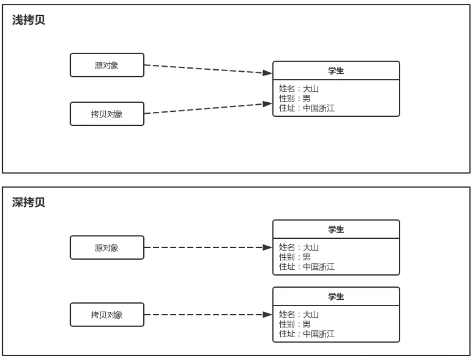
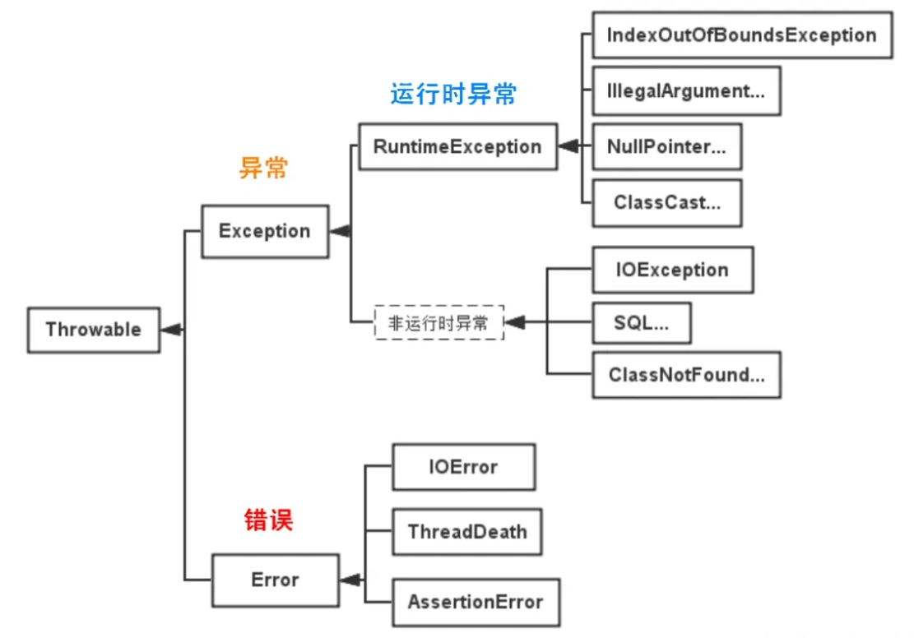

# 1. Java基础

## 1.1 深拷贝和浅拷贝

###  深拷贝和浅拷贝的区别？

- 浅拷贝（Shallow Copy）
  - **特点：**
    - 只复制对象的基本数据类型字段和对象引用，不复制引用对象本身。
    - 复制后的新对象与原对象共享相同的引用对象（即引用指向同一块内存）。
    - 如果引用对象的内容发生变化，两个对象都会受到影响。
  - **实现方式：**
    - 直接赋值（`=`）
    - 实现 `Cloneable` 接口并重写 `clone()` 方法（调用 `super.clone()`）
- 深拷贝（Deep Copy）
  - **特点：**
    - 复制对象的基本类型字段，同时递归复制引用对象的内容，创建完全独立的副本。
    - 复制后的新对象和原对象互不影响，修改其中一个不会影响另一个。
  - **实现方法：**
    - 手动实现 `clone()` 方法，递归拷贝引用对象。
    - 序列化与反序列化（适用于可序列化的对象）。
    - 使用构造方法手动创建新对象并复制所有字段。

## 1.2 异常

### 介绍一下Java异常

Java 中的异常体系主要由两个大类构成：**`Throwable`** 类及其子类。`Throwable` 是所有错误或异常的父类。它有两个主要的子类：

- **`Error`**：表示 JVM 内部的错误或系统错误。`Error` 通常是无法恢复的，如内存溢出、虚拟机崩溃等，不应在程序中捕获。
- **`Exception`**：表示程序中出现的各种异常情况，程序可以捕获和处理这些异常。

**`Throwable` 类的子类**

- **Error:** `Error` 类及其子类表示系统级的错误，通常由 JVM 引发。`Error` 表示一些严重的错误，程序无法对其进行处理，通常会导致程序的终止。

- **Exception:** `Exception` 类及其子类表示程序中可以预见并处理的异常情况。

  - **a. 检查异常（Checked Exception）:** 检查异常是程序员在编译时必须处理的异常。编译器会检查代码中是否适当处理了这些异常，未处理将导致编译错误。通常，检查异常表示程序执行中可能会发生的预料之外的情况，程序员需要显式处理它们。

  - **b. 非检查异常（Unchecked Exception）:** 非检查异常是继承自 `RuntimeException` 的异常，它们不需要在编译时显式处理，可以选择是否捕获。这些异常通常是程序的编程错误或运行时无法预见的问题。

# 2. Java集合

# 3. Java并发

# 4. JVM

# 5. Spring

# 6. MySQL

# 7. Redis

# 8. 计算机网络

# 9. 操作系统

# 10. 消息队列

