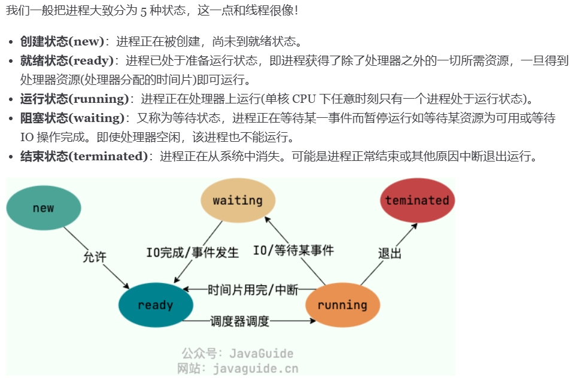

# Java基础

## 1. 深拷贝和浅拷贝

### 深拷贝和浅拷贝的区别？


- 浅拷贝（Shallow Copy）
  - **特点：**
    - 只复制对象的基本数据类型字段和对象引用，不复制引用对象本身。
    - 复制后的新对象与原对象共享相同的引用对象（即引用指向同一块内存）。
    - 如果引用对象的内容发生变化，两个对象都会受到影响。
  - **实现方式：**
    - 直接赋值（`=`）
    - 实现 `Cloneable` 接口并重写 `clone()` 方法（调用 `super.clone()`）
- 深拷贝（Deep Copy）
  - **特点：**
    - 复制对象的基本类型字段，同时递归复制引用对象的内容，创建完全独立的副本。
    - 复制后的新对象和原对象互不影响，修改其中一个不会影响另一个。
  - **实现方法：**
    - 手动实现 `clone()` 方法，递归拷贝引用对象。
    - 序列化与反序列化（适用于可序列化的对象）。
    - 使用构造方法手动创建新对象并复制所有字段。

## 2. 异常

### 介绍一下Java异常


Java 中的异常体系主要由两个大类构成：**`Throwable`** 类及其子类。`Throwable` 是所有错误或异常的父类。它有两个主要的子类：

- **`Error`**：表示 JVM 内部的错误或系统错误。`Error` 通常是无法恢复的，如内存溢出、虚拟机崩溃等，不应在程序中捕获。
- **`Exception`**：表示程序中出现的各种异常情况，程序可以捕获和处理这些异常。

**`Throwable` 类的子类**

- **Error:** `Error` 类及其子类表示系统级的错误，通常由 JVM 引发。`Error` 表示一些严重的错误，程序无法对其进行处理，通常会导致程序的终止。
- **Exception:** `Exception` 类及其子类表示程序中可以预见并处理的异常情况。

  - **a. 检查异常（Checked Exception）:** 检查异常是程序员在编译时必须处理的异常。编译器会检查代码中是否适当处理了这些异常，未处理将导致编译错误。通常，检查异常表示程序执行中可能会发生的预料之外的情况，程序员需要显式处理它们。
  - **b. 非检查异常（Unchecked Exception）:** 非检查异常是继承自 `RuntimeException` 的异常，它们不需要在编译时显式处理，可以选择是否捕获。这些异常通常是程序的编程错误或运行时无法预见的问题。

# Java集合

# Java并发

# 1. 死锁的条件

**互斥条件**：该资源任意一个时刻只由一个线程占用。

**请求与保持条件**：一个线程因请求资源而阻塞时，对已获得的资源保持不放。

**不剥夺条件**：线程已获得的资源在未使用完之前不能被其他线程强行剥夺，只有自己使用完毕后才释放资源。

**循环等待条件**：若干线程之间形成一种头尾相接的循环等待资源关系。

## 2. 介绍一下JMM

Java 内存模型（**JMM**，Java Memory Model）是 Java 多线程编程中**保证线程安全的核心规范**。它定义了多线程环境下，共享变量的读写规则、线程间操作的可见性、有序性以及原子性。JMM 的核心目标是解决多线程并发中的 **内存可见性** 和 **指令重排序** 问题。

### **1. JMM 的核心概念**

#### **(1) 主内存与工作内存**

- **主内存（Main Memory）**：所有线程共享的内存区域，存储共享变量（如堆中的对象）。
- **工作内存（Working Memory）**：每个线程私有的内存区域，存储该线程操作的共享变量副本。
  - 线程对共享变量的操作（读/写）必须通过工作内存与主内存交互。

#### **(2) 内存间交互规则**

- **`read`**：从主内存读取变量到工作内存。
- **`load`**：将 `read` 得到的值放入工作内存的变量副本。
- **`use`**：线程使用工作内存中的变量副本。
- **`assign`**：将修改后的变量值赋值到工作内存副本。
- **`store`**：将工作内存中的变量值传送到主内存。
- **`write`**：将 `store` 得到的值写入主内存的变量。

### **2. JMM 的三大特性**

#### **(1) 原子性（Atomicity）**

- **定义**：一个操作是不可分割的，要么全部执行，要么不执行。
- **JMM 的保证**：
  - 基本类型（如 `int`）的读写是原子的（`long/double` 在 32 位系统中可能非原子）。
  - `synchronized` 或 `Lock` 可以保证代码块的原子性。

#### **(2) 可见性（Visibility）**

- **定义**：一个线程修改共享变量后，其他线程能立即看到修改后的值。
- **JMM 的保证**：
  - `volatile` 关键字：强制将修改刷新到主内存，并禁止指令重排序。
  - `synchronized` 或 `Lock`：在释放锁时会将变量同步到主内存。

#### **(3) 有序性（Ordering）**

- **定义**：程序执行的顺序按照代码的先后顺序执行。
- **JMM 的保证**：
  - **指令重排序**：编译器和处理器会优化指令顺序以提高性能，但需遵守 **happens-before 规则**。
  - `volatile` 和 `synchronized` 可以禁止特定范围内的重排序。

### **3. Happens-Before 规则**

JMM 通过 **happens-before** 规则定义多线程操作的可见性和有序性。若操作 A happens-before 操作 B，则：

- A 的结果对 B 可见。
- A 的执行顺序排在 B 之前（但允许编译器优化，只要结果一致）。

#### **六大核心规则**

1. **程序顺序规则**：同一线程内的操作，前面的 happens-before 后面的。
2. **锁规则**：解锁操作 happens-before 后续的加锁操作。
3. **`volatile` 规则**：对 `volatile` 变量的写操作 happens-before 后续的读操作。
4. **传递性规则**：若 A happens-before B，B happens-before C，则 A happens-before C。
5. **线程启动规则**：`Thread.start()` happens-before 新线程的任何操作。
6. **线程终止规则**：线程的所有操作 happens-before 其他线程检测到该线程终止（如 `Thread.join()`）。

### **4. 内存屏障（Memory Barrier）**

为实现 happens-before 规则，JMM 通过插入 **内存屏障** 禁止特定类型的指令重排序：

- **`LoadLoad`**：禁止读操作重排序。
- **`StoreStore`**：禁止写操作重排序。
- **`LoadStore`**：禁止读后写重排序。
- **`StoreLoad`**：禁止写后读重排序（开销最大）。

# JVM

# Spring

## 1. **`@SpringBootApplication`** 注解包含哪些部分

- `@SpringBootConfiguration`：标记为配置类。
- `@EnableAutoConfiguration`：启用自动配置。
- `@ComponentScan`：扫描当前包及子包的组件（如 `@Component`, `@Service` 等）。

## 2. Spring Boot 的启动流程

### **1. 启动入口：`main` 方法与 `SpringApplication.run()`**

所有 Spring Boot 应用的入口都是一个标准的 Java `main` 方法，通过调用 `SpringApplication.run()` 启动：

```java
@SpringBootApplication
public class MyApp {
    public static void main(String[] args) {
        SpringApplication.run(MyApp.class, args);
    }
}
```

### **2. 初始化 `SpringApplication` 实例**

在 `run()` 方法执行前，Spring Boot 会初始化一个 `SpringApplication` 对象，关键步骤如下：

- **推断应用类型**：根据类路径判断是 Servlet 应用（如 Spring MVC）还是 Reactive 应用（如 WebFlux）。
- **加载 `ApplicationContextInitializer` 和 `ApplicationListener`**：从 `META-INF/spring.factories` 配置文件中读取并实例化扩展点实现（例如环境准备、上下文初始化等）。
- **推断主配置类**：寻找包含 `main` 方法的类作为配置源。

### **3. 执行 `run()` 方法**

`run()` 方法是启动流程的核心，分为以下几个关键阶段：

#### **(1) 启动计时器与监听器**

- **启动计时器**：记录应用启动耗时。
- **发布 `ApplicationStartingEvent`**：通知监听器（如日志初始化、配置加载）启动已开始。

#### **(2) 准备环境（Environment）**

- **创建并配置环境**：根据应用类型生成 `StandardEnvironment` 或 `StandardServletEnvironment`。
- **加载配置**：合并 `application.properties`/`application.yml`、命令行参数、系统属性等。
- **发布 `ApplicationEnvironmentPreparedEvent`**：通知监听器环境已就绪（例如 `ConfigFileApplicationListener` 加载配置文件）。

#### **(3) 创建应用上下文（ApplicationContext）**

- Servlet 应用：`AnnotationConfigServletWebServerApplicationContext`
- Reactive 应用：`AnnotationConfigReactiveWebServerApplicationContext`
- 非 Web 应用：`AnnotationConfigApplicationContext`

#### **(4) 准备上下文**

- 注册 `BeanDefinition`（主配置类）。
- 调用 `ApplicationContextInitializer` 对上下文进行扩展（例如设置属性源）。
- 发布 `ApplicationContextInitializedEvent`。

#### **(5) 刷新上下文（`refreshContext()`）**

这是 Spring 容器的核心初始化流程，对应传统 Spring 的 `AbstractApplicationContext.refresh()`，关键步骤包括：

1. **准备 `BeanFactory`**：注册必要的后置处理器（如 `ConfigurationClassPostProcessor`）。
2. **执行 `BeanFactoryPostProcessor`**：处理 `@Configuration` 类、解析 `@Bean` 方法、加载自动配置类。
3. **注册 `BeanPostProcessor`**：用于后续 Bean 初始化的拦截。
4. **初始化消息源、事件广播器等**。
5. **触发 `onRefresh()` 方法**：启动内嵌 Web 服务器（如 Tomcat、Netty）。
6. **注册 `Servlet`、`Filter`**（仅 Servlet 应用）。
7. **发布 `ApplicationStartedEvent`**。

#### **(6) 调用 `ApplicationRunner` 和 `CommandLineRunner`**

在所有 Bean 初始化完成后，执行用户自定义的启动逻辑（按 `@Order` 顺序执行）。

#### **(7) 发布 `ApplicationReadyEvent`**

标志应用已完全启动，可以接收外部请求。

### **4. 自动配置（Auto-Configuration）**

自动配置的核心是 `@EnableAutoConfiguration`（包含在 `@SpringBootApplication` 中），其流程如下：

1. **加载 `META-INF/spring/org.springframework.boot.autoconfigure.AutoConfiguration.imports`**：读取所有自动配置类。
2. **条件化筛选**：通过 `@ConditionalOnClass`、`@ConditionalOnMissingBean` 等条件注解，按需启用配置类。
3. **创建 Bean**：例如内嵌数据库、消息队列等组件的自动化配置。

### **5. 内嵌 Web 服务器启动**

- **Servlet 容器**：通过 `ServletWebServerApplicationContext` 启动 Tomcat/Jetty/Undertow。
- **Reactive 容器**：通过 `ReactiveWebServerApplicationContext` 启动 Netty/Undertow。
- **端口绑定与服务监听**：根据 `server.port` 配置启动服务。

```
main()
  └─> SpringApplication.run()
       ├─> 初始化 ApplicationContextInitializer、ApplicationListener
       ├─> 发布 ApplicationStartingEvent
       ├─> 准备 Environment
       ├─> 发布 ApplicationEnvironmentPreparedEvent
       ├─> 创建 ApplicationContext
       ├─> 准备上下文（注册主配置类）
       ├─> refreshContext()
       │    ├─> BeanFactory 初始化
       │    ├─> 执行自动配置
       │    ├─> 启动 Web 服务器
       │    └─> 发布 ApplicationStartedEvent
       ├─> 执行 ApplicationRunner/CommandLineRunner
       └─> 发布 ApplicationReadyEvent
```

## 3. Bean的生命周期

```
1. Bean 定义 → 2. 实例化 → 3. 属性注入 → 4. Aware 接口回调 
→ 5. BeanPostProcessor 前置处理 → 6. 初始化方法（@PostConstruct、InitializingBean） 
→ 7. BeanPostProcessor 后置处理 → 8. Bean 就绪 
→ 9. 销毁方法（@PreDestroy、DisposableBean）
```

### 1. **Bean定义读取**

- Spring容器启动时，读取配置文件（XML、Java Config或注解）中的Bean定义，并注册到BeanFactory。

### 2. **BeanFactoryPostProcessor处理**

- 容器允许 `BeanFactoryPostProcessor`修改Bean的定义（如 `PropertySourcesPlaceholderConfigurer`解析占位符）。

### 3. **实例化（Instantiation）**

- 通过构造函数或工厂方法创建Bean的实例。
- **扩展点**：`InstantiationAwareBeanPostProcessor.postProcessBeforeInstantiation()`可在实例化前拦截，自定义创建逻辑。

### 4. **属性赋值（Population）**

- 依赖注入：通过Setter、字段注入（如 `@Autowired`）或构造器注入属性。
- **扩展点**：
  - `InstantiationAwareBeanPostProcessor.postProcessAfterInstantiation()`：实例化后、注入前执行。
  - `InstantiationAwareBeanPostProcessor.postProcessProperties()`：处理属性注入（如 `@Autowired`解析）。

### 5. **Aware接口回调**

- 若Bean实现了Aware接口，容器会注入相关依赖：
  - `BeanNameAware`：设置Bean的ID。
  - `BeanFactoryAware`：注入BeanFactory。
  - `ApplicationContextAware`：注入ApplicationContext（其他如 `EnvironmentAware`等）。

### 6. **BeanPostProcessor前置处理**

- `BeanPostProcessor.postProcessBeforeInitialization()`：在初始化前执行（如 `@PostConstruct`注解的处理）。

### 7. **初始化（Initialization）**

- **`InitializingBean`接口**：调用 `afterPropertiesSet()`方法。
- **自定义初始化方法**：通过 `@Bean(initMethod="...")`或XML的 `init-method`指定。

### 8. **BeanPostProcessor后置处理**

- `BeanPostProcessor.postProcessAfterInitialization()`：在初始化后执行（如生成AOP代理）。

### 9. **Bean就绪**

- 此时Bean已可用，被应用程序使用（单例Bean会缓存，原型Bean每次请求新实例）。

### 10. **销毁（Destruction）**

- **`DisposableBean`接口**：调用 `destroy()`方法。
- **自定义销毁方法**：通过 `@Bean(destroyMethod="...")`或XML的 `destroy-method`指定。
- **扩展点**：`DestructionAwareBeanPostProcessor`可自定义销毁逻辑。

## 4. Bean 的循环依赖问题

### 1. 三级缓存机制

Spring使用三个不同的缓存级别来处理循环依赖：

1. **一级缓存(singletonObjects)**：存放完全初始化好的Bean
2. **二级缓存(earlySingletonObjects)**：存放提前暴露的原始Bean对象（尚未填充属性）
3. **三级缓存(singletonFactories)**：存放Bean工厂对象，用于生成提前暴露的Bean

### 2. 解决流程

以A依赖B，B又依赖A的循环依赖为例：

1. 创建A对象实例（通过构造器或工厂方法），此时A还未初始化（属性未填充）
2. 将A对象工厂放入三级缓存（singletonFactories）
3. 填充A的属性时发现需要B，于是开始创建B
4. 创建B对象实例，同样未初始化
5. 将B对象工厂放入三级缓存
6. 填充B的属性时发现需要A，于是：
   - 从一级缓存查找A（没有）
   - 从二级缓存查找A（没有）
   - 从三级缓存找到A的工厂，通过工厂获取早期A对象
   - 将早期A对象放入二级缓存，并从三级缓存移除A的工厂
7. B成功获取到A的早期引用，完成初始化，放入一级缓存
8. A接着完成B的注入，自身初始化完成，从二级缓存移除并放入一级缓存

# MySQL

## 1. 慢SQL排查

### **1. 明确问题场景**

- **定位慢SQL来源**：
  首先说明慢SQL可能出现在业务监控（如APM工具告警）、用户反馈（页面加载慢）或数据库日志中，强调需要通过系统方法快速定位具体SQL。

### **2. 排查步骤与核心工具**

#### **（1）开启慢查询日志**

- **配置数据库**：
  修改MySQL配置文件（`my.cnf`）开启慢查询日志：

  ```sql
  slow_query_log = ON  
  slow_query_log_file = /path/to/slow.log  
  long_query_time = 2  -- 定义慢查询阈值（单位：秒）
  ```
- **临时开启（动态设置）**：

  ```sql
  SET GLOBAL slow_query_log = 'ON';  
  SET GLOBAL long_query_time = 2;
  ```

#### **（2）分析慢查询日志**

- **工具使用**：

  - **`mysqldumpslow`**（MySQL自带）：
    统计高频慢SQL，例如：

    ```bash
    mysqldumpslow -s t -t 10 /path/to/slow.log  # 按耗时排序，取Top10
    ```
  - **`pt-query-digest`**（Percona Toolkit）：
    更强大的分析工具，生成详细报告：

    ```bash
    pt-query-digest /path/to/slow.log > report.txt
    ```

#### **（3）执行计划分析（EXPLAIN）**

- **关键字段解读**：

  ```sql
  EXPLAIN SELECT * FROM users WHERE age > 30 ORDER BY create_time;
  ```

  - **type**：访问类型（`ALL`全表扫描，`index`索引扫描，`range`范围扫描，`ref`非唯一索引，`const`主键等）。
  - **key**：实际使用的索引。
  - **rows**：预估扫描行数。
  - **Extra**：额外信息（如 `Using filesort`表示需要排序，`Using temporary`使用临时表）。

#### **（4）索引优化**

- **缺失索引检查**：
  使用 `SHOW INDEX FROM table`查看表索引，结合 `WHERE`、`ORDER BY`、`JOIN`条件判断是否缺失索引。
- **索引失效场景**：
  - 对字段使用函数或运算（如 `WHERE YEAR(create_time) = 2023`）。
  - 隐式类型转换（如字符串字段用数字查询）。
  - 联合索引未遵循最左前缀原则。

#### **（5）SQL语句优化**

- **减少数据量**：
  - 避免 `SELECT *`，按需查询字段。
  - 分页优化（避免 `OFFSET`过大，使用 `WHERE id > last_id LIMIT n`）。
- **简化复杂查询**：
  - 拆分嵌套查询为多个简单查询。
  - 避免 `IN`子查询，改用 `JOIN`。
- **锁竞争优化**：
  - 减少长事务，避免行锁升级为表锁（如合理使用索引）。

### **3. 高级排查手段**

#### **（1）实时性能分析**

- **`SHOW PROCESSLIST`**：
  查看当前数据库连接和运行中的查询，定位阻塞操作。
- **`INFORMATION_SCHEMA`表**：
  分析锁信息（`INNODB_LOCKS`、`INNODB_TRX`）。

#### **（2）性能监控工具**

- **Prometheus + Grafana**：监控QPS、TPS、连接数等指标。
- **Percona Monitoring and Management (PMM)**：专用于MySQL的性能监控平台。

## 2. 如何解决深度分页问题

**范围查询**: 基于 ID 连续性进行分页，通过记录上一页最后一条记录的 ID 来获取下一页数据。适合 ID 连续且按 ID 查询的场景，但在 ID 不连续或需要按其他字段排序时存在局限。

**子查询**: 先通过子查询获取分页的起始主键值，再根据主键进行筛选分页。利用主键索引提高效率，但子查询会生成临时表，复杂场景下性能不佳。

**延迟关联 (INNER JOIN)**: 使用 `INNER JOIN` 将分页操作转移到主键索引上，减少回表次数。相比子查询，延迟关联的性能更优，适合大数据量的分页查询。

**覆盖索引**: 通过索引直接获取所需字段，避免回表操作，减少 IO 开销，适合查询特定字段的场景。但当结果集较大时，MySQL 可能会选择全表扫描。

## 3. MySQL语句的执行顺序

| 执行步骤 | 关键字       | 作用                                              |
| -------- | ------------ | ------------------------------------------------- |
| ①       | `FROM`     | 确定查询的表，并建立数据源                        |
| ②       | `JOIN`     | 进行表连接（如 `INNER JOIN`、`LEFT JOIN` 等） |
| ③       | `WHERE`    | 进行行级过滤，筛选符合条件的记录                  |
| ④       | `GROUP BY` | 按指定列进行分组，生成分组后的数据                |
| ⑤       | `HAVING`   | 对分组后的数据进行过滤                            |
| ⑥       | `SELECT`   | 确定要返回的列，并计算表达式                      |
| ⑦       | `DISTINCT` | 去重                                              |
| ⑧       | `ORDER BY` | 排序                                              |
| ⑨       | `LIMIT`    | 限制返回的行数                                    |

# Redis

# 计算机网络

## 1. TCP如何保证可靠性

| **机制** | **核心作用**             |
| :------------- | :----------------------------- |
| 三次握手       | 确保连接双方通信能力正常       |
| 序列号与ACK    | 保证数据顺序、检测丢失和冗余   |
| 超时重传       | 应对数据包或ACK丢失            |
| 滑动窗口       | 流量控制，避免接收方过载       |
| 拥塞控制       | 动态调整发送速率，避免网络拥堵 |
| 校验和         | 检测数据完整性，防止传输错误   |

# 操作系统

## 1. 进程间通信方式

| **通信方式** | **数据传输** | **同步需求** | **速度** |  **适用场景**  |
| :----------------: | :----------------: | :----------------: | :------------: | :------------------: |
|        管道        |     单向字节流     |      自动阻塞      |       中       |   父子进程简单通信   |
|      消息队列      |     结构化消息     |      自动阻塞      |       中       |  异步通信、松散耦合  |
|      共享内存      |    直接内存读写    |     需手动同步     |       高       |     高频数据交换     |
|       信号量       |   无数据，仅同步   |      原子操作      |       高       |     资源访问控制     |
|        信号        |      信号编号      |      异步通知      |       低       |  事件通知、异常处理  |
|       套接字       |   字节流或数据包   |      可选同步      |     中/低     | 跨网络或本地进程通信 |

## 2. 进程的状态



## 3. 僵尸进程和孤儿进程

### **1. 孤儿进程（Orphan Process）**

#### **定义**

当 **父进程先于子进程终止** 时，子进程会成为孤儿进程。此时，孤儿进程会被系统的 **init 进程（PID=1）** 接管，由 init 进程负责后续的资源回收。

#### **产生原因**

- 父进程主动退出（如调用 `exit()` 或被终止）。
- 父进程未等待子进程结束便终止。

#### **行为特点**

- 孤儿进程仍在运行，但父进程变为 init 进程。
- init 进程会定期调用 `wait()` 回收孤儿进程资源，**不会导致资源泄漏**。

### **2. 僵尸进程（Zombie Process）**

#### **定义**

当 **子进程终止，但父进程未调用 `wait()` 或 `waitpid()` 获取其退出状态** 时，子进程的进程描述符（PCB）仍留在系统进程表中，成为僵尸进程。

#### **产生原因**

- 父进程未正确处理子进程的终止信号（如忽略 `SIGCHLD` 信号）。
- 父进程设计缺陷，未主动回收子进程资源。

#### **行为特点**

- 僵尸进程已终止，但占用系统进程表项（PID），**可能导致 PID 耗尽**。
- 无法通过 `kill` 命令杀死僵尸进程，必须由其父进程回收。

| **特性**     | **孤儿进程**          | **僵尸进程**                   |
| :----------------- | :-------------------------- | :----------------------------------- |
| **进程状态** | 仍在运行                    | 已终止                               |
| **父进程**   | 被 init 进程接管            | 仍为原父进程，但未回收子进程         |
| **资源占用** | 不泄漏资源（init 负责回收） | 占用 PID，可能导致资源耗尽           |
| **解决方式** | 无需干预（init 自动处理）   | 需父进程调用 `wait()` 或终止父进程 |

# 消息队列

# Linux

## 1. 常用命令

### **一、文件与目录操作**

|   命令   |      作用      |                   示例                   |
| :-------: | :-------------: | :--------------------------------------: |
|  `ls`  |  列出目录内容  |        `ls -lh`（显示详细信息）        |
|  `cd`  |    切换目录    |             `cd /var/log`             |
|  `pwd`  |  显示当前路径  |                 `pwd`                 |
| `mkdir` |    创建目录    |    `mkdir -p dir1/dir2`（递归创建）    |
|  `rm`  |  删除文件/目录  | `rm -rf dir`（强制递归删除，⚠️慎用） |
|  `cp`  |    复制文件    |            `cp file1 file2`            |
|  `mv`  | 移动/重命名文件 |          `mv old.txt new.txt`          |
| `touch` |   创建空文件   |            `touch test.txt`            |
|  `cat`  |  查看文件内容  |             `cat file.log`             |
| `find` |    搜索文件    |       `find /home -name "*.txt"`       |

### **二、文本处理**

|   命令   |     作用     |                    示例                    |
| :------: | :-----------: | :-----------------------------------------: |
| `grep` |   文本搜索   |          `grep "error" file.log`          |
| `sed` | 流式文本编辑 | `sed 's/old/new/g' file.txt`（替换文本） |
| `awk` | 文本分析工具 | `awk '{print $1}' file.txt`（输出第一列） |
| `head` | 查看文件头部 |      `head -n 10 file.log`（前10行）      |
| `tail` | 查看文件尾部 |    `tail -f file.log`（实时跟踪日志）    |
|  `wc`  | 统计行数/字数 |       `wc -l file.txt`（统计行数）       |
| `sort` |   排序文本   |              `sort file.txt`              |
| `uniq` |     去重     |               `sort file.txt               |

### **三、系统监控**

|    命令    |      作用      |            示例            |
| :--------: | :------------: | :-------------------------: |
|  `top`  |  实时监控进程  |  `top`（按 `q` 退出）  |
|  `htop`  | 增强版 `top` |     `htop`（需安装）     |
|   `ps`   |    查看进程    |           `ps aux           |
|  `free`  |  内存使用情况  | `free -h`（人类可读格式） |
|   `df`   |    磁盘空间    |          `df -h`          |
|   `du`   |    目录大小    |     `du -sh /var/log`     |
| `uptime` |  系统运行时间  |         `uptime`         |
| `uname` |    系统信息    |        `uname -a`        |

### **四、网络相关**

|     命令     |       作用       |                  示例                  |
| :----------: | :--------------: | :-------------------------------------: |
|   `ping`   |  测试网络连通性  |           `ping google.com`           |
|   `curl`   |   下载/测试API   | `curl -O http://example.com/file.zip` |
|   `wget`   |     下载文件     |  `wget http://example.com/file.zip`  |
| `ifconfig` |   查看网络接口   |          `ifconfig`（旧版）          |
|    `ip`    | 更强大的网络工具 |      `ip addr show`（新版推荐）      |
| `netstat` |   网络连接状态   |   `netstat -tulpn`（查看端口占用）   |
|   `ssh`   |     远程登录     |        `ssh user@192.168.1.1`        |
|   `scp`   |   安全传输文件   |    `scp file.txt user@host:/path`    |

### **五、用户与权限**

|    命令    |       作用       |                     示例                     |
| :---------: | :--------------: | :-------------------------------------------: |
|  `sudo`  | 以管理员身份执行 |              `sudo apt update`              |
|  `chmod`  |   修改文件权限   |      `chmod 755 script.sh`（rwx权限）      |
|  `chown`  |  修改文件所有者  |         `chown user:group file.txt`         |
| `passwd` |     修改密码     |                  `passwd`                  |
| `useradd` |     创建用户     |               `useradd john`               |
| `usermod` |   修改用户属性   | `usermod -aG sudo john`（添加用户到sudo组） |

### **六、软件包管理**

#### **Debian/Ubuntu (APT)**

|          命令          |       作用       |
| :--------------------: | :--------------: |
|     `apt update`     |  更新软件源列表  |
| `apt install <包名>` |     安装软件     |
| `apt remove <包名>` |     卸载软件     |
|    `apt upgrade`    | 升级所有已安装包 |

#### **Red Hat/CentOS (YUM/DNF)**

|          命令          |           作用           |
| :--------------------: | :----------------------: |
| `yum install <包名>` |         安装软件         |
| `yum remove <包名>` |         卸载软件         |
|    `dnf upgrade`    | 升级系统（DNF为YUM替代） |

#### **Arch Linux (Pacman)**

|         命令         |   作用   |
| :------------------: | :------: |
| `pacman -S <包名>` | 安装软件 |
| `pacman -R <包名>` | 卸载软件 |

### **七、进程管理**

|     命令     |     作用     |                 示例                 |
| :-----------: | :----------: | :-----------------------------------: |
|   `kill`   |   终止进程   | `kill -9 1234`（强制终止PID 1234） |
|  `killall`  | 按进程名终止 |           `killall nginx`           |
| `systemctl` |   服务管理   | `systemctl start nginx`（启动服务） |
|  `crontab`  |   定时任务   |    `crontab -e`（编辑计划任务）    |

### **八、压缩与解压**

|   命令   |     作用     |                                      示例                                      |
| :-------: | :-----------: | :----------------------------------------------------------------------------: |
|  `tar`  | 打包/解压文件 | `tar -czvf archive.tar.gz dir/`（压缩） `tar -xzvf archive.tar.gz`（解压） |
|  `zip`  |  创建zip文件  |                        `zip archive.zip file1 file2`                        |
| `unzip` |  解压zip文件  |                             `unzip archive.zip`                             |
| `gzip` |   压缩文件   |                      `gzip file.txt`（生成file.txt.gz）                      |

### **九、其他实用命令**

|    命令    |     作用     |               示例               |
| :---------: | :----------: | :-------------------------------: |
| `history` | 查看命令历史 |             `history             |
|  `alias`  | 创建命令别名 |      `alias ll='ls -alh'`      |
|   `man`   |   查看手册   |   `man grep`（按 `q` 退出）   |
|  `echo`  |   输出文本   | `echo "Hello World" > file.txt` |
|  `date`  |   显示时间   |   `date +"%Y-%m-%d %H:%M:%S"`   |

## 2. 软连接与硬链接

### **1. 定义与实现原理**

| **特性**       | **硬链接（Hard Link）**                      | **软连接（Symbolic Link）**                      |
| :------------------- | :------------------------------------------------- | :----------------------------------------------------- |
| **本质**       | 直接指向文件数据的目录条目（与原始文件共享 inode） | 独立的文件，内容是被链接文件的路径（拥有自己的 inode） |
| **创建命令**   | `ln source_file hard_link`                       | `ln -s source_file symbolic_link`                    |
| **跨文件系统** | ❌ 不可跨文件系统（同一文件系统内）                | ✅ 可跨文件系统（如从 `/home` 链接到 `/data`）     |
| **链接目录**   | ❌ 通常不允许（除非特殊权限，如 root 用户）        | ✅ 允许链接目录                                        |

### **2. 行为差异**

| **特性**       | **硬链接**                                   | **软连接**                                       |
| :------------------- | :------------------------------------------------- | :----------------------------------------------------- |
| **删除原文件** | 硬链接仍有效（数据未被删除，直到所有硬链接被删除） | 软连接失效（成为“悬空链接”，指向不存在的文件）       |
| **文件大小**   | 与原文件相同（共享数据块）                         | 等于路径名的字符数（如 `/path/to/file` 的长度）      |
| **权限与属性** | 与原文件同步（共享 inode 属性）                    | 独立权限（但实际访问受目标文件权限控制）               |
| **inode 编号** | 与原文件相同                                       | 独立 inode（与原文件不同）                             |
| **更新行为**   | 修改任一硬链接，所有硬链接内容同步更新             | 修改软连接本身不影响原文件，修改原文件会影响软连接内容 |
