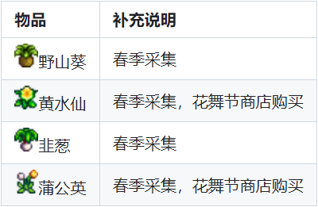
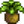
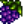
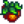

> [!NOTE]
> 本文内容参考至[星露谷Wiki收集包专栏](https://zh.stardewvalleywiki.com/mediawiki/index.php?title=%E6%94%B6%E9%9B%86%E5%8C%85&variant=zh)，进行二次整理以便于按季节规划

# 1. 春季

**工艺室——春季采集收集包：**

| 物品                                                         | 补充说明                 |
| :----------------------------------------------------------- | :----------------------- |
| 野山葵 | 春季采集                 |
| 黄水仙 | 春季采集，花舞节商店购买 |
| 韭葱     | 春季采集                 |
| 蒲公英 | 春季采集，花舞节商店购买 |

# 2. 夏季

**工艺室——夏季采集收集包：**

| 物品                                                         | 补充说明                   |
| ------------------------------------------------------------ | -------------------------- |
| 葡萄   | 夏季采集，秋季耕种         |
| 香味浆果 | 夏季采集，农村洞穴（果蝠） |
| 甜豌豆 | 夏季采集                   |

# 3. 秋季

**工艺室——秋季采集收集包**

|      |      |
| ---- | ---- |
|      |      |
|      |      |
|      |      |
|      |      |

# 4. 冬季

# 5. 无季节限定

