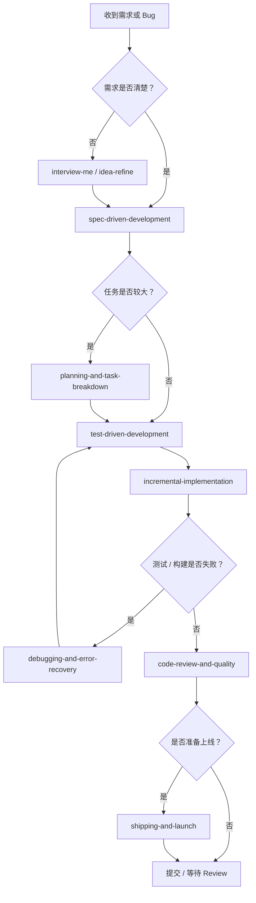

> 参考仓库

::github{repo="addyosmani/agent-skills"}

## 1. 这份仓库解决的核心问题

`agent-skills` 的价值不是“给 AI 更多知识”，而是 **给 AI 明确的工程工作流**。

在没有约束的情况下，AI 编程助手常见问题包括：

1. 需求没澄清就直接写代码。
2. 一次性改动太大，难以 review 和回滚。
3. 没有先写测试，靠“看起来没问题”判断完成。
4. 遇到错误时猜测式修复，而不是复现、定位、缩小范围。
5. 上线前缺少安全、性能、回滚和监控检查。
6. 文档只记录“做了什么”，没有记录“为什么这么做”。

`agent-skills` 把这些问题拆成一组可复用的 Markdown 工作流文件。每个 `SKILL.md` 都告诉 Agent：

- 什么时候应该使用这个 Skill。
- 应该按什么步骤执行。
- 哪些借口不能接受。
- 完成后必须提供什么证据。

一句话总结：**Skill 是给 Agent 用的工程 SOP，而不是给人阅读的知识库。**

## 2. 仓库内容结构

仓库主要由 5 类内容组成：

| 目录 / 文件 | 作用 | 工程实践中的用法 |
| --- | --- | --- |
| `skills/` | 23 个工程工作流 Skill | 按任务类型选择加载，作为 Agent 执行约束 |
| `.claude/commands/` | Claude Code slash commands | 把常见研发阶段封装成 `/spec`、`/plan`、`/build` 等命令 |
| `agents/` | 专家角色定义 | 用于代码审查、测试审查、安全审查等独立视角 |
| `references/` | 测试、安全、性能、可访问性等检查清单 | 在具体 Skill 需要时再加载，避免上下文过大 |
| `docs/` | 安装、适配不同 Agent、Skill 编写规范 | 团队引入或自定义 Skill 时参考 |

仓库的核心设计原则可以概括为 4 点：

1. **流程优先于知识**：Skill 不是百科，而是步骤。
2. **证据优先于假设**：测试、构建、日志、截图、监控数据才算完成证据。
3. **反合理化**：提前写出 Agent 常见偷懒借口，并给出反驳。
4. **渐进加载**：不要一次加载所有 Skill，只在当前任务需要时加载。

## 3. 研发生命周期对应的 Skill 选择

`agent-skills` 最适合按研发阶段使用。下面是推荐映射。

| 阶段 | 目标 | 推荐 Skill | 产物 |
| --- | --- | --- | --- |
| 需求澄清 | 确认要解决什么问题 | `interview-me`、`idea-refine` | 明确的问题定义、约束和成功标准 |
| 规格定义 | 在写代码前形成共识 | `spec-driven-development` | `SPEC.md` 或需求说明 |
| 任务拆分 | 把大需求拆成可交付单元 | `planning-and-task-breakdown` | `tasks/plan.md`、`tasks/todo.md` |
| 编码实现 | 小步交付，避免大爆炸式改动 | `incremental-implementation` | 小批量代码变更、可回滚提交 |
| 测试验证 | 用测试证明功能正确 | `test-driven-development` | 失败测试、通过测试、回归测试 |
| 调试修复 | 系统定位根因 | `debugging-and-error-recovery` | 复现步骤、根因、修复和防回归用例 |
| 接口设计 | 稳定边界和契约 | `api-and-interface-design` | API 约定、错误语义、版本策略 |
| 前端实现 | 交付可用、可访问、可维护 UI | `frontend-ui-engineering`、`browser-testing-with-devtools` | 页面、组件、浏览器验证证据 |
| 安全加固 | 防止输入、鉴权、密钥、依赖风险 | `security-and-hardening` | 安全检查结果、修复记录 |
| 性能优化 | 先测量再优化 | `performance-optimization` | 基线、瓶颈、优化后数据 |
| 代码审查 | 合并前多维质量检查 | `code-review-and-quality`、`code-simplification` | Review 报告、修改建议 |
| 上线发布 | 可观测、可回滚、可分阶段发布 | `shipping-and-launch`、`ci-cd-and-automation` | 发布清单、回滚方案、监控指标 |
| 文档沉淀 | 记录决策和迁移路径 | `documentation-and-adrs`、`deprecation-and-migration` | ADR、迁移指南、弃用计划 |

## 4. 最小可落地方案

如果团队第一次引入，不建议一开始把 23 个 Skill 全部塞进 Agent 上下文。推荐从下面 3 个开始。

### 4.1 三个基础 Skill

| Skill | 为什么优先引入 | 解决的主要问题 |
| --- | --- | --- |
| `spec-driven-development` | 防止 Agent 没搞清楚需求就开写 | 需求漂移、隐含假设、验收标准缺失 |
| `test-driven-development` | 要求用测试证明行为正确 | “看起来能跑”、缺少回归保护 |
| `code-review-and-quality` | 合并前做质量门禁 | 可读性、安全性、性能和架构问题被漏掉 |

### 4.2 推荐项目目录

可以在项目中建立一个轻量的 Agent 规则目录：

```text
project-root/
  AGENTS.md
  .agent-skills/
    spec-driven-development.md
    test-driven-development.md
    code-review-and-quality.md
  docs/
    adr/
  tasks/
    plan.md
    todo.md
```

如果你的工具支持直接引用外部文件，可以不复制 Skill 内容，只在 `AGENTS.md` 中声明使用方式。

### 4.3 `AGENTS.md` 示例

下面是一个可以直接改造使用的 `AGENTS.md`：

```markdown
# Agent 工作规则

## 默认原则

1. 非平凡代码修改前，先产出简短规格说明。
2. 修改业务逻辑、Bug 修复、接口行为时，必须先写或补充测试。
3. 每次改动保持小步提交，避免一次性修改过多文件。
4. 合并前必须进行代码审查，并给出测试和构建证据。
5. 如果遇到测试失败或运行异常，停止新增功能，先按调试流程定位根因。

## Skill 使用映射

- 新需求或需求不清晰：使用 `spec-driven-development`。
- 需求已明确但任务较大：使用 `planning-and-task-breakdown`。
- 实现跨多个文件的功能：使用 `incremental-implementation`。
- 改动任何业务行为：使用 `test-driven-development`。
- 测试失败、构建失败、线上异常：使用 `debugging-and-error-recovery`。
- 合并前：使用 `code-review-and-quality`。
- 涉及认证、权限、输入、文件上传、支付、PII：使用 `security-and-hardening`。
- 上线前：使用 `shipping-and-launch`。

## 完成标准

每次任务结束必须说明：

1. 改了什么。
2. 为什么这样改。
3. 如何验证。
4. 还有哪些风险或未完成项。
```

## 5. 日常开发工作流

下面是一套可以直接用于团队实践的流程。



这套流程的关键不是流程图本身，而是每个节点都有 **退出证据**。

| 节点 | 退出证据 |
| --- | --- |
| 需求澄清 | 用户、目标、约束、成功标准明确 |
| 规格定义 | 有验收标准、非目标、边界条件 |
| 任务拆分 | 每个任务可独立验证，依赖顺序清楚 |
| TDD | 有失败测试证明问题存在，有通过测试证明修复有效 |
| 增量实现 | 每个增量可构建、可测试、可回滚 |
| 调试 | 有复现步骤、根因说明和防回归用例 |
| Review | 有正确性、可读性、架构、安全、性能检查 |
| 上线 | 有监控、回滚、灰度或开关策略 |

## 6. 典型场景落地模板

### 6.1 新功能开发

适用：开发一个新页面、新接口、新业务流程。

推荐顺序：

```text
spec-driven-development
→ planning-and-task-breakdown
→ test-driven-development
→ incremental-implementation
→ code-review-and-quality
→ shipping-and-launch
```

执行提示词示例：

```text
请按 agent-skills 的方式处理这个新功能。
先使用 spec-driven-development 产出规格说明，不要直接写代码。
规格说明必须包含：目标、非目标、用户路径、接口变化、数据模型、验收标准、测试策略和风险。
```

当规格通过后：

```text
基于已确认的 SPEC.md，使用 planning-and-task-breakdown 拆成小任务。
每个任务必须包含：目标、涉及文件、验收标准、验证命令、是否可独立提交。
```

开始实现时：

```text
从 tasks/todo.md 中选择第一个未完成任务。
使用 test-driven-development 和 incremental-implementation。
先写失败测试，再写最小实现，最后运行相关测试和构建。
每完成一个小任务，说明验证结果。
```

### 6.2 Bug 修复

适用：线上报错、测试失败、用户反馈行为异常。

推荐顺序：

```text
debugging-and-error-recovery
→ test-driven-development
→ code-review-and-quality
```

执行提示词示例：

```text
请不要直接猜测修复。
先使用 debugging-and-error-recovery：复现问题、定位范围、构造最小失败用例、说明根因，再修改代码。
修复后必须补充回归测试，并给出测试命令和输出摘要。
```

Bug 修复的完成标准：

1. 能稳定复现原问题。
2. 有一个失败测试覆盖原问题。
3. 修复后该测试通过。
4. 相关测试套件通过。
5. 说明为什么不会引入同类回归。

### 6.3 重构和简化

适用：代码能跑，但复杂、难读、重复、难维护。

推荐顺序：

```text
code-simplification
→ test-driven-development
→ code-review-and-quality
```

执行提示词示例：

```text
请使用 code-simplification 重构这部分代码。
要求保持外部行为完全不变。
重构前先确认现有测试覆盖；如果覆盖不足，先补充 characterization tests。
不要为了减少行数牺牲可读性。
```

重构的完成标准：

| 检查项 | 要求 |
| --- | --- |
| 行为 | 外部行为不变 |
| 测试 | 重构前后测试均通过 |
| 可读性 | 命名、分支、抽象层次更清楚 |
| 风险 | 没有顺手改业务逻辑 |
| Review | 能解释每个抽象为什么存在 |

### 6.4 安全敏感改动

适用：登录、权限、Token、Webhook、文件上传、支付、用户隐私数据。

推荐顺序：

```text
security-and-hardening
→ test-driven-development
→ code-review-and-quality
→ shipping-and-launch
```

执行提示词示例：

```text
这是安全敏感改动，请使用 security-and-hardening。
重点检查：输入验证、鉴权、授权、密钥处理、日志脱敏、依赖风险、错误信息泄漏和重放攻击。
任何无法确认的安全假设都必须显式列出来。
```

安全改动的最小检查清单：

- [ ] 所有外部输入都有校验。
- [ ] 鉴权和授权分开检查。
- [ ] 服务端不信任前端传来的用户身份和权限。
- [ ] 日志不会输出 Token、密码、密钥、手机号、邮箱等敏感信息。
- [ ] 错误响应不会泄漏内部路径、SQL、堆栈或密钥。
- [ ] 新增依赖经过漏洞检查。
- [ ] 有负向测试覆盖越权、非法输入和过期凭证。

### 6.5 性能优化

适用：接口慢、页面慢、构建慢、资源占用高。

推荐顺序：

```text
performance-optimization
→ debugging-and-error-recovery
→ test-driven-development
→ code-review-and-quality
```

执行提示词示例：

```text
请使用 performance-optimization。
不要先改代码，先给出测量方法和基线数据。
优化方案必须说明：瓶颈证据、改动内容、预期收益、风险和优化后对比数据。
```

性能优化记录模板：

| 项目 | 内容 |
| --- | --- |
| 优化目标 | 例如 P95 响应时间小于 200ms |
| 基线数据 | 优化前的指标和采集方式 |
| 瓶颈证据 | Profiling、日志、SQL 执行计划、网络瀑布图等 |
| 优化方案 | 具体改动和原因 |
| 优化结果 | 优化后的同口径数据 |
| 副作用 | 缓存一致性、复杂度、成本、可观测性影响 |

## 7. Skill 选择决策表

当你不知道该让 Agent 用哪个 Skill，可以按下面的表判断。

| 你现在要做什么 | 应该使用 |
| --- | --- |
| 用户只说“帮我做个系统 / 页面 / 功能” | `interview-me` |
| 有想法但不够具体 | `idea-refine` |
| 要做一个新功能 | `spec-driven-development` |
| 功能较大，需要分阶段实现 | `planning-and-task-breakdown` |
| 修改会影响业务行为 | `test-driven-development` |
| 改动超过一个文件 | `incremental-implementation` |
| 测试失败或构建失败 | `debugging-and-error-recovery` |
| 设计接口、SDK、模块边界 | `api-and-interface-design` |
| 写 UI 或修 UI | `frontend-ui-engineering` |
| 浏览器行为和预期不一致 | `browser-testing-with-devtools` |
| 涉及登录、权限、文件、支付、隐私 | `security-and-hardening` |
| 感觉系统变慢 | `performance-optimization` |
| 合并 PR 前 | `code-review-and-quality` |
| 代码太绕但功能正确 | `code-simplification` |
| 要删除旧接口或迁移系统 | `deprecation-and-migration` |
| 做架构选择或公共 API 变化 | `documentation-and-adrs` |
| 准备发布到生产 | `shipping-and-launch` |
| 设置 CI/CD | `ci-cd-and-automation` |
| Agent 开始胡编 API 或忽略项目约定 | `context-engineering`、`source-driven-development` |
| 决策影响大，不能靠自信 | `doubt-driven-development` |

## 8. 团队实践中的质量门禁

把 Skill 真正落地，不能只靠“提醒 Agent”。建议把它们变成 PR 模板、CI 检查和发布清单。

### 8.1 PR 模板

```markdown
## 变更说明

- 本 PR 解决的问题：
- 主要改动：
- 不包含的范围：

## 使用的 Agent Skill

- [ ] spec-driven-development
- [ ] planning-and-task-breakdown
- [ ] test-driven-development
- [ ] incremental-implementation
- [ ] debugging-and-error-recovery
- [ ] security-and-hardening
- [ ] performance-optimization
- [ ] code-review-and-quality
- [ ] shipping-and-launch

## 验证证据

- [ ] 单元测试通过：`命令和摘要`
- [ ] 集成测试通过：`命令和摘要`
- [ ] 构建通过：`命令和摘要`
- [ ] 手工验证完成：`步骤和结果`
- [ ] 如果是 UI：附截图或录屏
- [ ] 如果是性能改动：附优化前后数据
- [ ] 如果是安全改动：附负向测试或审查结果

## 风险和回滚

- 风险：
- 监控指标：
- 回滚方式：
```

### 8.2 CI 质量门禁

建议最少包含：

```text
lint
→ typecheck / compile
→ unit test
→ integration test
→ build
→ security scan
→ artifact publish
```

如果项目较成熟，可以继续增加：

- 依赖漏洞扫描。
- License 检查。
- E2E 测试。
- 性能预算检查。
- 前端可访问性检查。
- 数据库 migration dry-run。

### 8.3 发布清单

```markdown
## 发布前检查

- [ ] 本次发布范围明确。
- [ ] 所有必须测试通过。
- [ ] 关键路径有监控指标。
- [ ] 日志中可以定位问题，但不会泄漏敏感信息。
- [ ] 有 Feature Flag 或灰度策略。
- [ ] 有明确回滚命令或回滚步骤。
- [ ] 相关人员知道发布时间和影响范围。
- [ ] 文档、变更日志或 ADR 已更新。
```

## 9. 如何自定义团队自己的 Skill

如果仓库中的 Skill 不完全适合你的团队，可以基于它的 `SKILL.md` 格式扩展。

一个团队 Skill 至少应包含：

```markdown
---
name: your-team-skill-name
description: Guides agents through [具体任务]. Use when [明确触发条件].
---

# Your Team Skill Name

## Overview

这个 Skill 解决什么问题，为什么团队需要它。

## When to Use

- 什么时候必须使用。
- 什么时候不要使用。

## Core Process

1. 第一步要做什么。
2. 第二步要做什么。
3. 每一步需要什么证据。

## Common Rationalizations

| Rationalization | Reality |
| --- | --- |
| “这个改动很小，不用测试” | 小改动也可能影响核心路径，至少运行相关测试。 |

## Red Flags

- Agent 没有说明假设。
- Agent 没有运行验证命令。
- Agent 一次性修改大量无关文件。

## Verification

- [ ] 验证命令已运行。
- [ ] 输出结果已记录。
- [ ] 风险和回滚方式已说明。
```

自定义 Skill 时要避免两个问题：

1. **写成知识库**：只解释概念，没有步骤，Agent 不知道怎么执行。
2. **写得过宽**：一个 Skill 同时管需求、开发、测试、上线，最后没有任何约束力。

## 10. 常见反模式

### 10.1 一次加载所有 Skill

不要把所有 Skill 都塞进上下文。上下文越大，Agent 越容易忽略真正相关的约束。

更好的做法：

1. 默认加载 `using-agent-skills` 或团队自己的 Skill 路由规则。
2. 当前任务需要什么，就加载什么。
3. 复杂任务按阶段切换 Skill。

### 10.2 把 Skill 当作提示词装饰

错误用法：

```text
请参考 test-driven-development，帮我实现功能。
```

更好的用法：

```text
请严格使用 test-driven-development。
先写一个会失败的测试来描述期望行为。
不要在失败测试出现前实现业务代码。
完成后给出测试命令、失败输出摘要、修复后通过输出摘要。
```

### 10.3 只有开发 Skill，没有 Review 和 Ship Skill

很多团队只约束“怎么写代码”，但不约束“怎么合并”和“怎么上线”。这会导致：

- 代码能跑但不可维护。
- 没有安全和性能检查。
- 上线失败后不知道如何回滚。

至少应该把 `code-review-and-quality` 和 `shipping-and-launch` 放进合并与发布流程。

### 10.4 让 Agent 自己决定所有事情

Skill 可以规范执行过程，但不能替代人做产品和工程取舍。以下内容仍然需要人确认：

- 业务目标和优先级。
- 可接受的技术债。
- 安全和合规边界。
- 发布窗口和风险承受能力。
- 是否为了速度牺牲长期可维护性。

## 11. 建议的引入路线

### 第一周：只做最小规则

目标：让 Agent 不再无约束写代码。

引入：

- `spec-driven-development`
- `test-driven-development`
- `code-review-and-quality`

产出：

- `AGENTS.md`
- PR 模板
- 最小验证命令清单

### 第二周：接入任务拆分和增量实现

目标：降低大改动风险。

引入：

- `planning-and-task-breakdown`
- `incremental-implementation`
- `debugging-and-error-recovery`

产出：

- `tasks/plan.md`
- `tasks/todo.md`
- Bug 修复模板

### 第三周：补齐安全、性能和发布

目标：让 Agent 参与生产级交付。

引入：

- `security-and-hardening`
- `performance-optimization`
- `shipping-and-launch`
- `ci-cd-and-automation`

产出：

- 发布检查清单
- 回滚模板
- 性能基线记录
- 安全审查清单

### 第四周以后：团队定制

目标：沉淀自己的工程约束。

可以自定义：

- 前端组件规范 Skill。
- 后端接口规范 Skill。
- 数据库 migration Skill。
- 线上故障复盘 Skill。
- 大模型应用评测 Skill。

## 12. 一个完整任务的示例用法

假设需求是：为电商系统增加优惠券核销接口。

### 12.1 规格阶段

```text
请使用 spec-driven-development，为“优惠券核销接口”写规格。
必须包含：用户路径、接口契约、幂等性要求、并发扣减风险、错误码、验收标准和测试策略。
```

预期产物：

```markdown
# SPEC: 优惠券核销接口

## 目标

用户下单时可以核销一张可用优惠券，系统需要保证优惠券不能重复使用。

## 非目标

- 不实现优惠券发放。
- 不实现营销规则配置后台。

## 验收标准

- 同一张优惠券只能成功核销一次。
- 已过期、已使用、非本人优惠券不能核销。
- 并发请求下不会出现重复核销。
```

### 12.2 任务拆分阶段

```text
基于 SPEC，使用 planning-and-task-breakdown 拆任务。
每个任务必须能独立测试和提交。
```

示例任务：

```markdown
- [ ] 新增优惠券核销领域模型和状态枚举。
- [ ] 新增核销接口契约和错误码。
- [ ] 实现核销服务，包含幂等和并发保护。
- [ ] 补充单元测试和并发测试。
- [ ] 更新 API 文档和发布说明。
```

### 12.3 实现阶段

```text
选择第一个任务，使用 test-driven-development 和 incremental-implementation。
先写失败测试，再实现最小代码。
```

### 12.4 Review 阶段

```text
请使用 code-review-and-quality 审查当前 diff。
从正确性、可读性、架构、安全、性能 5 个维度给出结论。
只阻塞必须修改的问题，非阻塞建议单独标注。
```

### 12.5 发布阶段

```text
请使用 shipping-and-launch，为优惠券核销接口准备上线清单。
重点关注：灰度、监控、错误率、重复核销告警和回滚方案。
```

## 13. 总结

`agent-skills` 的核心启发是：AI 编程助手不缺“写代码能力”，缺的是 **稳定执行工程流程的约束**。

在工程实践中，建议把它当成三层体系使用：

1. **Skill**：定义 Agent 怎么做。
2. **Persona**：定义 Agent 站在什么角色审查。
3. **Command / Workflow**：定义什么时候触发哪些 Skill 和 Persona。

真正落地时，不需要一次引入全部内容。更可行的方式是：

1. 先用 `spec-driven-development`、`test-driven-development`、`code-review-and-quality` 建立最小质量闭环。
2. 再用 `planning-and-task-breakdown` 和 `incremental-implementation` 控制变更规模。
3. 最后把安全、性能、CI/CD、发布和文档接入团队流程。

这样做的结果是：Agent 不再只是“帮你多写代码”，而是开始按一个可审计、可验证、可回滚的工程流程协作。
