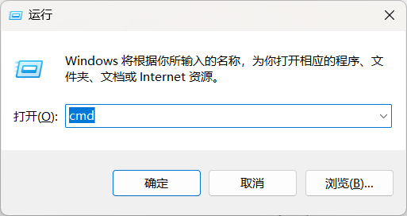

# 1. 需求分析

作为动漫爱好者，我常常遇到这样的烦恼：明明已经在电脑上下载好了最新的番剧，躺到床上想用手机观看时，却发现文件还在电脑里，不得不爬起来把文件传到手机。虽然电脑和手机都连着同一个WiFi，但传输文件却像隔了一道无形的墙。

局域网共享本应是最便捷的解决方案，但Windows文件夹共享配置复杂，而NAS设备又价格不菲，普通用户往往不得不在便利性和技术门槛之间做出妥协。本文将介绍如何通过Everything这款工具，简单几步将电脑变成私人流媒体服务器，轻松实现局域网内多设备文件共享，彻底告别繁琐的文件传输。

# 2. 工具准备

请自行前往官网下载对应版本的Everything（[Everything下载链接](https://www.voidtools.com/zh-cn/downloads/)）。

# 3. 进行配置

下载完成之后，打开Everything。在顶部工具栏中按照 ‘`工具 -> 选项 `进入设置页面。

进入配置页面后点击 `HTTP服务器`，并勾选 `启用HTTP服务器`，绑定本机局域网IP和端口，注意避免端口冲突。为了保障数据安全，可自行配置HTTP服务器用户名和密码，此处就不再演示。

# 4. 测试验证

手机浏览器中输入预先配置的 `IP : 端口` ，以我的配置为例，输入`192.168.31.10:18080`。之后出现如下图所示的页面，表明配置成功。

然后我们随便打开一个视频，发现可正常播放，至此配置全部完成。

# 5. 常见问题

## 1. 如何查看本机局域网IP

windows电脑按下 `win + R` 快捷键呼出运行窗口，并输入 `cmd` ，点击确认。

输入命令 `ipconfig`

局域网IP地址如下所示，本机的局域网IP为 `192.168.31.10`

## 2. 无法打开HTTP服务器：绑定失败 10049

**问题描述：**

**解决方案：**检查IP地址是否正确，或以管理员身份重新运行Everything

## 3. 无法打开HTTP服务器：绑定失败 10048

**问题描述：**

**解决方案：**端口冲突，更换端口后重新尝试