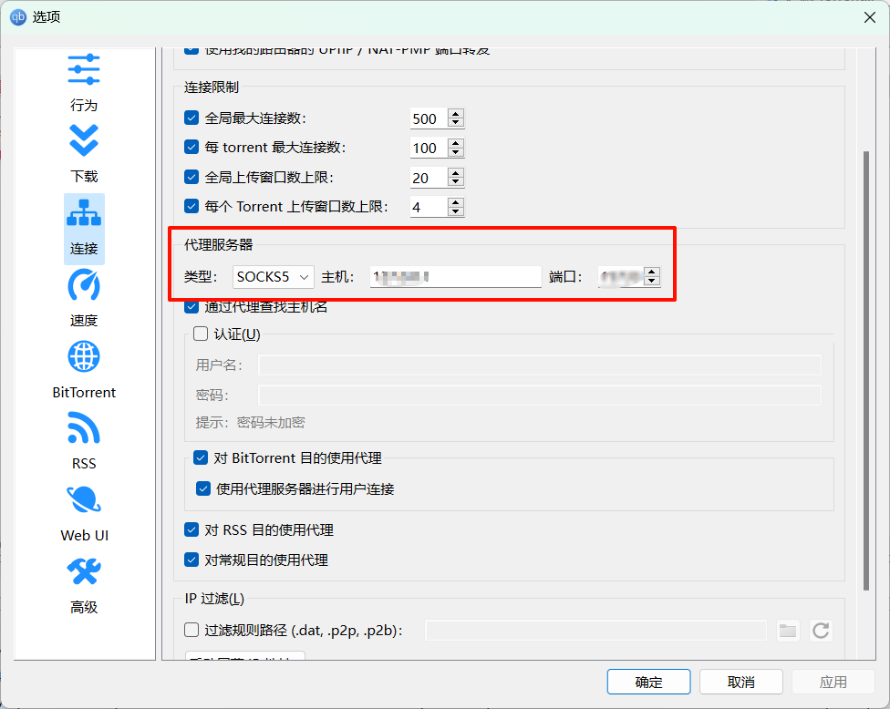

# 1. 什么是RSS

> 引用一段wiki对于RSS的介绍[RSS - 维基百科](https://zh.wikipedia.org/wiki/RSS)

**RSS**（英文全称：RDF Site Summary 或 Really Simple Syndication），中文译作**简易信息聚合**，也称**聚合内容**，是一种格式规范，用以聚合多个网站更新的内容并自动通知网站订阅者。使用 RSS 后，网站订阅者便无需再手动查看网站是否有新的内容，同时 RSS 可将多个网站更新的内容进行整合，以摘要的形式呈现，有助于订阅者快速获取重要信息，并选择性地点阅查看

简单来说，借助RSS，我们即可实现对资源的订阅，而无需手动查看资源的更新情况

# 2. 软件准备

为了实现订阅和获取RSS资源，我们需要有一个RSS阅读器和下载器。在此处，将以qBittorrent为例，进行演示。其他拥有RSS订阅和下载功能的软件也能实现类似的效果，由于实现的思路是类似的，此处便不一一演示。

> [qBittorrent 下载地址](https://www.qbittorrent.org/download)

## 2.1 开启RSS阅读器

在第一次下载之后，默认是不会显示RSS阅读器页面的。因此，我们勾选`视图 - RSS阅读器`来打开

首页出现RSS阅读器页面，设置成功

## 2.2 打开RSS订阅功能

进入`工具 - 设置 - RSS`页面，勾选`启用获取RSS订阅`和`启用RSS Torrent自动下载`，并自行配置更新时间间隔和每个订阅文章数目最大值

## 2.3 配置代理服务器

由于国内的网络问题，对于一些特殊资源需要配置代理才能正常访问。进入`工具 - 设置 - 连接`页面，找到代理服务器，自行配置

# 3. 获取资源

我们进入任意一个资源站（请自行寻找），点击目标资源的RSS图标

之后浏览器会跳转到一个网页，我们复制这个网址

进入qBittorrent的RSS阅读器页面，点击`新RSS订阅`，

输入刚才复制的网址，点击确定

在左侧的列表中，出现刚才订阅的资源，说明订阅成功

# 4. 开启自动下载

在完成对资源的订阅之后，点击RSS下载器

创建一条新的下载规则，勾选需要下载的源，同时可以配置过滤信息，来筛选需要下载的内容。以此处为例，字幕组可能会同时发布简体和繁体两个版本，此时我们通过设置过滤器，可以使其只下载简体版本。在右侧的列表中，我们可以看到过滤后的结果，以便更好编写过滤器

在成功创建下载规则之后，当应用检测到源有更新时，就会自动下载符合条件的资源

> **下载完成的通知：**
>
> qBittorrent支持在下载完成后发送邮件进行提醒，习惯使用邮箱的用户可以进行配置，以达到更好的提示效果

# 常见问题

1. **订阅之后查看不到对应资源**

可能是由于网络问题，资源被限制访问，可以尝试修改代理配置。具体请参考本文的[配置代理服务器](#23-配置代理服务器)
相关介绍

