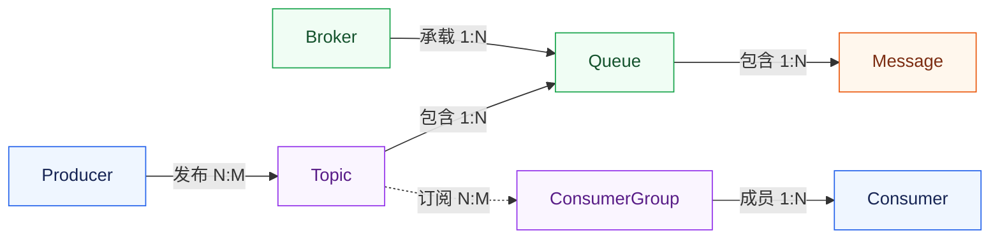
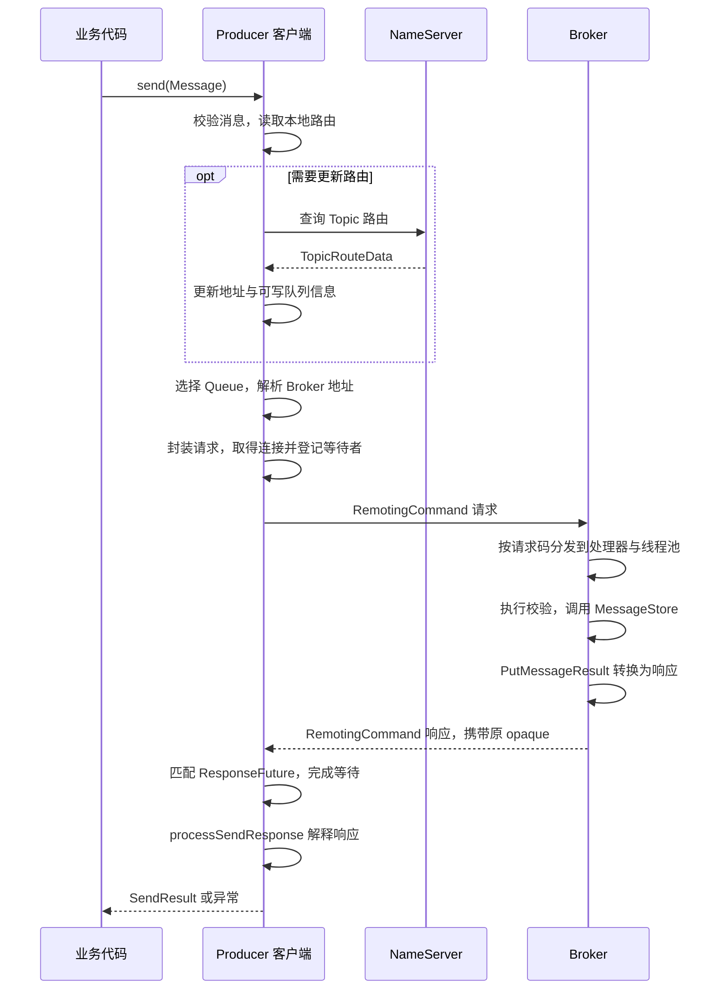

本文以 RocketMQ 4.9.8 的 Java 客户端为例，从 `producer.send(message)` 出发，跟踪一次普通同步发送如何完成队列选择、消息存储和响应返回

## 1. 发送链路中的基本对象

### 1.1 Producer、Broker 与 Consumer

| 概念 | 含义 |
| --- | --- |
| Message | 一条消息，包含消息体和描述消息的属性 |
| Producer | 构建并发送消息的客户端 |
| Broker | 消息服务端，负责接收、保存消息，处理消息获取和查询请求 |
| Consumer | 获取消息并交给业务代码处理的客户端 |

Producer 把消息交给 Broker 保存，Consumer 再从 Broker 获取消息并执行业务。Broker 是独立运行的服务，Producer 和 Consumer 通常集成在业务应用内，一个应用也可以同时发送和消费消息

### 1.2 Topic、Queue 和 ConsumerGroup

Topic 是消息主题，表示一类消息，也是发送和订阅的逻辑入口。Queue 是 Topic 下的逻辑分区，一个 Topic 可以包含多个 Queue，这些 Queue 可以分布在不同 Broker 上

客户端用 `topic`、`brokerName`、`queueId` 共同确定一个 Queue。其中 `brokerName` 是 Broker 的逻辑名称，建立连接时需要将它解析为地址和端口

一次发送尝试选择一个 Queue；重试时可能选择其他队列。多个 Queue 用于分散消息、支持并行消费。消息存入队列后获得队列内的位点 QueueOffset，各队列分别计数

ConsumerGroup 是消费组，用于组织承担同一类处理职责的 Consumer 实例。在集群消费模式下，同组实例通过分配 Queue 分担任务，不同组可以独立订阅和处理同一个 Topic

订阅关系指定 Topic 和消息过滤条件，同组实例应保持一致的订阅

### 1.3 消息属性

构建消息时，主要指定以下信息：

| 属性 | 用途 |
| --- | --- |
| Topic | 消息发往哪个主题 |
| Tag | 在主题内进一步分类，供订阅过滤使用 |
| Key | 按业务标识查询和关联消息 |
| Body | 业务数据，传输时表现为字节数组 |

发送结果中的 `SendResult.msgId` 通常是客户端生成的唯一标识，`offsetMsgId` 则是 Broker 返回的存储位置标识。Key 由业务设置，用于按订单号、事件 ID 等信息查询和关联消息

### 1.4 概念关系与订阅示意

图中的 `1:N` 表示一对多，`N:M` 表示多对多



Topic 与 Broker 通过 Queue 关联：一个 Topic 的队列可以分布在多个 Broker，一个 Broker 也可以承载多个 Topic 的队列，因此两者是多对多关系

## 2. 发送之前，客户端准备了什么

### 2.1 业务入口与客户端运行资源

业务代码使用 `DefaultMQProducer` 配置并发送消息。这个对象提供对外 API，发送流程由它持有的 `DefaultMQProducerImpl` 协调，包括状态检查、路由获取、队列选择和失败重试

路由维护、心跳和网络通信等公共资源由 `MQClientInstance` 管理。同一 JVM 进程内、同一客户端标识下的 Producer 可以复用这些资源

这些对象的持有关系如下：

```text
DefaultMQProducer：业务使用的发送入口
└── DefaultMQProducerImpl：协调一次消息发送
    └── MQClientInstance：维护路由、地址和客户端公共资源
        └── MQClientAPIImpl：组织请求、解释响应
            └── NettyRemotingClient：连接管理与网络通信
```

### 2.2 start() 初始化客户端

构造 Producer 时，主要创建配置和运行对象。[`DefaultMQProducerImpl.start()`](https://github.com/apache/rocketmq/blob/rocketmq-all-4.9.8/client/src/main/java/org/apache/rocketmq/client/impl/producer/DefaultMQProducerImpl.java#L188-L225) 检查配置，获取或创建 `MQClientInstance`，再登记当前 Producer。[`MQClientInstance.start()`](https://github.com/apache/rocketmq/blob/rocketmq-all-4.9.8/client/src/main/java/org/apache/rocketmq/client/impl/factory/MQClientInstance.java#L225-L257) 负责启动网络客户端、路由刷新和心跳等后台任务

NameServer 保存 Broker 注册的 Topic、队列和地址信息。客户端从中查询路由，在本地缓存，并通过后台任务定期刷新

Producer 通常随应用启动和关闭，后续发送复用路由缓存、网络客户端和连接。目标 Topic 的可写路由和 Broker 地址会在发送时查找，缺失时再更新

## 3. 路由怎样变成一个确定的发送目标

### 3.1 从路由元数据得到可写队列

准备好 Producer 和 Topic 后，业务发起一次发送：

```java
Message message = new Message(topic, tags, key, body);
SendResult result = producer.send(message);
```

调用进入 `sendDefaultImpl()` 后，先检查 Producer 状态和消息合法性，再取得 Topic 的发送信息

NameServer 返回的 `TopicRouteData` 包含各 Broker 的队列、读写权限和地址信息。[`topicRouteData2TopicPublishInfo()`](https://github.com/apache/rocketmq/blob/rocketmq-all-4.9.8/client/src/main/java/org/apache/rocketmq/client/impl/factory/MQClientInstance.java#L161-L208) 从中筛选具有写权限和 Master 地址的 Broker，再按写队列数量构造候选队列：

```text
TopicRouteData
├── 各 Broker 的队列数量与权限
└── 各 Broker 的地址信息
        ↓
筛选可写且路由中包含 Master 地址的 Broker
        ↓
按写队列数量构造 MessageQueue 列表
        ↓
TopicPublishInfo
```

例如，某个 Broker 对目标 Topic 提供两个可写队列，客户端就会构造 Q0、Q1 两个 `MessageQueue`，分别记录 Topic、Broker 名称和队列编号

### 3.2 缓存与刷新怎样配合

`DefaultMQProducerImpl` 保存 Topic 对应的发送信息，`MQClientInstance` 维护公共路由和 Broker 地址。查找 Topic 时，先尝试复用本地可用结果，不足时再更新

[`tryToFindTopicPublishInfo()`](https://github.com/apache/rocketmq/blob/rocketmq-all-4.9.8/client/src/main/java/org/apache/rocketmq/client/impl/producer/DefaultMQProducerImpl.java#L672-L689) 先检查缓存，缺失或不可用时向 NameServer 查询：

```java
TopicPublishInfo topicPublishInfo = this.topicPublishInfoTable.get(topic);
if (null == topicPublishInfo || !topicPublishInfo.ok()) {
    this.topicPublishInfoTable.putIfAbsent(topic, new TopicPublishInfo());
    this.mQClientFactory.updateTopicRouteInfoFromNameServer(topic);
    topicPublishInfo = this.topicPublishInfoTable.get(topic);
}
```

公共客户端取得新路由后，会更新 Broker 地址，并把转换后的发送信息交给相关 Producer，后续发送便使用新的候选队列

NameServer 负责路由查询，消息由 Producer 直接发往 Broker。本地缓存可用时，发送就能复用它

无法取得可用路由时，先确认 NameServer 地址、环境、Topic 和可写队列；`topicRoute` 和 `clusterList` 可用于查看路由及 Broker 信息

### 3.3 选择队列，再解析连接地址

`sendDefaultImpl()` 拿到 `TopicPublishInfo` 后，通过发送策略选择一个 `MessageQueue`。选定结果交给 `sendKernelImpl()`，再根据 Broker 的逻辑名称找到具体发送地址

```text
可写队列列表
→ 发送策略选中一个 MessageQueue
→ 根据 brokerName 解析发送地址
→ 获取或建立到该地址的连接
```

队列选择决定消息写入哪个逻辑分区，地址查找决定请求发往哪里。Broker 地址变更后，客户端通过路由更新取得新地址

网络客户端通过 `getAndCreateChannel()` 获取连接，已有可用连接就复用，没有时再建立

路由里有地址但连接失败时，应检查应用实际连接的 IP 和端口：注册地址是否可达、端口映射是否一致、客户端是否仍持有失效地址

## 4. 请求进入 Broker 后怎样被处理

### 4.1 Message 被组织成通信请求

发送目标确定后，`MQClientAPIImpl` 将消息及发送参数封装为 `RemotingCommand`，通过请求头和消息体传给 Broker

请求结构如下：

```text
RemotingCommand
├── code：说明这是发送消息等哪一种请求
├── 请求头：Topic、队列编号、消息属性等
├── body：消息体字节
└── opaque：关联本次请求与响应的请求标识
```

`opaque` 是通信层的请求标识，用于匹配这次请求及其响应

客户端通过 `writeAndFlush()` 将请求写入连接，随后等待 Broker 返回处理结果

### 4.2 请求码找到处理器，线程池承接处理任务

Broker 的同一个通信入口会接收发送、拉取、查询等请求，通信层根据请求码查找处理器及其执行线程池

发送处理器的注册关系可以简化为：

```java
remotingServer.registerProcessor(
    RequestCode.SEND_MESSAGE,
    sendMessageProcessor,
    this.sendMessageExecutor
);
```

[`BrokerController`](https://github.com/apache/rocketmq/blob/rocketmq-all-4.9.8/broker/src/main/java/org/apache/rocketmq/broker/BrokerController.java#L544-L558) 将 `SEND_MESSAGE`、`SEND_MESSAGE_V2` 等请求码注册到同一个发送处理器。收到请求后，通信层将任务提交到 `sendMessageExecutor`，由工作线程调用 `SendMessageProcessor`

```text
通信层接收并解码请求
→ 根据 code 查找处理器与线程池
→ 提交发送处理任务
→ 工作线程执行校验与消息处理
```

发送任务可能先在线程池中排队，再执行校验和存储。线程池繁忙时，排队时间也会消耗 Producer 的响应等待时间

### 4.3 处理器把消息交给存储层

发送处理器检查 Topic、权限和消息合法性，构造服务端内部消息对象，再通过 `MessageStore` 接口提交写入

存储层把消息追加到 CommitLog，返回 `PutMessageResult`，处理器据此生成发送响应。后台任务从 CommitLog 分发消息，构建供消费读取使用的 ConsumeQueue 等索引

处理过程可以概括为：

```text
发送请求
→ 服务端内部消息对象
→ MessageStore 写入
→ PutMessageResult
→ 发送响应
```

[`SendMessageProcessor`](https://github.com/apache/rocketmq/blob/rocketmq-all-4.9.8/broker/src/main/java/org/apache/rocketmq/broker/processor/SendMessageProcessor.java#L80-L108) 使用异步请求处理接口，调用 `asyncPutMessage()` 后得到 `CompletableFuture<PutMessageResult>`，在 Future 完成后处理存储结果并返回响应

[`CommitLog.asyncPutMessage()`](https://github.com/apache/rocketmq/blob/rocketmq-all-4.9.8/store/src/main/java/org/apache/rocketmq/store/CommitLog.java#L617-L749) 在当前调用中执行消息追加，再将刷盘和副本同步的等待组合为 Future 返回。发送工作线程随后可以结束当前任务，等待完成后的回调继续处理响应

```text
执行消息追加 → 提交刷盘与副本等待 → 返回 Future
Future 未完成时，发送工作线程可结束当前任务
结果就绪 → 处理 PutMessageResult → 返回响应
```

Producer 的同步发送会等待最终响应，Broker 则通过 Future 和回调组织内部处理

## 5. 响应怎样回到原来的发送调用

### 5.1 用请求标识找到等待者

同一连接可以承载多个请求，响应顺序可能与发送顺序不同，因此客户端通过 `opaque` 找到对应的等待者

请求发出前，[`invokeSyncImpl()`](https://github.com/apache/rocketmq/blob/rocketmq-all-4.9.8/remoting/src/main/java/org/apache/rocketmq/remoting/netty/NettyRemotingAbstract.java#L409-L455) 会创建 `ResponseFuture`，以 `opaque` 为键登记到响应表，再发送请求并等待响应

响应到达后，[`processResponseCommand()`](https://github.com/apache/rocketmq/blob/rocketmq-all-4.9.8/remoting/src/main/java/org/apache/rocketmq/remoting/netty/NettyRemotingAbstract.java#L289-L308) 读取 `opaque`，找到对应的 `ResponseFuture`，填入响应并唤醒等待线程；异步请求则执行回调

```text
发出请求：opaque → ResponseFuture
收到响应：读取 opaque → 找到 ResponseFuture → 完成等待或回调
```

### 5.2 通信响应还要转换成发送结果

同步发送的通信调用返回后，还要经过一次结果解释：

```java
RemotingCommand response = this.remotingClient.invokeSync(addr, request, timeoutMillis);
return this.processSendResponse(brokerName, msg, response, addr);
```

`invokeSync()` 返回服务端响应，[`processSendResponse()`](https://github.com/apache/rocketmq/blob/rocketmq-all-4.9.8/client/src/main/java/org/apache/rocketmq/client/impl/MQClientAPIImpl.java#L623-L695) 再将响应码转换为 `SendStatus`。权限不足等拒绝响应会被转换为 `MQBrokerException`，发送状态则随 `SendResult` 返回：

| SendStatus | 含义 |
| --- | --- |
| `SEND_OK` | 服务端返回发送成功，确认范围取决于刷盘、副本等配置 |
| `FLUSH_DISK_TIMEOUT` | 消息已追加，但同步刷盘等待超时 |
| `FLUSH_SLAVE_TIMEOUT` | 消息已追加，但同步复制到副本的等待超时 |
| `SLAVE_NOT_AVAILABLE` | 同步复制要求下，没有满足条件的可用副本 |

业务代码需要检查 `SendStatus`：刷盘或副本等待超时会作为结果返回，此时消息可能已经写入。`SendResult` 还携带消息标识、目标队列与 QueueOffset，便于查询消息

`SEND_OK` 表示发送成功，其持久化保证取决于 Broker 的刷盘和副本配置。Consumer 的业务处理在后续独立进行

### 5.3 同步与异步的差别在等待方式

同步发送的调用线程等待 Broker 响应，异步发送通过回调交付结果。两者使用同一套请求与响应匹配机制：

| 方式 | 结果如何交给业务 |
| --- | --- |
| 同步发送 | 当前调用等待发送结果或异常 |
| 异步发送 | 后续通过回调取得结果，调用阶段也可能直接失败 |
| 单向发送 | 不等待 Broker 发送响应，不能据此确认服务端已接收 |

使用异步发送时，应等在途发送结束后再关闭 Producer。三种方式的 API 示例见官方文档 [Simple Message Sending](https://rocketmq.apache.org/docs/4.x/producer/02message1/)

## 6. 超时与重试怎样影响发送结果

### 6.1 同步发送的重试策略

普通同步发送的重试由 [`sendDefaultImpl()`](https://github.com/apache/rocketmq/blob/rocketmq-all-4.9.8/client/src/main/java/org/apache/rocketmq/client/impl/producer/DefaultMQProducerImpl.java#L537-L670) 协调。`retryTimesWhenSendFailed` 默认为 `2`，加上首次发送，最多尝试三次。遇到可重试的异常或响应码，且时间仍有剩余时，客户端继续尝试

每轮尝试会重新选队列，并把此前消耗的时间从本次调用的超时预算中扣除：

```text
send(message)，共享本次调用的超时预算
├── 第一次尝试：选择 Queue，发送并等待
├── 遇到可重试错误且时间仍有剩余：重新选择 Queue
└── 得到结果，或次数、时间耗尽后结束
```

参数在发送循环前校验失败、Broker 返回不可重试的响应码或线程被中断时，发送会提前结束

收到非 `SEND_OK` 的结果后，是否继续尝试由 `retryAnotherBrokerWhenNotStoreOK` 控制。它默认为 `false`，此时客户端直接返回结果；开启后才会在剩余次数和时间内重试。这两个参数的默认值定义在 [`DefaultMQProducer`](https://github.com/apache/rocketmq/blob/rocketmq-all-4.9.8/client/src/main/java/org/apache/rocketmq/client/producer/DefaultMQProducer.java#L100-L124) 中

### 6.2 超时后的消息状态

Producer 等待超时时，可能请求尚未到达 Broker，也可能 Broker 已追加消息，只是响应没有及时返回。客户端仅凭超时异常，无法区分这两种情况

```text
第一次尝试：Broker 已追加消息 → 响应丢失或迟到 → Producer 超时
第二次尝试：客户端重新发送 → Broker 再次追加消息
```

重试成功后，第一次写入的记录也可能保留，形成重复消息。返回结果中的目标队列和 QueueOffset 对应得到确认的那次尝试

同步等待退出后，通信层会移除响应表中的记录。迟到的响应找不到对应请求时，会留下未匹配请求的日志

### 6.3 用业务标识处理重复

RocketMQ 不会按业务 Key 或客户端消息 ID 自动去重。消费端需要选定幂等标识，例如订单事件 ID，并让去重判断与业务状态变更保持一致

排查重试产生的重复消息时，可以用业务事件 ID 关联各次发送，记录 Topic、Broker、队列、耗时和返回状态，再结合 `msgId`、`offsetMsgId`、QueueOffset 查询存储记录

## 7. 一次消息发送的完整流转

客户端启动后，一次发送尝试的请求与响应流程如下：



路由和队列选择确定消息发往哪里，Broker 完成校验与存储，`opaque` 和 `ResponseFuture` 将响应交回原来的发送调用，最后由 `processSendResponse()` 转换为业务代码收到的结果
