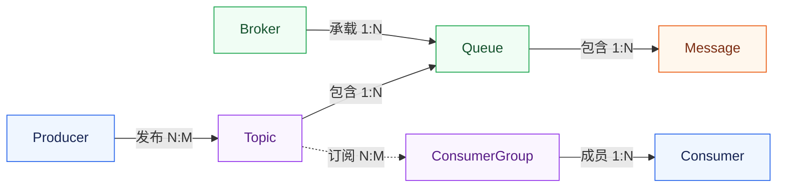
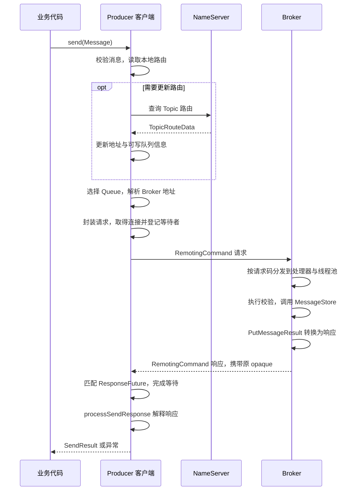

业务代码调用一次 `producer.send(message)`，客户端需要找到可写队列、连接 Broker、发送请求，再把 Broker 的处理结果交回调用线程。发送成功、网络写入完成和消费完成，分别对应这条链路中的不同阶段

本文以 Apache RocketMQ **4.9.8** 的传统 Java 客户端为源码基准，沿 `DefaultMQProducer` 直接连接 Broker 的普通同步发送路径展开。不包含事务消息、延时消息、批量消息、指定队列或自定义选择器的发送，也不展开 5.x gRPC SDK 与 Proxy 接入链路

## 1. 发送链路中的基本对象

### 1.1 消息经过哪些角色

| 概念 | 含义 |
| --- | --- |
| Message | 一条消息，包含消息体和描述消息的属性 |
| Producer | 构建并发送消息的客户端 |
| Broker | 消息服务端，负责接收、保存消息，处理消息获取和查询请求 |
| Consumer | 获取消息并交给业务代码处理的客户端 |

Broker 通常作为持续运行的服务对外监听端口。Producer 和 Consumer 通常集成在业务应用内，一个应用也可以同时承担发送和消费两种角色

最基本的关系是：Producer 把消息交给 Broker，Broker 保存消息，Consumer 再从 Broker 获取消息并执行业务

### 1.2 Topic、Queue 和 ConsumerGroup

Topic 是消息主题，表示一类消息，也是发送和订阅的逻辑入口。Queue 是 Topic 下的逻辑分区，一个 Topic 可以包含多个 Queue，这些 Queue 可以分布在不同 Broker 上

客户端用 `topic`、`brokerName`、`queueId` 描述一个 Queue。其中 `brokerName` 是逻辑名称，连接时还需要取得对应的地址和端口；单独一个 `queueId` 不能确定消息所在的队列

一次发送尝试只选择一个 Queue；如果触发重试，后续尝试可能选择其他队列。多个 Queue 用于分布和并行处理消息，不是同一条消息的多份副本；消息存入队列后获得队列内的位置，称为 QueueOffset，不同队列的位点分别计算

ConsumerGroup 是消费组，用于组织承担同一类处理职责的 Consumer 实例。4.x 的集群消费模式下，同组实例通过分配 Queue 分担消费任务；广播消费模式下，每个实例都会接收所订阅的消息。不同组可以独立订阅和处理同一个 Topic

订阅关系说明消费组接收哪个 Topic、满足什么过滤条件的消息。同组实例应保持一致的订阅，避免部分实例接收的消息范围不同

### 1.3 消息属性

构建消息时，主要指定以下信息：

| 属性 | 用途 |
| --- | --- |
| Topic | 消息发往哪个主题 |
| Tag | 在主题内进一步分类，供订阅过滤使用 |
| Key | 按业务标识查询和关联消息 |
| Body | 业务数据，传输时表现为字节数组 |

在本文版本中，普通消息的 `SendResult.msgId` 通常是客户端生成的唯一标识，`offsetMsgId` 则来自 Broker 返回的存储位置标识。两者都不同于业务 Key，排查时应保留具体字段名，避免把不同含义的 ID 混在一起

Key 是查询和关联信息，不是自动去重开关。是否属于同一次业务操作、重复处理时怎样保证结果不变，需要业务自己定义

### 1.4 概念关系与订阅示意

`1:N` 表示一对多，反向看是多对一；`N:M` 表示多对多。下面是对象关系图，不是网络调用顺序图



Topic 与 Broker 通过 Queue 关联：一个 Topic 的队列可以分布在多个 Broker，一个 Broker 也可以承载多个 Topic 的队列，因此两者是多对多关系。单条已存储消息记录则属于一个 Queue 和一个 Topic

## 2. 发送之前，客户端准备了什么

### 2.1 业务入口与客户端运行资源

业务代码使用 `DefaultMQProducer` 配置并发送消息。这个对象提供对外 API，发送流程由它持有的 `DefaultMQProducerImpl` 协调，包括状态检查、路由获取、队列选择和失败重试

路由维护、心跳和网络通信等公共资源由 `MQClientInstance` 管理。同一 JVM 进程内、同一客户端标识下的 Producer 可以复用这些资源，不必各自重建网络客户端和后台任务

运行对象的关系可以简化为：

```text
DefaultMQProducer：业务使用的发送入口
└── DefaultMQProducerImpl：协调一次消息发送
    └── MQClientInstance：维护路由、地址和客户端公共资源
        └── MQClientAPIImpl：组织请求、解释响应
            └── NettyRemotingClient：连接管理与网络通信
```

这棵结构表示对象的职责和持有关系。发送协调层向公共客户端取得路由和地址，再调用通信接口发送请求并处理结果；业务代码不必自己管理这些资源

### 2.2 start() 建立的是运行条件

构造 Producer 时，主要创建配置和运行对象。执行 `start()` 后，客户端才会检查配置、获取或创建 `MQClientInstance`、登记当前 Producer，并在需要时启动网络客户端和后台维护任务

NameServer 是提供路由信息的服务，保存 Topic 对应的 Broker、队列等信息。Broker 注册这些信息，客户端通过查询和后台更新在本地维护路由与地址

因此，发送前已经存在一套会持续维护的运行环境：

```text
客户端运行状态
Topic 路由与可写队列信息
Broker 逻辑名称到地址的映射
通信客户端及可复用连接
路由刷新、心跳等后台任务
```

这些资源会被后续发送复用。频繁创建、启动和关闭 Producer，会反复承担初始化与连接建立的开销

启动成功说明客户端具备了运行条件，单次发送仍需检查目标 Topic 的可写路由、连接和 Broker 处理结果

相关实现可从 [`DefaultMQProducerImpl.start()`](https://github.com/apache/rocketmq/blob/rocketmq-all-4.9.8/client/src/main/java/org/apache/rocketmq/client/impl/producer/DefaultMQProducerImpl.java#L188-L225) 和 [`MQClientInstance.start()`](https://github.com/apache/rocketmq/blob/rocketmq-all-4.9.8/client/src/main/java/org/apache/rocketmq/client/impl/factory/MQClientInstance.java#L225-L257) 继续阅读

## 3. 路由怎样变成一个确定的发送目标

### 3.1 从路由元数据得到可写队列

准备好 Producer 和 Topic 后，业务发起一次发送：

```java
Message message = new Message(topic, tags, key, body);
SendResult result = producer.send(message);
```

这里只展示构建与发送，参数、生命周期和异常处理省略。消息进入 `sendDefaultImpl()` 后，会先检查 Producer 状态和消息合法性，再取得 Topic 的发送信息

NameServer 返回的 `TopicRouteData` 包含各 Broker 的队列、读写权限和地址信息，客户端需要将它整理成可选择的发送目标

普通路由的转换过程大致是：

```text
TopicRouteData
├── 各 Broker 的队列数量与权限
└── 各 Broker 的地址信息
        ↓
筛选可写且路由中包含 Master 地址的 Broker
        ↓
按写队列数量构造 MessageQueue 列表
        ↓
TopicPublishInfo
```

例如，某个 Broker 对目标 Topic 提供两个可写队列，客户端就可以构造该 Topic 下的 Q0、Q1 两个 `MessageQueue`。它们包含逻辑名称和队列编号，不直接把网络地址固定在业务消息里

这一步对应 [`topicRouteData2TopicPublishInfo()`](https://github.com/apache/rocketmq/blob/rocketmq-all-4.9.8/client/src/main/java/org/apache/rocketmq/client/impl/factory/MQClientInstance.java#L161-L208) 的职责：把服务发现得到的元数据变成发送方可以使用的候选队列。在本文版本的普通路由分支中，客户端会检查写权限和 `MASTER_ID` 对应的地址；路由里出现 Broker，不代表它已经满足发送条件

### 3.2 缓存与刷新怎样配合

`DefaultMQProducerImpl` 保存 Topic 对应的发送信息，`MQClientInstance` 维护公共路由和 Broker 地址。查找 Topic 时，先尝试复用本地可用结果，不足时再更新

下面摘录 [`tryToFindTopicPublishInfo()`](https://github.com/apache/rocketmq/blob/rocketmq-all-4.9.8/client/src/main/java/org/apache/rocketmq/client/impl/producer/DefaultMQProducerImpl.java#L672-L689) 中优先检查缓存的分支，省略后续默认 Topic 路由回退逻辑：

```java
TopicPublishInfo topicPublishInfo = this.topicPublishInfoTable.get(topic);
if (null == topicPublishInfo || !topicPublishInfo.ok()) {
    this.topicPublishInfoTable.putIfAbsent(topic, new TopicPublishInfo());
    this.mQClientFactory.updateTopicRouteInfoFromNameServer(topic);
    topicPublishInfo = this.topicPublishInfoTable.get(topic);
}
```

公共客户端取得新路由后，会更新 Broker 地址，并把转换后的发送信息交给相关 Producer，后续发送便使用新的候选队列

> **NameServer 会参与每一次消息发送吗？**
>
> 它不转发消息，也不要求每条消息都重新查询路由。可用的本地信息会被复用，缺失或需要刷新时才更新，后台任务也会持续维护路由。
>
> 因此，客户端发送的是“根据当前路由选出的目标”，路由获取成功与目标此刻可用是两个不同条件

无法取得可用路由时，先确认 NameServer 地址、环境、Topic 和可写队列；`topicRoute` 和 `clusterList` 可用于查看路由及 Broker 信息

### 3.3 选择队列，再解析连接地址

`sendDefaultImpl()` 拿到 `TopicPublishInfo` 后，通过发送策略选择一个 `MessageQueue`。选定结果交给 `sendKernelImpl()`，再根据 Broker 的逻辑名称找到具体发送地址

```text
可写队列列表
→ 发送策略选中一个 MessageQueue
→ 根据 brokerName 解析发送地址
→ 获取或建立到该地址的连接
```

队列选择决定本次消息的逻辑落点，地址查找决定网络请求发往哪里。两者分开之后，地址变更可以通过路由维护反映到客户端，而不需要业务代码自己保存每个 Broker 的 IP

网络客户端通过 `getAndCreateChannel()` 获取连接，已有可用连接就复用，没有时再建立

路由里有地址但连接失败，可能是注册地址不适合应用所在网络、监听端口或端口映射不一致，也可能是客户端仍持有失效地址。应检查应用实际尝试连接的目标，而不是只验证 NameServer 能否访问

## 4. 请求进入 Broker 后怎样被处理

### 4.1 Message 被组织成通信请求

发送目标确定后，`MQClientAPIImpl` 将消息及发送参数封装为 `RemotingCommand`，通过请求头和消息体传给 Broker

一个发送请求可以按下面几部分理解：

```text
RemotingCommand
├── code：说明这是发送消息等哪一种请求
├── 请求头：Topic、队列编号、消息属性等
├── body：消息体字节
└── opaque：关联本次请求与响应的请求标识
```

`opaque` 是通信层的请求标识，不是消息 ID，也不是业务 Key。它用于回答“这个响应对应当前等待中的哪次请求”，业务 Key 则用于关联业务操作

请求通过 `writeAndFlush()` 提交给连接。网络写入完成只说明相应发送操作完成，不说明 Broker 已经完成消息存储；发送结果还需要等待服务端响应

### 4.2 请求码找到处理器，线程池承接处理任务

Broker 的同一个通信入口会接收发送、拉取、查询等请求，通信层根据请求码查找处理器及其执行线程池

发送处理器的注册关系可以简化为：

```java
remotingServer.registerProcessor(
    RequestCode.SEND_MESSAGE,
    sendMessageProcessor,
    this.sendMessageExecutor
);
```

它建立的是“请求类型 → 处理器 + 执行资源”的关系。除了示意中的 `SEND_MESSAGE`，[`BrokerController`](https://github.com/apache/rocketmq/blob/rocketmq-all-4.9.8/broker/src/main/java/org/apache/rocketmq/broker/BrokerController.java#L544-L558) 也把 `SEND_MESSAGE_V2` 等发送请求码注册到同一个处理器；4.9.8 客户端的普通发送可以使用 V2 请求头编码。收到请求后，通信层取得对应配置，将任务提交到发送线程池，再由 `SendMessageProcessor` 处理发送语义

```text
通信层接收并解码请求
→ 根据 code 查找处理器与线程池
→ 提交发送处理任务
→ 工作线程执行校验与消息处理
```

这种分工使网络线程不必承担完整的消息处理，但发送任务可能先在线程池中排队，收到请求与开始处理之间会有时间差

> **Broker 已经收到请求，为什么 Producer 还会超时？**
>
> 收到请求只是进入服务端的第一步，后面还可能等待线程池、执行校验、等待存储或副本条件，最后还要把响应送回客户端。
>
> 因此，“服务端收到过请求”不能直接等同于“写入已完成”，也不能把全部耗时都算作网络传输

### 4.3 处理器把消息交给存储层

发送处理器会检查相应的 Topic、权限和消息条件，并组织服务端内部消息对象，再通过 `MessageStore` 接口交给存储层

处理器负责理解发送请求，存储层负责写入并报告结果。普通存储路径把消息内容追加到 CommitLog，后台再分发并构建 ConsumeQueue 等索引；发送响应不表示消费索引已经构建完成，也不表示 Consumer 已经处理消息

处理过程可以概括为：

```text
发送请求
→ 服务端内部消息对象
→ MessageStore 写入
→ PutMessageResult
→ 发送响应
```

4.9.8 的 [`SendMessageProcessor`](https://github.com/apache/rocketmq/blob/rocketmq-all-4.9.8/broker/src/main/java/org/apache/rocketmq/broker/processor/SendMessageProcessor.java#L80-L108) 通过异步请求处理接口推进发送，普通消息调用 `asyncPutMessage()`，得到 `CompletableFuture<PutMessageResult>`。待结果就绪后，再解释存储状态并完成响应

这里的异步不表示所有写入工作都被移到另一个线程。[`CommitLog.asyncPutMessage()`](https://github.com/apache/rocketmq/blob/rocketmq-all-4.9.8/store/src/main/java/org/apache/rocketmq/store/CommitLog.java#L617-L749) 在返回 Future 前仍会执行追加消息等工作；刷盘和副本同步的等待则通过 Future 组合。调用返回后，发送工作线程可以结束当前任务，不必一直阻塞到这些条件完成

```text
执行消息追加 → 提交刷盘与副本等待 → 返回 Future
Future 未完成时，发送工作线程可结束当前任务
结果就绪 → 处理 PutMessageResult → 返回响应
```

因此，处理器这一轮方法调用结束，不一定代表响应已经返回。即使 Producer 使用同步发送，Broker 内部也可以通过异步任务完成处理，两端的执行方式并不需要相同

## 5. 响应怎样回到原来的发送调用

### 5.1 用请求标识找到等待者

同一连接可以承载多个请求，响应顺序可能与发送顺序不同，因此客户端通过 `opaque` 找到对应的等待者

请求发出前，通信层会把 `opaque` 对应的 `ResponseFuture` 登记到响应表中，用于保存响应并通知等待者

响应到达后，`processResponseCommand()` 读取它的 `opaque`，从表中找到对应记录，填入响应并触发完成处理。这个完成事件才会继续推动原来的同步等待或异步回调

```text
发出请求：opaque → ResponseFuture
收到响应：读取 opaque → 找到 ResponseFuture → 完成等待或回调
```

`ResponseFuture` 保存的是一次请求的响应关联和执行状态，不代表 Consumer 的业务已经完成。同步等待及响应配对可对照 [`invokeSyncImpl()`](https://github.com/apache/rocketmq/blob/rocketmq-all-4.9.8/remoting/src/main/java/org/apache/rocketmq/remoting/netty/NettyRemotingAbstract.java#L409-L455) 和 [`processResponseCommand()`](https://github.com/apache/rocketmq/blob/rocketmq-all-4.9.8/remoting/src/main/java/org/apache/rocketmq/remoting/netty/NettyRemotingAbstract.java#L289-L308) 阅读

### 5.2 通信响应还要转换成发送结果

同步发送的通信调用返回后，还要经过一次结果解释：

```java
RemotingCommand response = this.remotingClient.invokeSync(addr, request, timeoutMillis);
return this.processSendResponse(brokerName, msg, response, addr);
```

`invokeSync()` 完成的是“取得服务端响应”，`processSendResponse()` 判断的是“这份响应在消息发送上意味着什么”。服务端可以正常返回一个拒绝响应，所以通信调用拿到了响应，不代表消息发送成功

[`processSendResponse()`](https://github.com/apache/rocketmq/blob/rocketmq-all-4.9.8/client/src/main/java/org/apache/rocketmq/client/impl/MQClientAPIImpl.java#L623-L695) 会把相应响应码转换成 `SendStatus`，也可能抛出 `MQBrokerException`：

| SendStatus | 含义 |
| --- | --- |
| `SEND_OK` | 服务端返回发送成功，确认范围取决于刷盘、副本等配置 |
| `FLUSH_DISK_TIMEOUT` | 消息已追加，但同步刷盘等待超时 |
| `FLUSH_SLAVE_TIMEOUT` | 消息已追加，但同步复制到副本的等待超时 |
| `SLAVE_NOT_AVAILABLE` | 同步复制要求下，没有满足条件的可用副本 |

结果还可能带有消息标识、目标队列与 QueueOffset，用来确认本次发送的落点；这些信息不包含消费方的业务结果

> **send() 没有抛异常，就可以认为发送成功吗？**
>
> 还需要检查返回状态。部分未满足刷盘或副本条件的情况会作为 `SendResult` 返回，不一定抛出异常；这些状态也不能直接等同于“此前没有写入”。
>
> `SEND_OK` 表示发送侧成功，不表示 Consumer 已完成业务，也不能脱离配置推断所有副本都已同步落盘

### 5.3 同步与异步的差别在等待方式

网络请求通过事件和回调推进。同步发送在这套机制上增加等待：请求发出后，当前调用线程等待响应使 Future 完成；异步发送则通过后续回调交付结果，提交调用时仍可能发生校验或发送错误

| 方式 | 结果如何交给业务 |
| --- | --- |
| 同步发送 | 当前调用等待发送结果或异常 |
| 异步发送 | 后续通过回调取得结果，调用阶段也可能直接失败 |
| 单向发送 | 不等待 Broker 发送响应，不能据此确认服务端已接收 |

同步发送等待的是 Broker 对发送请求的响应，不是消费方的业务结果，所以它仍然可以用于异步解耦的业务链路。使用异步发送时，也不能在提交调用后立即关闭 Producer，再假定所有消息已经发完；应等待在途发送明确结束。三种方式的 API 示例见官方文档 [Simple Message Sending](https://rocketmq.apache.org/docs/4.x/producer/02message1/)

## 6. 超时与重试怎样影响发送结果

### 6.1 一次 send() 可能对应多次发送尝试

普通同步发送的重试由 `sendDefaultImpl()` 协调。4.9.8 的 `retryTimesWhenSendFailed` 默认值为 `2`，加上第一次发送，最多尝试三次；是否真正重试，还取决于异常类型、响应码和剩余时间

每轮尝试会重新选队列，并把此前消耗的时间从本次调用的超时预算中扣除：

```text
send(message)，共享本次调用的超时预算
├── 第一次尝试：选择 Queue，发送并等待
├── 遇到可重试错误且时间仍有剩余：重新选择 Queue
└── 得到结果，或次数、时间耗尽后结束
```

因此，“最多三次”不等于“一定发三次”，也不等于每次都重新获得完整的超时时间。参数在发送循环前校验失败、不可重试的 Broker 响应、线程被中断等情况，不会简单地按次数重发

非 `SEND_OK` 的 `SendResult` 还有单独的控制项：`retryAnotherBrokerWhenNotStoreOK` 默认是 `false`。即使配置了失败重试次数，刷盘或副本条件未满足的结果也不一定自动重试，业务仍要检查返回状态。具体分支见 [`sendDefaultImpl()`](https://github.com/apache/rocketmq/blob/rocketmq-all-4.9.8/client/src/main/java/org/apache/rocketmq/client/impl/producer/DefaultMQProducerImpl.java#L537-L670)，默认值见 [`DefaultMQProducer`](https://github.com/apache/rocketmq/blob/rocketmq-all-4.9.8/client/src/main/java/org/apache/rocketmq/client/producer/DefaultMQProducer.java#L100-L124)

这里讨论的是 `send(message)` 的普通同步发送重试，不能直接套用到指定队列、自定义选择器、异步或单向发送上

### 6.2 超时留下的是结果未知

Producer 等待超时时，可能请求尚未到达 Broker，也可能 Broker 已追加消息，只是响应没有及时返回。客户端仅凭超时异常，无法区分这两种情况

```text
第一次尝试：Broker 已追加消息 → 响应丢失或迟到 → Producer 超时
第二次尝试：客户端重新发送 → Broker 再次追加消息
```

最终 `send()` 可以返回成功，但第一次尝试写入的记录仍然可能存在。成功返回的目标队列和 QueueOffset 说明的是这次得到确认的发送落点，不是所有尝试的完整记录

同步等待退出后，通信层会移除对应的响应表记录。如果旧响应随后到达，可能出现“响应找不到匹配请求”的日志；这类迟到响应不会把已经抛给业务的超时重新变成成功

### 6.3 用业务标识处理重复

业务 Key 和客户端消息 ID 都不会自动阻止 Broker 再次存储一条消息。消费端应按业务语义确定幂等标识，例如订单事件 ID，并让去重判断与业务状态变更保持一致

排查发送问题时，可以把业务事件 ID、Topic、每次尝试的 Broker 与队列、耗时、异常或 `SendStatus` 关联起来；有 `msgId`、`offsetMsgId` 和 QueueOffset 时一并保留。`opaque` 用来对应一次通信请求，不能替代跨重试的业务标识，也不需要为排查而打印完整消息体

## 7. 一次消息发送的完整流转

把前面的各层串起来，一次普通同步发送在单次尝试成功时的过程如下。客户端已经完成启动，路由与连接等运行资源可以复用；路由查询只在需要更新时发生，重试分支在图中省略



从业务代码看，入口是 `send(Message)`，出口是 `SendResult` 或异常；从内部执行看，链路中有两次独立的关联：Topic 路由把消息关联到 Broker 和 Queue，`opaque` 把网络响应关联回正在等待的发送请求

判断结果时，先区分客户端是否发出了请求、Broker 是否返回了明确状态，再检查该状态满足了哪些存储条件。消费是否完成、重复消息如何处理，则属于消费端和业务协议的职责
