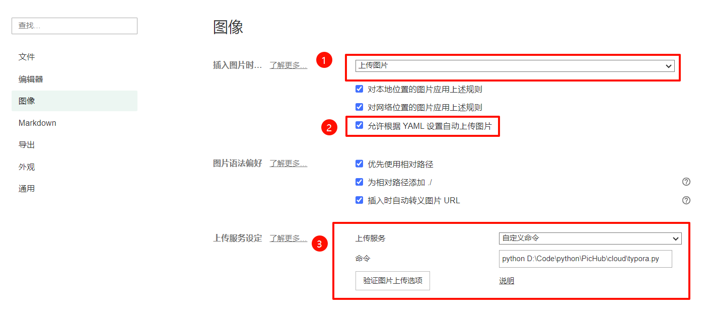
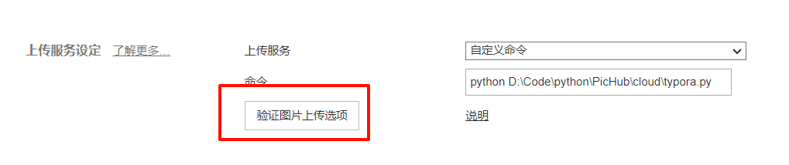
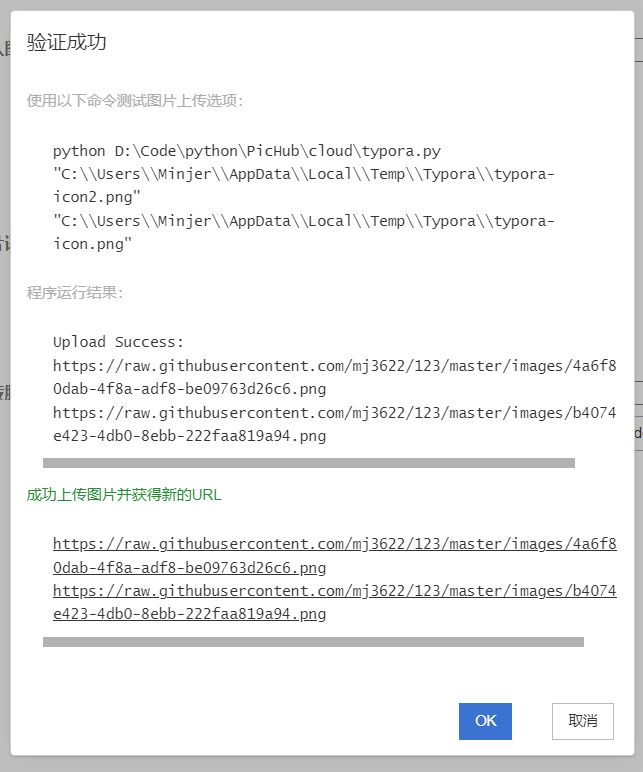

# 1. 图床服务准备

在本文介绍中，将以`PicHub`作为图床服务，这是一个开源的图床服务，依托于Github提供的资源实现。其他第三方服务，例如阿里云OSS，华为云OBS也可以达到同样的效果，可根据实际情况进行选择


> PicHub项目地址

::github{repo="mj3622/PicHub"}


# 2. Typora自定义上传规范

> [Typora图片上传文档](https://support.typora.io/Upload-Image/#custom)

查阅官方文档，我们可以看到Typora对图片上传的要求如下


输入：Typora会调用用户自定义的程序，并且输入**一个或多个**链接，以参数的形式传入

```sh
[some path]/upload-image.sh "image-path-1" "image-path-2"
```


输出：第一行为`Upload Success:`，之后每一行按顺序对应输入图片的远程链接

```
Upload Success:
http://remote-image-1.png
http://remote-image-2.png
```

:::tip
此处的输出要求有一个小坑，需要一次性输出所有内容，如果一行一行输出可能会出现一些问题
:::


# 3. 编写待调用程序

上文中已经介绍了Typora对于输入和输出的要求，按照要求编写即可


下面给出一个python程序示例，在upload_image中编写你的图床服务逻辑。也可直接访问[PicHub接入Typora](https://github.com/mj3622/PicHub/blob/master/docs/接入Typora.md)获取已经编写好的服务

```py
def upload_image(image_path):
	pass


if __name__ == "__main__":
    res = 'Upload Success:\n'
    
    for i in range(1, len(sys.argv)):
        image_path = sys.argv[i]
        url = upload_image(image_path)
        if url:
            res += f'{url}\n'
        else:
            res += f'Failed\n'

    res = res[:-1]
    print(res)
```


# 4. 配置与测试

在使用图片上传服务之前，我们需要先对Typora进行一些简单的配置。进入`文件 - 偏好设置 - 图像`配置页面，如下图所示 

1. 切换`插入图片时`配置为`上传图片`
2. 按自己需求勾选应用规则（**允许自动上传必须勾选**）
3. 上传服务选择`自定义命令，填入自定义指令，配置带调用程序的调用方式




完成配置之后，点击**验证图片上传选项**




若通过验证，则证明配置成功，可以开始使用自定义图片上传服务


