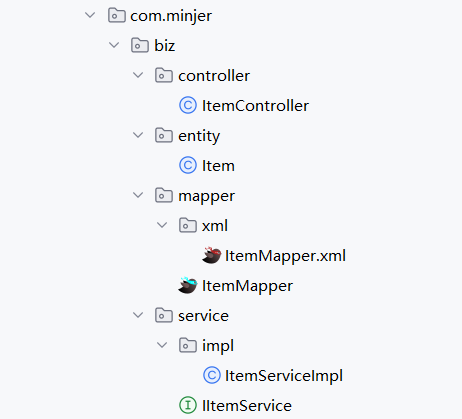

# 🧱 MyBatis-Plus 代码生成器

在 Java 后端开发中，当我们面对一个数据库表时，通常需要手动编写一系列基础代码文件，如：

- 实体类（Entity）
- 数据访问层接口（Mapper）
- Mapper XML 文件
- 服务层接口与实现（Service / ServiceImpl）
- 控制器类（Controller）

这些重复性工作不仅枯燥，还容易出错。幸运的是，MyBatis-Plus 提供了一个强大的[代码生成器](https://baomidou.com/guides/new-code-generator/) ，可以帮助我们自动生成这些基础代码，大幅提升开发效率！


## 1. 引入依赖

```xml
<dependency>
    <groupId>com.baomidou</groupId>
    <artifactId>mybatis-plus-generator</artifactId>
    <version>3.5.1</version>
</dependency>

<dependency>
    <groupId>org.apache.velocity</groupId>
    <artifactId>velocity-engine-core</artifactId>
    <version>2.3</version>
</dependency>
```


## 2. 编写生成器代码

下面给出官方的代码生成器示例，请根据实际情况自行修改配置。

>  [!CAUTION]
>
> 全新的代码生成器添加于 3.5.1 版本，且对历史版本不兼容！如果您用的是 3.5.1 以下的版本，请参考 [代码生成器](https://baomidou.com/guides/code-generator/) 进行配置与使用。

```java
FastAutoGenerator.create("url", "username", "password")
        .globalConfig(builder -> builder
                .author("Baomidou")
                .outputDir(Paths.get(System.getProperty("user.dir")) + "/src/main/java")
                .commentDate("yyyy-MM-dd")
        )
        .packageConfig(builder -> builder
                .parent("com.baomidou.mybatisplus")
                .entity("entity")
                .mapper("mapper")
                .service("service")
                .serviceImpl("service.impl")
                .xml("mapper.xml")
        )
        .strategyConfig(builder -> builder
                .entityBuilder()
                .enableLombok()
        )
        .templateEngine(new VelocityTemplateEngine())
        .execute();
```

> [!NOTE]
>
> 为了生成更加符合需求的代码，官方提供了一系列完整的配置说明，可参考[代码生成器配置 | MyBatis-Plus](https://baomidou.com/reference/new-code-generator-configuration/)


## 3. 运行并查看生成的代码

我在数据库中预先创建了一张表`item`，运行上面这段代码后，自动生成的文件结构如下所示：



# 自定义模板

## 1. **创建自定义模板目录**

在项目的 `src/main/resources` 下创建 `templates` 目录：

```
src/main/resources
└── templates
    ├── entity.java.vm       # 实体类模板
    ├── controller.java.vm   # Controller模板
    └── mapper.xml.vm        # Mapper XML模板
```

## 2. **修改模板内容**

以自定义实体类模板 (`entity.java.vm`) 为例：

```velocity
## 实体类模板示例（添加Swagger和自定义注释）
package ${package.Entity};

import com.baomidou.mybatisplus.annotation.TableName;
import io.swagger.annotations.ApiModel;
import io.swagger.annotations.ApiModelProperty;
import lombok.Data;
import lombok.EqualsAndHashCode;

/**
 * 实体类 - ${table.comment}
 * @author ${author}
 * @date ${date}
 */
@Data
@EqualsAndHashCode(callSuper = true)
@TableName("${table.name}")
@ApiModel("${table.comment}实体")
public class ${entity} extends ${superEntityClass} {
    private static final long serialVersionUID = 1L;

## ---------- 字段循环生成 ----------
#foreach($field in ${table.fields})
    #if(${field.comment})
    @ApiModelProperty("${field.comment}")
    #end
    #if(${field.keyFlag})
    @TableId(value = "${field.name}", type = IdType.${field.keyIdentityFlag})
    #else
    @TableField("${field.name}")
    #end
    private ${field.propertyType} ${field.propertyName};
#end
}
```


## 3. **配置生成器使用自定义模板**

在代码生成器中指定模板路径（默认自动识别，无需额外配置）：

```java
TemplateConfig templateConfig = new TemplateConfig.Builder()
    .entity("/templates/entity.java.vm")  // 指定实体类模板路径
    .controller("/templates/controller.java.vm") 
    .build();
```


## 4. 自定义模板的关键变量

模板中可使用的预定义变量（以 `entity.java.vm` 为例）：

|        变量名        |               说明                |
| :------------------: | :-------------------------------: |
|   `package.Entity`   |           实体类的包名            |
|       `author`       |       全局配置中设置的作者        |
|        `date`        |    当前日期（如 `2024-01-01`）    |
|   `table.comment`    |           数据库表注释            |
|       `entity`       |       实体类名（如 `User`）       |
|  `superEntityClass`  |   实体类父类（如 `BaseEntity`）   |
|    `table.fields`    |           表的字段集合            |
| `field.propertyName` | 字段对应的属性名（如 `userName`） |
| `field.propertyType` | 字段对应的Java类型（如 `String`） |
|   `field.comment`    |             字段注释              |