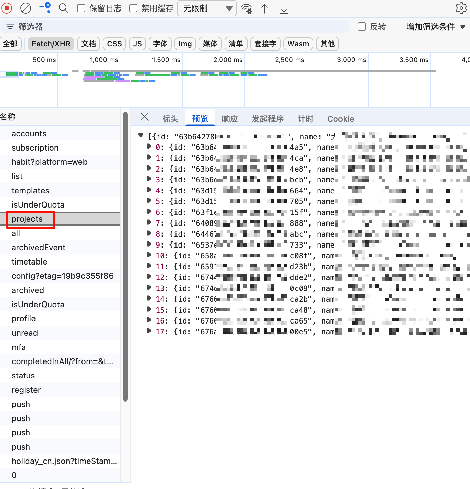

在日常工作和学习中，我们常常需要将各个平台产生的信息（如报错日志、定时提醒、邮件待办）汇总到一处进行管理。滴答清单（Dida365/TickTick）作为一款优秀的 GTD 工具，官方提供了 Open API 供开发者接入。

本文将手把手带你从零开始，使用 Python 编写一个支持命令行传参、具备失败重试和飞书告警兜底机制的滴答清单自动创建任务工具。

# 准备工作：获取 API 凭证

在编写代码之前，我们需要在滴答清单开发者平台注册应用，以获取调用 API 的钥匙。

1. 登录 [滴答清单开发者中心](https://developer.dida365.com/manage)。
2. 创建一个新的应用（App），名称随意填，比如 `MyAutoTask`。
3. 在应用详情页中，你会获得关键的 `Client ID` 和 `Client Secret`。同时，在“OAuth Redirect URL”中填入 `http://127.0.0.1:8080`（用于本地测试的回调）。

# 第一步：获取 Access Token

滴答清单使用的是标准 OAuth2 授权机制。为了让自动化脚本能够长期静默运行，我们需要获取一个授权的 `Access Token`。授权后直接颁发的 Access Token 具有极长的有效期，直接将其写死在脚本中即可。

**1. 拼接并访问授权链接**
将你的 `Client ID` 替换到以下链接中，并在浏览器打开：

```text
https://dida365.com/oauth/authorize?scope=tasks:write tasks:read&client_id=你的ClientID&state=state&redirect_uri=http://127.0.0.1:8080&response_type=code

```

**2. 获取授权 Code**
在弹出的页面点击“授权”后，浏览器会跳转到一个无法访问的本地地址。直接看浏览器地址栏：
`http://127.0.0.1:8080/?code=xxxxxx_你的code_xxxxxx&state=state`
复制出这段 `code`（注意它只有几分钟有效期且仅能使用一次）。

**3. 换取 Token**
打开终端，使用 `curl` 命令换取 Token（替换为你的 ID、Secret 和 Code）：

```bash
curl -X POST https://dida365.com/oauth/token \
-H "Content-Type: application/x-www-form-urlencoded" \
-d "client_id=你的ClientID" \
-d "client_secret=你的ClientSecret" \
-d "code=你的Code" \
-d "grant_type=authorization_code" \
-d "scope=tasks:write tasks:read" \
-d "redirect_uri=http://127.0.0.1:8080"

```

执行后返回的 JSON 数据中，提取出 `access_token` 的值妥善保存。

# 第二步：获取任务清单 ID (Project ID)

在滴答清单中，任务通常归属于不同的“清单”（Project）。为了让脚本将任务准确投递到指定清单，我们需要获取该清单的专属 ID。如果不指定，API 默认会将其放入“收集箱”。

**方法一：通过网页端开发者工具获取（推荐）**
这是最直观的免写代码获取方式：

1. 登录滴答清单网页端。
2. 在左侧边栏点击进入你想要存放自动化任务的清单。
3. 按 `F12`（或右键点击页面选择“检查”）打开浏览器的**开发者工具**，并切换到 **Network（网络）** 面板。
4. 重新刷新网页，此时 Network 面板中会抓取到网络请求。 点击名称为 `projects` 的请求。
5. 在该请求的 **Response** 数据中寻找 `id` 字段。复制这串字符备用。
   

**方法二：通过官方 API 获取**
如果你熟悉接口调试，也可以使用获取到的 Access Token，直接向官方的获取清单列表接口发送 `GET` 请求（对应 Endpoint 为 `/open/v1/project`）。接口会返回你账户下所有清单的完整 JSON 数据，你可以从中提取所需的 ID。此处不作详细展开。

# 第三步：编写核心 Python 脚本

确保你的环境已安装 Python 3，并安装 `requests` 库：

```bash
pip3 install requests

```

新建一个名为 `create_dida_task.py` 的文件，将下方代码粘贴进去。代码内置了动态传参、重试机制和飞书兜底告警。请将前面获取到的 Token 和 Project ID 填入代码的配置区。

```python
import argparse
import requests
import time
import logging
import json
import sys
from datetime import datetime, timedelta, timezone

# 配置日志输出格式
logging.basicConfig(
    level=logging.INFO,
    format='%(asctime)s - %(levelname)s - %(message)s',
    handlers=[logging.StreamHandler(sys.stdout)]
)

# ================= 配置区 =================
# 填入你获取的 Access Token
DIDA_TOKEN = "YOUR_ACCESS_TOKEN"

# 飞书告警配置 (如果暂时不用，可以留空)
FEISHU_WEBHOOK = "YOUR_FEISHU_WEBHOOK_URL"

# 填入抓包获取的清单 ID
DEFAULT_PROJECT_ID = "YOUR_PROJECT_ID"
MAX_RETRIES = 3
# ==========================================

def get_task_dates(is_today_only=False):
    """获取任务的起止 UTC 时间字符串"""
    now_utc = datetime.now(timezone.utc)
    start_date = now_utc.replace(hour=0, minute=0, second=0, microsecond=0)

    if is_today_only:
        due_date = start_date
    else:
        due_date = start_date + timedelta(days=2)

    time_format = "%Y-%m-%dT%H:%M:%S+0000"
    return start_date.strftime(time_format), due_date.strftime(time_format)

def send_feishu_alert(task_title, error_detail):
    """发送飞书告警推送"""
    if not FEISHU_WEBHOOK or FEISHU_WEBHOOK == "YOUR_FEISHU_WEBHOOK_URL":
        logging.warning("未配置有效的飞书 Webhook，跳过告警。")
        return

    headers = {"Content-Type": "application/json"}
    payload = {
        "msg_type": "text",
        "content": {
            "text": f"🚨 滴答清单任务创建失败\n任务：{task_title}\n错误：{error_detail}"
        }
    }
    try:
        requests.post(FEISHU_WEBHOOK, headers=headers, data=json.dumps(payload), timeout=10)
    except Exception as e:
        logging.error(f"飞书告警失败: {e}")

def create_dida_task(title, content, is_today, priority):
    """调用 API 创建任务"""
    url = "https://api.dida365.com/open/v1/task"
    headers = {
        "Authorization": f"Bearer {DIDA_TOKEN}",
        "Content-Type": "application/json"
    }

    start_date, due_date = get_task_dates(is_today)

    payload = {
        "title": title,
        "projectId": DEFAULT_PROJECT_ID,
        "isAllDay": True,
        "startDate": start_date,
        "dueDate": due_date,
        "priority": priority
    }
    if content:
        payload["content"] = content

    for attempt in range(1, MAX_RETRIES + 1):
        try:
            response = requests.post(url, headers=headers, json=payload, timeout=10)
            response.raise_for_status()
            logging.info(f"✅ 成功: {title} (优先级:{priority}, 仅当天:{is_today})")
            return True
        except requests.exceptions.RequestException as e:
            error_msg = f"{e} | {getattr(e.response, 'text', '')}"
            logging.warning(f"❌ 失败 ({attempt}/{MAX_RETRIES}): {error_msg}")

            if attempt < MAX_RETRIES:
                time.sleep(2 ** attempt)
            else:
                send_feishu_alert(title, error_msg)
                return False

if __name__ == "__main__":
    parser = argparse.ArgumentParser()
    parser.add_argument("--title", required=True)
    parser.add_argument("--content", default="")
    parser.add_argument("--today", action="store_true")
    parser.add_argument("--priority", type=int, choices=[0, 1, 3, 5], default=0)

    args = parser.parse_args()
    success = create_dida_task(args.title, args.content, args.today, args.priority)
    sys.exit(0 if success else 1)

```

# 第四步：运行与测试

进入脚本所在目录，打开终端进行测试：

**创建基础任务：**

```bash
python3 create_dida_task.py --title "阅读滴答清单API文档"

```

**创建高优先级且必须今日完成的任务：**

```bash
python3 create_dida_task.py --title "处理服务器宕机" --content "紧急排查Nginx日志" --today --priority 5

```

如果运行成功，你的滴答清单对应列表中就会立刻出现这笔新任务。

为了便于后续接入 `crontab`、CI/CD 或告警脚本，建议先熟悉这几个命令行参数：

| 参数           | 是否必填 | 类型 / 取值                   | 默认值    | 说明                                               | 示例                              |
| -------------- | -------- | ----------------------------- | --------- | -------------------------------------------------- | --------------------------------- |
| `--title`    | 是       | 字符串                        | 无        | 任务标题，建议简洁明确，便于列表快速扫描。         | `--title "处理服务器宕机"`      |
| `--content`  | 否       | 字符串                        | `""`    | 任务详情/备注，可写排查步骤、链接、上下文信息。    | `--content "紧急排查Nginx日志"` |
| `--today`    | 否       | 布尔开关（出现即为 true）     | `false` | 标记后任务仅当天；不加时默认截止日期为两天后。     | `--today`                       |
| `--priority` | 否       | 整数：`0`/`1`/`3`/`5` | `0`     | 任务优先级。数值越高越紧急，`5` 常用于事故处理。 | `--priority 5`                  |

你可以把这些参数组合使用，例如：

```bash
python3 create_dida_task.py \
  --title "修复线上告警" \
  --content "先看监控面板，再排查近 1 小时发布记录" \
  --today \
  --priority 5

```

如果你在自动化系统里调用该脚本（如定时任务、告警回调），建议至少保证 `--title` 可追踪且 `--priority` 有明确规则，后续排查会轻松很多。

# 可拓展内容（进阶玩法）

掌握了基础的脚本后，你可以将其无缝接入更多自动化场景：

1. **服务器定时监控任务生成**
   结合 Linux 的 `crontab` 或 macOS 的 `launchd`。例如，每天早晨 9 点运行脚本，自动在滴答清单中生成当天的例行检查清单。
2. **结合 CI/CD 流程**
   在 GitHub Actions 或 GitLab CI 中，当代码构建失败时，不仅通过邮件报警，还直接在负责人的滴答清单中插入一条高优先级待办任务。
3. **RSS / 邮件解析入库**
   编写一个前置脚本监听特定的邮件或 RSS 订阅源，提取标题和摘要后，利用此工具一键推送到滴答清单作为稍后阅读任务。
4. **增强参数解析**
   后续可修改 Python 脚本的 `argparse` 部分，增加诸如 `--project-id`（动态切换清单分组通过参数传入）、`--due-time`（指定精确到分钟的截止时间）等高级参数。

# 主要参考

- [滴答清单（Dida365）官方 Open API 文档](https://developer.dida365.com/docs#/openapi)
