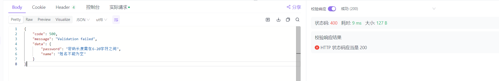

# 1. 基本概念

[Java Bean Validation](https://docs.spring.io/spring-framework/reference/core/validation/beanvalidation.html) 是 Java 平台上的一个标准验证框架，用于对 Java Bean 对象的属性进行声明式校验。它通过注解（Annotation）的方式定义校验规则，简化了数据验证逻辑，提高了代码的可维护性和可读性。该框架是 Java EE（现 Jakarta EE）标准的一部分，遵循 JSR 380 （最新版本，之前为 JSR 349 和 JSR 303）规范。


其核心功能如下：

1. **声明式验证**
   通过注解（如 `@NotNull`、`@Size`）直接标注在 Java Bean 的字段上，无需手动编写校验逻辑。
2. **自动触发验证**
   在 Spring MVC 控制器中，对请求参数（如 `@RequestBody` 或 `@ModelAttribute`）添加 `@Valid` 注解即可自动触发校验。
3. **异常统一处理**
   验证失败时抛出 `MethodArgumentNotValidException`，可通过 `@ControllerAdvice` 或 `@ExceptionHandler` 统一捕获并返回结构化错误信息。
4. **支持自定义规则**
   允许开发者定义自定义注解和验证器，满足复杂业务规则。


# 2. 快速上手

## 2.1 引入依赖

在Spirng Boot项目中，在 `pom.xml` 中引入：

```xml
<dependency>
    <groupId>org.springframework.boot</groupId>
    <artifactId>spring-boot-starter-validation</artifactId>
</dependency>
```

其包含的核心组件：

- **Spring Validation 模块** ：提供 `Validator` 接口和 `@Valid` 注解。
- **Hibernate Validator** ：JSR 380 的参考实现，新增如 `@Email`、`@NotBlank` 等扩展注解。
- **Spring Web 集成** ：自动配置 `MethodValidationPostProcessor`，支持在 Controller 中使用验证。


## 2.2 定义带验证注解的实体类

下面给出一个自定义`User`类作为示例：

```java
@Data
public class User {
    @NotBlank(message = "姓名不能为空")
    private String name;

    @Email(message = "邮箱格式不正确")
    private String email;

    @Size(min = 6, max = 20, message = "密码长度需在6-20字符之间")
    private String password;
}
```


## 2.3 在 Controller 中触发验证

在对应的请求参数前加上`@Validated`即可开启校验

```java
@RestController
@RequestMapping("/user")
public class UserController {
    @PostMapping("/save")
    public Result saveUser(@Validated User user) {
        // save user

        return Result.success();
    }
}
```


## 2.4 添加全局异常处理（可选）

拦截处理`MethodArgumentNotValidException.class`异常

```java
@ControllerAdvice
public class GlobalExceptionHandler {

    @ResponseStatus(HttpStatus.BAD_REQUEST)
    @ExceptionHandler(MethodArgumentNotValidException.class)
    @ResponseBody
    public Result handleValidationException(MethodArgumentNotValidException ex) {
        Map<String, String> errors = new HashMap<>();
        ex.getBindingResult().getFieldErrors()
                .forEach(error -> errors.put(error.getField(), error.getDefaultMessage()));

        return Result.error("Validation failed", errors);
    }
    
}
```


## 2.5 验证测试

发起一次参数为空的请求，当请求参数不符合校验要求时，就会自动返回错误响应，如下所示：



# 3. 常用注解

下面给出常用的验证注解，可按实际情况选择使用

| 注解名称           | 适用类型                                                | 示例字段                                          | 描述                                        |
| ------------------ | ------------------------------------------------------- | ------------------------------------------------- | ------------------------------------------- |
| `@NotNull`         | 任意对象                                                | `@NotNull private String name;`                   | 确保字段不为 `null`。                       |
| `@NotBlank`        | `String`                                                | `@NotBlank private String name;`                  | 确保字符串不为空且至少包含一个非空白字符。  |
| `@NotEmpty`        | `String`, `Collection`, `Map`, `Array`                  | `@NotEmpty private List<String> tags;`            | 确保字符串非空、集合非空、数组非空。        |
| `@Size(min, max)`  | `String`, `Collection`, `Map`, `Array`                  | `@Size(min = 2, max = 10) private String name;`   | 限制字符串长度、集合/数组大小在指定范围内。 |
| `@Min(value)`      | `Number`（如 `int`, `Integer`, `double`, `BigDecimal`） | `@Min(18) private int age;`                       | 确保数值不小于指定最小值。                  |
| `@Max(value)`      | `Number`                                                | `@Max(100) private int score;`                    | 确保数值不大于指定最大值。                  |
| `@Email`           | `String`                                                | `@Email private String email;`                    | 验证字符串是否符合邮箱格式。                |
| `@Pattern(regexp)` | `String`                                                | `@Pattern(regexp = "\\d+") private String phone;` | 确保字符串匹配指定正则表达式。              |
| `@AssertTrue`      | `boolean`                                               | `@AssertTrue private boolean agreedToTerms;`      | 确保布尔值为 `true`。                       |
| `@AssertFalse`     | `boolean`                                               | `@AssertFalse private boolean isDeleted;`         | 确保布尔值为 `false`。                      |
| `@Past`            | `Date`, `Calendar`, `LocalDate`, `LocalDateTime` 等     | `@Past private LocalDate birthDate;`              | 确保日期在当前时间之前。                    |
| `@Future`          | 同上                                                    | `@Future private LocalDateTime eventDate;`        | 确保日期在当前时间之后。                    |


# 4. 进阶使用

## 4.1 分组验证

不同业务场景下，对同一实体的不同字段进行不同级别的验证。例如：注册时验证邮箱，更新时验证用户名。

**实现步骤：**

1. 定义分组接口

   ```java
   public interface OnCreate {}
   public interface OnUpdate {}
   ```

2. 在实体类中标注分组

   ```java
   public class User {
       @NotBlank(groups = OnCreate.class)
       private String username;
   
       @Email(groups = {OnCreate.class, OnUpdate.class})
       private String email;
   }
   ```

3. 在 Controller 中指定分组

   ```java
   @PostMapping("/users")
   public Result createUser(@Validated(OnCreate.class) @RequestBody User user) {
       // ...
   }
   ```


## 4.2 自定义验证器

内置注解无法满足特定业务逻辑，如验证手机号格式等。

**实现步骤：**

1. 定义分组接口

   ```java
   @Target({ ElementType.FIELD })
   @Retention(RetentionPolicy.RUNTIME)
   @Constraint(validatedBy = MobileNumberValidator.class)
   public @interface MobileNumber {
       String message() default "手机号格式不正确";
       Class<?>[] groups() default {};
   }
   ```

2. 实现验证逻辑

   ```java
   public class MobileNumberValidator implements ConstraintValidator<MobileNumber, String> {
       private static final String MOBILE_REGEX = "^1[3-9]\\d{9}$";
   
       @Override
       public boolean isValid(String value, ConstraintValidatorContext context) {
           return value == null || value.matches(MOBILE_REGEX);
       }
   }
   ```

3. 在实体类中使用

   ```java
   public class User {
       @MobileNumber
       private String mobile;
   }
   ```

   

## 4.3 条件验证

根据某个字段的值，决定是否验证另一个字段。

**实现步骤：**

1. 自定义验证器

   ```java
   public class PasswordConfirmValidator implements ConstraintValidator<PasswordConfirm, User> {
       @Override
       public boolean isValid(User user, ConstraintValidatorContext context) {
           return user.getPassword().equals(user.getConfirmPassword());
       }
   }
   ```

2. 自定义注解

   ```java
   @Target(ElementType.TYPE)
   @Retention(RetentionPolicy.RUNTIME)
   @Constraint(validatedBy = PasswordConfirmValidator.class)
   public @interface PasswordConfirm {
       String message() default "两次密码不一致";
       Class<?>[] groups() default {};
   }
   ```

3. 在类上使用

   ```java
   @PasswordConfirm
   public class User {
       private String password;
       private String confirmPassword;
   }
   ```

   
