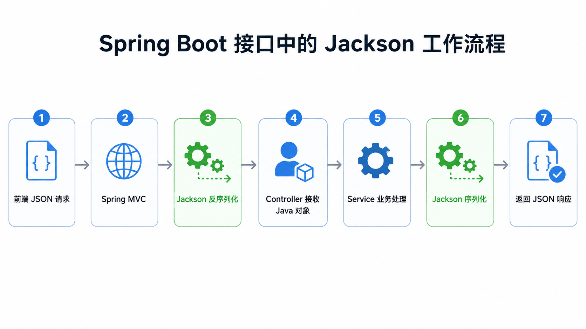
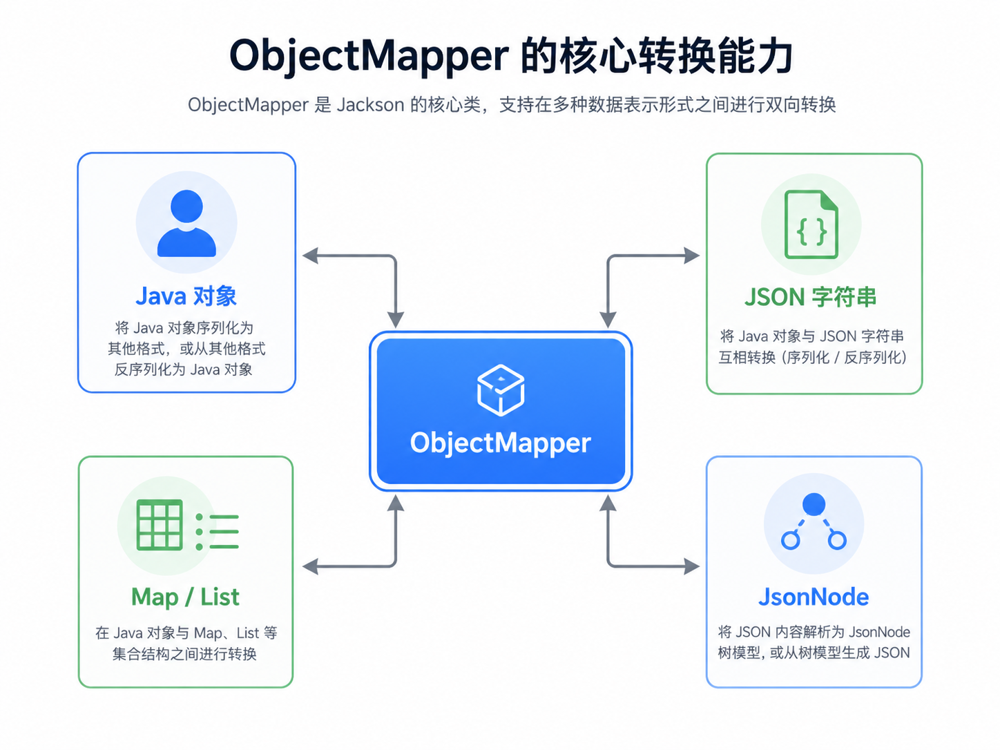
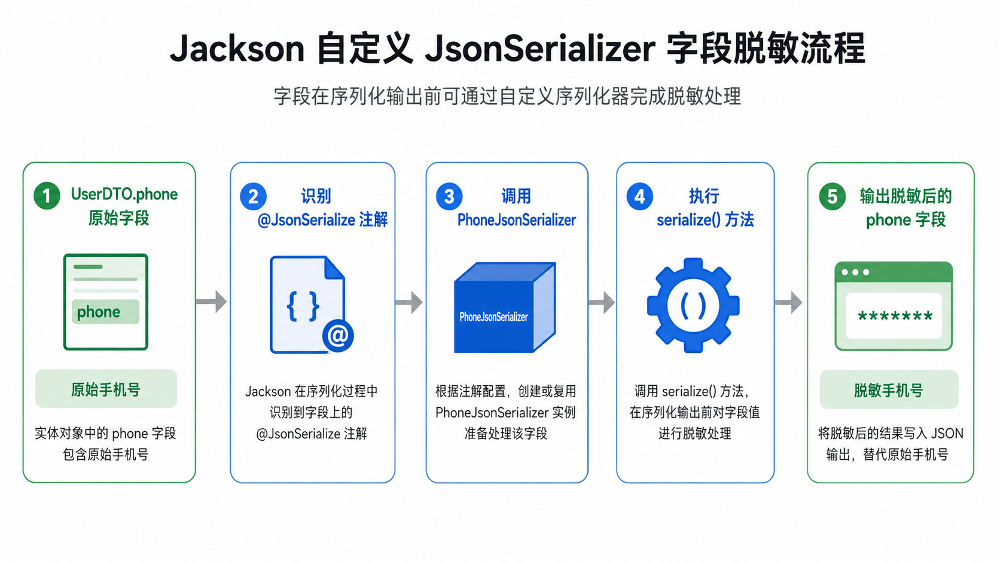

# 一、为什么 Java 后端离不开 JSON 序列化

在 Web 后端开发中，接口通常需要接收 JSON 请求体，并返回 JSON 响应结果。

例如前端传来这样一段 JSON：

```json
{
  "id": 1,
  "username": "minjer",
  "age": 23
}
```

后端一般不会直接手动解析字符串，而是希望把它自动转换成 Java 对象：

```java
public class UserDTO {
    private Long id;
    private String username;
    private Integer age;
}
```

同样，后端返回数据时，也希望可以自动把 Java 对象转换成 JSON 字符串。

这类“Java 对象和 JSON 之间互相转换”的过程，就叫做序列化和反序列化：

- 序列化：Java 对象 -> JSON 字符串
- 反序列化：JSON 字符串 -> Java 对象

Jackson 就是 Java 后端开发中非常常见的一套 JSON 处理库。

在 Spring Boot 项目中，我们写接口时通常不需要手动调用 Jackson：

```java
@GetMapping("/user")
public UserDTO getUser() {
    return new UserDTO(1L, "minjer", 23);
}
```

Spring MVC 会在返回响应时自动使用 Jackson 把 `UserDTO` 转成 JSON。

也就是说，很多时候我们虽然没有直接写 Jackson 代码，但它其实一直在接口数据转换过程中工作。



---

# 二、Jackson 的核心入口：ObjectMapper



如果脱离 Spring Boot，单独使用 Jackson，最核心的类就是 `ObjectMapper`。

它负责完成 Java 对象、JSON 字符串、Map、List、JsonNode 等数据结构之间的转换。

## 1. Java 对象转 JSON

```java
ObjectMapper objectMapper = new ObjectMapper();

UserDTO user = new UserDTO();
user.setId(1L);
user.setUsername("minjer");
user.setAge(23);

String json = objectMapper.writeValueAsString(user);

System.out.println(json);
```

输出结果类似：

```json
{ "id": 1, "username": "minjer", "age": 23 }
```

这里的 `writeValueAsString()` 就是把 Java 对象序列化成 JSON 字符串。

---

## 2. JSON 转 Java 对象

```java
String json = "{\"id\":1,\"username\":\"minjer\",\"age\":23}";

UserDTO user = objectMapper.readValue(json, UserDTO.class);

System.out.println(user.getUsername());
```

这里的 `readValue()` 就是把 JSON 字符串反序列化成 Java 对象。

---

## 3. JSON 转 Map

有时候我们并不想提前定义 DTO，也可以直接转成 `Map`：

```java
Map<String, Object> map = objectMapper.readValue(json, Map.class);

System.out.println(map.get("username"));
```

这种方式适合处理结构不固定的 JSON，但缺点是类型不够明确，后续取值时需要自己做类型转换。

---

## 4. JSON 转 JsonNode

Jackson 还提供了树模型 `JsonNode`，适合读取复杂 JSON 中的部分字段。

```java
JsonNode root = objectMapper.readTree(json);

String username = root.get("username").asText();
Integer age = root.get("age").asInt();
```

`JsonNode` 的好处是不用完整定义 Java 类，也能比较方便地读取嵌套 JSON。

---

# 三、Jackson 常用注解

在实际业务中，Java 字段名和 JSON 字段名不一定完全一致，有些字段也可能不希望返回给前端。

这时候可以使用 Jackson 提供的注解进行控制。

---

## 1. @JsonProperty：指定 JSON 字段名

```java
public class UserDTO {

    @JsonProperty("user_name")
    private String username;
}
```

序列化后，字段名会从 `username` 变成 `user_name`：

```json
{
  "user_name": "minjer"
}
```

这个注解常用于前后端字段命名风格不一致的场景。

例如 Java 中常用驼峰命名：

```java
userName
```

而 JSON 接口中可能希望使用下划线命名：

```json
user_name
```

---

## 2. @JsonIgnore：忽略字段

```java
public class UserDTO {

    private Long id;

    @JsonIgnore
    private String password;
}
```

这样返回 JSON 时，`password` 字段就不会被输出。

这个注解很适合用于密码、内部标识、临时字段等不应该暴露给前端的数据。

---

## 3. @JsonInclude：控制空值是否输出

```java
@JsonInclude(JsonInclude.Include.NON_NULL)
public class UserDTO {

    private Long id;
    private String username;
    private String email;
}
```

当 `email` 为 `null` 时，序列化结果中就不会出现这个字段。

如果不加控制，默认可能会输出：

```json
{
  "id": 1,
  "username": "minjer",
  "email": null
}
```

加上 `@JsonInclude(JsonInclude.Include.NON_NULL)` 后，会变成：

```json
{
  "id": 1,
  "username": "minjer"
}
```

这可以让接口响应更加简洁。

---

## 4. @JsonFormat：格式化日期

```java
public class UserDTO {

    @JsonFormat(pattern = "yyyy-MM-dd HH:mm:ss", timezone = "GMT+8")
    private LocalDateTime createTime;
}
```

这个注解常用于控制日期时间字段的输出格式。

例如把 `LocalDateTime` 输出成：

```json
{
  "createTime": "2026-06-09 20:30:00"
}
```

而不是时间戳或其他默认格式。

---

# 四、特殊类型处理：枚举、日期、泛型和嵌套对象

基础类型字段通常可以被 Jackson 自动处理，但是在真实项目中，我们经常会遇到一些特殊类型。

例如：

```java
public class UserDTO {

    private Long id;

    private String username;

    private UserStatus status;

    private LocalDateTime createTime;

    private List<RoleDTO> roles;

    private AddressDTO address;

    private Map<String, Object> extra;
}
```

这些字段分别对应枚举、日期时间、泛型集合、嵌套对象和扩展字段。

其中，枚举类是非常常见的一类特殊类型，尤其适合表示用户状态、订单状态、支付方式、业务类型等固定范围的值。

---

# 五、枚举类的序列化与反序列化

在实际业务开发中，接口字段并不总是简单的 `String`、`Integer`、`Long`。

很多字段天然适合使用枚举类型表示，例如：

- 用户状态：启用、禁用；
- 订单状态：待支付、已支付、已取消；
- 性别类型：男、女、未知；
- 支付方式：微信、支付宝、银行卡；
- 业务类型：新增、修改、删除。

相比直接使用数字或字符串，枚举类的好处是语义更清晰，也能减少魔法值。

例如：

```java
public enum UserStatus {

    ENABLED(1, "启用"),
    DISABLED(0, "禁用");

    private final Integer code;
    private final String desc;

    UserStatus(Integer code, String desc) {
        this.code = code;
        this.desc = desc;
    }

    public Integer getCode() {
        return code;
    }

    public String getDesc() {
        return desc;
    }
}
```

然后在 DTO 中使用：

```java
public class UserDTO {

    private Long id;

    private String username;

    private UserStatus status;
}
```

---

## 1. Jackson 默认如何处理枚举

默认情况下，Jackson 会把枚举按照枚举名称进行序列化。

例如：

```java
UserDTO user = new UserDTO();
user.setId(1L);
user.setUsername("minjer");
user.setStatus(UserStatus.ENABLED);
```

序列化后的结果通常是：

```json
{
  "id": 1,
  "username": "minjer",
  "status": "ENABLED"
}
```

也就是说，默认输出的是枚举常量名：

```java
ENABLED
```

如果前端传入：

```json
{
  "status": "ENABLED"
}
```

Jackson 也可以把它反序列化成：

```java
UserStatus.ENABLED
```

这种方式最简单，但也有明显问题：

1. 枚举名称通常偏后端代码风格，不适合直接暴露给前端；
2. 前端更可能需要 `code` 和 `desc`；
3. 如果枚举名后续重构，可能影响接口兼容性；
4. 数据库存储通常是 `0`、`1` 这类 code，而不是 `ENABLED`、`DISABLED`。

所以在真实项目中，经常需要对枚举的序列化和反序列化进行定制。

---

## 2. 使用 @JsonValue 指定枚举输出值

如果我们希望枚举序列化时只输出 `code`，可以在 `getCode()` 方法上添加 `@JsonValue`：

```java
public enum UserStatus {

    ENABLED(1, "启用"),
    DISABLED(0, "禁用");

    private final Integer code;
    private final String desc;

    UserStatus(Integer code, String desc) {
        this.code = code;
        this.desc = desc;
    }

    @JsonValue
    public Integer getCode() {
        return code;
    }

    public String getDesc() {
        return desc;
    }
}
```

这样序列化时，结果就会从：

```json
{
  "status": "ENABLED"
}
```

变成：

```json
{
  "status": 1
}
```

这适合前端只需要拿到状态编码的场景。

不过这种方式有一个缺点：前端只能看到 `1`，无法直接知道它代表“启用”。

如果接口需要同时返回 `code` 和 `desc`，可以使用另一种方式。

---

## 3. 使用 @JsonFormat 把枚举输出成对象

如果希望枚举序列化后变成一个完整对象，可以在枚举类上添加：

```java
@JsonFormat(shape = JsonFormat.Shape.OBJECT)
public enum UserStatus {

    ENABLED(1, "启用"),
    DISABLED(0, "禁用");

    private final Integer code;
    private final String desc;

    UserStatus(Integer code, String desc) {
        this.code = code;
        this.desc = desc;
    }

    public Integer getCode() {
        return code;
    }

    public String getDesc() {
        return desc;
    }
}
```

这时 `UserDTO` 序列化结果会变成：

```json
{
  "id": 1,
  "username": "minjer",
  "status": {
    "code": 1,
    "desc": "启用"
  }
}
```

这种方式适合管理后台、字典展示、状态展示等场景。

它的优点是前端不需要再额外维护一份状态映射表。

但是也要注意：如果接口只需要传递状态值，这种结构会显得有点重。

---

## 4. 使用 @JsonCreator 支持根据 code 反序列化枚举

如果前端传入的是：

```json
{
  "status": 1
}
```

而后端希望自动转换成：

```java
UserStatus.ENABLED
```

可以在枚举类中添加一个静态方法，并使用 `@JsonCreator` 标记：

```java
public enum UserStatus {

    ENABLED(1, "启用"),
    DISABLED(0, "禁用");

    private final Integer code;
    private final String desc;

    UserStatus(Integer code, String desc) {
        this.code = code;
        this.desc = desc;
    }

    public Integer getCode() {
        return code;
    }

    public String getDesc() {
        return desc;
    }

    @JsonCreator
    public static UserStatus fromCode(Integer code) {
        if (code == null) {
            return null;
        }

        for (UserStatus status : UserStatus.values()) {
            if (status.getCode().equals(code)) {
                return status;
            }
        }

        throw new IllegalArgumentException("未知的用户状态 code: " + code);
    }
}
```

这样当前端传入：

```json
{
  "status": 1
}
```

Jackson 就会调用：

```java
UserStatus.fromCode(1)
```

最终得到：

```java
UserStatus.ENABLED
```

这是一种非常常见的枚举反序列化写法。

---

## 5. 同时支持序列化和反序列化

在实际项目中，经常会把 `@JsonValue` 和 `@JsonCreator` 配合使用：

```java
public enum UserStatus {

    ENABLED(1, "启用"),
    DISABLED(0, "禁用");

    private final Integer code;
    private final String desc;

    UserStatus(Integer code, String desc) {
        this.code = code;
        this.desc = desc;
    }

    @JsonValue
    public Integer getCode() {
        return code;
    }

    public String getDesc() {
        return desc;
    }

    @JsonCreator
    public static UserStatus fromCode(Integer code) {
        if (code == null) {
            return null;
        }

        for (UserStatus status : UserStatus.values()) {
            if (status.getCode().equals(code)) {
                return status;
            }
        }

        throw new IllegalArgumentException("未知的用户状态 code: " + code);
    }
}
```

这样就可以实现：

Java 枚举序列化成 JSON：

```java
UserStatus.ENABLED
```

输出为：

```json
1
```

JSON 反序列化成 Java 枚举：

```json
1
```

转换为：

```java
UserStatus.ENABLED
```

这种方式比较适合前后端统一使用 `code` 作为枚举传输值的项目。

---

## 6. 如果前端传了未知枚举值怎么办

还有一个常见问题：如果前端传入了后端不存在的枚举值怎么办？

例如：

```json
{
  "status": 999
}
```

如果直接抛异常，接口会返回错误。

这在严格业务场景下是合理的，因为非法状态本来就应该被拒绝。

但是在某些兼容性场景中，也可以返回一个兜底枚举：

```java
public enum UserStatus {

    ENABLED(1, "启用"),
    DISABLED(0, "禁用"),
    UNKNOWN(-1, "未知");

    private final Integer code;
    private final String desc;

    UserStatus(Integer code, String desc) {
        this.code = code;
        this.desc = desc;
    }

    @JsonValue
    public Integer getCode() {
        return code;
    }

    public String getDesc() {
        return desc;
    }

    @JsonCreator
    public static UserStatus fromCode(Integer code) {
        if (code == null) {
            return null;
        }

        for (UserStatus status : UserStatus.values()) {
            if (status.getCode().equals(code)) {
                return status;
            }
        }

        return UNKNOWN;
    }
}
```

这样即使前端传入了未知值，也不会直接反序列化失败。

不过是否使用 `UNKNOWN`，要根据业务场景决定。

如果是订单状态、支付状态这类严肃字段，更推荐直接抛异常，而不是静默转成未知状态。

---

## 7. 什么时候使用枚举类

枚举类适合用于值范围固定、业务含义明确的字段。

例如：

```java
private UserStatus status;
private OrderStatus orderStatus;
private PayType payType;
private Gender gender;
```

不太适合频繁变化、需要后台动态维护的数据。

例如：

```java
private String city;
private String productCategory;
private String departmentName;
```

这些字段通常更适合放在数据库字典表中维护，而不是写死在枚举类里。

简单来说：

- 固定业务状态：适合枚举；
- 变化频繁的数据字典：适合数据库表；
- 前后端都需要展示含义：枚举需要提供 code 和 desc；
- 接口只传递状态值：可以只输出 code；
- 管理后台展示：可以输出完整对象。

---

## 8. 枚举处理小结

Jackson 默认会按照枚举名称处理枚举类。

如果业务中希望使用 `code` 作为传输值，可以使用：

```java
@JsonValue
```

控制枚举如何序列化。

如果希望前端传入 `code` 后自动转成枚举，可以使用：

```java
@JsonCreator
```

提供一个静态工厂方法。

如果希望枚举输出成完整对象，可以使用：

```java
@JsonFormat(shape = JsonFormat.Shape.OBJECT)
```

最终如何选择，取决于接口设计：

| 场景                        | 推荐方式                                       |
| --------------------------- | ---------------------------------------------- |
| 前后端直接传枚举名          | 使用默认行为                                   |
| 只传状态编码                | `@JsonValue` + `@JsonCreator`                  |
| 返回给前端展示 code 和 desc | `@JsonFormat(shape = JsonFormat.Shape.OBJECT)` |
| 未知枚举值需要兼容          | 提供 `UNKNOWN` 兜底值                          |
| 严格业务状态                | 未知值直接抛异常                               |

---

# 六、处理 LocalDateTime

在 Java 8 之后，后端项目中经常使用 `LocalDateTime`、`LocalDate`、`LocalTime`。

如果直接使用 Jackson 处理 Java 8 时间类型，有时会遇到格式不符合预期的问题。

常见做法是引入并注册 `JavaTimeModule`：

```java
ObjectMapper objectMapper = new ObjectMapper();

objectMapper.registerModule(new JavaTimeModule());
objectMapper.disable(SerializationFeature.WRITE_DATES_AS_TIMESTAMPS);
```

其中：

```java
objectMapper.disable(SerializationFeature.WRITE_DATES_AS_TIMESTAMPS);
```

表示不要把日期时间输出成时间戳，而是输出成更可读的字符串格式。

在 Spring Boot 项目中，很多基础配置已经被自动处理，但如果你希望统一接口中的日期格式，仍然可以通过配置文件或自定义配置类进行调整。

---

# 七、处理泛型集合

除了枚举和日期，泛型集合也是 Jackson 使用中的一个常见坑。

例如我们希望把 JSON 数组转换成 `List<UserDTO>`：

```json
[
  {
    "id": 1,
    "username": "minjer"
  },
  {
    "id": 2,
    "username": "jack"
  }
]
```

如果直接写成：

```java
List<UserDTO> users = objectMapper.readValue(json, List.class);
```

虽然代码可以运行，但得到的通常不是 `List<UserDTO>`，而是类似 `List<LinkedHashMap>` 的结构。

原因是 Java 的泛型在运行时存在类型擦除，Jackson 只知道目标类型是 `List`，不知道 List 里面具体是什么对象。

这时候应该使用 `TypeReference`：

```java
List<UserDTO> users = objectMapper.readValue(
        json,
        new TypeReference<List<UserDTO>>() {}
);
```

如果是更复杂的结构，例如：

```java
Map<String, List<UserDTO>>
```

也可以这样处理：

```java
Map<String, List<UserDTO>> userMap = objectMapper.readValue(
        json,
        new TypeReference<Map<String, List<UserDTO>>>() {}
);
```

简单来说，只要目标类型中包含泛型，就优先考虑使用 `TypeReference`。

---

# 八、处理嵌套对象

Jackson 对嵌套对象的支持比较自然。

例如：

```java
public class UserDTO {

    private Long id;

    private String username;

    private AddressDTO address;
}
```

```java
public class AddressDTO {

    private String province;

    private String city;
}
```

对应 JSON 可以是：

```json
{
  "id": 1,
  "username": "minjer",
  "address": {
    "province": "广东",
    "city": "深圳"
  }
}
```

只要 Java 类结构和 JSON 结构能够对应上，Jackson 就可以自动完成转换。

需要注意的是，嵌套对象也需要有可访问的构造方式和字段访问方式。

常见做法是：

- 提供无参构造方法；
- 提供 getter / setter；
- 或者使用 Lombok 的 `@Data`、`@NoArgsConstructor` 等注解。

---

# 九、自定义序列化：JsonSerializer

Jackson 的注解可以解决很多常见问题，但如果业务逻辑更加复杂，就需要自定义序列化器。

例如下面这些场景：

- 手机号脱敏
- 身份证号脱敏
- 金额格式化
- 枚举值转中文描述
- 根据用户权限决定字段是否展示明文

自定义序列化器需要继承 `JsonSerializer<T>`，并重写 `serialize()` 方法。

例如我们希望把手机号脱敏：

```java
public class PhoneJsonSerializer extends JsonSerializer<String> {

    @Override
    public void serialize(
            String value,
            JsonGenerator gen,
            SerializerProvider serializers
    ) throws IOException {

        if (value == null) {
            gen.writeNull();
            return;
        }

        String masked = value.replaceAll("(\\d{3})\\d{4}(\\d{4})", "$1****$2");

        gen.writeString(masked);
    }
}
```

然后在字段上使用：

```java
public class UserDTO {

    @JsonSerialize(using = PhoneJsonSerializer.class)
    private String phone;
}
```

当接口返回时，手机号就会被自动脱敏。

例如：

```json
{
  "phone": "138****5678"
}
```

这个过程的本质是：

1. Jackson 序列化 `phone` 字段；
2. 发现字段上有 `@JsonSerialize`；
3. 使用指定的 `PhoneJsonSerializer`；
4. 调用 `serialize()` 方法；
5. 写出脱敏后的 JSON 字段值。



---

# 十、自定义反序列化：JsonDeserializer

和序列化相反，反序列化是把 JSON 转成 Java 对象。

如果前端传来的数据格式比较特殊，也可以自定义反序列化器。

```java
public class GenderDeserializer extends JsonDeserializer<Integer> {

    @Override
    public Integer deserialize(
            JsonParser p,
            DeserializationContext ctxt
    ) throws IOException {

        String value = p.getText();

        if ("男".equals(value)) {
            return 1;
        }

        if ("女".equals(value)) {
            return 2;
        }

        return 0;
    }
}
```

使用方式：

```java
public class UserDTO {

    @JsonDeserialize(using = GenderDeserializer.class)
    private Integer gender;
}
```

这样当前端传入：

```json
{
  "gender": "男"
}
```

后端接收到的 Java 对象中，`gender` 就会被转换成 `1`。

---

# 十一、Spring Boot 中如何配置 Jackson

在 Spring Boot 项目中，Jackson 通常已经被自动集成。

如果我们只是写普通接口：

```java
@RestController
@RequestMapping("/users")
public class UserController {

    @GetMapping("/{id}")
    public UserDTO getUser(@PathVariable Long id) {
        UserDTO user = new UserDTO();
        user.setId(id);
        user.setUsername("minjer");
        return user;
    }
}
```

Spring Boot 会自动把返回对象序列化成 JSON。

如果想进行全局配置，可以使用配置文件：

```yaml
spring:
  jackson:
    date-format: yyyy-MM-dd HH:mm:ss
    time-zone: GMT+8
    default-property-inclusion: non_null
```

也可以通过配置类进行更灵活的控制：

```java
@Configuration
public class JacksonConfig {

    @Bean
    public Jackson2ObjectMapperBuilderCustomizer jacksonCustomizer() {
        return builder -> {
            builder.simpleDateFormat("yyyy-MM-dd HH:mm:ss");
            builder.serializationInclusion(JsonInclude.Include.NON_NULL);
        };
    }
}
```

如果需要注册自定义序列化器，可以使用 `SimpleModule`：

```java
@Configuration
public class JacksonConfig {

    @Bean
    public Module customModule() {
        SimpleModule module = new SimpleModule();
        module.addSerializer(String.class, new PhoneJsonSerializer());
        return module;
    }
}
```

不过这里要注意：如果直接给 `String.class` 注册全局序列化器，会影响所有字符串字段。

所以在真实项目中，更推荐结合注解，只对特定字段生效。

---

# 十二、ObjectMapper 不建议频繁 new

在示例代码里，我们经常这样写：

```java
ObjectMapper objectMapper = new ObjectMapper();
```

这是为了演示方便。

但在真实项目中，不建议每次使用时都重新创建 `ObjectMapper`。

原因是 `ObjectMapper` 内部会维护序列化器、反序列化器、类型信息等缓存。频繁创建不仅没有必要，也会影响性能和配置一致性。

在 Spring Boot 项目中，通常直接使用框架自动配置好的 `ObjectMapper`：

```java
@Service
public class JsonService {

    private final ObjectMapper objectMapper;

    public JsonService(ObjectMapper objectMapper) {
        this.objectMapper = objectMapper;
    }
}
```

这样可以保证项目中的 JSON 行为保持一致。

---

# 十三、常见问题总结

## 1. 字段不想返回给前端怎么办？

使用 `@JsonIgnore`。

```java
@JsonIgnore
private String password;
```

---

## 2. 字段名想改成下划线怎么办？

可以使用 `@JsonProperty`。

```java
@JsonProperty("user_name")
private String username;
```

也可以使用全局命名策略，让所有字段统一从驼峰转下划线。

---

## 3. 空字段不想返回怎么办？

使用 `@JsonInclude`。

```java
@JsonInclude(JsonInclude.Include.NON_NULL)
```

---

## 4. 日期格式不符合预期怎么办？

可以使用 `@JsonFormat` 控制单个字段，也可以通过 Spring Boot 全局配置统一处理。

---

## 5. JSON 数组转 List 结果不对怎么办？

如果目标类型是 `List<UserDTO>`、`Map<String, UserDTO>` 这类泛型结构，建议使用 `TypeReference`：

```java
List<UserDTO> users = objectMapper.readValue(
        json,
        new TypeReference<List<UserDTO>>() {}
);
```

---

## 6. 枚举字段应该怎么设计？

如果只是内部系统，直接使用枚举名也可以。

如果是前后端接口，更推荐为枚举设计稳定的 `code`：

```java
@JsonValue
public Integer getCode() {
    return code;
}
```

同时使用 `@JsonCreator` 支持根据 `code` 反序列化：

```java
@JsonCreator
public static UserStatus fromCode(Integer code) {
    // 根据 code 查找枚举
}
```

这样接口传输值更加稳定，不容易受到后端枚举命名变化的影响。

---

## 7. 复杂字段规则怎么办？

如果普通注解无法满足需求，就可以考虑自定义 `JsonSerializer` 或 `JsonDeserializer`。

---

# 十四、总结

Jackson 是 Java 后端开发中非常重要的 JSON 处理工具。

对于普通业务开发来说，掌握下面几个点基本就够用了：

1. 使用 `ObjectMapper` 完成对象和 JSON 的转换；
2. 使用常见注解控制字段名、空值、日期格式和忽略字段；
3. 使用 `JsonNode` 处理结构不固定的 JSON；
4. 使用 `TypeReference` 处理泛型集合；
5. 使用 `@JsonValue`、`@JsonCreator`、`@JsonFormat` 处理枚举类；
6. 使用 `JsonSerializer` 实现自定义序列化；
7. 在 Spring Boot 中尽量使用框架统一管理的 `ObjectMapper`。

如果只是简单接口开发，Jackson 基本是“开箱即用”的。

但一旦遇到字段脱敏、权限控制、枚举转换、日期格式统一、复杂 JSON 解析等场景，就需要真正理解 Jackson 的序列化和反序列化机制。

理解 Jackson，不只是为了会写 JSON 转换代码，更是为了更好地掌控后端接口的数据输入和输出。
