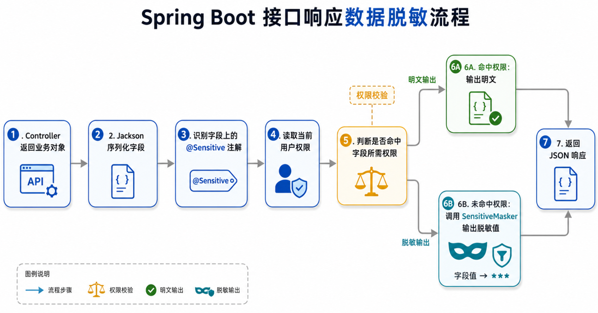
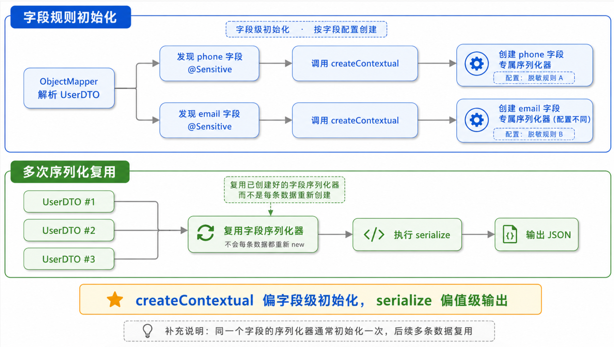
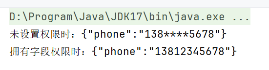

# 1. 背景

在接口开发中，用户手机号、身份证号、银行卡号、邮箱等字段通常不能直接明文返回。

如果在每个接口里手动调用脱敏方法，代码会很快变得分散：

```java
user.setPhone(maskPhone(user.getPhone()));
```

这种写法能跑，但不够统一，也容易漏处理。更适合的方式是：**用注解声明字段需要脱敏，让 Jackson 在 JSON 序列化阶段统一处理。**

# 2. 实现目标

希望业务对象只需要这样标记字段：

```java
@Sensitive(type = SensitiveType.PHONE, permissions = "user:phone:read")
private String phone;
```

最终效果：

- 当前用户没有权限：返回 `138****5678`
- 当前用户拥有 `user:phone:read` 权限：返回 `13812345678`

# 3. 核心设计

整体实现由四部分组成：

1. `SensitiveType`：定义敏感数据类型，例如手机号、身份证、银行卡。
2. `@Sensitive`：标记需要脱敏的字段，并声明查看明文所需权限。
3. `SensitiveMasker`：集中维护不同类型的脱敏规则。
4. `PermissionSensitiveJsonSerializer`：在 Jackson 序列化阶段判断权限并输出结果。



# 4. 定义脱敏注解

`@Sensitive` 是这个方案的入口。字段加上该注解后，Jackson 会使用自定义序列化器处理它。

```java
// 字段和 getter 方法都可以使用该注解。
@Target({ElementType.FIELD, ElementType.METHOD})
// 运行时需要读取注解，所以保留到 RUNTIME。
@Retention(RetentionPolicy.RUNTIME)
// 告诉 Jackson 这是一个组合注解。
@JacksonAnnotationsInside
// 指定字段序列化时使用自定义脱敏序列化器。
@JsonSerialize(using = PermissionSensitiveJsonSerializer.class)
public @interface Sensitive {

    // 脱敏类型，例如手机号、身份证、银行卡等。
    SensitiveType type();

    // 允许查看明文的权限编码。
    String[] permissions() default {};
}
```

这里的关键是 `@JsonSerialize`，它把字段序列化逻辑交给了 `PermissionSensitiveJsonSerializer`。

# 5. 定义脱敏规则

脱敏规则集中放在 `SensitiveMasker` 中。以手机号为例：

```java
// 手机号脱敏：保留前三位和后四位。
private static String maskPhone(String value) {
    // 长度不足时不截取，避免 substring 越界。
    if (value.length() < 7) {
        return value;
    }

    // 示例：13812345678 -> 138****5678。
    return value.substring(0, 3)
            + "****"
            + value.substring(value.length() - 4);
}
```

例如：

```text
13812345678 -> 138****5678
```

其他类型也可以在同一个工具类中继续扩展，避免脱敏逻辑散落在 Controller 或 Service 中。

# 6. 保存当前用户权限

本文使用 `ThreadLocal` 保存当前用户权限：

```java
public static Set<String> getPermissions() {
    // 从当前线程中读取用户权限。
    Set<String> permissions = USER_PERMISSIONS.get();

    // 未设置权限时返回空集合，默认视为无明文查看权限。
    return permissions == null ? Collections.emptySet() : permissions;
}
```

这里默认返回空集合，表示没有任何明文查看权限。这样即使没有设置权限上下文，接口也会走脱敏逻辑，而不是直接抛空指针异常。

真实项目中，权限上下文通常可以从 Spring Security、网关鉴权结果、拦截器或过滤器中设置。

# 7. 自定义 Jackson 序列化器

脱敏逻辑真正生效的位置在 `PermissionSensitiveJsonSerializer`。

它的类定义如下：

```java
// 继承 JsonSerializer，负责控制字段最终如何写入 JSON。
public class PermissionSensitiveJsonSerializer extends JsonSerializer<String>
        // 实现 ContextualSerializer，负责读取当前字段上的注解配置。
        implements ContextualSerializer {
}
```

这里同时用到了一个父类和一个接口：

- `JsonSerializer<String>`：Jackson 提供的序列化器父类，负责把 Java 字段值写成 JSON 字段值。
- `ContextualSerializer`：Jackson 提供的上下文序列化接口，负责在序列化前拿到当前字段的上下文信息，比如字段上的注解。

两者的职责不同：

- `JsonSerializer` 解决“这个字段最终怎么输出”的问题。
- `ContextualSerializer` 解决“这个字段配置了什么脱敏规则”的问题。

也就是说，`JsonSerializer` 处理值，`ContextualSerializer` 处理字段配置。

## 7.1 成员变量说明

`PermissionSensitiveJsonSerializer` 中有两个核心成员变量：

```java
// 当前字段的脱敏类型，例如 PHONE、EMAIL、BANK_CARD。
private final SensitiveType sensitiveType;

// 当前字段允许查看明文的权限集合。
private final Set<String> requiredPermissions;
```

它们分别保存当前字段的脱敏类型和明文查看权限：

- `sensitiveType`：保存字段配置的敏感数据类型，用于告诉 `SensitiveMasker` 应该按手机号、邮箱、银行卡等哪种规则脱敏。
- `requiredPermissions`：保存字段配置的明文查看权限，用于判断当前用户是否可以查看该字段明文。

这两个值不是写死在序列化器里的，而是在 `createContextual` 中根据当前字段注解动态创建出来的。这样同一个序列化器类就可以处理不同字段：

```java
// 手机号字段使用手机号脱敏规则，并要求 user:phone:read 权限查看明文。
@Sensitive(type = SensitiveType.PHONE, permissions = "user:phone:read")
private String phone;

// 邮箱字段使用邮箱脱敏规则，并要求 user:email:read 权限查看明文。
@Sensitive(type = SensitiveType.EMAIL, permissions = "user:email:read")
private String email;
```

序列化 `phone` 时，`sensitiveType` 是 `PHONE`；序列化 `email` 时，`sensitiveType` 是 `EMAIL`。这也是为什么需要为不同字段创建带有不同配置的序列化器实例。

## 7.2 继承 JsonSerializer

`JsonSerializer<String>` 中最重要的方法是 `serialize`：

```java
@Override
public void serialize(String value, JsonGenerator generator, SerializerProvider provider) throws IOException {
    // 读取当前用户权限。
    Set<String> currentPermissions = CurrentUserPermissionsHolder.getPermissions();

    // 有权限时直接写出原始值。
    if (canViewRawValue(currentPermissions)) {
        generator.writeString(value);
        return;
    }

    // 无权限时先脱敏，再写入 JSON。
    generator.writeString(SensitiveMasker.mask(value, sensitiveType));
}
```

这个方法会在 Jackson 输出字段值时被调用。

几个参数的含义如下：

- `value`：当前字段的原始值，例如手机号 `13812345678`。
- `generator`：Jackson 用来写 JSON 的对象，调用 `writeString` 就是在写最终响应值。
- `provider`：序列化过程中的上下文对象，本文暂时没有使用它。

这里的逻辑很直接：

- 有权限：调用 `generator.writeString(value)` 输出明文。
- 无权限：先调用 `SensitiveMasker.mask(...)` 脱敏，再写入 JSON。

## 7.3 实现 ContextualSerializer

如果只继承 `JsonSerializer<String>`，序列化器只能拿到字段值，无法知道字段上配置的是手机号脱敏、邮箱脱敏，还是银行卡脱敏。

例如这个字段：

```java
@Sensitive(type = SensitiveType.PHONE, permissions = "user:phone:read")
// phone 字段序列化时会被 PermissionSensitiveJsonSerializer 处理。
private String phone;
```

序列化器需要读取 `type` 和 `permissions`，所以还要实现 `ContextualSerializer`。

`ContextualSerializer` 的核心方法是 `createContextual`：

```java
@Override
public JsonSerializer<?> createContextual(SerializerProvider provider, BeanProperty property)
        throws JsonMappingException {
    // 优先从当前字段上读取 @Sensitive 注解。
    Sensitive sensitive = property.getAnnotation(Sensitive.class);

    // 如果字段上没有，再尝试从上下文中读取。
    if (sensitive == null) {
        sensitive = property.getContextAnnotation(Sensitive.class);
    }

    // 没有 @Sensitive 注解时，交还给 Jackson 默认序列化器处理。
    if (sensitive == null) {
        return provider.findValueSerializer(property.getType(), property);
    }

    // 为当前字段创建带有脱敏类型和权限配置的序列化器。
    return new PermissionSensitiveJsonSerializer(
            sensitive.type(),
            Set.of(sensitive.permissions())
    );
}
```

这里的关键点是 `BeanProperty`。它代表当前正在序列化的字段或 getter 方法，可以通过它读取字段上的注解。

读取到 `@Sensitive` 后，会创建一个新的 `PermissionSensitiveJsonSerializer`，并把当前字段的脱敏类型和权限配置保存进去。这样后续执行 `serialize` 时，就知道应该按什么规则处理当前字段。

## 7.4 权限判断

序列化器负责做两件事：

- 读取字段上的 `@Sensitive` 配置
- 根据当前用户权限决定输出明文还是脱敏值

核心判断逻辑如下：

```java
private boolean canViewRawValue(Set<String> currentPermissions) {
    // 当前用户权限与字段所需权限有交集时，可以查看明文。
    return currentPermissions.stream().anyMatch(requiredPermissions::contains);
}
```

序列化时：

```java
// 有权限时直接输出原始值。
if (canViewRawValue(currentPermissions)) {
    generator.writeString(value);
    return;
}

// 无权限时输出脱敏后的值。
generator.writeString(SensitiveMasker.mask(value, sensitiveType));
```

也就是说，权限命中时输出原始值，否则调用脱敏工具类输出脱敏结果。

## 7.5 是否会重复创建序列化器

看到 `createContextual` 里有一行 `new PermissionSensitiveJsonSerializer(...)`，很容易产生一个疑问：**每次序列化对象时，都会重新创建序列化器吗？**

通常不会按每条数据重复创建。

`createContextual` 的作用是为“当前字段”创建带上下文配置的序列化器。Jackson 在处理某个类型时，会先解析字段信息，并为字段准备对应的序列化器。对于同一个 `ObjectMapper`、同一个 Java 类型、同一个字段配置来说，这个序列化器通常会被缓存和复用。

可以简单理解为：

- `createContextual`：字段级初始化，读取 `@Sensitive` 注解并生成带配置的序列化器。
- `serialize`：值级输出，每次真正写 JSON 字段值时执行。

也就是说，创建序列化器主要发生在字段序列化规则初始化阶段，而不是每序列化一条用户数据都创建一次。

以一个 `UserDTO` 为例：

```java
class UserDTO {
    // phone 字段会对应一个保存 PHONE 和 user:phone:read 配置的序列化器。
    @Sensitive(type = SensitiveType.PHONE, permissions = "user:phone:read")
    private String phone;

    // email 字段会对应另一个保存 EMAIL 和 user:email:read 配置的序列化器。
    @Sensitive(type = SensitiveType.EMAIL, permissions = "user:email:read")
    private String email;
}
```

这里会为 `phone` 和 `email` 准备不同的序列化器实例，因为它们的脱敏类型和权限配置不同。后续序列化多个 `UserDTO` 对象时，字段规则已经确定，Jackson 会继续使用这些字段对应的序列化器来处理具体值。

需要注意的是，如果频繁创建新的 `ObjectMapper`，或者运行时不断生成大量不同结构的类型，序列化器缓存收益就会变差。因此在 Spring Boot 项目中，通常直接使用容器管理的 `ObjectMapper`，不要在业务代码中反复 `new ObjectMapper()`。



# 8. 测试验证

本文使用 `ObjectMapper` 直接验证序列化结果，重点覆盖两类核心情况：

- 未设置权限时输出脱敏值
- 拥有字段权限时输出明文

```java
@Test
void printMaskingResultForBlog() throws JsonProcessingException {
    DemoUser demoUser = new DemoUser("13812345678");

    CurrentUserPermissionsHolder.clear();
    String maskedJson = objectMapper.writeValueAsString(demoUser);

    CurrentUserPermissionsHolder.setPermissions(Set.of("user:phone:read"));
    String rawJson = objectMapper.writeValueAsString(demoUser);

    System.out.println("未设置权限时：" + maskedJson);
    System.out.println("拥有字段权限时：" + rawJson);
}
```



# 9. 小结

本文实现的数据脱敏方案，本质上是把“字段是否敏感”和“字段如何输出”这两件事拆开处理。

业务代码只需要通过 `@Sensitive` 声明字段的敏感类型和明文查看权限，真正的脱敏逻辑则交给 Jackson 序列化阶段统一完成。这样做的好处是，Controller 和 Service 不需要关心手机号、邮箱、银行卡等字段该如何处理，也不需要在不同接口里重复调用脱敏方法。

回顾整个实现，核心链路可以概括为：

- 业务对象只负责声明字段是否敏感
- 脱敏规则集中维护
- Jackson 在输出 JSON 时读取字段注解
- 序列化器根据当前用户权限决定输出明文还是脱敏值
- `ContextualSerializer` 负责把字段注解配置传递给具体序列化逻辑

这种方式的优点是侵入性低、规则集中、扩展方便。后续如果要支持更多敏感类型，只需要扩展 `SensitiveType` 和 `SensitiveMasker`；如果要接入真实权限体系，则可以把当前用户权限从 Spring Security、网关鉴权结果或统一拦截器中写入上下文。

如果用于生产环境，还需要继续完善请求级权限初始化、`ThreadLocal` 清理、审计日志、异常兜底和更严格的脱敏规则。对于接口响应数据脱敏来说，这套方案可以作为一个清晰的基础版本，再根据业务复杂度逐步增强。
