本文使用到的依赖/软件版本如下

| 名称                           | 版本   |
| ------------------------------ | ------ |
| `JDK`                          | 17     |
| `MySQL`                        | 8.0.31 |
| `spring-boot`                  | 3.4.5  |
| `spring-security`              | 6.4.5  |
| `spring-boot-starter-security` | 3.4.5  |
| `mybatis-plus`                 | 3.5.9  |
| `jjwt`                         | 0.9.1  |


# 1. 数据库设计

由于我们将采用[RBAC（Role-Based Access Control，基于角色的访问控制）](https://www.cloudflare.com/zh-cn/learning/access-management/role-based-access-control-rbac/)来进行用户的权限管理，因此我们需要构建用户-角色-权限模型，即用户被分配一个或多个角色，每个角色关联一组权限。但是为了简便起见，此处我们直接用资源替换权限。

因此，数据库设计如下图所示：

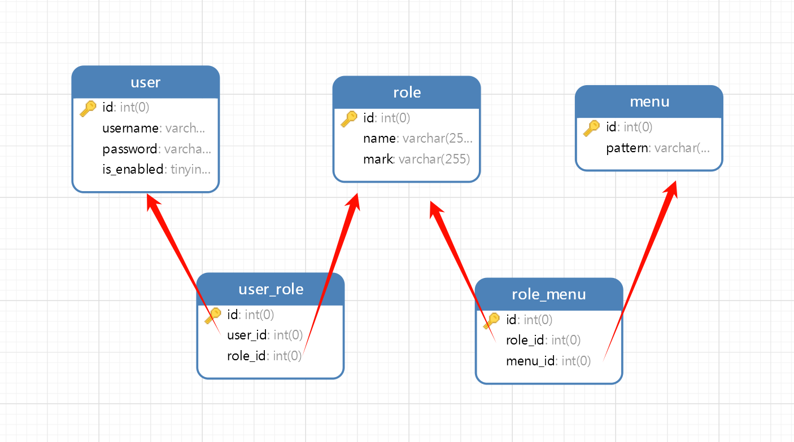

接着，我们向数据库中插入一系列数据，便于后续测试使用

`user`表，密码均为`password`

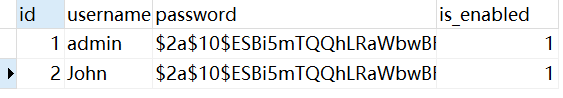

`role`表：

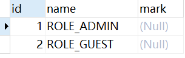

`user_role`表：

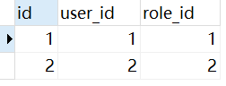

`menu`表：

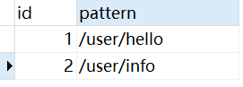

`role_menu`表：

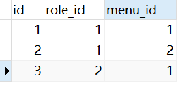

同时通过[MyBatis-Plus 代码生成器](https://baomidou.com/reference/new-code-generator-configuration/)，构建出基础项目结构

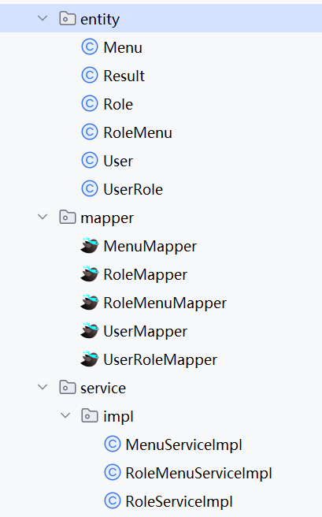

# 2. JWT配置

## 2.1 配置工具类

由于我们将采用`JWT`进行用户的身份认证，因此我们需要构建一个`JWT`工具类来进行分发和校验

```java
public class JwtUtil {
    // JWT密钥
    private static final String SECRET_KEY = "secret-key";

    // 1天过期时间
    private static final long EXPIRATION_TIME = TimeUnit.DAYS.toMillis(1);

    // 生成 JWT
    public static String generateToken(String username, List<String> roles) {
        return Jwts.builder()
                .setSubject(username)
                .claim("roles", roles)
                .setIssuedAt(new Date())
                .setExpiration(new Date(System.currentTimeMillis() + EXPIRATION_TIME))
                .signWith(SignatureAlgorithm.HS256, SECRET_KEY)
                .compact();
    }

    // 解析 JWT
    public static Claims getClaimsFromToken(String token) {
        return Jwts.parser()
                .setSigningKey(SECRET_KEY)
                .parseClaimsJws(token)
                .getBody();
    }

    // 获取用户名
    public static String getUsernameFromToken(String token) {
        return getClaimsFromToken(token).getSubject();
    }

    // 获取角色
    public static List<String> getRolesFromToken(String token) {
        return getClaimsFromToken(token).get("roles", List.class);
    }

    // 验证令牌
    public static boolean validateToken(String token) {
        try {
            // 检查令牌是否存在
            Date expiration = getClaimsFromToken(token).getExpiration();
            // 检查令牌是否过期
            return !expiration.before(new Date());
        } catch (Exception e) {
            return false;
        }
    }
}
```


## 2.2 **JWT 认证过滤器** 

对于绝大部分请求，我们都需要经过`JWT`校验，确保用户访问合法。`JWT` 认证过滤器继承 `OncePerRequestFilter`，确保每个请求只过滤一次。

该过滤器主要承担以下职责：

- 从请求头 `Authorization` 中提取 `JWT`并验证 `token` 有效性
- 从 `Claims` 中提取用户信息和权限，将其构造一个 `UsernamePasswordAuthenticationToken` 对象，并设置为已认证 
- 将构建好的 `Authentication` 对象存入 `SecurityContextHolder.getContext().setAuthentication(authentication)`。
- 如果 `token` 无效或缺失，直接放行，后续的授权过滤器会处理未认证/无权限的情况。

```java
@Component
public class JwtAuthenticationFilter extends OncePerRequestFilter {
    @Override
    protected void doFilterInternal(HttpServletRequest request, HttpServletResponse response, FilterChain filterChain) throws ServletException, IOException {
        String authHeader = request.getHeader("Authorization");

        if (authHeader == null || !authHeader.startsWith("Bearer ")) {
            filterChain.doFilter(request, response);
            return;
        }

        // 去掉 "Bearer "
        String token = authHeader.substring(7);

        try {
            // 验证JWT令牌
            if (JwtUtil.validateToken(token)) {
                // 从JWT中获取用户名和权限
                String username = JwtUtil.getUsernameFromToken(token);
                List<String> authorities = JwtUtil.getRolesFromToken(token);

                // 转换权限字符串为 GrantedAuthority
                List<GrantedAuthority> grantedAuthorities = authorities.stream()
                        .map(SimpleGrantedAuthority::new)
                        .collect(Collectors.toList());
                
                // 构建已认证的 Authentication 对象
                UsernamePasswordAuthenticationToken authentication = new UsernamePasswordAuthenticationToken(username, null, grantedAuthorities);
                SecurityContextHolder.getContext().setAuthentication(authentication);
            }
        } catch (JwtException e) {
            // 如果JWT验证失败，清除SecurityContext
            SecurityContextHolder.clearContext();
            response.sendError(HttpServletResponse.SC_UNAUTHORIZED, "Invalid JWT token");
            return;
        }
        filterChain.doFilter(request, response); // 继续过滤器链
    }
}
```


# 3. 动态权限源配置

由于我们需要实现基于URL的动态权限配置，因此，我们需要实现 `AuthorizationManager<RequestAuthorizationContext>` 接口，重写核心方法 `AuthorizationDecision check(Supplier<Authentication> authentication, RequestAuthorizationContext context)`，来让程序知道当前请求需要什么权限。


在该方法中，我们主要会进行以下工作：

1. 获取当前请求的 URL
2. 根据请求的 URL ，查询需要哪些权限才能访问该资源
3. 从`SecurityContextHolder`中或获取到用户的身份信息
4. 将用户拥有的权限与需求的权限进行比较，判断是否允许访问

```java
@Component
@AllArgsConstructor
public class DynamicAuthorizationManager implements AuthorizationManager<RequestAuthorizationContext> {

    private final RoleMenuMapper roleMenuMapper;

    @Override
    public AuthorizationDecision check(Supplier<Authentication> authentication, RequestAuthorizationContext context) {
        // 获取请求URL
        String url = context.getRequest().getRequestURI();

        // 查询所有角色与菜单的关联关系
        List<String> roleNames = roleMenuMapper.getRoleNamesByMenuPattern(url);

        // 如果没有匹配的角色，则默认返回拒绝授权
        if (roleNames.isEmpty()) {
            return new AuthorizationDecision(false);
        }

        // 查询当前用户的角色
        Authentication auth = SecurityContextHolder.getContext().getAuthentication();
        if (Objects.isNull(auth) || !auth.isAuthenticated()) {
            // 如果用户未认证，拒绝授权
            return new AuthorizationDecision(false);
        }

        // 检查用户角色是否在允许的角色列表中
        boolean hasRole = auth.getAuthorities().stream()
                .map(GrantedAuthority::getAuthority)
                .anyMatch(roleNames::contains);

        // 返回授权决策
        return new AuthorizationDecision(hasRole);
    }
}
```

对应的SQL多表联查语句：

```sql
    <select id="getRoleNamesByMenuPattern" resultType="java.lang.String">
        SELECT DISTINCT r.name
        FROM role_menu rm
        JOIN role r ON rm.role_id = r.id
        JOIN menu m ON rm.menu_id = m.id
        WHERE m.pattern LIKE CONCAT('%', #{pattern}, '%')
    </select>
```

>  [!TIP]
>
>  由于频繁查询数据库会很影响性能，且权限对应状态相对固定，因此我们可以引入缓存进行优化，此处不过多赘述


# 4. 用户数据源配置

由于我们的用户信息均存储在数据库中，因此我们需要建立起用户数据与认证机制的桥梁。在 Spring Security 中，`UserDetailsService` 接口扮演了这一角色，它是用户认证过程的核心，主要作用是在认证过程中检索用户特定的数据。


该接口需要实现`UserDetails loadUserByUsername(String username)`这一核心方法，用于加载用户的认证信息，主要有：

- **用户名 (Username)：** 用户的唯一标识符。
- **密码 (Password)：** 用户的**编码后**的密码。Spring Security 会将这个编码后的密码与用户登录时提供的编码后的密码进行比较。
- **权限/角色 (Authorities/Roles)：** 分配给用户的权限或角色（例如 "ROLE_ADMIN", "ROLE_USER"）。这些权限用于后续的授权决策。
- **账户状态 (Account Status)：** 指示账户是否启用、是否过期、是否被锁定，或者凭据是否过期。

```java
@Component
@AllArgsConstructor
public class UserDetailsService implements org.springframework.security.core.userdetails.UserDetailsService {
    private final IUserRoleService userRoleService;
    private final IRoleService roleService;
    private final UserMapper userMapper;

    @Override
    public UserDetails loadUserByUsername(String username) throws UsernameNotFoundException {
        // 根据用户名查询用户信息
        User user = userMapper.selectOne(
                new LambdaQueryWrapper<>(User.class)
                        .eq(User::getUsername, username)
                        .eq(User::getEnabled, true)
        );

        if (Objects.isNull(user)) {
            throw new UsernameNotFoundException("User not found: " + username);
        }

        // 查询用户角色id
        List<Integer> roleIds = userRoleService.list(
                new LambdaQueryWrapper<>(UserRole.class)
                        .eq(UserRole::getUserId, user.getId())
        ).stream().map(UserRole::getRoleId).toList();

        // 根据角色id查询角色信息
        List<Role> roles = roleIds.isEmpty() ? List.of() : roleService.list(
                new LambdaQueryWrapper<>(Role.class)
                        .in(Role::getId, roleIds)
        );

        // 将角色信息转换为GrantedAuthority
        List<SimpleGrantedAuthority> authorities = roles.stream()
                .map(role -> new SimpleGrantedAuthority(role.getName()))
                .toList();

        // 返回UserDetails对象
        return org.springframework.security.core.userdetails.User.builder()
                .username(user.getUsername())
                .password(user.getPassword())
                .disabled(!user.getEnabled())
                .authorities(authorities)
                .build();
    }
}
```


# 5. 配置Spring Security

在完成了上述所有的准备工作之后，我们需要将这些实现的接口配置到Spring Security中去，使得Spring Security能够正确加载我们自定义的配置


## 5.1 创建配置类

创建Spring Security 配置的入口，并添加`@Configuration`注解标记为配置类，以及`@EnableWebSecurity`注解启用 Spring Security 的 Web 安全功能

```java
@Configuration
@EnableWebSecurity
public class SecurityConfig {
    
    // 根据实际情况注入
    private final UserDetailsService userDetailsService;
    private final JwtAuthenticationFilter jwtAuthenticationFilter;
    private final DynamicAuthorizationManager authorizationManager;

    public SecurityConfig(
            UserDetailsService userDetailsService,
            JwtAuthenticationFilter jwtAuthenticationFilter,
            DynamicAuthorizationManager authorizationManager) {
        this.userDetailsService = userDetailsService;
        this.jwtAuthenticationFilter = jwtAuthenticationFilter;
        this.authorizationManager = authorizationManager;
    }
}
```


## 5.2 配置认证管理器

在配置类中添加以下内容，启用我们自定义的`userDetailsService`以及`passwordEncoder`，此处我们使用`BCryptPasswordEncoder`进行密码加密，可以根据实际需求进行更换

```java
/**
 * * 配置认证管理器
 *
 * @param http HttpSecurity
 * @return AuthenticationManager
 */
@Bean
public AuthenticationManager authenticationManager(HttpSecurity http) throws Exception {
    AuthenticationManagerBuilder authenticationManagerBuilder =
            http.getSharedObject(AuthenticationManagerBuilder.class);

    authenticationManagerBuilder
            .userDetailsService(userDetailsService)
            .passwordEncoder(passwordEncoder());

    return authenticationManagerBuilder.build();
}

/**
 * * 密码编码器
 * * 使用 BCryptPasswordEncoder 进行密码加密
 *
 * @return PasswordEncoder
 */
@Bean
public PasswordEncoder passwordEncoder() {
    return new BCryptPasswordEncoder();
}
```


## 5.3 配置安全过滤链

具体配置参考代码注释

```java
	@Value("${demo.security.ignore-path}")
    private String[] ignorePath;

	/**
     * * 配置安全过滤链
     *
     * @param http HttpSecurity
     * @return SecurityFilterChain
     */
    @Bean
    public SecurityFilterChain securityFilterChain(HttpSecurity http) throws Exception {
        http
                // 禁用 CSRF 保护
                .csrf(AbstractHttpConfigurer::disable)
                // 禁用默认的表单登录和基本认证
                .formLogin(AbstractHttpConfigurer::disable)
                .httpBasic(AbstractHttpConfigurer::disable)
                // 禁用默认的注销功能
                .logout(AbstractHttpConfigurer::disable)
                // 配置会话管理
                .sessionManagement(session -> session
                        .sessionCreationPolicy(SessionCreationPolicy.STATELESS))
                // 添加自定义的 JWT 认证过滤器
                .addFilterBefore(jwtAuthenticationFilter,
                                 UsernamePasswordAuthenticationFilter.class)
                // 配置请求授权
                .authorizeHttpRequests(auth -> auth
                        // 部分接口无需授权访问
                        .requestMatchers(ignorePath).permitAll()
                        // 其余接口需要通过权限校验
                        .anyRequest().access(authorizationManager)
                );

        return http.build();
    }
```

在`application.yml`中配置忽略路径，如下所示：

```yml
demo:
  security:
    ignore-path:
      /user/login,
      /user/ping
```


# 6. 用户登录接口

由于用户登录流程较为简单，只需用到`AuthenticationManager`即可简化校验流程，此处不过多赘述

```java
private final AuthenticationManager authenticationManager;

@Override
public Result<String> login(User user) {
    // 执行认证
    UsernamePasswordAuthenticationToken token = new UsernamePasswordAuthenticationToken(
        user.getUsername(), user.getPassword());
    Authentication authentication = authenticationManager.authenticate(token);

    // 如果认证成功，设置用户信息到SecurityContext
    SecurityContextHolder.getContext().setAuthentication(authentication);

    // 查询用户权限
    List<String> authorities = authentication.getAuthorities().stream()
        .map(GrantedAuthority::getAuthority)
        .toList();

    // 生成 JWT 令牌
    String jwt = JwtUtil.generateToken(user.getUsername(), authorities);

    return Result.success(jwt);
}
```


# 7. 验证测试

在`UserController`中创建以下接口进行测试，其中`/login`和`/ping`接口已添加至白名单中，不过经过权限校验。`/hello`接口需要`ROLE_ADMIN`或`ROLE_GUEST`权限，`/info`权限需要`ROLE_ADMIN`权限

```java
@PostMapping("/login")
public Result<String> login(@RequestBody User user) {
    return userService.login(user);
}

@GetMapping("/ping")
public String ping() {
    return "Pong";
}

@GetMapping("/hello")
public String hello() {
    return "Hello, World!";
}

@GetMapping("/info")
public Result<Authentication> getUserInfo() {
    Authentication authentication = SecurityContextHolder.getContext().getAuthentication();

    if (authentication == null || !authentication.isAuthenticated()) {
        return Result.fail("User not authenticated");
    }

    return Result.success(authentication);
}
```


## 7.1 未登录用户

访问`/ping`接口，返回`pong`，证明白名单生效

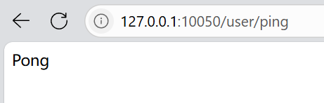

访问`/info`和`/hello`接口，均返回`403`表示无权限，符合预期

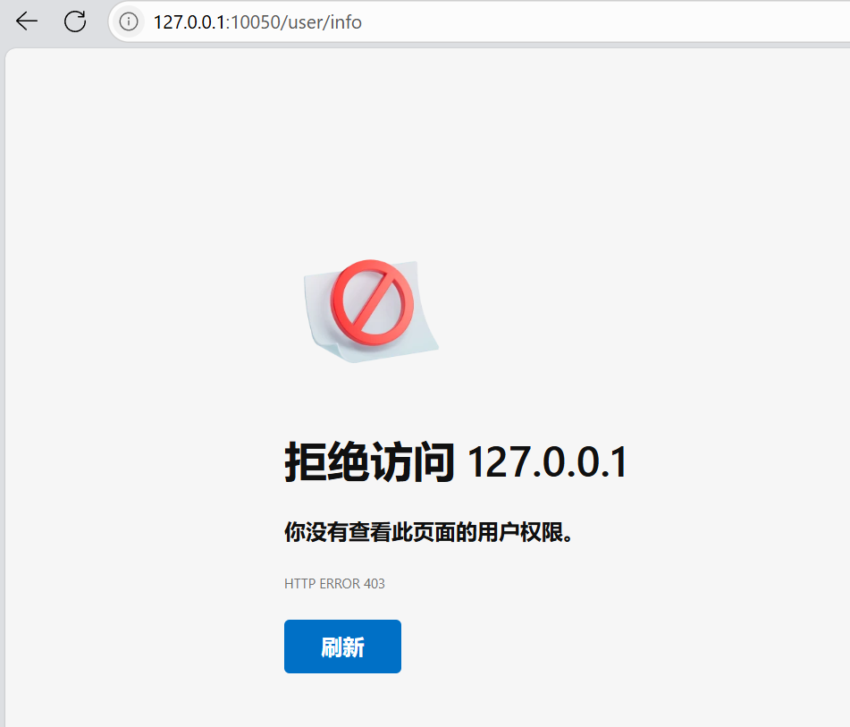


## 7.2 GUEST权限用户

利用Apifox，登录`John`账号。可以看到登录成功，然后将返回的`jwt`放置在后续的请求头中

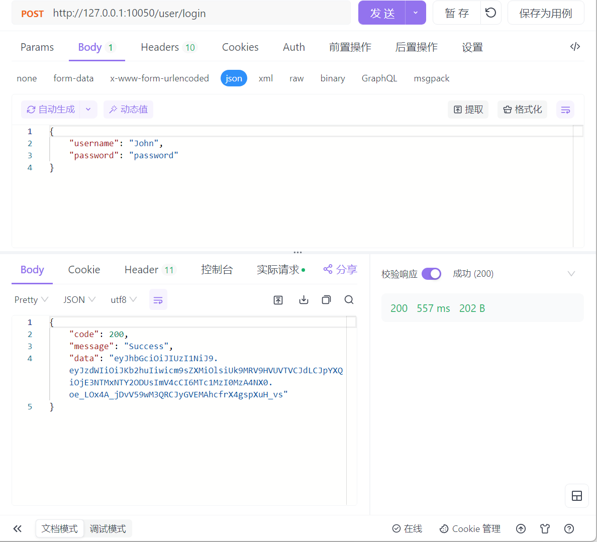


访问`/hello`接口，发现可以正确访问

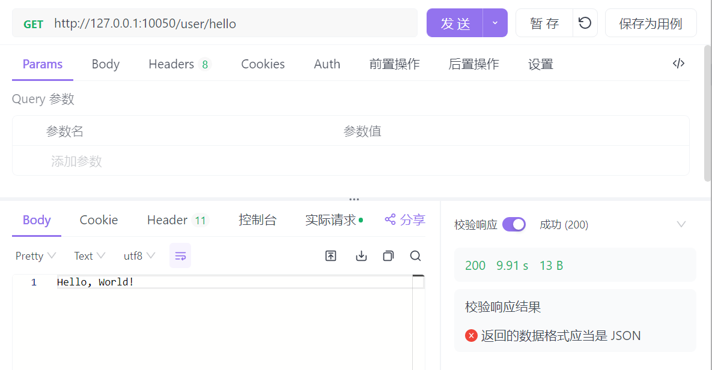


访问`/info`接口，返回403，表示无权限访问，符合预期

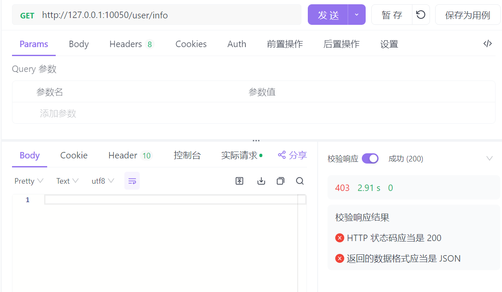


## 7.3 ADMIN权限用户

登录`admin`账号。可以看到登录成功，然后将返回的`jwt`放置在后续的请求头中

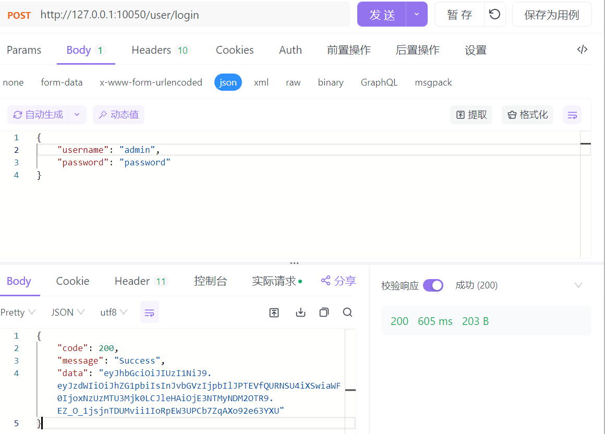

访问`/hello`和`/info`接口，发现均可以正确访问

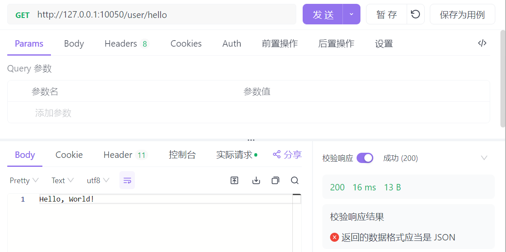

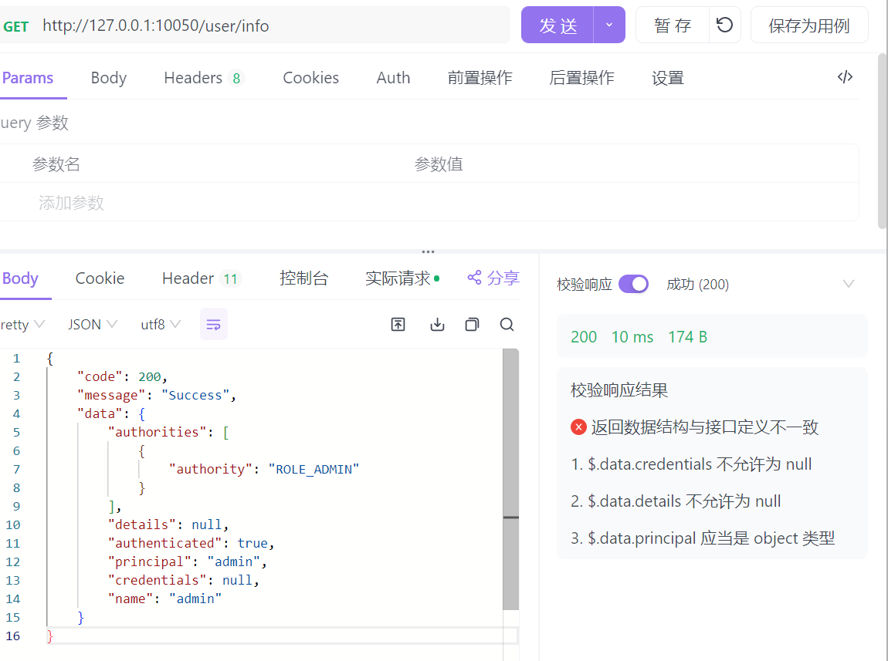


# 源码

本文章配套源码已部署至`github`，可按需下载查看

::github{repo="mj3622/spring-security-demo"}
