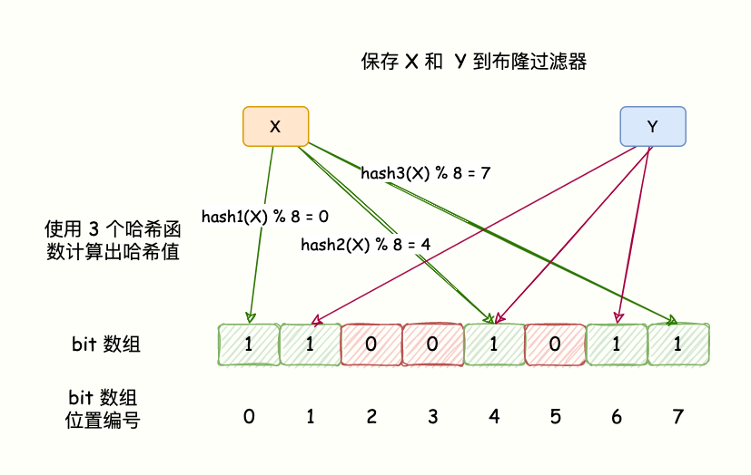

# 1. 布隆过滤器

布隆过滤器（Bloom Filter）是一种空间效率极高的概率型数据结构，由位数组和哈希函数两部分组成，用于判断一个元素是否属于一个集合。它由 Burton Howard Bloom 在 1970 年提出，主要用于解决大规模数据下的成员查询问题。其可能产生误判（即判断元素存在时，实际可能不存在），但不会漏判（即判断元素不存在时，实际一定不存在）。


**实现原理：**

1. 初始化：创建一个长度为 m 的位数组，所有位初始化为 0。
2. 添加元素：使用 k 个哈希函数将元素映射到位数组的 k 个位置，并将这些位置置为 1。
3. 查询元素：使用相同的哈希函数检查元素的 k 个位置是否都为 1。如果都是 1，则元素可能存在；如果有任何一个位置为 0，则元素一定不存在。




**使用场景：**

- **缓存穿透保护**：在缓存系统中，快速判断请求的数据是否可能存在于数据库中。
- **去重**：在大规模数据中快速判断某个元素是否已经处理过。
- **推荐系统**：过滤已经推荐过的内容。
- **垃圾邮件过滤**：快速判断邮件地址是否在黑名单中。


# 2. 借助Redisson使用布隆过滤器

> [!TIP]
>
> 如果是在Spring Boot项目中引入，可以参考[Redisson 介绍](https://mj3622.github.io/posts/项目介绍/点评网站/#36-redisson)

### 1. 添加 Redisson 依赖

```xml
<dependency>
    <groupId>org.redisson</groupId>
    <artifactId>redisson</artifactId>
    <version>3.17.0</version>
</dependency>
```

### 2. 初始化 Redisson 客户端

```java
import org.redisson.Redisson;
import org.redisson.api.RedissonClient;
import org.redisson.config.Config;

public class RedissonConfig {
    public static RedissonClient createClient() {
        Config config = new Config();
        config.useSingleServer()
              .setAddress("redis://127.0.0.1:6379"); // Redis 服务器地址
        return Redisson.create(config);
    }
}
```

------

### 3. 使用 Redisson 的布隆过滤器

```java
import org.redisson.api.RBloomFilter;
import org.redisson.api.RedissonClient;

public class BloomFilterExample {
    public static void main(String[] args) {
        // 初始化 Redisson 客户端
        RedissonClient redissonClient = RedissonConfig.createClient();

        // 获取或创建布隆过滤器
        RBloomFilter<String> bloomFilter = redissonClient.getBloomFilter("myBloomFilter");

        // 初始化布隆过滤器
        // expectedInsertions: 预计插入的元素数量
        // falseProbability: 误判率
        bloomFilter.tryInit(10000L, 0.01);

        // 添加元素
        bloomFilter.add("apple");
        bloomFilter.add("banana");

        // 检查元素是否存在
        System.out.println("Contains 'apple': " + bloomFilter.contains("apple"));   // 输出: true
        System.out.println("Contains 'orange': " + bloomFilter.contains("orange")); // 输出: false

        // 关闭 Redisson 客户端
        redissonClient.shutdown();
    }
}
```

