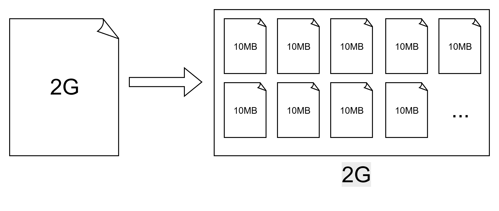
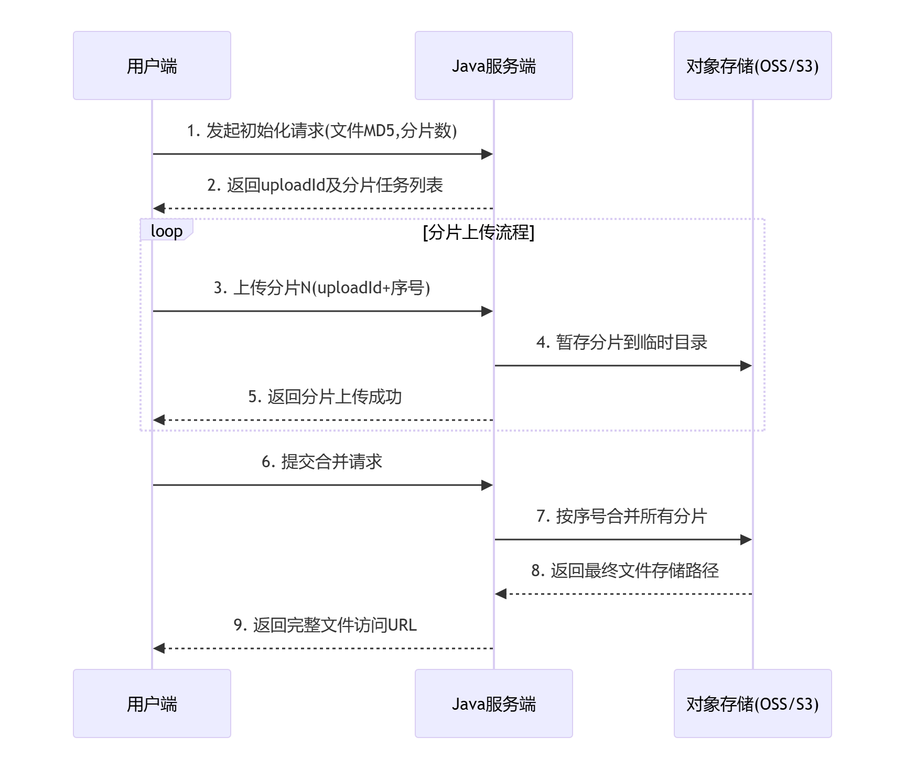

# 1. 背景介绍

## 1.1 为什么需要分片上传？

当用户尝试上传一个2GB视频文件时，传统单次上传方式存在致命缺陷：

- **网络波动导致失败**：上传90%时断网需要完全重传
- **服务器内存溢出**：Java应用尝试`MultipartFile file`接收大文件时JVM崩溃
- **用户体验断层**：长时间等待无进度反馈

以上暴露的种种问题，导致我们需要引入文件分片上传来进行优化，那么什么是文件分片上传呢？


## 1.2 文件分片上传是什么？

文件分片的概念其实很简单，就是将一个大文件给他进行切分，变成一系列的小文件，如下图所示：

这样做有什么好处呢？当我们进行小文件上传时，速度是很快的，不会长时间卡住导致用户无法知晓上传进度。此外，当使用分片上传时，即使中途因为网络原因导致部分分片丢失或是上传失败，我们也无需重新上传整个文件，而只需要重新上传丢失的部分，能有效保障使用体验。


分片上传的具体流程图如下所示，之后本文将分别从前端和后端介绍如何实现文件的分片上传




# 2. 前端切片处理

## 2.1 实现思路

前端实现分片上传的核心流程如下：

1. **文件选择**：用户通过 `<input type="file">` 选择文件
2. **哈希计算**：生成文件唯一标识（基于内容）
3. **分片检查**：查询服务器已上传的分片
4. **分片上传**：并发上传未完成的分片
5. **合并请求**：通知服务器合并所有分片


## 2.2 文件哈希计算

由于文件是分片上传的，那么我们显然就需要给这一系列的分片分配一个唯一标识，来表示这些分片归属于一个文件。


那么我们应该采用什么作为唯一标识呢？文件名显然是不行的，因为文件名非常容易重复产生冲突。那么常见的UUID呢？这也不是一个好的方案，如果用户想要续传一个文件，那么在上传前就会被分配到一个新的UUID，而无法找到之前已经上传的部分了。此外，如果用户对文件的内容进行了修改，但是不去改变名称，那么在续传的时候即使匹配到之前上传的部分，也会产生问题。


从上述分析中我们不难发现，这个文件的唯一标识符应该和文件本身的内容有关，那么文件的哈希值就可以很好的满足我们的需求。即使文件发生了很细微的改动，文件的哈希值也会变得截然不同，这样能够有效的帮我们区分不同的文件。


下面是文件的哈希计算示例代码：

```js
async function calculateFileHash(file) {
  return new Promise(resolve => {
    const spark = new SparkMD5.ArrayBuffer();
    const reader = new FileReader();
    const chunkSize = Math.min(file.size, 10 * 1024 * 1024);
    
    // 抽样策略：仅计算首尾+中间3块（加速大文件处理）
    const samplePoints = [
      0,
      Math.floor(file.size / 2),
      file.size - chunkSize,
      file.size - 1
    ];
    
    let processed = 0;
    
    reader.onload = e => {
      spark.append(e.target.result);
      processed++;
      if (processed === samplePoints.length) {
        resolve(spark.end() + '_' + file.name.substring(file.name.lastIndexOf('.')));
      }
    };

    samplePoints.forEach(start => {
      const end = Math.min(start + chunkSize, file.size);
      reader.readAsArrayBuffer(file.slice(start, end));
    });
  });
}
```


## 2.3 分片上传实现

要实现文件的分片上传，我们首先要实现文件的分片，在分片操作时需要注意：

- 需要跳过已上传的分片
- 分片标识 = 文件哈希 + 分片索引

参考代码如下：

```js
function createChunks(file, fileHash, uploadedChunks = []) {
  const chunks = [];
  const count = Math.ceil(file.size / CHUNK_SIZE);
  
  for (let i = 0; i < count; i++) {
    if (uploadedChunks.includes(i)) continue;
    
    chunks.push({
      index: i,
      hash: `${fileHash}_${i}`, // 分片唯一标识
      chunk: file.slice(i * CHUNK_SIZE, (i + 1) * CHUNK_SIZE)
    });
  }
  return chunks;
}
```


完成分片后，我们需要进行分片的上传，我们可以通过使用线程池的方式来实现并且上传，以提高效率

参考代码如下：

```js
function uploadChunks(chunks, concurrency) {
  const queue = [...chunks];
  const workers = new Array(concurrency).fill(null).map(async () => {
    while (queue.length) {
      const { index, chunk, hash } = queue.shift();
      const formData = new FormData();
      formData.append('file', chunk);
      formData.append('index', index);
      formData.append('hash', hash);
      
      await fetch(`${BASE_URL}/upload-chunk`, {
        method: 'POST',
        body: formData
      });
    }
  });
  await Promise.all(workers);
}
```


## 2.4 完整示例代码

下面给出一份完成的`html`代码，实现了文件的分片上传功能

```html
<input type="file" id="fileInput">
<button onclick="upload()">上传</button>

<script src="https://cdn.jsdelivr.net/npm/spark-md5@3.0.0/spark-md5.min.js"></script>
<script>

const BASE_URL = 'http://127.0.0.1:8080';
const CHUNK_SIZE = 10 * 1024 * 1024; // 10MB分片大小

async function upload() {
  const file = document.getElementById('fileInput').files[0];
  if (!file) return;

  // 生成文件唯一标识（基于文件内容）
  const fileHash = await calculateFileHash(file);
  
  // 检查已上传分片
  const uploadedChunks = await checkChunks(file.name, fileHash);
  
  // 创建分片上传任务
  const chunks = createChunks(file, fileHash, uploadedChunks);
  
  // 并发上传（限制4个并行）
  await uploadChunks(chunks, 4);
  
  // 请求合并文件
  await mergeFile(file.name, fileHash, file.size);
}

async function calculateFileHash(file) {
  return new Promise(resolve => {
    const spark = new SparkMD5.ArrayBuffer();
    const reader = new FileReader();
    // 抽样10MB计算hash
    const chunkSize = Math.min(file.size, 10 * 1024 * 1024); 
    const chunks = Math.ceil(file.size / chunkSize);
    let currentChunk = 0;
    
    reader.onload = e => {
      spark.append(e.target.result);
      currentChunk++;
      if (currentChunk < chunks) {
        loadNext();
      } else {
        resolve(spark.end() + '_' + file.name.substring(file.name.lastIndexOf('.')));
      }
    };
    
    function loadNext() {
      const start = currentChunk * chunkSize;
      const end = Math.min(start + chunkSize, file.size);
      reader.readAsArrayBuffer(file.slice(start, end));
    }
    loadNext();
  });
}

function createChunks(file, fileHash, uploadedChunks = []) {
  const chunks = [];
  const count = Math.ceil(file.size / CHUNK_SIZE);
  for (let i = 0; i < count; i++) {
    const start = i * CHUNK_SIZE;
    const end = Math.min(start + CHUNK_SIZE, file.size);
    // 跳过已上传分片
    if (!uploadedChunks.includes(i)) {
      chunks.push({
        index: i,
        start,
        end,
        hash: fileHash,
        chunk: file.slice(start, end)
      });
    }
  }
  return chunks;
}

async function checkChunks(filename, fileHash) {
  const response = await fetch(
      `${BASE_URL}/check-chunks?filename=${filename}&hash=${fileHash}`);
  return response.json(); // 返回 [0,1,2,...] 已上传分片索引
}

async function uploadChunks(chunks, concurrency) {
  const queue = [...chunks];
  const workers = new Array(concurrency).fill(null).map(async () => {
    while (queue.length) {
      const { index, chunk, hash } = queue.shift();
      const formData = new FormData();
      formData.append('file', chunk);
      formData.append('index', index);
      formData.append('hash', hash);
      
      await fetch(`${BASE_URL}/upload-chunk`, {
        method: 'POST',
        body: formData
      });
    }
  });
  await Promise.all(workers);
}

async function mergeFile(filename, fileHash, fileSize) {
  await fetch(`${BASE_URL}/merge`, {
    method: 'POST',
    headers: { 'Content-Type': 'application/json' },
    body: JSON.stringify({ filename, hash: fileHash, size: fileSize })
  });
}
</script>
```


# 3. 后端收集汇总

## 3.1 实现思路

按照之前绘制的流程图，我们可以知道后端需要做的工作有：

1. **查询切片**：查看该文件知否存在已上传过的切片，若存在则跳过
2. **暂存切片**：将上传的切片暂存到临时目录
3. **合并切片**：将所有的数据切片进行合并成完整的文件
4. **返回链接**：返回文件最终的存储路径


## 3.2 查询切片接口

由于我们的切片会全部暂存到临时目录中，因此我们可以通过扫描该目录查询已上传的分片

```java
@GetMapping("/check-chunks")
public ResponseEntity<List<Integer>> checkChunks(@RequestParam String filename, 
                                                 @RequestParam String hash) {

    String chunkDir = getChunkDir(hash);
    File[] chunks = new File(chunkDir).listFiles();

    if (chunks == null) {
        return ResponseEntity.ok(Collections.emptyList());
    }

    List<Integer> uploaded = Arrays
                        .stream(chunks)
                        .map(f -> Integer.parseInt(f.getName().split("\\.")[0]))
                        .sorted()
                        .collect(Collectors.toList());

    return ResponseEntity.ok(uploaded);
}

private String getChunkDir(String hash) {
    return uploadDir + File.separator + "chunks" + File.separator + hash;
}
```


## 3.3 接收切片接口

在接收文件切片时，我们需要同时或许到该分片的索引和文件的哈希值，以确保分片的顺序正确

```java
// 上传分片
@PostMapping("/upload-chunk")
public ResponseEntity<String> uploadChunk(@RequestParam("file") MultipartFile file, 
                                          @RequestParam Integer index, 
                                          @RequestParam String hash) throws IOException {

    String chunkDir = getChunkDir(hash);
    new File(chunkDir).mkdirs();

    String chunkPath = chunkDir + File.separator + index + ".chunk";
    file.transferTo(Paths.get(chunkPath));

    return ResponseEntity.ok("Chunk saved");
}
```


## 3.4 合并切片接口

当前端完成了所有切片的上传后，即可向后端发送合并的请求。后端在接收到请求后，即可扫描临时目录中的分片，开始组装

>  [!CAUTION]
>
> 在此次进行组装时并未进行任何校验，很有可能出现异常，在实际使用时应进行相应的处理

```java
    // 合并文件
    @PostMapping("/merge")
    public ResponseEntity<String> mergeFile(@RequestBody MergeRequest request) throws IOException {
        // 检查分片目录是否存在
        String chunkDir = getChunkDir(request.getHash());
        String filePath = uploadDir + File.separator + request.getFilename();

        try (FileOutputStream fos = new FileOutputStream(filePath)) {
            for (int i = 0; i < Math.ceil(request.getSize() / (double) CHUNK_SIZE); i++) {
                String chunkPath = chunkDir + File.separator + i + ".chunk";
                Files.copy(Paths.get(chunkPath), fos);
            }
        }

        // 清理分片目录
        FileUtils.deleteDirectory(new File(chunkDir));

        System.out.println("File merged: " + filePath);

        return ResponseEntity.ok("File merged");
    }
```


## 3.5 完整示例代码

下面给出一份完成的`Java`代码，实现了文件分片的查询、接收与合并。

```java
import org.apache.commons.io.FileUtils;
import org.springframework.beans.factory.annotation.Value;
import org.springframework.http.ResponseEntity;
import org.springframework.web.bind.annotation.*;
import org.springframework.web.multipart.MultipartFile;

import java.io.File;
import java.io.FileOutputStream;
import java.io.IOException;
import java.nio.file.Files;
import java.nio.file.Paths;
import java.util.Arrays;
import java.util.Collections;
import java.util.List;
import java.util.stream.Collectors;

@RestController
public class FileUploadController {

    private static final long CHUNK_SIZE = 10 * 1024 * 1024;

    @Value("${upload.dir}")
    private String uploadDir;

    // 检查已上传分片
    @GetMapping("/check-chunks")
    public ResponseEntity<List<Integer>> checkChunks(@RequestParam String filename, 
                                                     @RequestParam String hash) {

        String chunkDir = getChunkDir(hash);
        File[] chunks = new File(chunkDir).listFiles();

        if (chunks == null) {
            return ResponseEntity.ok(Collections.emptyList());
        }

        List<Integer> uploaded = Arrays
            .stream(chunks)
            .map(f -> Integer.parseInt(f.getName().split("\\.")[0]))
            .sorted()
            .collect(Collectors.toList());

        return ResponseEntity.ok(uploaded);
    }

    // 上传分片
    @PostMapping("/upload-chunk")
    public ResponseEntity<String> uploadChunk(@RequestParam("file") MultipartFile file, 
                                              @RequestParam Integer index, 
                                              @RequestParam String hash) throws IOException {

        String chunkDir = getChunkDir(hash);
        new File(chunkDir).mkdirs();

        String chunkPath = chunkDir + File.separator + index + ".chunk";
        file.transferTo(Paths.get(chunkPath));

        return ResponseEntity.ok("Chunk saved");
    }

    // 合并文件
    @PostMapping("/merge")
    public ResponseEntity<String> mergeFile(@RequestBody MergeRequest request) throws IOException {
        // 检查分片目录是否存在
        String chunkDir = getChunkDir(request.getHash());
        String filePath = uploadDir + File.separator + request.getFilename();

        try (FileOutputStream fos = new FileOutputStream(filePath)) {
            for (int i = 0; i < Math.ceil(request.getSize() / (double) CHUNK_SIZE); i++) {
                String chunkPath = chunkDir + File.separator + i + ".chunk";
                Files.copy(Paths.get(chunkPath), fos);
            }
        }

        // 清理分片目录
        FileUtils.deleteDirectory(new File(chunkDir));

        System.out.println("File merged: " + filePath);

        return ResponseEntity.ok("File merged");
    }

    private String getChunkDir(String hash) {
        return uploadDir + File.separator + "chunks" + File.separator + hash;
    }
}
```


# 4. 总结

本文介绍了如何从前端进行数据分片，批量上传至后端服务器重新组装得到完整文件的流程，并给出了完整的示例代码以供参考。


当然，本文的教程仅提供了最简单的实现方法，在实际使用中可能还要加入更多的细节，例如安全防护、切片大小动态调整以及存储到不同的文件系统等，不过由于本文篇幅有限，加之是以简单教程的形式介绍，在此就不过多赘述。