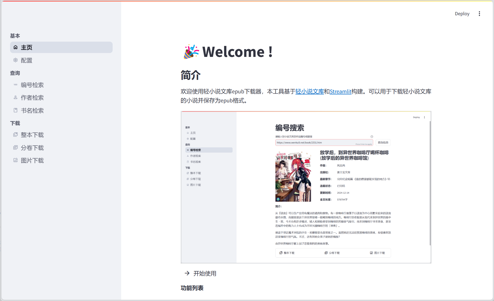
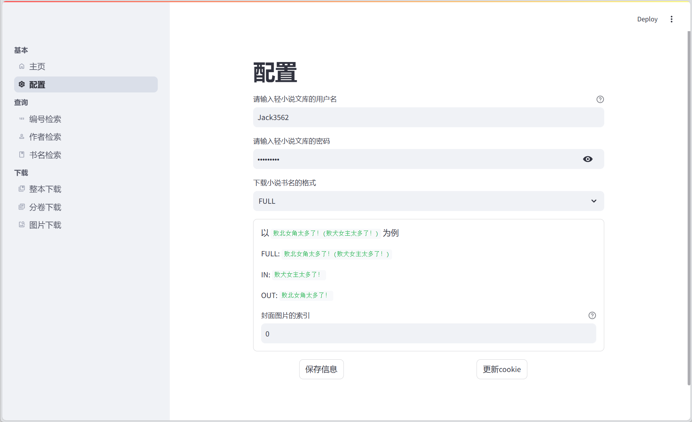

# 轻小说下载器

**Wenku8Downloader** 是基于 Python 和 [Streamlit](https://streamlit.io/) 构建的一款本地工具，提供基于Web的操作页面，用于下载 [轻小说文库](https://www.wenku8.net/) 的小说并保存为EPUB格式。




# 基本功能
下载文件均存储在`/downloads`目录下
- ✅ 查询文库中的小说信息（支持按编号、书名、作者查询）
- ✅ 下载整本小说或分卷下载
- ✅ 单独下载小说插图
- ✅ 个性化下载配置
- ⚠️ 暂不支持下载已下架小说


# 使用方法

本项目基于 `Python 3.9` 构建，请在使用前自行配置环境

1. 将项目拉取到本地

   ```bash
   git clone https://github.com/mj3622/Wenku8Downloader.git
   cd Wenku8Downloader
   ```

2. 创建并激活虚拟环境

   ```bash
   # 创建
   python -m venv myenv
   
   # 激活
   myenv\Scripts\activate
   ```

3. 安装依赖

   ```bash
   pip install -r requirements.txt
   ```

4. 启动

   ```bash
   streamlit run app.py
   ```

   

**补充内容：**

为方便后续使用，可自行编写`start.bat`文件进行一键开启，此处给出参考示例

```bat
@echo off
:: 进入当前目录
cd /d %~dp0

:: 激活虚拟环境
call myenv\Scripts\activate

:: 运行 Streamlit 应用
streamlit run app.py

:: 保持命令行窗口开启
pause
```


# 配置介绍

配置页面如下所示：



- **用户名、密码**：使用默认提供的即可，若账号出现异常时可以自行更换
- **下载格式**：对于有两种译名的作品，可自行选择保存时的标题
- **封面索引**：分卷下载小说时，作为封面的插图索引，从`0`开始


# 常见问题

### 1. 下载过程中出现异常 `Exception: Failed to fetch`

请检查当前的网络环境，如开启代理可以在关闭后再重试


### 2. 小说 查询/下载 失败

请先检查该书是否为已下架小说，当前并未支持对下架小说的操作行为


### 3. 分卷下载小说时封面异常

分卷下载时，默认以首张插图作为封面，可以自行在`基本-配置`页面进行修改


