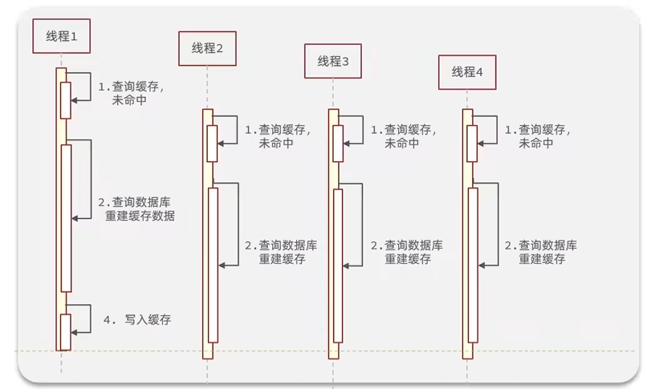

# 1. 验证码登录

整体业务流程如下所示：

## 1.1 发送短信验证码

核心代码：

```java
public Result sendCode(String phone, HttpSession session) {
    // 1. 校验手机号码是否合法
    if (RegexUtils.isPhoneInvalid(phone)) {
        return Result.fail("手机号码格式不正确");
    }
    // 2. 生成验证码
    String code = RandomUtil.randomNumbers(6);

    // 3. 保存验证码到session中
    session.setAttribute("code", code);

    // 4. 发送验证码到手机
    log.info("向手机号码：{} 发送验证码：{}", phone, code);

    return Result.ok();
}
```


## 1.2 验证码注册登录

核心代码：

```java
public Result login(LoginFormDTO loginForm, HttpSession session) {
    // 1. 校验手机号码是否合法
    if (RegexUtils.isPhoneInvalid(loginForm.getPhone())) {
        return Result.fail("手机号码格式不正确");
    }

    // 2. 校验验证码
    String code = (String) session.getAttribute("code");
    if (!loginForm.getCode().equals(code)) {
        return Result.fail("验证码错误");
    }

    // 3. 查询用户信息
    User user = query().eq("phone", loginForm.getPhone()).one();

    // 4. 判断用户是否存在
    if (user == null) {
        // 4.1 用户不存在，注册用户
        user = new User()
                .setPhone(loginForm.getPhone())
                .setNickName("user_" + UUID.randomUUID().toString().substring(0, 8));
        
        // 4.2 存入数据库
        save(user);
    }

    // 5. 保存用户信息到session中
    session.setAttribute("user", user);

    return Result.ok();
}
```


## 1.3 校验登录状态


拦截器核心代码：将用户信息存储在`ThreadLocal`以便后续服务获取用户信息

```java
public class LoginInterceptor implements HandlerInterceptor {
    @Override
    public boolean preHandle(HttpServletRequest request, HttpServletResponse response, Object handler) throws Exception {
        // 1. 从session中获取用户信息
        HttpSession session = request.getSession();
        UserDTO user = (UserDTO) session.getAttribute("user");
        // 2. 判断用户信息是否存在
        if (user == null) {
            response.setStatus(401);
            return false;
        }

        // 3. 保存用户信息到ThreadLocal中（只保留用户的基本信息）
        UserHolder.saveUser(BeanUtil.copyProperties(user, UserDTO.class));

        // 4. 放行
        return true;
    }

    @Override
    public void afterCompletion(HttpServletRequest request, HttpServletResponse response, Object handler, Exception ex) throws Exception {
        // 移除ThreadLocal中的用户信息
        UserHolder.removeUser();
    }
}
```

注册拦截器：将不需要用户信息的请求排除在外

```java
@Configuration
public class MvcConfig implements WebMvcConfigurer {
    @Override
    public void addInterceptors(InterceptorRegistry registry) {
        registry.addInterceptor(new LoginInterceptor())
                .excludePathPatterns(
                        "/user/code", 
                        "/user/login",
                        "/blog/hot",
                        "/upload/**",
                        "/shop/**",
                        "/vocher/**",
                        "/shop-type/**");
    }
}
```


## 1.4 集群的Session共享问题

**session共享问题：** 多台Tomcat并不共享session存储空间，当请求切换到不同tomcat服务时导致数据丢失的问题。


## 1.5 使用Redis对登录进行改造


### 1. Redis存储验证码

```java
// 3. 保存验证码到session中
//session.setAttribute("code", code);
// 3.1 保存验证码到redis中
redisTemplate.opsForValue().set(RedisConstants.LOGIN_CODE_KEY + phone, code, RedisConstants.LOGIN_CODE_TTL, TimeUnit.MINUTES);
```


### 2. Redis校验验证码并存储用户信息

这边可以做简单的优化，登录成功之后销毁验证码

```java
// 2. 校验验证码
//String code = (String) session.getAttribute("code");
// 2.1 从redis中获取验证码
String code = redisTemplate.opsForValue().get(RedisConstants.LOGIN_CODE_KEY + loginForm.getPhone());

...
    
// 5. 保存用户信息到session中
//session.setAttribute("user", user);
// 5.1 保存用户信息到redis中
// 生成token
String token = UUID.randomUUID().toString();

// 将信息转为HashMap（由于使用的是StringRedisTemplate，因此要将所有类型转换成String）
Map<String, Object> map = BeanUtil.beanToMap(BeanUtil.copyProperties(user, UserDTO.class), new HashMap<>(),
                                             CopyOptions.create().setIgnoreNullValue(true).setFieldValueEditor(
                                                 (fieldName, value) -> value.toString()
                                             ));

// 保存到redis中
redisTemplate.opsForHash().putAll(RedisConstants.LOGIN_USER_KEY + token, map);
redisTemplate.expire(RedisConstants.LOGIN_USER_KEY + token, RedisConstants.LOGIN_USER_TTL, TimeUnit.MINUTES);

...
    
// 将token返回给前端存储，以便之后读取用户信息
return Result.ok(token);
```


### 3. 校验登录状态

```java
@Override
public boolean preHandle(HttpServletRequest request, HttpServletResponse response, Object handler) throws Exception {
    // 1. 从请求头中获取Token
    String token = request.getHeader("authorization");
    if (StrUtil.isBlank(token)) {
        response.setStatus(401);
        return false;
    }

    // 2. 从Redis中获取用户信息
    Map<Object, Object> userMap = redisTemplate.opsForHash().entries(RedisConstants.LOGIN_USER_KEY + token);

    // 3. 判断用户信息是否存在
    if (userMap.isEmpty()) {
        response.setStatus(401);
        return false;
    }

    // 4. 保存用户信息到ThreadLocal中
    UserHolder.saveUser(BeanUtil.fillBeanWithMap(userMap, new UserDTO(), false));

    // 5. 刷新Token的过期时间
    redisTemplate.expire(RedisConstants.LOGIN_USER_KEY + token, RedisConstants.LOGIN_USER_TTL, TimeUnit.MINUTES);

    // 6. 放行
    return true;
}
```


### 4. 拦截器优化

在上面介绍的这种方法中，只有当访问需要登录状态的路径时，才会对token进行刷新。因此需要增加一个拦截器，专门用于对token进行刷新，以确保用户的良好体验。


新增拦截器的代码：基本和之前的拦截器相同，只不过把部分返回`false`的地方改为放行给下一个拦截器验证

```java
@Override
public boolean preHandle(HttpServletRequest request, HttpServletResponse response, Object handler) throws Exception {
    // 1. 从请求头中获取Token
    String token = request.getHeader("authorization");
    if (StrUtil.isBlank(token)) {
        // 未携带Token，放行给下一个拦截器
        return true;
    }

    // 2. 从Redis中获取用户信息
    Map<Object, Object> userMap = redisTemplate.opsForHash().entries(RedisConstants.LOGIN_USER_KEY + token);

    // 3. 判断用户信息是否存在
    if (userMap.isEmpty()) {
        // 放行给下一个拦截器
        return true;
    }

    // 4. 保存用户信息到ThreadLocal中
    UserHolder.saveUser(BeanUtil.fillBeanWithMap(userMap, new UserDTO(), false));

    // 5. 刷新Token的过期时间
    redisTemplate.expire(RedisConstants.LOGIN_USER_KEY + token, RedisConstants.LOGIN_USER_TTL, TimeUnit.SECONDS);

    // 6. 放行
    return true;
}
```


原先拦截器修改后的代码：只需要判断用户信息是否存在即可

```java
@Override
public boolean preHandle(HttpServletRequest request, HttpServletResponse response, Object handler) throws Exception {
    // 判断用户信息是否存在
    if (UserHolder.getUser() == null) {
        // 如果用户信息不存在，返回401状态码
        response.setStatus(401);
        return false;
    }
    
    return true;
}
```


最后修改配置文件，将新拦截器放置于旧拦截器之前

```java
@Configuration
public class MvcConfig implements WebMvcConfigurer {
    @Autowired
    private StringRedisTemplate redisTemplate;
    @Override
    public void addInterceptors(InterceptorRegistry registry) {
        registry.addInterceptor(new RefreshTokenInterceptor(redisTemplate)).order(0);
        
        registry.addInterceptor(new LoginInterceptor())
                .excludePathPatterns(
                        "/user/code",
                        "/user/login",
                        "/blog/hot",
                        "/upload/**",
                        "/shop/**",
                        "/vocher/**",
                        "/shop-type/**").order(1);
        
    }
}
```


# 2. 商户查询缓存

## 2.1 添加商户缓存


核心代码：

```java
public Result queryById(Long id) {
    String key = RedisConstants.CACHE_SHOP_KEY + id;
    // 1. 从缓存中查询
    String shopJson = redisTemplate.opsForValue().get(key);

    // 2. 如果缓存中有，直接返回
    if (StrUtil.isBlank(shopJson)) {
        // 3. 如果缓存中没有，从数据库中查询
        Shop shop = getById(id);
        if (shop == null) {
            return Result.fail("商铺不存在");
        }
        shopJson = JSONUtil.toJsonStr(shop);

        // 4. 如果数据库中有，将数据写入缓存
        redisTemplate.opsForValue().set(key, shopJson);
    }

    return Result.ok(JSONUtil.toBean(shopJson, Shop.class));
}
```


同时，我们还可以给商户的分类信息进行缓存，这里提供两种方式：

方法1：以`String`形式存储

```java
public List<ShopType> queryTypeList() {
    // 1. 从缓存中查询
    String list = redisTemplate.opsForValue().get(RedisConstants.SHOP_TYPE_LIST);

    // 2. 如果缓存中有，直接返回
    if (StrUtil.isBlank(list)) {
        // 3. 如果缓存中没有，从数据库中查询
        List<ShopType> shopTypes = query().orderByAsc("sort").list();
        list = JSONUtil.toJsonStr(shopTypes);
        // 4. 将数据写入缓存
        redisTemplate.opsForValue().set(RedisConstants.SHOP_TYPE_LIST, list);
    }

    return JSONUtil.toList(JSONUtil.parseArray(list), ShopType.class);
}
```

方法2：以`List`形式存储

```java
public List<ShopType> queryTypeList() {
    // 1. 从 Redis 缓存中查询数据（JSON 格式的 List）
    List<String> cachedList = redisTemplate.opsForList().range(RedisConstants.SHOP_TYPE_LIST, 0, -1);

    // 2. 如果缓存中有数据
    if (CollUtil.isNotEmpty(cachedList)) {
        // 将 JSON 字符串转换为 ShopType 对象
        return cachedList.stream()
                .map(json -> JSONUtil.toBean(json, ShopType.class))
                .collect(Collectors.toList());
    }

    // 3. 如果缓存中没有，从数据库中查询
    List<ShopType> shopTypes = query().orderByAsc("sort").list();

    // 4. 如果数据库中有数据，将其序列化为 JSON 并存入 Redis
    if (CollUtil.isNotEmpty(shopTypes)) {
        List<String> jsonList = shopTypes.stream()
                .map(JSONUtil::toJsonStr)
                .collect(Collectors.toList());
        redisTemplate.opsForList().rightPushAll(RedisConstants.SHOP_TYPE_LIST, jsonList);
    }

    return shopTypes;
}
```


## 2.2 缓存更新策略


**常见的主动更新策略：**


在实际开放中，常常采用第一种策略来更新缓存


针对第三个问题，我们可以看以下两张图：

- 先删除缓存，再操作数据库：由于查询的性能通常较高，因此右边这种异常状况较容易发生


- 先操作数据库，再删除缓存：通常来说，线程1中的这些操作要比线程2中的快许多，因此这种异常发生的概率较小


## 2.3 设置查询店铺的缓存更新

1. 给缓存添加超时时间。

   ```java
   // 设置过期时间
   redisTemplate.opsForValue().set(key, shopJson, RedisConstants.CACHE_SHOP_TTL, TimeUnit.MINUTES);
   ```

2. 更新店铺信息时，先修改数据库后删除缓存。同时使用`@Transactional`注解保证事务一致性。

   ```java
   @Transactional
   public Boolean updateShop(Shop shop) {
       // 1. 查询商铺信息
       Shop oldShop = getById(shop.getId());
   
       // 2. 检测商铺是否存在
       if (oldShop == null) {
           log.error("商铺不存在，id: " + shop.getId());
           return false;
       }
   
       // 3. 更新商铺信息
       updateById(shop);
   
       // 4. 删除缓存
       redisTemplate.delete(RedisConstants.CACHE_SHOP_KEY + shop.getId());
   
       return true;
   }
   ```

   

## 2.4 缓存穿透

缓存穿透是指用户请求的数据既不存在于缓存中，也不存在于数据库中，导致请求直接穿过缓存层，打到数据库。由于大量无效请求直接访问数据库，会对数据库造成很大的压力，甚至可能导致数据库崩溃。


### 1. 缓存穿透的典型场景

1. **恶意请求**：
   - 攻击者构造大量不存在的键（如随机生成的用户 ID），直接绕过缓存层，给数据库造成压力。
2. **请求的键本身不合法**：
   - 比如查询一个负数 ID 或超大 ID，这些数据通常既不在缓存中，也不会存储在数据库中。
3. **缓存未命中且数据库无该数据**：
   - 用户请求的数据确实不存在，缓存也没存储对应的空值，导致每次都需要查询数据库。


### 2. 缓存穿透的影响

1. **缓存无效**：
   - 缓存失去了缓解数据库压力的作用。
2. **数据库压力骤增**：
   - 高频无效请求直接打到数据库，可能引发性能瓶颈或宕机。
3. **系统资源浪费**：
   - 数据库和网络资源都被浪费在无效请求上，影响正常用户的访问。


### 3. 解决缓存穿透的常用方法

1. **缓存空值：** 如果查询的结果为空（数据库中也没有），将空值写入缓存，并设置较短的过期时间。
2. **布隆过滤器：**
   - 在查询缓存或数据库之前，使用布隆过滤器快速判断一个键是否存在。
   - 布隆过滤器使用少量内存维护一个可能存在的键集合，能够高效地过滤掉大部分无效请求。
   - 特点：
     - 存在一定的误判率（可能误判不存在的键为存在）。
     - 不会漏判（不会将存在的键误判为不存在）。


### 4. 使用缓存空值优化店铺查询


核心修改代码如下所示：

```java
// 防止缓存穿透
if (StrUtil.equals("", shopJson)) {
    return Result.fail("商铺不存在");
}

// 3. 如果缓存中没有，从数据库中查询
Shop shop = getById(id);
if (shop == null) {
    // 缓存一个空值，防止缓存穿透
    redisTemplate.opsForValue().set(key, "", RedisConstants.CACHE_NULL_TTL, TimeUnit.MINUTES);
    return Result.fail("商铺不存在");
}
```


## 2.5 缓存雪崩

缓存雪崩是指在同一时间大量缓存失效，导致大量请求直接涌向后端数据库或服务，引发数据库或服务的性能瓶颈甚至崩溃的现象。它通常发生在高并发、大流量的场景中，是分布式系统中缓存设计的一个重要问题。


### 1. 缓存雪崩的产生原因

1. **缓存集中失效**：
   - 系统中大量的缓存数据设置了相同或相近的过期时间，一旦到期，大量请求同时绕过缓存，直接访问后端。
2. **缓存服务崩溃**：
   - 缓存服务（如 Redis、Memcached）因故障（如宕机、网络问题）导致所有缓存数据不可用，大量请求直接涌向数据库。
3. **高并发场景的缓存穿透**：
   - 请求的目标数据本身不在缓存中（如查询无效的键），直接对数据库发起大量访问。


### 2. 缓存雪崩的影响

1. **数据库或服务压力骤增**：
   - 短时间内大量请求绕过缓存直达数据库，可能导致服务不可用。
2. **系统响应时间急剧增加**：
   - 数据库、服务超负荷运行，导致请求延迟增加或直接失败。
3. **系统雪崩效应**：
   - 一旦数据库因过载崩溃，整个系统可能陷入不可用状态，最终对用户体验产生严重影响。


### 3. 缓存雪崩的解决方案

**1. 缓存过期时间的设计**

- 设置随机过期时间：避免所有缓存集中失效，可以在过期时间的基础上增加一个随机值。

  ```java
  int baseExpire = 3600; // 基础过期时间 1 小时
  int randomExpire = ThreadLocalRandom.current().nextInt(300); // 随机增加 0~300 秒
  redisTemplate.expire("key", baseExpire + randomExpire, TimeUnit.SECONDS);
  ```

- 分散缓存失效时间： 对不同类型的数据设置不同的过期时间。


**2. 缓存预热**

- 主动加载缓存：在系统启动或大流量访问前，提前将热点数据加载到缓存中，避免缓存为空导致请求直接落到数据库。

  - 示例：

    ```java
    public void warmUpCache() {
        List<HotData> hotData = database.queryHotData();
        for (HotData data : hotData) {
            redisTemplate.opsForValue().set(data.getKey(), data.getValue(), 1, TimeUnit.HOURS);
        }
    }
    ```

- 定期更新缓存： 使用后台任务定时刷新部分热点数据，确保缓存中始终有有效数据。


**3. 缓存降级**

- 使用默认值： 在缓存和数据库都不可用时，返回默认值或空数据，保证系统的基本可用性。
  - 示例：返回一个默认的商品列表或提示信息。
- 快速失败： 对非核心业务请求，直接返回失败，防止系统进一步过载。


**4. 增加缓存冗余**

- 多级缓存：结合本地缓存（如 Guava Cache、Caffeine）和分布式缓存（如 Redis），实现多级缓存架构。

  - 本地缓存作为第一层，减少对 Redis 的访问。
  - 如果本地缓存未命中，再访问 Redis。

  示例：多级缓存架构

  - 请求流程：
    1. 先查询本地缓存。
    2. 本地缓存未命中时，查询 Redis 缓存。
    3. Redis 未命中时，查询数据库，并更新 Redis 和本地缓存。


**5. 限流与熔断**

- 请求限流： 使用限流策略对请求量进行控制，避免流量过大导致后端数据库崩溃。
  - 示例：使用令牌桶算法或漏桶算法限制每秒请求数。
- 熔断机制： 当后端服务响应时间过长或错误率过高时，直接返回错误或默认数据，保护系统。


**6. 缓存服务高可用**

- Redis 哨兵模式： 部署 Redis 的主从架构和哨兵模式，确保缓存服务的高可用。主节点宕机时，哨兵会自动切换到从节点。
- 分布式缓存集群： 使用 Redis Cluster，分布式存储数据，避免单点故障。


## 2.6 缓存击穿

缓存击穿是指在高并发场景中，某个热点数据的缓存失效，导致大量并发请求同时访问数据库的现象。它通常发生在某些访问量极大的热点数据上，如果设计不当，可能会对数据库或后端服务造成瞬时的高负载压力，甚至引发系统崩溃。



### 1. 缓存击穿的典型场景

1. **热点数据缓存失效** ：一个高频访问的热点键（例如秒杀商品详情）突然过期，缓存中没有数据，导致所有请求直接访问数据库。
2. **高并发访问** ：短时间内有大量请求访问同一数据，而缓存又未命中时，所有请求会同时落到数据库。


### 2. 缓存击穿的影响

- **数据库压力骤增**： 如果大量请求绕过缓存直接访问数据库，数据库很容易负载过高，影响其他业务。
- **系统响应时间增加**： 用户请求需要等待数据库查询完成，导致系统延迟增加。
- **引发系统雪崩**： 在极端情况下，数据库因过载崩溃，进而导致系统不可用。


### 3. 缓存击穿的解决方案

1. **使用互斥锁**：当缓存失效时，使用分布式锁（如 Redis 的 `setnx`）保证只有一个线程能查询数据库并更新缓存，其他线程等待缓存更新完成后再读取缓存。
2. **逻辑过期**：将过期时间存储在缓存中，而key设置为永不过期，等到合适的时间再统一清理或更新


## 2.7 缓存击穿解决实战

### 1. 互斥锁解决


**核心代码**

构建操作锁的方法：

```java
public boolean tryLock(String key){
    Boolean b = redisTemplate.opsForValue().setIfAbsent(key, "1", 10, TimeUnit.SECONDS);
    return BooleanUtil.isTrue(b);
}

public void unlock(String key){
    redisTemplate.delete(key);
}
```

程序中使用互斥锁避免击穿

```java
private Shop queryWithMutex(Long id) {
    String key = RedisConstants.CACHE_SHOP_KEY + id;
    String lockKey = RedisConstants.LOCK_SHOP_KEY + id;
    // 1. 从缓存中查询
    String shopJson = redisTemplate.opsForValue().get(key);

    // 2. 如果缓存中有，直接返回
    if (StrUtil.isBlank(shopJson)) {

        try {
            boolean lock = tryLock(lockKey);

            // 如果获取锁失败，等待一段时间后重试
            if (!lock) {
                Thread.sleep(50);
                return queryWithMutex(id);
            }

            // 3. 如果缓存中没有，从数据库中查询
            Shop shop = getById(id);
            if (shop == null) {
                return null;
            }
            shopJson = JSONUtil.toJsonStr(shop);

            // 4. 如果数据库中有，将数据写入缓存
            redisTemplate.opsForValue().set(key, shopJson, RedisConstants.CACHE_SHOP_TTL, TimeUnit.MINUTES);
        } catch (InterruptedException e) {
            throw new RuntimeException(e);
        } finally {
            // 释放锁
            unlock(lockKey);
        }
    }
    return JSONUtil.toBean(shopJson, Shop.class);
}
```

### 2. 逻辑过期解决


首先，我们可以新建一个工具类，专门用于存储这类逻辑过期的数据

```java
public class RedisData {
    private LocalDateTime expireTime;
    private Object data;
}
```

然后专门编写一个辅助方法，用于更新店铺数据进Redis，方便后续使用

```java
private void saveShop2Redis(Long id, Long seconds) {
    String key = RedisConstants.CACHE_SHOP_KEY + id;
    Shop shop = getById(id);
    RedisData redisData = new RedisData().setData(shop).setExpireTime(LocalDateTime.now().plusSeconds(seconds));
    redisTemplate.opsForValue().set(key, JSONUtil.toJsonStr(redisData));
}
```

核心代码：注意在使用这种方法时候要记得先将热点数据写入Redis进行预热

```java
private Shop queryWithLogicExpire(Long id) {
    // 1. 从缓存中查询
    String key = RedisConstants.CACHE_SHOP_KEY + id;
    String lockKey = RedisConstants.LOCK_SHOP_KEY + id;
    String shopJson = redisTemplate.opsForValue().get(key);

    // 2. 缓存未命中，返回空
    if (StrUtil.isBlank(shopJson)) {
        return null;
    }

    // 3. 缓存命中，判断是否过期
    RedisData redisData = JSONUtil.toBean(shopJson, RedisData.class);
    if (redisData.getExpireTime().isBefore(LocalDateTime.now())) {
        // 3.1 缓存过期，异步刷新缓存
        tryLock(lockKey);
        executorService.execute(() -> saveShop2Redis(id, RedisConstants.CACHE_SHOP_TTL));
        unlock(lockKey);
    }

    // 4. 返回缓存数据
    JSONObject jsonObject = (JSONObject) redisData.getData();
    return jsonObject.toBean(Shop.class);
}
```


## 2.8 封装缓存工具类


工具类代码示例：

```java
@Component
public class RedisClient {
    private final StringRedisTemplate redisTemplate;

    private final ExecutorService executorService = Executors.newFixedThreadPool(10);

    public RedisClient(StringRedisTemplate redisTemplate) {
        this.redisTemplate = redisTemplate;
    }
    
    public void set(String key, Object value, Long time, TimeUnit timeUnit) {
        redisTemplate.opsForValue().set(key, JSONUtil.toJsonStr(value), time, timeUnit);
    }

    public void setWithLogicalExpire(String key, Object value, Long time, TimeUnit timeUnit) {
        RedisData redisData = new RedisData();
        redisData.setExpireTime(LocalDateTime.now().plusSeconds(timeUnit.toSeconds(time)));
        redisData.setData(value);
        redisTemplate.opsForValue().set(key, JSONUtil.toJsonStr(redisData));
    }

    // 可解决缓存穿透问题
    public <R, ID> R get(String prefix, ID id, Class<R> type, Function<ID, R> dbFallback, Long time, TimeUnit timeUnit) {
        String key = prefix + id;
        String value = redisTemplate.opsForValue().get(key);

        // 为空值缓存，直接返回null
        if (Objects.equals(value, "")) {
            return null;
        }
        
        // 缓存穿透解决方案
        if (value == null) {
            R result = dbFallback.apply(id);
            // 数据库中存在，写入缓存
            if (result != null) {
                set(key, result, time, timeUnit);
                return result;
            }
            // 数据库中不存在，写入空值缓存
            set(key, "", RedisConstants.CACHE_NULL_TTL, TimeUnit.SECONDS);
            return null;
        }
        return JSONUtil.toBean(value, type);

    }

    // 可解决缓存击穿问题
    public <R, ID> R getWithLogicalExpire(String prefix, ID id, Class<R> type, Function<ID, R> dbFallback, Long time, TimeUnit timeUnit) {
        String key = prefix + id;
        String value = redisTemplate.opsForValue().get(key);

        // 不是热点数据，直接返回null
        if (StrUtil.isBlank(value)) {
            return null;
        }

        // 缓存逻辑过期解决方案
        RedisData redisData = JSONUtil.toBean(value, RedisData.class);
        if (LocalDateTime.now().isAfter(redisData.getExpireTime())) {
            if (tryLock(key)) {
                executorService.execute(() -> {
                    R result = dbFallback.apply(id);
                    if (result != null) {
                        setWithLogicalExpire(key, result, time, timeUnit);
                    }
                    unlock(key);
                });
            }
        }
        return JSONUtil.toBean(JSONUtil.toJsonStr(redisData.getData()), type);
    }
    
    public boolean tryLock(String key) {
        Boolean b = redisTemplate.opsForValue().setIfAbsent(key, "1", 10, TimeUnit.SECONDS);
        return BooleanUtil.isTrue(b);
    }

    public void unlock(String key) {
        redisTemplate.delete(key);
    }
}
```


## 2.9 缓存问题总结分析

| 特性         | 缓存击穿                         | 缓存穿透                     | 缓存雪崩                     |
| ------------ | -------------------------------- | ---------------------------- | ---------------------------- |
| **描述**     | 热点数据失效，大量请求涌向数据库 | 请求无效键，缓存和数据库均无 | 大量缓存同时失效，访问数据库 |
| **触发条件** | 单一热点键过期或失效             | 无效请求或恶意请求           | 缓存集中失效或缓存服务不可用 |
| **影响范围** | 单一热点数据                     | 对单一请求影响较大           | 大面积影响整个系统           |
| **解决方式** | 互斥锁、预热、永不过期           | 布隆过滤器、参数校验         | 随机过期、预热、多级缓存     |


# 3. 优惠券秒杀

## 3.1 全局唯一ID

### 1. Redis实现

基于Redis的全局唯一ID生成策略：


实现代码：

```java
public class RedisIdWorker {
    private static final long BEGIN_TIME = 1704067200L;
    private static final int COUNT_BITS = 32;
    private StringRedisTemplate redisTemplate;

    public RedisIdWorker(StringRedisTemplate redisTemplate) {
        this.redisTemplate = redisTemplate;
    }

    public long nextId(String keyPrefix) {
        long timestamp = LocalDateTime.now().toEpochSecond(ZoneOffset.UTC) - BEGIN_TIME;
        String key = "icr:" + keyPrefix + ":" + LocalDateTime.now().format(DateTimeFormatter.ofPattern("yyyy:MM:dd"));

        long count = redisTemplate.opsForValue().increment(key, 1);

        return (timestamp << COUNT_BITS) | count;
    }
}
```


### 2. 雪花算法实现

雪花算法（Snowflake）是 Twitter 开发的一种分布式 ID 生成算法，生成的 ID 是一个 64 位的 long 型整数，具有全局唯一性和一定的有序性。

1. **ID 结构**：雪花算法的 ID 由以下部分组成（从高位到低位）：

   - **符号位**（1 位）：固定为 0，不使用。

   - **时间戳**（41 位）：相对于某个起始时间的毫秒数，可支持约 69 年。

   - **数据中心 ID**（5 位）：标识数据中心，可支持 32 个数据中心。

   - **机器 ID**（5 位）：标识单个节点，可支持 32 台机器。

   - **序列号**（12 位）：同一毫秒内的自增序号，可支持每毫秒生成 4096 个 ID。

​	**ID 格式**：0 | 41 位时间戳 | 5 位数据中心 ID | 5 位机器 ID | 12 位序列号

2. **优点**

   - **高性能**：每毫秒可生成数千个 ID。

   - **分布式支持**：适用于分布式系统，每个节点独立生成 ID。

   - **顺序性**：大致有序，适合数据库索引。

3. **缺点**

   - **时间依赖**：依赖系统时间，时间回拨可能导致 ID 冲突。

   - **实现复杂**：需要自行配置节点 ID 和时间戳逻辑。

实现代码：

```java
public class SnowflakeIdGenerator {
    private final long epoch = 1609459200000L; // 起始时间戳：2021-01-01
    private final long dataCenterIdBits = 5L; // 数据中心 ID 位数
    private final long workerIdBits = 5L;     // 机器 ID 位数
    private final long sequenceBits = 12L;   // 序列号位数

    private final long maxWorkerId = ~(-1L << workerIdBits);      // 最大机器 ID
    private final long maxDataCenterId = ~(-1L << dataCenterIdBits); // 最大数据中心 ID
    private final long sequenceMask = ~(-1L << sequenceBits);     // 最大序列号

    private final long workerIdShift = sequenceBits;                // 机器 ID 左移位数
    private final long dataCenterIdShift = sequenceBits + workerIdBits; // 数据中心 ID 左移位数
    private final long timestampLeftShift = sequenceBits + workerIdBits + dataCenterIdBits; // 时间戳左移位数

    private long workerId;      // 机器 ID
    private long dataCenterId;  // 数据中心 ID
    private long sequence = 0L; // 当前序列号
    private long lastTimestamp = -1L; // 上次生成 ID 的时间戳

    public SnowflakeIdGenerator(long workerId, long dataCenterId) {
        if (workerId > maxWorkerId || workerId < 0) {
            throw new IllegalArgumentException("Worker ID out of range");
        }
        if (dataCenterId > maxDataCenterId || dataCenterId < 0) {
            throw new IllegalArgumentException("Data Center ID out of range");
        }
        this.workerId = workerId;
        this.dataCenterId = dataCenterId;
    }

    public synchronized long nextId() {
        long timestamp = System.currentTimeMillis();

        if (timestamp < lastTimestamp) {
            throw new RuntimeException("Clock moved backwards. Refusing to generate ID");
        }

        if (timestamp == lastTimestamp) {
            sequence = (sequence + 1) & sequenceMask; // 当前毫秒内递增
            if (sequence == 0) {
                timestamp = waitForNextMillis(lastTimestamp); // 序列号用完，等待下一毫秒
            }
        } else {
            sequence = 0L; // 不同毫秒，重置序列号
        }

        lastTimestamp = timestamp;

        return ((timestamp - epoch) << timestampLeftShift) // 时间戳部分
                | (dataCenterId << dataCenterIdShift)      // 数据中心 ID
                | (workerId << workerIdShift)              // 机器 ID
                | sequence;                                // 序列号
    }

    private long waitForNextMillis(long lastTimestamp) {
        long timestamp = System.currentTimeMillis();
        while (timestamp <= lastTimestamp) {
            timestamp = System.currentTimeMillis();
        }
        return timestamp;
    }
}
```


## 3.2 实现优惠券秒杀下单


基本的下单实现代码：

```java
public Result seckillVoucher(Long voucherId) {
    // 1. 查询秒杀信息
    SeckillVoucher voucher = seckillVoucherService.getById(voucherId);

    // 2. 判断秒杀时间
    if (voucher.getBeginTime().isAfter(LocalDateTime.now()) || voucher.getEndTime().isBefore(LocalDateTime.now())) {
        return Result.fail("不在秒杀时间范围内");
    }

    // 3. 判断库存
    if (voucher.getStock() <= 0) {
        return Result.fail("库存不足");
    }

    // 4. 扣减库存
    voucher.setStock(voucher.getStock() - 1);
    boolean update = seckillVoucherService.updateById(voucher);
    if (!update) {
        return Result.fail("扣减库存失败");
    }

    // 5. 生成订单
    long orderId = redisIdWorker.nextId("order");
    VoucherOrder order = new VoucherOrder()
            .setVoucherId(voucherId)
            .setId(orderId)
            .setUserId(UserHolder.getUser().getId());
    save(order);

    // 6. 返回结果
    return Result.ok(orderId);
}
```


## 3.3 解决秒杀过程超卖问题


选用乐观锁时有两种方式：


采用CAS法实现乐观锁代码如下，但是采用这种方式时，出现剩余大量库存的情况。因为只有有人修改了之后，别的线程都会失败，而不管是否是真的已经库存不足。

```java
// 4. 扣减库存
boolean update = seckillVoucherService.update()
    .setSql("stock = stock - 1")
    .eq("id", voucherId)
    .eq("stock", voucher.getStock())
    .update();
```


因此，我们可以对锁进行改进，如下所示：

```java
boolean update = seckillVoucherService.update()
        .setSql("stock = stock - 1")
        .eq("id", voucherId)
        .gt("stock", 0)
        .update();
```


## 3.4 实现一人一单功能


核心代码如下：

```java
int count = voucherOrderService.query()
        .eq("voucher_id", voucherId)
        .eq("user_id", UserHolder.getUser().getId())
        .count();

if (count > 0) {
    return Result.fail("不能重复购买");
}
```

但是仅仅这样是不够的，因为这是典型的“查询-检查-操作”行为，必须要加锁来确保其线程安全。因此我们可以考虑如下方案，将创建订单抽取出来，对整个方法添加锁和事务

```java
@Transactional
public synchronized Result createOrder(Long voucherId) {
    // 3. 判断是否重复购买
    int count = voucherOrderService.query()
        .eq("voucher_id", voucherId)
        .eq("user_id", UserHolder.getUser().getId())
        .count();

    if (count > 0) {
        return Result.fail("不能重复购买");
    }
    
    // ... 其他相关业务代码
}
```

---

这样又引发了新的问题，由于锁加在方法上，因此所有线程创建订单的行为就会串行化，这并不是我们希望的，我们希望的每个用户持有一个自己的锁，防止重复下单。那么，上述代码又可以进行如下优化：

> [!WARNING]
>
> 此处应使用`voucherId.toString().intern()`而不能直接使用`voucherId.toString()`加锁，因为后者在每次调用都会生成一个新的字符串对象，这就使得锁机制失效，无法正确同步多个线程对同一资源的访问

```java
@Transactional
public Result createOrder(Long voucherId) {    
	synchronized (voucherId.toString().intern()) {
        int count = voucherOrderService.query()
                .eq("voucher_id", voucherId)
                .eq("user_id", UserHolder.getUser().getId())
                .count();

        if (count > 0) {
            return Result.fail("不能重复购买");
        }

        // ... 其他相关业务代码
    }
}
```

---

但是按照这种加锁方法，事务的提交是在锁的释放之后，因此仍然存在线程安全问题，所以我们需要把锁移至`createOrder()`方法的的调用处，这样才能保证事务是在加锁期间完成。

```java
synchronized (voucherId.toString().intern()){
    return createOrder(voucherId);
}
```

---

还有最后一个错误，像这样会出现**同类方法调用事务失效** 问题，在这种情况下，事务无法生效的主要原因是通过this调用方法时，调用不会通过代理对象。

- Spring事务是通过AOP代理实现的，`@Transactional`的逻辑仅在代理对象上生效。
- 直接调用`this.innerTransactionalMethod`绕过了代理对象，导致事务逻辑未被触发。

为了解决这个问题，我们可以通过通过AOP上下文获取代理对象，如下所示：

```java
synchronized (voucherId.toString().intern()) {
    IVoucherOrderService service = (IVoucherOrderService) AopContext.currentProxy();
    return service.createOrder(voucherId);
}
```

使用了这种方式后，还应该引入如下依赖：

```xml
<dependency>
    <groupId>org.aspectj</groupId>
    <artifactId>aspectjweaver</artifactId>
</dependency>
```

并且在启动类中添加注解暴露代理对象：

```java
@EnableAspectJAutoProxy(exposeProxy = true)
```

---

至此，一人一单的业务成功完成，完成代码如下所示：

```java
@Override
@Transactional
public Result seckillVoucher(Long voucherId) {
    // 1. 查询秒杀信息
    SeckillVoucher voucher = seckillVoucherService.getById(voucherId);

    // 2. 判断秒杀时间
    if (voucher.getBeginTime().isAfter(LocalDateTime.now()) || voucher.getEndTime().isBefore(LocalDateTime.now())) {
        return Result.fail("不在秒杀时间范围内");
    }

    // 3. 判断库存
    if (voucher.getStock() <= 0) {
        return Result.fail("库存不足");
    }

    // 4. 生成订单
    synchronized (voucherId.toString().intern()) {
        IVoucherOrderService service = (IVoucherOrderService) AopContext.currentProxy();
        return service.createOrder(voucherId);
    }
}

@Override
@Transactional
public Result createOrder(Long voucherId) {
    // 4.1 判断是否重复购买

    int count = voucherOrderService.query()
            .eq("voucher_id", voucherId)
            .eq("user_id", UserHolder.getUser().getId())
            .count();

    if (count > 0) {
        return Result.fail("不能重复购买");
    }

    // 4.2 扣减库存
    boolean update = seckillVoucherService.update()
            .setSql("stock = stock - 1")
            .eq("voucher_id", voucherId)
            .gt("stock", 0)
            .update();
    if (!update) {
        return Result.fail("扣减库存失败");
    }

    // 4.3 生成订单
    long orderId = redisIdWorker.nextId("order");
    VoucherOrder order = new VoucherOrder()
            .setVoucherId(voucherId)
            .setId(orderId)
            .setUserId(UserHolder.getUser().getId());
    save(order);

    return Result.ok(orderId);
}
```


## 3.5 分布式锁

### 1. 集群模式下锁的失效


在上述一人一单的业务中，我们采用了Java内置的`synchronized`锁来确保线程安全。但是当后端服务集群部署时，这种锁就会在不同的节点间失效，因为内置锁是由JVM的锁监视器维护的。因此我们需要采用新的模式来解决集群中的并发问题。

### 2. 什么是分布式锁


分布式锁是一种用于分布式系统中协调多个节点访问共享资源的机制。它确保在多个节点并发操作共享资源时，不会出现数据竞争或数据一致性问题。分布式锁类似于单机系统中的互斥锁，但它需要在分布式环境下实现。

**应用场景**

1. **限流与并发控制**：控制资源的并发访问数量，例如限速或限流。
2. **任务调度**：确保一个任务在某个时间点只有一个实例在运行。
3. **资源分配**：对共享资源（如库存、文件）进行锁定操作，防止超卖或重复操作。
4. **分布式事务**：协调分布式事务的执行顺序或状态一致性。


**分布式锁的关键问题**

1. **互斥性**：确保同一时刻只有一个客户端能获取锁。
2. **死锁问题**：加锁后因异常未释放，需通过过期时间解决。
3. **锁的可重入性**：是否允许同一个客户端重复加锁。
4. **锁的粒度**：应根据需求合理划分锁定资源的范围。
5. **高可用性**：锁服务的可靠性需保障，避免单点故障。


**常见实现方式**

1. **基于数据库的分布式锁**

   - **原理**：通过数据库的唯一性约束实现锁。比如，插入一条唯一标识的记录来表示加锁，删除记录表示释放锁。

   - **优点：**
     - 实现简单，依赖已有数据库。
   - **缺点**：
     - 性能较低，适合低并发场景。
     - 存在可能因为客户端崩溃而导致锁失效的问题，需要额外机制清理死锁。

2. **基于缓存（Redis）的分布式锁**

   - **原理**：使用 Redis 的 `SETNX`（Set if Not Exists）命令加锁，并通过设置过期时间防止死锁。Redis 的 Lua 脚本保证操作的原子性。

   - **优点**：
     - 性能高，适合高并发场景。
     - Redis 的主从同步和哨兵机制可以提供更高的可靠性。

   - **缺点**：
     - 需要处理锁自动过期的问题，避免资源被误释放。

3. **基于 Zookeeper 的分布式锁**

   - **原理**：利用 Zookeeper 的节点机制（创建临时顺序节点）实现分布式锁。节点创建失败表示加锁失败，删除节点表示释放锁。

   - **优点**：
     - 提供强一致性，适合对一致性要求高的场景。
     - 天然支持锁的失效检测（通过临时节点）。
   - **缺点**：
     - 性能相对较低。
     - 依赖 Zookeeper 集群，部署和维护成本较高。


### 3. 用Redis实现分布式锁


实现代码：

```java
public class SimpleRedisLock implements ILock {
    private String name;
    private StringRedisTemplate stringRedisTemplate;
    private static final String LOCK_PREFIX = "lock:";

    public SimpleRedisLock(String name, StringRedisTemplate stringRedisTemplate) {
        this.name = name;
        this.stringRedisTemplate = stringRedisTemplate;
    }

    @Override
    public boolean tryLock(long timeoutSeconds) {
        long threadId = Thread.currentThread().getId();
        Boolean success = stringRedisTemplate.opsForValue().setIfAbsent(LOCK_PREFIX + name,
                String.valueOf(threadId), timeoutSeconds, TimeUnit.SECONDS);

        return Boolean.TRUE.equals(success);
    }

    @Override
    public void unlock() {
        stringRedisTemplate.delete(LOCK_PREFIX + name);
    }
}
```


这样我们就可以利用这个分布式锁，对之前的一人一单业务进行优化：

```java
// 4. 生成订单
Long userId = UserHolder.getUser().getId();
SimpleRedisLock lock = new SimpleRedisLock("secKill:" + userId, stringRedisTemplate);

if (!lock.tryLock(5)) {
    return Result.fail("请勿重复点击");
}
try {
    return ((VoucherOrderServiceImpl) AopContext.currentProxy()).createOrder(voucherId);
} finally {
    lock.unlock();
}
```


### 4. Redis分布式锁误删问题

Redis分布式锁误删问题是指在某些场景下，Redis锁的持有者可能意外删除了另一个持有者正在使用的锁，从而导致锁失效，进而引发共享资源被多个客户端同时访问的问题。

**锁过期导致误删**

- 场景：
  - 客户端 A 获取锁，并设置过期时间。
  - 由于网络延迟或其他原因，操作时间超出了锁的有效期。
  - 锁过期后，客户端 B 成功获取锁。
  - 客户端 A 执行释放锁逻辑，但由于 A 不知道锁已经过期并被 B 获取，它直接删除了锁。
- 结果：客户端 B 的锁被误删，导致共享资源暴露。

**锁非唯一性问题**

- 如果 Redis 锁的值没有唯一标识，不同客户端可能误删彼此的锁。例如，不同客户端的锁值都设为默认值（如 `"LOCKED"`），导致释放锁时无法区分锁的归属。


解决思路：


修改代码：

```java
public class SimpleRedisLock implements ILock {
    // ...

    private static final String LOCK_PREFIX = "lock:";
    private static final String VALUE_PREFIX = UUID.randomUUID().toString(true) + "-";

    @Override
    public boolean tryLock(long timeoutSeconds) {
        // 存储唯一值用于判断
        String value = VALUE_PREFIX + Thread.currentThread().getId();
        Boolean success = stringRedisTemplate.opsForValue()
                .setIfAbsent(LOCK_PREFIX + name, value, timeoutSeconds, TimeUnit.SECONDS);

        return Boolean.TRUE.equals(success);
    }

    @Override
    public void unlock() {
        // 1. 判断是否是自己的锁
        String value = stringRedisTemplate.opsForValue().get(LOCK_PREFIX + name);
        if (StrUtil.equals(value, VALUE_PREFIX + Thread.currentThread().getId())) {
            // 2. 删除锁
            stringRedisTemplate.delete(LOCK_PREFIX + name);
        }
    }
}
```

但是由于这种方法仍然属于先判断后操作，存在可能的并发问题，因此我们需要找到一种原子的方式来释放锁。


### 5. Redis的Lua脚本

Redis 的 Lua 脚本是 Redis 提供的一种内置功能，允许用户通过 Lua 编程语言编写脚本，并在 Redis 服务器端以原子方式执行这些脚本。这种功能增强了 Redis 的灵活性和性能，特别适用于需要多个 Redis 命令一起执行且保持原子性的一些场景。

**Redis 的 Lua 脚本**是 Redis 提供的一种内置功能，允许用户通过 Lua 编程语言编写脚本，并在 Redis 服务器端以原子方式执行这些脚本。这种功能增强了 Redis 的灵活性和性能，特别适用于需要多个 Redis 命令一起执行且保持原子性的一些场景。


**Lua 脚本的特点**

1. **原子性**：
   - Redis 的 Lua 脚本在执行期间是单线程操作，不会被其他命令打断。
   - 脚本中的所有命令要么全部执行成功，要么全部失败（如遇错误）。
2. **高性能**：
   - 脚本直接在 Redis 服务器端运行，减少了客户端与服务器之间的多次网络往返，提升性能。
3. **灵活性**：
   - 支持复杂的逻辑操作，可以通过 Lua 编程语言实现 Redis 的基本命令无法直接完成的功能。
4. **安全性**：
   - Redis 提供了受限的 Lua 环境，禁止访问文件系统、网络等外部资源，专注于 Redis 数据操作。


**Lua 脚本的常用命令**：`EVAL`直接执行 Lua 脚本。

- **语法**：

  ```bash
  EVAL script numkeys key [key ...] arg [arg ...]
  ```

  - `script`: Lua 脚本的代码。
  - `numkeys`: 键的数量。
  - `key [key ...]`: 键名。
  - `arg [arg ...]`: 额外的参数。

- 示例：

  ```bash
  EVAL "return redis.call('set', KEYS[1], ARGV[1])" 1 mykey myvalue
  ```

  上述脚本等价于：

  ```bash
  SET mykey myvalue
  ```


**分布式锁释放的脚本：**

```lua
if redis.call('GET', KEYS[1]) == ARGV[1] then
    return redis.call('DEL', KEYS[1])
else
    return 0
end
```


### 6. 在Java中使用lua脚本


利用Lua脚本改造释放锁的方法：

```java
private static final DefaultRedisScript<Long> UNLOCK_SCRIPT;

static {
    UNLOCK_SCRIPT = new DefaultRedisScript<>();
    UNLOCK_SCRIPT.setResultType(Long.class);
    UNLOCK_SCRIPT.setLocation(new ClassPathResource("unlock.lua"));
}

public void unlock() {
    stringRedisTemplate.execute(
        UNLOCK_SCRIPT,
        Collections.singletonList(LOCK_PREFIX + name),
        VALUE_PREFIX + Thread.currentThread().getId());
}
```


虽然这种锁已经能解决绝大部分情况，但是仍然存在一些问题


## 3.6 Redisson

::github{repo="redisson/redisson"}

Redisson 是一个基于 Redis 的 Java 驻内存数据网格 (In-Memory Data Grid) 框架。它不仅提供了 Redis 客户端的基本功能，还扩展了大量分布式数据结构、分布式锁、事件监听器以及其他分布式服务，简化了分布式应用开发的复杂性。


### 1. 使用场景

1. **分布式锁**：在分布式系统中保护共享资源（如数据库记录）的并发访问。
2. **分布式缓存**：提高读取性能，降低主数据库压力。
3. **事件驱动架构**：利用 Redisson 的消息队列或分布式执行器处理异步任务。
4. **限流与熔断**：通过信号量或限流器实现 API 限流。
5. **分布式任务调度**：利用 Redisson 的分布式执行器实现分布式任务分发。


### 2. 在Java中使用

1. 引入maven坐标

   ```xml
   <!--  resisson  -->
   <dependency>
       <groupId>org.redisson</groupId>
       <artifactId>redisson</artifactId>
       <version>3.14.0</version>
   </dependency>
   ```

2. 创建配置类

   ```java
   @Configuration
   public class RedissonConfig {
       @Bean
       public RedissonClient redissonClient() {
           Config config = new Config();
           config.useSingleServer().setAddress("redis://127.0.0.1:6379").setPassword("123456");
           return Redisson.create(config);
       }
   }
   ```

3. 使用：此处对之前的一人一单业务进行改造

   ```java
   @Autowired
   private RedissonClient redissonClient;
   
   //...
   
   // 4. 生成订单
   Long userId = UserHolder.getUser().getId();
   RLock lock = redissonClient.getLock("secKill:" + userId);
   
   if (!lock.tryLock()) {
       return Result.fail("请勿重复点击");
   }
   try {
       return ((VoucherOrderServiceImpl) AopContext.currentProxy()).createOrder(voucherId);
   } finally {
       lock.unlock();
   }
   ```


### 3. Redisson锁可重入原理

**可重入性**

- 同一线程可以多次获取同一个锁。
- 每次加锁都会增加锁的计数，释放锁时计数减一，只有当计数归零时，锁才会真正释放。


**实现原理**

Redisson 的可重入锁基于 Redis 的 `SETNX` 和 `Lua 脚本` 实现。

1. **加锁**
   - 使用 Redis 的 `SETNX` 命令（SET if Not eXists）保证只有一个线程能成功加锁。
   - 锁的值通常设置为当前线程的唯一标识，用于区分不同线程。
   - 锁的超时时间通过 Redis 的 `EXPIRE` 或 `PExpire` 设置。
2. **锁的续期**
   - 如果业务逻辑运行时间超过锁的过期时间，Redisson 会启动一个后台线程定期为锁续期，确保锁不会被提前释放。
3. **释放锁**
   - 使用 Lua 脚本保证解锁的原子性（防止误解锁）。脚本会校验锁的持有者是否为当前线程，只有持有锁的线程才能释放锁。
4. **可重入性**
   - Redisson 会为每个线程维护一个计数器，当同一线程重复加锁时，计数器递增；解锁时，计数器递减，直到归零时锁才真正释放。


查看源码我们可以看到其加锁和释放锁的Lua脚本如下：

```java
// 加锁
<T> RFuture<T> tryLockInnerAsync(long waitTime, long leaseTime, TimeUnit unit, long threadId, RedisStrictCommand<T> command) {
    internalLockLeaseTime = unit.toMillis(leaseTime);

    return evalWriteAsync(getName(), LongCodec.INSTANCE, command,
            "if (redis.call('exists', KEYS[1]) == 0) then " +
                    "redis.call('hincrby', KEYS[1], ARGV[2], 1); " +
                    "redis.call('pexpire', KEYS[1], ARGV[1]); " +
                    "return nil; " +
                    "end; " +
                    "if (redis.call('hexists', KEYS[1], ARGV[2]) == 1) then " +
                    "redis.call('hincrby', KEYS[1], ARGV[2], 1); " +
                    "redis.call('pexpire', KEYS[1], ARGV[1]); " +
                    "return nil; " +
                    "end; " +
                    "return redis.call('pttl', KEYS[1]);",
            Collections.singletonList(getName()), internalLockLeaseTime, getLockName(threadId));
}

// 释放锁
protected RFuture<Boolean> unlockInnerAsync(long threadId) {
    return evalWriteAsync(getName(), LongCodec.INSTANCE, RedisCommands.EVAL_BOOLEAN,
                          "if (redis.call('hexists', KEYS[1], ARGV[3]) == 0) then " +
                          "return nil;" +
                          "end; " +
                          "local counter = redis.call('hincrby', KEYS[1], ARGV[3], -1); " +
                          "if (counter > 0) then " +
                          "redis.call('pexpire', KEYS[1], ARGV[2]); " +
                          "return 0; " +
                          "else " +
                          "redis.call('del', KEYS[1]); " +
                          "redis.call('publish', KEYS[2], ARGV[1]); " +
                          "return 1; " +
                          "end; " +
                          "return nil;",
                          Arrays.asList(getName(), getChannelName()), LockPubSub.UNLOCK_MESSAGE, internalLockLeaseTime, getLockName(threadId));
}
```


### 4. Redisson锁重试和WatchDog机制


**1. 锁重试机制**

锁重试机制是 **Redisson** 为了防止锁被长期占用而提供的一个重要功能。它允许线程在获取锁失败时，不立即抛出异常，而是**重试获取锁**，直到成功或达到最大重试次数。


**工作原理**

- 当线程尝试获取锁时，如果锁已被其他线程占用，Redisson 会让当前线程等待一段时间后再次尝试获取锁，而不是立即返回失败。
- 重试的时间间隔和最大重试次数是可以配置的。


**配置示例**

```java
RLock lock = redisson.getLock("myLock");

// 设置重试次数为 3，重试间隔为 100 毫秒
lock.lock(10, TimeUnit.SECONDS);  // 设置锁的超时为 10 秒
lock.tryLock(5, 100, TimeUnit.MILLISECONDS); // 尝试锁，最多重试 5 次，每次重试间隔 100 毫秒
```


**关键点**

- `lock.tryLock(long waitTime, long leaseTime, TimeUnit unit)`：这个方法让线程尝试获取锁。如果获取失败，会在 `waitTime` 期间内进行重试，直到成功或超过最大重试次数。`leaseTime` 是锁的自动过期时间。
- **重试间隔**：`waitTime` 设置了重试的最大等待时间，而 `leaseTime` 设置了锁的持有时间（超时后自动释放锁）。

---

**2. 看门狗机制（Watchdog）**

看门狗机制（Watchdog）是 Redisson 提供的一个自动续期机制，旨在解决锁超时后被错误释放的问题。这个机制确保锁在被持有时不会因为超时而被自动释放，即使持有锁的线程可能由于某些原因卡住或没有正常释放锁。


**工作原理**

- Redisson 使用一个 **定时任务** 来定期为锁续期，确保锁不会在超时前被释放，避免死锁的发生。
- 每当锁被获取时，Redisson 会启动一个 **看门狗**，定时刷新锁的过期时间。锁只有在持有线程正常释放时，看门狗才会停止。
- 如果持有锁的线程没有在指定时间内释放锁，看门狗将定期更新锁的过期时间，直到线程主动释放锁或发生异常。


**看门狗机制的配置**

看门狗机制的启用通常是透明的，Redisson 会自动管理锁的续期。默认情况下，Redisson 会每 30 毫秒刷新一次锁的过期时间。

```java
RLock lock = redisson.getLock("myLock");

// 获取锁，最大持有时间 10 秒
lock.lock(10, TimeUnit.SECONDS);
```


**关键点**

- **自动续期**：当锁的持有者在锁的过期时间内没有释放锁时，看门狗会定期为锁续期，确保锁不会过早释放。
- **定时续期**：看门狗的续期间隔是可以配置的，默认情况下是每 30 毫秒更新一次。


**看门狗与锁超时**

- 如果在锁的最大持有时间（`leaseTime`）内，持有锁的线程没有主动释放锁，Redisson 会利用看门狗机制续期锁的有效期，直到线程正常释放锁或者超时。
- 锁的过期时间并不意味着看门狗会停止。即使锁的过期时间到达，锁也会一直有效，直到持有锁的线程显式释放锁或发生其他异常。

---

**重试与看门狗机制的结合**

这两个机制结合使用可以提高分布式锁的容错能力：

1. **锁重试机制**：当锁被其他线程占用时，当前线程不会立即失败，而是会在一定时间后重试。这避免了因短暂的资源争用导致的锁无法获取的情况。
2. **看门狗机制**：确保锁不会因为某些线程挂起或者超时未释放而导致死锁，使得系统能够在不依赖外部干预的情况下恢复正常。


**使用场景**

- **高并发任务调度**：在分布式环境中调度任务时，多个实例可能同时请求锁。使用锁重试机制可以避免阻塞或失败，而看门狗机制能确保锁不会因为线程卡住而被过早释放。
- **秒杀和抢购**：在秒杀等高并发场景下，锁重试机制能够增加成功获取锁的几率，而看门狗机制则保证锁在超时之前不会被错误释放，避免出现数据不一致的情况。
- **长时间运行的任务**：如果任务执行时间较长，使用看门狗机制可以确保锁不会在任务执行期间意外超时。


### 5. Redisson的multiLock

`MultiLock` 是 Redisson 提供的一种锁机制，允许你一次性对多个资源（如多个 Redis 键）加锁。它确保这些资源的加锁操作具有原子性，即要么所有锁都成功获取，要么所有锁都失败，避免了部分锁成功而其他锁失败的情况。


**`MultiLock` 的工作原理**

`MultiLock` 是通过分别获取多个独立的分布式锁来实现的。它会确保所有锁都成功获取后才返回，失败时会释放已经获取的锁。这个过程是原子的，因此即使是分布式环境下，也可以确保多个资源的锁操作互斥。

- 如果所有锁都能成功获取，`MultiLock` 就会成功获取所有锁，并且在解锁时，会按顺序释放每个锁。
- 如果其中有一个锁获取失败，`MultiLock` 会释放已经获取的锁，保证所有锁的操作是要么成功，要么失败。


## 3.7 异步优化秒杀过程


核心思想：将资格判断与创建订单交给两个线程来处理，因为两个任务的性能差距较大

::: caution
此处优化没有判断优惠时间的步骤
:::

**优化代码：**

1. 在创建秒杀券的同时将其存入Redis

   ```java
   stringRedisTemplate.opsForValue().set(RedisConstants.SECKILL_STOCK_KEY + voucher.getId(), voucher.getStock().toString());
   ```

2. 编写Lua脚本

   ```lua
   -- 1. 参数列表
   local voucherId = ARGV[1]
   local userId = ARGV[2]
   
   local voucherKey = "seckill:stock:" .. voucherId
   local orderKey = "seckill:order:" .. voucherId
   
   -- 2. 判断库存是否充足
   local stock = tonumber(redis.call("GET", voucherKey))
   if stock <= 0 then
       return 1
   end
   
   -- 3. 判断用户是否已经抢购过
   if (redis.call("SISMEMBER", orderKey, userId) == 1)then
       return 2
   end
   
   -- 4. 减库存
   redis.call("DECR", voucherKey)
   
   -- 5. 记录用户抢购记录
   redis.call("SADD", orderKey, userId)
   
   return 0
   ```

3. 改造业务代码

   ```java
       public Result seckillVoucher(Long voucherId) {
           // 1. 执行Lua脚本
           Long userId = UserHolder.getUser().getId();
   
           Long result = stringRedisTemplate.execute(
                   SECKILL_SCRIPT,
                   Collections.emptyList(),
                   voucherId.toString(), userId.toString()
           );
           int res = result.intValue();
   
           // 2. 判断结果
           if(res != 0){
               return Result.fail(res == 1 ? "库存不足" : "不能重复购买");
           }
   
           // 3. 生成订单
           long order = redisIdWorker.nextId("order");
   
           // 4. TODO 异步下单
   
           return Result.ok(order);
       }
   ```

4. 实现异步下单

   ```java
   private final LinkedBlockingQueue<VoucherOrder> blockingQueue = new LinkedBlockingQueue<>(1000);
   
   private VoucherOrderServiceImpl aopProxy;
   
   @PostConstruct
   public void init() {
       log.debug("初始化订单生成线程");
       ThreadUtil.execute(() -> {
           while (true) {
               try {
                   log.debug("等待订单生成");
                   VoucherOrder order = blockingQueue.take();
                   log.debug("用户：" + order.getUserId() + "生成订单");
                   // 4.2 扣减库存
                   aopProxy.createOrder(order);
               } catch (InterruptedException e) {
                   log.error("生成订单失败", e);
               }
           }
       });
   }
   
   @Override
   public Result seckillVoucher(Long voucherId) {
       // ...
   
       // 4. 异步下单
       aopProxy = (VoucherOrderServiceImpl) AopContext.currentProxy();
       // 4.1 创建订单信息
       VoucherOrder voucherOrder = new VoucherOrder()
           .setId(order)
           .setUserId(userId)
           .setVoucherId(voucherId);
   
       // 4.2 加入阻塞队列
       log.debug("用户：" + voucherOrder.getUserId() + "加入队列");
       blockingQueue.offer(voucherOrder);
   
       return Result.ok(order);
   }
   ```


**潜在的问题：**

1. 内存限制：服务宕机会导致数据直接丢失
2. 数据安全：任务如果执行失败没有反馈机制


## 3.8 Redis 消息队列


### 1. List 实现

Redis 的 List 数据结构（`lpush` 和 `rpop` 或反向使用 `rpush` 和 `lpop`）可以用来实现一个简单的消息队列。

**特点：**

- FIFO（先进先出）队列。
- 简单易用，适合对实时性要求不高的任务队列。
- 无法支持多消费者消费同一条消息。


**操作：**

- **生产者**：用 `lpush` 或 `rpush` 将消息推入队列。
- **消费者**：用 `rpop` 或 `lpop` 从队列中取出消息。
- **阻塞消费**（推荐）：`blpop` 或 `brpop`，当队列为空时，会阻塞等待消息。


**优点：**

- 简单易用。
- 基于 Redis 的高性能，适合轻量级场景。

**缺点：**

- 无法保证消息持久化。
- 不支持发布/订阅模式，无法支持广播场景。
- 如果多个消费者消费，会出现竞争导致消息丢失。


### 2. PubSub 实现

Redis 提供了原生的发布/订阅机制，可以实现消息广播功能。发布者（Publisher）向某个频道发送消息，订阅者（Subscriber）可以接收到该频道的所有消息。


**特点：**

- 实现消息的实时推送。
- 适合广播类场景：一个消息可以被多个订阅者同时消费。
- 消息是**实时分发**的，订阅者离线后无法接收错过的消息。


**操作：**

- **生产者**：`publish` 向频道发送消息。
- **消费者**：`subscribe` 订阅频道并接收消息。


**优点：**

- 支持广播，一个消息可以被多个消费者同时消费。
- 实现简单。

**缺点：**

- 无法持久化消息，订阅者离线时会错过消息。
- 无法保证消息可靠投递。


### 3. Streams 实现

Redis 5.0 引入了 Streams 数据结构，支持更强大的消息队列功能。Redis Streams 提供了消息持久化、消息确认、消费组等特性，适合实现复杂的消息队列系统。


**特点：**

- 支持消息持久化。
- 支持消费组，多个消费者可消费同一消息。
- 支持消息确认（ACK）和未处理消息重试。
- 更适合高可靠性和复杂的消息队列场景。


#### 单消费者模式

**操作流程**：

1. **消息生产**：使用 `XADD` 向 Stream 写入消息。
2. **消息消费**：使用 `XRANGE` 或 `XREAD` 读取消息。
3. **消息处理**：消费者处理消息后，手动或自动决定是否删除已处理的消息。


**特点**：

1. 消息可回溯
2. 一个消息可以被多个消费者读取
3. 可以阻塞读取
4. 有消息漏读的风险


**使用：**

```sh
# 生产者
XADD mystream * field1 value1 field2 value2

# 消费者读取消息
XREAD COUNT 10 STREAMS mystream 0
```


#### 消费者组模式


**1. Stream 的创建与消息添加**

- **Stream** 是 Redis 中的一种新的数据结构，用于实现数据的时间序列存储和队列功能。

- 使用 `XADD`

   命令向 Stream 中添加消息。每条消息有唯一的 ID

   和一个键值对形式的内容。

  ```bash
  XADD mystream * field1 value1 field2 value2
  ```

  - `mystream` 是 Stream 的名称。
  - `*` 表示自动生成消息 ID。


**2. 消费者组 (Consumer Group) 的创建**

- Redis Stream 支持 **消费者组**，使得多个消费者可以协作消费 Stream 中的消息。

- 使用 `XGROUP CREATE`

   命令创建消费者组：

  ```bash
  XGROUP CREATE mystream mygroup $ MKSTREAM
  ```

  - `mystream`：Stream 名称。
  - `mygroup`：消费者组名称。
  - `$`：表示从当前消息开始消费（不处理历史消息）。若要消费历史消息，替换为 `0`。
  - `MKSTREAM`：如果 Stream 不存在，则创建它。


**3. 消息的消费**

- 消费者组中的消费者使用 `XREADGROUP`

   命令读取消息：

  ```
  XREADGROUP GROUP mygroup consumer1 COUNT 10 STREAMS mystream >
  ```

  - `mygroup`：消费者组名称。
  - `consumer1`：当前消费者名称。
  - `COUNT 10`：每次读取最多 10 条消息。
  - `mystream`：Stream 名称。
  - `>`：表示读取 **消费者组未被消费的消息**（即待分配给消费者的消息）。

**注意**：

- Redis 会将消息分配给不同的消费者，实现负载均衡。
- 一个消息只能被消费者组内的一个消费者消费。


**4. 消息的确认与处理**

- 消费者读取消息后，需要进行处理并 **确认消息**，防止消息丢失。

- 使用 `XACK`

   命令确认消息已被处理：

  ```bash
  XACK mystream mygroup 1526569495631-0
  ```

  - `mystream`：Stream 名称。
  - `mygroup`：消费者组名称。
  - `1526569495631-0`：消息的唯一 ID。

**重要**：

- 若消费者读取消息后未确认，消息会保存在 **Pending Entries List (PEL)** 中，作为未确认的消息。


**5. 消息的重试机制**

- 如果某个消费者在一段时间内未确认消息，该消息被视为未处理，可以被其他消费者重新消费。

- 使用 `XPENDING` 命令查看未确认的消息：

  ```bash
  XPENDING mystream mygroup
  ```

  - 显示待处理的消息数量、最早和最晚的消息 ID，以及各消费者的未确认消息数量。

- 可使用 `XCLAIM` 命令将未确认消息重新分配给其他消费者：

  ```bash
  XCLAIM mystream mygroup consumer2 60000 1526569495631-0
  ```

  - `consumer2`：新的消费者名称。
  - `60000`：消息的最小空闲时间（毫秒）。
  - `1526569495631-0`：未确认的消息 ID。


**6. 消息的删除**

- 消息消费后，可以选择性删除以节省内存。

- 使用 `XDEL`

   命令删除特定消息：

  ```bash
  XDEL mystream 1526569495631-0
  ```


### 4. 基于Stream消费队列优化秒杀过程


1. 在redis中创建队列：

   ```sh
   XGROUP CREATE stream.orders g1 $ MKSTREAM
   ```

2. 修改Lua脚本，增加发送消息流程（仅展示新增部分）

   ```lua
   local orderId = ARGV[3]
   
   -- 6. 向订单队列中添加订单
   redis.call("XADD", "stream.orders", "*", "voucherId", voucherId, "userId", userId, "id", orderId)
   ```

3. 修改Java业务代码

   ```java
   // 精简流程，全部交给Lua脚本
   public Result seckillVoucher(Long voucherId) {
       long order = redisIdWorker.nextId("order");
       // 1. 执行Lua脚本
       Long userId = UserHolder.getUser().getId();
   
       Long result = stringRedisTemplate.execute(
           SECKILL_SCRIPT,
           Collections.emptyList(),
           voucherId.toString(), userId.toString(), String.valueOf(order)
       );
       int res = result.intValue();
   
       // 2. 判断结果
       if (res != 0) {
           return Result.fail(res == 1 ? "库存不足" : "不能重复购买");
       }
       return Result.ok(order);
   }
   
   // 消费线程
   ThreadUtil.execute(() -> {
       while (true) {
           try {
               // 1 从Redis Stream中获取订单
               List<MapRecord<String, Object, Object>> mapRecords = stringRedisTemplate.opsForStream().read(
                   Consumer.from("g1", "c1"),
                   StreamReadOptions.empty().count(1).block(Duration.ofSeconds(2)),
                   StreamOffset.create(STREAM_NAME, ReadOffset.lastConsumed())
               );
   
               // 2. 提取订单信息
               if (mapRecords == null || mapRecords.isEmpty()) {
                   continue;
               }
               MapRecord<String, Object, Object> mapRecord = mapRecords.get(0);
               VoucherOrder order = BeanUtil.fillBeanWithMap(mapRecord.getValue(), new VoucherOrder(), false);
   
               // 3. 处理订单
               aopProxy.createOrder(order);
   
               // 4. 返回ACK
               stringRedisTemplate.opsForStream().acknowledge(STREAM_NAME, "g1", mapRecord.getId());
   
           } catch (Error e) {
               log.error("生成订单失败", e);
               // 进入异常处理，读取pending列表
               handlePending();
           }
       }
   });
   
   // 异常处理
   private void handlePending() {
       while (true) {
           try {
               // 1 从pending中获取订单
               List<MapRecord<String, Object, Object>> mapRecords = stringRedisTemplate.opsForStream().read(
                   Consumer.from("g1", "c1"),
                   StreamReadOptions.empty().count(1),
                   // 从第一个未被确认的消息开始读取
                   StreamOffset.create(STREAM_NAME, ReadOffset.from("0"))
               );
   
               // 2. 提取订单信息
               if (mapRecords == null || mapRecords.isEmpty()) {
                   continue;
               }
               MapRecord<String, Object, Object> mapRecord = mapRecords.get(0);
               VoucherOrder order = BeanUtil.fillBeanWithMap(mapRecord.getValue(), new VoucherOrder(), false);
   
               // 3. 处理订单
               aopProxy.createOrder(order);
   
               // 4. 返回ACK
               stringRedisTemplate.opsForStream().acknowledge(STREAM_NAME, "g1", mapRecord.getId());
   
           } catch (Error e) {
               log.error("处理pending订单失败", e);
   
           }
       }
   }
   ```

   


# 4. 达人探店

## 4.1 发布和查看笔记

### 1. 发布笔记

该功能为常规CURD操作，不过多介绍。但此处的图片是存储在了前端Nginx服务器中，而不是专门的文件服务器，对此进行简单的介绍。

```java
private static final String IMAGE_UPLOAD_DIR = "E:\\nginx\\html\\hmdp\\imgs\\";

public Result uploadImage(@RequestParam("file") MultipartFile image) {
    try {
        // 获取原始文件名称
        String originalFilename = image.getOriginalFilename();
        // 生成新文件名
        String fileName = createNewFileName(originalFilename);
        // 保存文件
        image.transferTo(new File(SystemConstants.IMAGE_UPLOAD_DIR, fileName));
        // 返回结果
        log.debug("文件上传成功，{}", fileName);
        return Result.ok(fileName);
    } catch (IOException e) {
        throw new RuntimeException("文件上传失败", e);
    }
}

private String createNewFileName(String originalFilename) {
    // 获取后缀
    String suffix = StrUtil.subAfter(originalFilename, ".", true);
    // 生成目录
    String name = UUID.randomUUID().toString();
    int hash = name.hashCode();
    int d1 = hash & 0xF;
    int d2 = (hash >> 4) & 0xF;
    // 判断目录是否存在
    File dir = new File(SystemConstants.IMAGE_UPLOAD_DIR, StrUtil.format("/blogs/{}/{}", d1, d2));
    if (!dir.exists()) {
        dir.mkdirs();
    }
    // 生成文件名
    return StrUtil.format("/blogs/{}/{}/{}.{}", d1, d2, name, suffix);
}
```


### 2. 查看笔记

核心代码：基本的CURD

```java
public Result queryBlog(Long id) {
    Blog blog = getById(id);
    // 查询用户
    getBlogUser(blog);
    return Result.ok(blog);
}
@Override
public Result queryHotBlog(Integer current) {
    // 根据用户查询
    Page<Blog> page = query()
            .orderByDesc("liked")
            .page(new Page<>(current, SystemConstants.MAX_PAGE_SIZE));
    // 获取当前页数据
    List<Blog> records = page.getRecords();
    // 查询用户
    records.forEach(this::getBlogUser);
    return Result.ok(records);
}

private void getBlogUser(Blog blog) {
    Long userId = blog.getUserId();
    User user = userService.getById(userId);
    blog.setName(user.getNickName());
    blog.setIcon(user.getIcon());
}
```


## 4.2 点赞与排行榜

### 1. 点赞功能


1. 在`Blog`类中新增`isLike`成员变量

   ```java
       // 是否点赞过了
       @TableField(exist = false)
       private Boolean isLike;
   ```

2. 编写业务代码

   ```java
   public Result likeBlog(Long id) {
       // 1. 获取当前笔记
       Blog blog = getById(id);
       if (blog == null) {
           return Result.fail("笔记不存在");
       }
   
       // 2. 获取登录用户
       Long userId = UserHolder.getUser().getId();
   
       // 3. 判断是否已经点赞
       Boolean isLike = redisTemplate.opsForSet().isMember(RedisConstants.BLOG_LIKED_KEY + id, String.valueOf(userId));
   
       if(Boolean.TRUE.equals(isLike)){
           // 3.1 已经点赞则取消点赞
           redisTemplate.opsForSet().remove(RedisConstants.BLOG_LIKED_KEY + id, String.valueOf(userId));
           update().setSql("liked = liked - 1").eq("id", id).update();
       }else {
           // 3.2 未点赞则点赞
           redisTemplate.opsForSet().add(RedisConstants.BLOG_LIKED_KEY + id, String.valueOf(userId));
           update().setSql("liked = liked + 1").eq("id", id).update();
       }
   
       return Result.ok();
   ```

3. 修改之前的查询笔记代码，加入更新`isLike`属性的部分

   ```java
   records.forEach(
       blog -> {
           // 获取笔记发布用户
           getBlogUser(blog);
           // 判断当前用户是否点赞过
           isLikeBlog(blog);
       }
   );
   
   private void isLikeBlog(Blog blog) {
       // 如果没有登录用户则不需要判断
       if(UserHolder.getUser() == null){
           return;
       }
       Long userId = UserHolder.getUser().getId();
       Boolean isLike = redisTemplate.opsForSet().isMember(RedisConstants.BLOG_LIKED_KEY + blog.getId(), String.valueOf(userId));
       blog.setIsLike(isLike);
   }
   ```


### 2. 点赞排行榜


由于之前将点赞用户的信息存在`Set`中，但是由于其无序性，因此我们需要更换为`ZSet`进行存储。通过将`Score`设置为时间戳，则可以天然实现按照时间进行排序。

实现代码：

1. 对之前的相关代码进行改造

   ```java
   // 3. 判断是否已经点赞
   Boolean isLike = redisTemplate.opsForZSet().score(RedisConstants.BLOG_LIKED_KEY + id, String.valueOf(userId)) != null;
   
   if (Boolean.TRUE.equals(isLike)) {
       // 3.1 已经点赞则取消点赞
       redisTemplate.opsForZSet().remove(RedisConstants.BLOG_LIKED_KEY + id, String.valueOf(userId));
       update().setSql("liked = liked - 1").eq("id", id).update();
   } else {
       // 3.2 未点赞则点赞
       redisTemplate.opsForZSet().add(RedisConstants.BLOG_LIKED_KEY + id, String.valueOf(userId), System.currentTimeMillis());
       update().setSql("liked = liked + 1").eq("id", id).update();
   }
   ```

2. 新增查询前五名点赞用户的方法

   ```java
   public Result queryBlogLikes(Long id) {
       // 1. 获取当前笔记
       Blog blog = getById(id);
       if (blog == null) {
           return Result.fail("笔记不存在");
       }
   
       // 2. 获取点赞用户
       Set<String> userIds = redisTemplate.opsForZSet().range(RedisConstants.BLOG_LIKED_KEY + id, 0, 4);
       if (userIds == null || userIds.isEmpty()) {
           return Result.ok(Collections.emptyList());
       }
   
       // 3. 处理用户信息
       List<UserDTO> users = userService.query()
           .in("id", userIds).last("ORDER BY FIELD(id, " + String.join(",", userIds) + ")").list()
           .stream()
           .map(user -> BeanUtil.copyProperties(user, UserDTO.class))
           .collect(Collectors.toList());
   
       return Result.ok(users);
   }
   ```

> [!NOTE]
>
> 此处 3. 处理用户信息 步骤中，如果使用MybatisPlus默认的`listByIds(userIds)`则会出现乱序的问题，因为其是通过`IN`关键词进行查询，这就会使MySQL返回的结果乱序，因此要使用自定义排序`in("id", userIds).last("ORDER BY FIELD(id, " + String.join(",", userIds) + ")")`来解决

**补充思考：**点赞信息并没有写入数据库，怎么确保Redis宕机后数据不丢失

## 4.3 好友关注

### 1. 关注和取关

核心代码：

```java
@Override
public Result followOrNot(Long id) {
    Long userId = UserHolder.getUser().getId();
    Integer count = query().eq("user_id", userId).eq("follow_user_id", id).count();
    return Result.ok(count > 0);
}

@Override
public Result follow(Long id, Boolean isFollow) {
    // 1. 获取当前用户id
    Long userId = UserHolder.getUser().getId();
    if (isFollow) {
        // 2. 如果未关注则进行关注操作
        Follow follow = new Follow();
        follow.setUserId(userId);
        follow.setFollowUserId(id);
        save(follow);
    } else {
        // 3. 如果已经关注则取关
        remove(new QueryWrapper<Follow>().eq("user_id", userId).eq("follow_user_id", id));
    }
    return Result.ok();
}
```


### 2. 共同关注

利用Redis中`Set`求交集的功能实现获取共同关注用户。

1. 对关注的代码进行改造，修改数据库后同步给Redis

   ```java
   public Result follow(Long id, Boolean isFollow) {
       Long userId = UserHolder.getUser().getId();
       if (isFollow) {
           Follow follow = new Follow();
           follow.setUserId(userId);
           follow.setFollowUserId(id);
           boolean save = save(follow);
           // 向Redis中存入关注信息
           if (save) {
               redisTemplate.opsForSet().add(RedisConstants.FOLLOW_KEY + userId, id.toString());
           }
       } else {
           boolean remove = remove(new QueryWrapper<Follow>().eq("user_id", userId).eq("follow_user_id", id));
           // 从Redis中移除关注信息
           if (remove) {
               redisTemplate.opsForSet().remove(RedisConstants.FOLLOW_KEY + userId, id.toString());
           }
       }
       return Result.ok();
   }
   ```

2. 实现共同关注接口

   ```java
   public Result commonFollow(Long id) {
       Long userId = UserHolder.getUser().getId();
       // 1. 从Redis中获取当前用户和目标用户的关注列表的交集
       Set<String> set = redisTemplate.opsForSet().intersect(RedisConstants.FOLLOW_KEY + userId, RedisConstants.FOLLOW_KEY + id);
       // 无共同关注
       if (set == null || set.isEmpty()) {
           return Result.fail("无共同关注");
       }
   
       // 2. 获取共同关注的用户ID
       List<Long> ids = set.stream().map(Long::valueOf).collect(Collectors.toList());
   
       // 3. 查询用户信息
       List<UserDTO> users = userService.listByIds(ids)
           .stream().map(user -> BeanUtil.copyProperties(user, UserDTO.class))
           .collect(Collectors.toList());
   
       return Result.ok(users);
   }
   ```

   

## 4.4 Feed流推送

Feed流推送是一种典型的信息分发和展示方式，广泛应用于社交媒体、电商平台、新闻资讯等场景。它通过将用户感兴趣的内容（如帖子、新闻、商品等）以流式的方式推送到用户界面，形成一个动态更新的内容流。

常见的排序逻辑包括：

- **时间排序**：基于内容发布时间，最新内容优先展示。
- **个性化推荐**：利用推荐算法（如协同过滤、基于内容的推荐、深度学习）计算每条内容与用户的相关性。
- **热点排序**：基于内容的热度（点赞、评论、分享）进行优先展示。


时间排序推送具体的实现方案：

1. **拉模式**：用户向发布者拉取
2. **推模式**：消息一发布就推送给用户
3. **推拉结合**：根据不同的用户采取不同的策略，活跃用户采用推模式，普通用户采用拉模式


### 1. 实现关注推送功能

由于项目中的用户量较小，因此采用推模式来实现。除此之外，我们还需考虑分页的问题。如果按照传统查询方式，则会出现重复查询的问题，如下图所示：


因此我们需要采取滚动分页的模式，从上次读取的最后一个id开始查询，这样就能做到正确读取数据。


**实现代码：**

1. 修改发布笔记的逻辑，新增推送流

   ```java
   public Result saveBlog(Blog blog) {
       // 1. 获取登录用户
       UserDTO user = UserHolder.getUser();
       blog.setUserId(user.getId());
       // 2. 保存探店推文
       blogService.save(blog);
   
       // 3. 查询作者的粉丝
       followService.query().eq("follow_user_id", user.getId()).list()
           .forEach(follow -> {
               // 4. 推送消息给粉丝
               redisTemplate.opsForZSet()
                   .add(RedisConstants.FEED_KEY + follow.getUserId()
                        , blog.getId().toString()
                        , System.currentTimeMillis());
           });
   
       // 4. 返回id
       return Result.ok(blog.getId());
   }
   ```

2. 添加用户分页读取的功能

   滚动分页查询参数：

   - max：上一次查询的最小时间戳 或 当前时间
   - min：0
   - offset：与上次查询最小时间戳一致的所有元素的个数 或 0
   - count：分页大小

   ```java
   public Result queryBlogOfFollow(Long max, Integer offset) {
       // 1. 获取登录用户ID
       Long userId = UserHolder.getUser().getId();
   
       // 2. 从Redis中获取关注用户的笔记
       Set<ZSetOperations.TypedTuple<String>> tuples = redisTemplate.opsForZSet().reverseRangeByScoreWithScores(
           RedisConstants.FEED_KEY + userId,
           0, max, offset, SystemConstants.MAX_PAGE_SIZE);
   
       // 3. 判断是否有数据
       if (tuples == null || tuples.isEmpty()) {
           return Result.ok(Collections.emptyList());
       }
   
       // 4. 解析数据
       // 最后一条推文的score
       long minScore = 0;
       // 相同最小score的数量（即下次查询的偏移量）
       int sameScoreCount = 1;
       List<Long> ids = new ArrayList<>(tuples.size());
       for (ZSetOperations.TypedTuple<String> tuple : tuples) {
           //
           long score = tuple.getScore().longValue();
           if (score == minScore) {
               sameScoreCount++;
           } else {
               sameScoreCount = 1;
               minScore = score;
           }
           ids.add(Long.valueOf(tuple.getValue()));
       }
   
       // 5. 根据ID查询Blog
       List<Blog> blogs = query()
           .in("id", ids)
           .last("ORDER BY FIELD(id, " + StrUtil.join(",", ids) + ")")
           .list();
   
       for (Blog blog : blogs) {
           getBlogUser(blog);
           isLikeBlog(blog);
       }
   
       // 6. 封装并返回
       ScrollResult scrollResult = new ScrollResult();
       scrollResult.setOffset(sameScoreCount);
       scrollResult.setMinTime(minScore);
       scrollResult.setList(blogs);
   
       return Result.ok(scrollResult);
   }
   ```

> [!NOTE]
>
> 以上这种实现方式有一定的局限，用户的消息箱中只有关注之后博主新发布的推文，历史推文还是无法显示。并且这个实现方式在用户取关之后并没有对消息箱进行清理，还需要进行进一步完善。
>
> 可能采取的优化措施：在用户关注之后自动向消息箱中推送一定数量的最新文章，以优化用户体验


## 4.5 附近商铺

